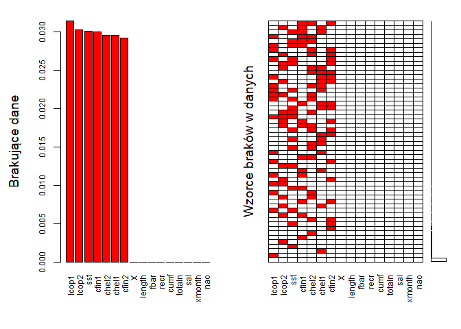
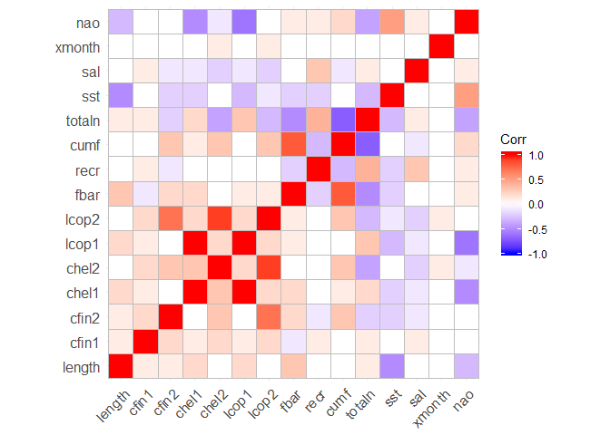

## Wstęp

Celem poniższego projektu jest analiza zbioru danych dotyczących pomiarów śledzi atlantyckich i warunków w jakich żyją, zbieranych w ciągu ostatnich 60 lat, i próba znalezienia przyczyn stopniowego spadku ich długości w ostatnich latach. W procesie tej analizy zbadano ewentualne zależności pomiędzy atrybutami zbioru i utworzono klasyfikator dokonujący predykcji rozmiaru śledzi na podstawie pozostałych pomiarów. W wyniku poniższych kroków sformułowano trzy główne czynniki wpływające na spadek długości śledzi w ostatnich latach.

## Przygotowanie środowiska

Poniższy kod ładuje wymagane biblioteki i zapewnia powtarzalność wyników:


```r
library(ggplot2)
library(plotly)
library(VIM)
library(knitr)
library(ggcorrplot)
library(caret)       
library(randomForest)
set.seed(42)
```

## Zbiór danych

Zbiór danych składa się z pomiarów śledzi i warunków w jakich żyją, zebranych przez ostatnich 60 lat. Dane były pobierane z połowów komercyjnych jednostek. W ramach połowu jednej jednostki losowo wybierano od 50 do 100 sztuk trzyletnich śledzi.

Kolejne kolumny w zbiorze danych to:

* <span style="color:darkred">*length*</span> --- długość złowionego śledzia [cm];
* *cfin1* --- dostępność planktonu [zagęszczenie Calanus finmarchicus gat. 1];
* *cfin2* --- dostępność planktonu [zagęszczenie Calanus finmarchicus gat. 2];
* *chel1* --- dostępność planktonu [zagęszczenie Calanus helgolandicus gat. 1];
* *chel2* --- dostępność planktonu [zagęszczenie Calanus helgolandicus gat. 2];
* *lcop1* --- dostępność planktonu [zagęszczenie widłonogów gat. 1];
* *lcop2* --- dostępność planktonu [zagęszczenie widłonogów gat. 2];
* *fbar* --- natężenie połowów w regionie [ułamek pozostawionego narybku];
* *recr* --- roczny narybek [liczba śledzi];
* *cumf* --- łączne roczne natężenie połowów w regionie [ułamek pozostawionego narybku];
* *totaln* --- łączna liczba ryb złowionych w ramach połowu [liczba śledzi];
* *sst* --- temperatura przy powierzchni wody [°C];
* *sal* --- poziom zasolenia wody [Knudsen ppt];
* *xmonth* --- miesiąc połowu [numer miesiąca];
* *nao* --- oscylacja północnoatlantycka [mb].

### Oryginalny zbiór

Wczytywanie oryginalnego zbioru danych z wyspecyfikowaniem typu danych w kolumnach:


```r
sample <- read.csv("sledzie.csv", nrows = 100)
df_classes <- sapply(sample, class) 
df_classes <- replace(df_classes, df_classes=="factor", "numeric")
all_df <- read.csv("sledzie.csv", colClasses = df_classes, fill=TRUE, na.string=c("NA", "?"))
```

Próbka danych ze zbioru:


|  X| length|   cfin1|   cfin2|   chel1|    chel2|   lcop1|    lcop2|  fbar|   recr|      cumf|   totaln|      sst|      sal| xmonth| nao|
|--:|------:|-------:|-------:|-------:|--------:|-------:|--------:|-----:|------:|---------:|--------:|--------:|--------:|------:|---:|
|  0|   23.0| 0.02778| 0.27785| 2.46875|       NA| 2.54787| 26.35881| 0.356| 482831| 0.3059879| 267380.8| 14.30693| 35.51234|      7| 2.8|
|  1|   22.5| 0.02778| 0.27785| 2.46875| 21.43548| 2.54787| 26.35881| 0.356| 482831| 0.3059879| 267380.8| 14.30693| 35.51234|      7| 2.8|
|  2|   25.0| 0.02778| 0.27785| 2.46875| 21.43548| 2.54787| 26.35881| 0.356| 482831| 0.3059879| 267380.8| 14.30693| 35.51234|      7| 2.8|
|  3|   25.5| 0.02778| 0.27785| 2.46875| 21.43548| 2.54787| 26.35881| 0.356| 482831| 0.3059879| 267380.8| 14.30693| 35.51234|      7| 2.8|
|  4|   24.0| 0.02778| 0.27785| 2.46875| 21.43548| 2.54787| 26.35881| 0.356| 482831| 0.3059879| 267380.8| 14.30693| 35.51234|      7| 2.8|
|  5|   22.0| 0.02778| 0.27785| 2.46875| 21.43548| 2.54787|       NA| 0.356| 482831| 0.3059879| 267380.8| 14.30693| 35.51234|      7| 2.8|
|  6|   24.0| 0.02778| 0.27785| 2.46875| 21.43548| 2.54787| 26.35881| 0.356| 482831| 0.3059879| 267380.8| 14.30693| 35.51234|      7| 2.8|
|  7|   23.5| 0.02778| 0.27785| 2.46875| 21.43548| 2.54787| 26.35881| 0.356| 482831| 0.3059879| 267380.8| 14.30693| 35.51234|      7| 2.8|
|  8|   22.5| 0.02778| 0.27785| 2.46875| 21.43548| 2.54787| 26.35881| 0.356| 482831| 0.3059879| 267380.8| 14.30693| 35.51234|      7| 2.8|
|  9|   22.5| 0.02778| 0.27785| 2.46875| 21.43548| 2.54787| 26.35881| 0.356| 482831| 0.3059879| 267380.8| 14.30693| 35.51234|      7| 2.8|

### Uzupełniony zbiór danych

Oryginalny zbiór składa się z 52582 pomiarów, z czego 10094 (około 19%) zawiera brakujące wartości:


```
##   n_samples n_missing_values percent_missing_values
## 1     52582            10094              0.1919668
```

Poniżej zostały zaprezentowane szczegółowe informacje na temat brakujących wartości pomiarów:

<!-- -->

```
## 
##  Variables sorted by number of missings: 
##  Variable      Count
##     lcop1 0.03143661
##     lcop2 0.03025750
##       sst 0.03012438
##     cfin1 0.03006732
##     chel2 0.02959188
##     chel1 0.02957286
##     cfin2 0.02921152
##         X 0.00000000
##    length 0.00000000
##      fbar 0.00000000
##      recr 0.00000000
##      cumf 0.00000000
##    totaln 0.00000000
##       sal 0.00000000
##    xmonth 0.00000000
##       nao 0.00000000
```

Można zauważyć, że braki w pomiarach dotyczą 7 atrybutów - dostępności poszczególnych gatunków planktonu oraz temperatury przy powierzchni wody. 

Możliwym rozwiązaniem tego problemu byłoby użycie metody k-nn, aby uzupełniać brakujące dane w pomiarze na podstawie tych znajdujących się w najpodobniejszych do niego pomiarach.

Po dokładniejszym przyjrzeniu się danym, okazuje się, że w przypadku większości takich wierszy można łatwo uzupełnić te braki, ponieważ otaczające je pomiary, pochodzące z tego samego połowu, są bardzo podobne lub identyczne, mogą więc być wykorzystane do wypełnienia braków, bez uszczerbku na ogólnej jakości zbioru.

Ponieważ dane są uporządkowane chronologicznie można założyć, że jeśli dwa sąsiednie pomiary mają taką samą wartość atrybutu *xmonth* to mogą posłużyć do uzupełnienia braków sąsiada. Aby uprościć proces, w przypadku, jeśli sąsiednie pomiary pochodzą już z innego miesiąca lub mają takie same braki jak pomiar aktualnie uzupełniany to wartość brakująca jest nadpisywana przez średnią dla danego atrybutu w całym zbiorze.

Brakujące dane uzupełnia następujący kod:


```r
missing_vals <- apply(all_df, 1, anyNA)

if(missing_vals[1]){
  for (x in 1:ncol(all_df)) {
    if (is.na(all_df[1, x])) {
      all_df[1, x] <- all_df[2, x]
    }
  }
}

for(i in 2:nrow(all_df)-1){
  if(missing_vals[i]){
    for (x in 1:ncol(all_df)) {
      if (is.na(all_df[i, x])) {
        if(!is.na(all_df[i - 1, x]) && (all_df$xmonth[i] == all_df$xmonth[i - 1])){
          all_df[i, x] <- all_df[i - 1, x]
        }else if(!is.na(all_df[i + 1, x]) && (all_df$xmonth[i] == all_df$xmonth[i + 1])){
          all_df[i, x] <- all_df[i + 1, x]
        }else{
          all_df[i, x] <- mean(all_df[,x], na.rm = TRUE)
        }
      }
    }
  }
}

if(missing_vals[nrow(all_df)]){
  for (x in 1:ncol(all_df)) {
    if (is.na(all_df[nrow(all_df), x])) {
      all_df[nrow(all_df), x] <- all_df[nrow(all_df)-1, x]
    }
  }
}
```

Niestety atrybut *xmonth* nie wystarczy by jednoznacznie oddzielić kolejne lata pomiarów, ponieważ jego wartość zmienia się częściej niż by to wynikało z rzeczywistego okresu zbierania pomiarów:


```r
months <- 0
curr_month <-0
for(i in 1:nrow(all_df)){
  if(curr_month != all_df$xmonth[i]){
    months <- months + 1
    curr_month <- all_df$xmonth[i]
  }
}
months/12
```

```
## [1] 317.5833
```

W związku z tym zostały utworzone sztuczne atrybuty *year* oraz *years_group*, dzielące zbiór odpowiednio na 60 i 10 równej wielkości grup. Jest to podział dokonany na potrzeby analizy i wizualizacji danych.


## Analiza wartości atrybutów

### Długość wyławianych śledzi

Przebieg poniższego wykresu obrazuje stopniowy spadek rozmiaru śledzia z czasem:

<!--html_preserve--><div id="htmlwidget-30e4409849e39179307f" style="width:672px;height:480px;" class="plotly html-widget"></div>
<script type="application/json" data-for="htmlwidget-30e4409849e39179307f">{"x":{"data":[{"x":[1,1,1,1,1,1,1,1,1,1,1,1,1,1,1,1,1,1,1,1,1,1,1,1,1,1,1,1,1,1,1,1,1,1,1,1,1,1,1,1,1,1,1,1,1,1,1,1,1,1,1,1,1,1,1,1,1,1,1,1,1,1,1,1,1,1,1,1,1,1,1,1,1,1,1,1,1,1,1,1,1,1,1,1,1,1,1,1,1,1,1,1,1,1,1,1,1,1,1,1,1,1,1,1,1,1,1,1,1,1,1,1,1,1,1,1,1,1,1,1,1,1,1,1,1,1,1,1,1,1,1,1,1,1,1,1,1,1,1,1,1,1,1,1,1,1,1,1,1,1,1,1,1,1,1,1,1,1,1,1,1,1,1,1,1,1,1,1,1,1,1,1,1,1,1,1,1,1,1,1,1,1,1,1,1,1,1,1,1,1,1,1,1,1,1,1,1,1,1,1,1,1,1,1,1,1,1,1,1,1,1,1,1,1,1,1,1,1,1,1,1,1,1,1,1,1,1,1,1,1,1,1,1,1,1,1,1,1,1,1,1,1,1,1,1,1,1,1,1,1,1,1,1,1,1,1,1,1,1,1,1,1,1,1,1,1,1,1,1,1,1,1,1,1,1,1,1,1,1,1,1,1,1,1,1,1,1,1,1,1,1,1,1,1,1,1,1,1,1,1,1,1,1,1,1,1,1,1,1,1,1,1,1,1,1,1,1,1,1,1,1,1,1,1,1,1,1,1,1,1,1,1,1,1,1,1,1,1,1,1,1,1,1,1,1,1,1,1,1,1,1,1,1,1,1,1,1,1,1,1,1,1,1,1,1,1,1,1,1,1,1,1,1,1,1,1,1,1,1,1,1,1,1,1,1,1,1,1,1,1,1,1,1,1,1,1,1,1,1,1,1,1,1,1,1,1,1,1,1,1,1,1,1,1,1,1,1,1,1,1,1,1,1,1,1,1,1,1,1,1,1,1,1,1,1,1,1,1,1,1,1,1,1,1,1,1,1,1,1,1,1,1,1,1,1,1,1,1,1,1,1,1,1,1,1,1,1,1,1,1,1,1,1,1,1,1,1,1,1,1,1,1,1,1,1,1,1,1,1,1,1,1,1,1,1,1,1,1,1,1,1,1,1,1,1,1,1,1,1,1,1,1,1,1,1,1,1,1,1,1,1,1,1,1,1,1,1,1,1,1,1,1,1,1,1,1,1,1,1,1,1,1,1,1,1,1,1,1,1,1,1,1,1,1,1,1,1,1,1,1,1,1,1,1,1,1,1,1,1,1,1,1,1,1,1,1,1,1,1,1,1,1,1,1,1,1,1,1,1,1,1,1,1,1,1,1,1,1,1,1,1,1,1,1,1,1,1,1,1,1,1,1,1,1,1,1,1,1,1,1,1,1,1,1,1,1,1,1,1,1,1,1,1,1,1,1,1,1,1,1,1,1,1,1,1,1,1,1,1,1,1,1,1,1,1,1,1,1,1,1,1,1,1,1,1,1,1,1,1,1,1,1,1,1,1,1,1,1,1,1,1,1,1,1,1,1,1,1,1,1,1,1,1,1,1,1,1,1,1,1,1,1,1,1,1,1,1,1,1,1,1,1,1,1,1,1,1,1,1,1,1,1,1,1,1,1,1,1,1,1,1,1,1,1,1,1,1,1,1,1,1,1,1,1,1,1,1,1,1,1,1,1,1,1,1,1,1,1,1,1,1,1,1,1,1,1,1,1,1,1,1,1,1,1,1,1,1,1,1,1,1,1,1,1,1,1,1,1,1,1,1,1,1,1,1,1,1,1,1,1,1,1,1,1,1,1,1,1,1,1,1,1,1,1,1,1,1,1,1,1,1,1,1,1,1,1,1,1,1,1,1,1,1,1,1,1,1,1,1,1,1,1,1,1,1,1,1,1,1,1,1,1,1,1,1,1,1,1,1,1,1,1,1,1,1,1,1,1,1,1,1,1,1,1,1,1,1,1,1,1,1,1,1,1,1,1,1,1,1,1,1,1,1,1,1,1,1,1,1,1,1,1,1,1,1,1,1,1,1,1,1,1,1,1,1,1,1,1,1,1,1,1,1,1,1,1,1,1,1,1,1,1,1,1,1,1,1,1,1,1,1,1,1,1,1,1,1,1,1,1,1,1,1,1,1,1,1,1,1,1,1,1,1,1,1,1,1,1,1,1,1,1,1,1,1,1,1,1,1,1,1,1,1,1,1,1,1,1,1,1,1,1,1,1,1,1,1,1,1,1,1,1,1,1,1,1,1,1,1,1,1,1,1,1,1,1,1,1,1,1,1,1,1,1,1,1,1,1,1,1,1,1,1,1,1,1,1,1,1,1,1,1,1,1,1,1,1,1,1,1,1,1,1,1,1,1,1,1,1,1,1,1,1,1,1,1,1,1,1,1,1,1,1,1,1,1,1,1,1,1,1,1,1,1,1,1,1,1,1,1,1,1,1,1,1,1,1,1,1,1,1,1,1,1,1,1,1,1,1,1,1,1,1,1,1,1,1,1,1,1,1,1,1,1,1,1,1,1,1,1,1,1,1,1,1,1,1,1,1,1,1,1,1,1,1,1,1,1,1,1,1,1,1,1,1,1,1,1,1,1,1,1,1,1,1,1,1,1,1,1,1,1,1,1,1,1,1,1,1,1,1,1,1,1,1,1,1,1,1,1,1,1,1,1,1,1,1,1,1,1,1,1,1,1,1,1,1,1,1,1,1,1,1,1,1,1,1,1,1,1,1,1,1,1,1,1,1,1,1,1,1,1,1,1,1,1,1,1,1,1,1,1,1,1,1,1,1,1,1,1,1,1,1,1,1,1,1,1,1,1,1,1,1,1,1,1,1,1,1,1,1,1,1,1,1,1,1,1,1,1,1,1,1,1,1,1,1,1,1,1,1,1,1,1,1,1,1,1,1,1,1,1,1,1,1,1,1,1,1,1,1,1,1,1,1,1,1,1,1,1,1,1,1,1,1,1,1,1,1,1,1,1,1,1,1,1,1,1,1,1,1,1,1,1,1,1,1,1,1,1,1,1,1,1,1,1,1,1,1,1,1,1,1,1,1,1,1,1,1,1,1,1,1,1,1,1,1,1,1,1,1,1,1,1,1,1,1,1,1,1,1,1,1,1,1,1,1,1,1,1,1,1,1,1,1,1,1,1,1,1,1,1,1,1,1,1,1,1,1,1,1,1,1,1,1,1,1,1,1,1,1,1,1,1,1,1,1,1,1,1,1,1,1,1,1,1,1,1,1,1,1,1,1,1,1,1,1,1,1,1,1,1,1,1,1,1,1,1,1,1,1,1,1,1,1,1,1,1,1,1,1,1,1,1,1,1,1,1,1,1,1,1,1,1,1,1,1,1,1,1,1,1,1,1,1,1,1,1,1,1,1,1,1,1,1,1,1,1,1,1,1,1,1,1,1,1,1,1,1,1,1,1,1,1,1,1,1,1,1,1,1,1,1,1,1,1,1,1,1,1,1,1,1,1,1,1,1,1,1,1,1,1,1,1,1,1,1,1,1,1,1,1,1,1,1,1,1,1,1,1,1,1,1,1,1,1,1,1,1,1,1,1,1,1,1,1,1,1,1,1,1,1,1,1,1,1,1,1,1,1,1,1,1,1,1,1,1,1,1,1,1,1,1,1,1,1,1,1,1,1,1,1,1,1,1,1,1,1,1,1,1,1,1,1,1,1,1,1,1,1,1,1,1,1,1,1,1,1,1,1,1,1,1,1,1,1,1,1,1,1,1,1,1,1,1,1,1,1,1,1,1,1,1,1,1,1,1,1,1,1,1,1,1,1,1,1,1,1,1,1,1,1,1,1,1,1,1,1,1,1,1,1,1,1,1,1,1,1,1,1,1,1,1,1,1,1,1,1,1,1,1,1,1,1,1,1,1,1,1,1,1,1,1,1,1,1,1,1,1,1,1,1,1,1,1,1,1,1,1,1,1,1,1,1,1,1,1,1,1,1,1,1,1,1,1,1,1,1,1,1,1,1,1,1,1,1,1,1,1,1,1,1,1,1,1,1,1,1,1,1,1,1,1,1,1,1,1,1,1,1,1,1,1,1,1,1,1,1,1,1,1,1,1,1,1,1,1,1,1,1,1,1,1,1,1,1,1,1,1,1,1,1,1,1,1,1,1,1,1,1,1,1,1,1,1,1,1,1,1,1,1,1,1,1,1,1,1,1,1,1,1,1,1,1,1,1,1,1,1,1,1,1,1,1,1,1,1,1,1,1,1,1,1,1,1,1,1,1,1,1,1,1,1,1,1,1,1,1,1,1,1,1,1,1,1,1,1,1,1,1,1,1,1,1,1,1,1,1,1,1,1,1,1,1,1,1,1,1,1,1,1,1,1,1,1,1,1,1,1,1,1,1,1,1,1,1,1,1,1,1,1,1,1,1,1,1,1,1,1,1,1,1,1,1,1,1,1,1,1,1,1,1,1,1,1,1,1,1,1,1,1,1,1,1,1,1,1,1,1,1,1,1,1,1,1,1,1,1,1,1,1,1,1,1,1,1,1,1,1,1,1,1,1,1,1,1,1,1,1,1,1,1,1,1,1,1,1,1,1,1,1,1,1,1,1,1,1,1,1,1,1,1,1,1,1,1,1,1,1,1,1,1,1,1,1,1,1,1,1,1,1,1,1,1,1,1,1,1,1,1,1,1,1,1,1,1,1,1,1,1,1,1,1,1,1,1,1,1,1,1,1,1,1,1,1,1,1,1,1,1,1,1,1,1,1,1,1,1,1,1,1,1,1,1,1,1,1,1,1,1,1,1,1,1,1,1,1,1,1,1,1,1,1,1,1,1,1,1,1,1,1,1,1,1,1,1,1,1,1,1,1,1,1,1,1,1,1,1,1,1,1,1,1,1,1,1,1,1,1,1,1,1,1,1,1,1,1,1,1,1,1,1,1,1,1,1,1,1,1,1,1,1,1,1,1,1,1,1,1,1,1,1,1,1,1,1,1,1,1,1,1,1,1,1,1,1,1,1,1,1,1,1,1,1,1,1,1,1,1,1,1,1,1,1,1,1,1,1,1,1,1,1,1,1,1,1,1,1,1,1,1,1,1,1,1,1,1,1,1,1,1,1,1,1,1,1,1,1,1,1,1,1,1,1,1,1,1,1,1,1,1,1,1,1,1,1,1,1,1,1,1,1,1,1,1,1,1,1,1,1,1,1,1,1,1,1,1,1,1,1,1,1,1,1,1,1,1,1,1,1,1,1,1,1,1,1,1,1,1,1,1,1,1,1,1,1,1,1,1,1,1,1,1,1,1,1,1,1,1,1,1,1,1,1,1,1,1,1,1,1,1,1,1,1,1,1,1,1,1,1,1,1,1,1,1,1,1,1,1,1,1,1,1,1,1,1,1,1,1,1,1,1,1,1,1,1,1,1,1,1,1,1,1,1,1,1,1,1,1,1,1,1,1,1,1,1,1,1,1,1,1,1,1,1,1,1,1,1,1,1,1,1,1,1,1,1,1,1,1,1,1,1,1,1,1,1,1,1,1,1,1,1,1,1,1,1,1,1,1,1,1,1,1,1,1,1,1,1,1,1,1,1,1,1,1,1,1,1,1,1,1,1,1,1,1,1,1,1,1,1,1,1,1,1,1,1,1,1,1,1,1,1,1,1,1,1,1,1,1,1,1,1,1,1,1,1,1,1,1,1,1,1,1,1,1,1,1,1,1,1,1,1,1,1,1,1,1,1,1,1,1,1,1,1,1,1,1,1,1,1,1,1,1,1,1,1,1,1,1,1,1,1,1,1,1,1,1,1,1,1,1,1,1,1,1,1,1,1,1,1,1,1,1,1,1,1,1,1,1,1,1,1,1,1,1,1,1,1,1,1,1,1,1,1,1,1,1,1,1,1,1,1,1,1,1,1,1,1,1,1,1,1,1,1,1,1,1,1,1,1,1,1,1,1,1,1,1,1,1,1,1,1,1,1,1,1,1,1,1,1,1,1,1,1,1,1,1,1,1,1,1,1,1,1,1,1,1,1,1,1,1,1,1,1,1,1,1,1,1,1,1,1,1,1,1,1,1,1,1,1,1,1,1,1,1,1,1,1,1,1,1,1,1,1,1,1,1,1,1,1,1,1,1,1,1,1,1,1,1,1,1,1,1,1,1,1,1,1,1,1,1,1,1,1,1,1,1,1,1,1,1,1,1,1,1,1,1,1,1,1,1,1,1,1,1,1,1,1,1,1,1,1,1,1,1,1,1,1,1,1,1,1,1,1,1,1,1,1,1,1,1,1,1,1,1,1,1,1,1,1,1,1,1,1,1,1,1,1,1,1,1,1,1,1,1,1,1,1,1,1,1,1,1,1,1,1,1,1,1,1,1,1,1,1,1,1,1,1,1,1,1,1,1,1,1,1,1,1,1,1,1,1,1,1,1,1,1,1,1,1,1,1,1,1,1,1,1,1,1,1,1,1,1,1,1,1,1,1,1,1,1,1,1,1,1,1,1,1,1,1,1,1,1,1,1,1,1,1,1,1,1,1,1,1,1,1,1,1,1,1,1,1,1,1,1,1,1,1,1,1,1,1,1,1,1,1,1,1,1,1,1,1,1,1,1,1,1,1,1,1,1,1,1,1,1,1,1,1,1,1,1,1,1,1,1,1,1,1,1,1,1,1,1,1,1,1,1,1,1,1,1,1,1,1,1,1,1,1,1,1,1,1,1,1,1,1,1,1,1,1,1,1,1,1,1,1,1,1,1,1,1,1,1,1,1,1,1,1,1,1,1,1,1,1,1,1,1,1,1,1,1,1,1,1,1,1,1,1,1,1,1,1,1,1,1,1,1,1,1,1,1,1,1,1,1,1,1,1,1,1,1,1,1,1,1,1,1,1,1,1,1,1,1,1,1,1,1,1,1,1,1,1,1,1,1,1,1,1,1,1,1,1,1,1,1,1,1,1,1,1,1,1,1,1,1,1,1,1,1,1,1,1,1,1,1,1,1,1,1,1,1,1,1,1,1,1,1,1,1,1,1,1,1,1,1,1,1,1,1,1,1,1,1,1,1,1,1,1,1,1,1,1,1,1,1,1,1,1,1,1,1,1,1,1,1,1,1,1,1,1,1,1,1,1,1,1,1,1,1,1,1,1,1,1,1,1,1,1,1,1,1,1,1,1,1,1,1,1,1,1,1,1,1,1,1,1,1,1,1,1,1,1,1,1,1,1,1,1,1,1,1,1,1,1,1,1,1,1,1,1,1,1,1,1,1,1,1,1,1,1,1,1,1,1,1,1,1,1,1,1,1,1,1,1,1,1,1,1,1,1,1,1,1,1,1,1,1,1,1,1,1,1,1,1,1,1,1,1,1,1,1,1,1,1,1,1,1,1,1,1,1,1,1,1,1,1,1,1,1,1,1,1,1,1,1,1,1,1,1,1,1,1,1,1,1,1,1,1,1,1,1,1,1,1,1,1,1,1,1,1,1,1,1,1,1,1,1,1,1,1,1,1,1,1,1,1,1,1,1,1,1,1,1,1,1,1,1,1,1,1,1,1,1,1,1,1,1,1,1,1,1,1,1,1,1,1,1,1,1,1,1,1,1,1,1,1,1,1,1,1,1,1,1,1,1,1,1,1,1,1,1,1,1,1,1,1,1,1,1,1,1,1,1,1,1,1,1,1,1,1,1,1,1,1,1,1,1,1,1,1,1,1,1,1,1,1,1,1,1,1,1,1,1,1,1,1,1,1,1,1,1,1,1,1,1,1,1,1,1,1,1,1,1,1,1,1,1,1,1,1,1,1,1,1,1,1,1,1,1,1,1,1,1,1,1,1,1,1,1,1,1,1,1,1,1,1,1,1,1,1,1,1,1,1,1,1,1,1,1,1,1,1,1,1,1,1,1,1,1,1,1,1,1,1,1,1,1,1,1,1,1,1,1,1,1,1,1,1,1,1,1,1,1,1,1,1,1,1,1,1,1,1,1,1,1,1,1,1,1,1,1,1,1,1,1,1,1,1,1,1,1,1,1,1,1,1,1,1,1,1,1,1,1,1,1,1,1,1,1,1,1,1,1,1,1,1,1,1,1,1,1,1,1,1,1,1,1,1,1,1,1,1,1,1,1,1,1,1,1,1,1,1,1,1,1,1,1,1,1,1,1,1,1,1,1,1,1,1,1,1,1,1,1,1,1,1,1,1,1,1,1,1,1,1,1,1,1,1,1,1,1,1,1,1,1,1,1,1,1,1,1,1,1,1,1,1,1,1,1,1,1,1,1,1,1,1,1,1,1,1,1,1,1,1,1,1,1,1,1,1,1,1,1,1,1,1,1,1,1,1,1,1,1,1,1,1,1,1,1,1,1,1,1,1,1,1,1,1,1,1,1,1,1,1,1,1,1,1,1,1,1,1,1,1,1,1,1,1,1,1,1,1,1,1,1,1,1,1,1,1,1,1,1,1,1,1,1,1,1,1,1,1,1,1,1,1,1,1,1,1,1,1,1,1,1,1,1,1,1,1,1,1,1,1,1,1,1,1,1,1,1,1,1,1,1,1,1,1,1,1,1,1,1,1,1,1,1,1,1,1,1,1,1,1,1,1,1,1,1,1,1,1,1,1,1,1,1,1,1,1,1,1,1,1,1,1,1,1,1,1,1,1,1,1,1,1,1,1,1,1,1,1,1,1,1,1,1,1,1,1,1,1,1,1,1,1,1,1,1,1,1,1,1,1,1,1,1,1,1,1,1,1,1,1,1,1,1,1,1,1,1,1,1,1,1,1,1,1,1,1,1,1,1,1,1,1,1,1,1,1,1,1,1,1,1,1,1,1,1,1,1,1,1,1,1,1,1,1,1,1,1,1,1,1,1,1,1,1,1,1,1,1,1,1,1,1,1,1,1,1,1,1,1,1,1,1,1,1,1,1,1,1,1,1,1,1,1,1,1,1,1,1,1,1,1,1,1,1,1,1,1,1,1,1,1,1,1,1,1,1,1,1,1,1,1,1,1,1,1,1,1,1,1,1,1,1,1,1,1,1,1,1,1,1,1,1,1,1,1,1,1,1,1,1,1,1,1,1,1,1,1,1,1,1,1,1,1,1,1,1,1,1,1,1,1,1,1,1,1,1,1,1,1,1,1,1,1,1,1,1,1,1,1,1,1,1,1,1,1,1,1,1,1,1,1,1,1,1,1,1,1,1,1,1,1,1,1,1,1,1,1,1,1,1,1,1,1,1,1,1,1,1,1,1,1,1,1,1,1,1,1,1,1,1,1,1,1,1,1,1,1,1,1,1,1,1,1,1,1,1,1,1,1,1,1,1,1,1,1,1,1,1,1,1,1,1,1,1,1,1,1,1,1,1,1,1,1,1,1,1,1,1,1,1,1,1,1,1,1,1,1,1,1,1,1,1,1,1,1,1,1,1,1,1,1,1,1,1,1,1,1,1,1,1,1,1,1,1,1,1,1,1,1,1,1,1,1,1,1,1,1,1,1,1,1,1,1,1,1,1,1,1,1,1,1,1,1,1,1,1,1,1,1,1,1,1,1,1,1,1,1,1,1,1,1,1,1,1,1,1,1,1,1,1,1,1,1,1,1,1,1,1,1,1,1,1,1,1,1,1,1,1,1,1,1,1,1,1,1,1,1,1,1,1,1,1,1,1,1,1,1,1,1,1,1,1,1,1,1,1,1,1,1,1,1,1,1,1,1,1,1,1,1,1,1,1,1,1,1,1,1,1,1,1,1,1,1,1,1,1,1,1,1,1,1,1,1,1,1,1,1,1,1,1,1,1,1,1,1,1,1,1,1,1,1,1,1,1,1,1,1,1,1,1,1,1,1,1,1,1,1,1,1,1,1,1,1,1,1,1,1,1,1,1,1,1,1,1,1,1,1,1,1,1,1,1,1,1,1,1,1,1,1,1,1,1,1,1,1,1,1,1,1,1,1,1,1,1,1,1,1,1,1,1,1,1,1,1,1,1,1,1,1,1,1,1,1,1,1,1,1,1,1,1,1,1,1,1,1,1,1,1,1,1,1,1,1,1,1,1,1,1,1,1,1,1,1,1,1,1,1,1,1,1,1,1,1,1,1,1,1,1,1,1,1,1,1,1,1,1,1,1,1,1,1,1,1,1,1,1,1,1,1,1,1,1,1,1,1,1,1,1,1,1,1,1,1,1,1,1,1,1,1,1,1,1,1,1,1,1,1,1,1,1,1,1,1,1,1,1,1,1,1,1,1,1,1,1,1,1,1,1,1,1,1,1,1,1,1,1,1,1,1,1,1,1,1,1,1,1,1,1,1,1,1,1,1,1,1,1,1,1,1,1,1,1,1,1,1,1,1,1,1,1,1,1,1,1,1,1,1,1,1,1,1,1,1,1,1,1,1,1,1,1,1,1,1,1,1,1,1,1,1,1,1,1,1,1,1,1,1,1,1,1,1,1,1,1,1,1,1,1,1,1,1,1,1,1,1,1,1,1,1,1,1,1,1,1,1,1,1,1,1,1,1,1,1,1,1,1,1,1,1,1,1,1,1,1,1,1,1,1,1,1,1,1,1,1,1,1,1,1,1,1,1,1,1,1,1,1,1,1,1,1,1,1,1,1,1,1,1,1,1,1,1,1,1,1,1,1,1,1,1,1,1,1,1,1,1,1,1,1,1,1,1,1,1,1,1,1,1,1,1,1,1,1,1,1,1,1,1,1,1,1,1,1,1,1,1,1,1,1,1,1,1,1,1,1,1,1,1,1,1,1,1,1,1,1,1,1,1,1,1,1,1,1,1,1,1,1,1,1,1,1,1,1,1,1,1,1,1,1,1,1,1,1,1,1,1,1,1,1,1,1,1,1,1,1,1,1,1,1,1,1,1,1,1,1,1,1,1,1,1,1,1,1,1,1,1,1,1,1,1,1,1,1,1,1,1,1,1,1,1,1,1,1,1,1,1,1,1,1,1,1,1,1,1,1,1,1,1,1,1,1,1,1,1,1,1,1,1,1,1,1,1,1,1,1,1,1,1,1,1,1,1,1,1,1,1,1,1,1,1,1,1,1,1,1,1,1,1,1,1,1,1,1,1,1,1,1,1,1,1,1,1,1,1,1,1,1,1,1,1,1,1,1,1,1,1,1,1,1,1,1,1,1,1,1,1,1,1,1,1,1,1,1,1,1,1,1,1,1,1,1,1,1,1,1,1,1,1,1,1,1,1,1,1,1,1,1,1,1,1,1,1,1,1,1,1,1,1,1,1,1,1,1,1,1,1,1,1,1,1,1,1,1,1,1,1,1,1,1,1,1,1,1,1,1,1,1,1,1,1,1,1,1,1,1,1,1,1,1,1,1,1,1,1,1,1,1,1,1,1,1,1,1,1,1,1,1,1,1,1,1,1,1,1,1,1,1,1,1,1,1,1,1,1,1,1,1,1,1,1,1,1,1,1,1,1,1,1,1,1,1,1,1,1,1,1,1,1,1,1,1,1,1,1,1,1,1,1,1,1,1,1,1,1,1,1,1,1,1,1,1,1,1,1,1,1,1,1,1,1,1,1,1,1,1,1,1,1,1,1,1,1,1,1,1,1,1,1,1,1,1,1,1,1,1,1,1,1,1,1,1,1,1,1,1,1,1,1,1,1,1,1,1,1,1,1,1,1,1,1,1,1,1,1,1,1,1,1,1,1,1,1,1,1,1,1,1,1,1,1,1,1,1,1,1,1,1,1,1,1,1,1,1,1,1,1,1,1,1,1,1,1,1,1,1,1,1,1,1,1,1,1,1,1,1,1,1,1,1,1,1,1,1,1,1,1,1,1,1,1,1,1,1,1,1,1,1,1,1,1,1,1,1,1,1,1,2,2,2,2,2,2,2,2,2,2,2,2,2,2,2,2,2,2,2,2,2,2,2,2,2,2,2,2,2,2,2,2,2,2,2,2,2,2,2,2,2,2,2,2,2,2,2,2,2,2,2,2,2,2,2,2,2,2,2,2,2,2,2,2,2,2,2,2,2,2,2,2,2,2,2,2,2,2,2,2,2,2,2,2,2,2,2,2,2,2,2,2,2,2,2,2,2,2,2,2,2,2,2,2,2,2,2,2,2,2,2,2,2,2,2,2,2,2,2,2,2,2,2,2,2,2,2,2,2,2,2,2,2,2,2,2,2,2,2,2,2,2,2,2,2,2,2,2,2,2,2,2,2,2,2,2,2,2,2,2,2,2,2,2,2,2,2,2,2,2,2,2,2,2,2,2,2,2,2,2,2,2,2,2,2,2,2,2,2,2,2,2,2,2,2,2,2,2,2,2,2,2,2,2,2,2,2,2,2,2,2,2,2,2,2,2,2,2,2,2,2,2,2,2,2,2,2,2,2,2,2,2,2,2,2,2,2,2,2,2,2,2,2,2,2,2,2,2,2,2,2,2,2,2,2,2,2,2,2,2,2,2,2,2,2,2,2,2,2,2,2,2,2,2,2,2,2,2,2,2,2,2,2,2,2,2,2,2,2,2,2,2,2,2,2,2,2,2,2,2,2,2,2,2,2,2,2,2,2,2,2,2,2,2,2,2,2,2,2,2,2,2,2,2,2,2,2,2,2,2,2,2,2,2,2,2,2,2,2,2,2,2,2,2,2,2,2,2,2,2,2,2,2,2,2,2,2,2,2,2,2,2,2,2,2,2,2,2,2,2,2,2,2,2,2,2,2,2,2,2,2,2,2,2,2,2,2,2,2,2,2,2,2,2,2,2,2,2,2,2,2,2,2,2,2,2,2,2,2,2,2,2,2,2,2,2,2,2,2,2,2,2,2,2,2,2,2,2,2,2,2,2,2,2,2,2,2,2,2,2,2,2,2,2,2,2,2,2,2,2,2,2,2,2,2,2,2,2,2,2,2,2,2,2,2,2,2,2,2,2,2,2,2,2,2,2,2,2,2,2,2,2,2,2,2,2,2,2,2,2,2,2,2,2,2,2,2,2,2,2,2,2,2,2,2,2,2,2,2,2,2,2,2,2,2,2,2,2,2,2,2,2,2,2,2,2,2,2,2,2,2,2,2,2,2,2,2,2,2,2,2,2,2,2,2,2,2,2,2,2,2,2,2,2,2,2,2,2,2,2,2,2,2,2,2,2,2,2,2,2,2,2,2,2,2,2,2,2,2,2,2,2,2,2,2,2,2,2,2,2,2,2,2,2,2,2,2,2,2,2,2,2,2,2,2,2,2,2,2,2,2,2,2,2,2,2,2,2,2,2,2,2,2,2,2,2,2,2,2,2,2,2,2,2,2,2,2,2,2,2,2,2,2,2,2,2,2,2,2,2,2,2,2,2,2,2,2,2,2,2,2,2,2,2,2,2,2,2,2,2,2,2,2,2,2,2,2,2,2,2,2,2,2,2,2,2,2,2,2,2,2,2,2,2,2,2,2,2,2,2,2,2,2,2,2,2,2,2,2,2,2,2,2,2,2,2,2,2,2,2,2,2,2,2,2,2,2,2,2,2,2,2,2,2,2,2,2,2,2,2,2,2,2,2,2,2,2,2,2,2,2,2,2,2,2,2,2,2,2,2,2,2,2,2,2,2,2,2,2,2,2,2,2,2,2,2,2,2,2,2,2,2,2,2,2,2,2,2,2,2,2,2,2,2,2,2,2,2,2,2,2,2,2,2,2,2,2,2,2,2,2,2,2,2,2,2,2,2,2,2,2,2,2,2,2,2,2,2,2,2,2,2,2,2,2,2,2,2,2,2,2,2,2,2,2,2,2,2,2,2,2,2,2,2,2,2,2,2,2,2,2,2,2,2,2,2,2,2,2,2,2,2,2,2,2,2,2,2,2,2,2,2,2,2,2,2,2,2,2,2,2,2,2,2,2,2,2,2,2,2,2,2,2,2,2,2,2,2,2,2,2,2,2,2,2,2,2,2,2,2,2,2,2,2,2,2,2,2,2,2,2,2,2,2,2,2,2,2,2,2,2,2,2,2,2,2,2,2,2,2,2,2,2,2,2,2,2,2,2,2,2,2,2,2,2,2,2,2,2,2,2,2,2,2,2,2,2,2,2,2,2,2,2,2,2,2,2,2,2,2,2,2,2,2,2,2,2,2,2,2,2,2,2,2,2,2,2,2,2,2,2,2,2,2,2,2,2,2,2,2,2,2,2,2,2,2,2,2,2,2,2,2,2,2,2,2,2,2,2,2,2,2,2,2,2,2,2,2,2,2,2,2,2,2,2,2,2,2,2,2,2,2,2,2,2,2,2,2,2,2,2,2,2,2,2,2,2,2,2,2,2,2,2,2,2,2,2,2,2,2,2,2,2,2,2,2,2,2,2,2,2,2,2,2,2,2,2,2,2,2,2,2,2,2,2,2,2,2,2,2,2,2,2,2,2,2,2,2,2,2,2,2,2,2,2,2,2,2,2,2,2,2,2,2,2,2,2,2,2,2,2,2,2,2,2,2,2,2,2,2,2,2,2,2,2,2,2,2,2,2,2,2,2,2,2,2,2,2,2,2,2,2,2,2,2,2,2,2,2,2,2,2,2,2,2,2,2,2,2,2,2,2,2,2,2,2,2,2,2,2,2,2,2,2,2,2,2,2,2,2,2,2,2,2,2,2,2,2,2,2,2,2,2,2,2,2,2,2,2,2,2,2,2,2,2,2,2,2,2,2,2,2,2,2,2,2,2,2,2,2,2,2,2,2,2,2,2,2,2,2,2,2,2,2,2,2,2,2,2,2,2,2,2,2,2,2,2,2,2,2,2,2,2,2,2,2,2,2,2,2,2,2,2,2,2,2,2,2,2,2,2,2,2,2,2,2,2,2,2,2,2,2,2,2,2,2,2,2,2,2,2,2,2,2,2,2,2,2,2,2,2,2,2,2,2,2,2,2,2,2,2,2,2,2,2,2,2,2,2,2,2,2,2,2,2,2,2,2,2,2,2,2,2,2,2,2,2,2,2,2,2,2,2,2,2,2,2,2,2,2,2,2,2,2,2,2,2,2,2,2,2,2,2,2,2,2,2,2,2,2,2,2,2,2,2,2,2,2,2,2,2,2,2,2,2,2,2,2,2,2,2,2,2,2,2,2,2,2,2,2,2,2,2,2,2,2,2,2,2,2,2,2,2,2,2,2,2,2,2,2,2,2,2,2,2,2,2,2,2,2,2,2,2,2,2,2,2,2,2,2,2,2,2,2,2,2,2,2,2,2,2,2,2,2,2,2,2,2,2,2,2,2,2,2,2,2,2,2,2,2,2,2,2,2,2,2,2,2,2,2,2,2,2,2,2,2,2,2,2,2,2,2,2,2,2,2,2,2,2,2,2,2,2,2,2,2,2,2,2,2,2,2,2,2,2,2,2,2,2,2,2,2,2,2,2,2,2,2,2,2,2,2,2,2,2,2,2,2,2,2,2,2,2,2,2,2,2,2,2,2,2,2,2,2,2,2,2,2,2,2,2,2,2,2,2,2,2,2,2,2,2,2,2,2,2,2,2,2,2,2,2,2,2,2,2,2,2,2,2,2,2,2,2,2,2,2,2,2,2,2,2,2,2,2,2,2,2,2,2,2,2,2,2,2,2,2,2,2,2,2,2,2,2,2,2,2,2,2,2,2,2,2,2,2,2,2,2,2,2,2,2,2,2,2,2,2,2,2,2,2,2,2,2,2,2,2,2,2,2,2,2,2,2,2,2,2,2,2,2,2,2,2,2,2,2,2,2,2,2,2,2,2,2,2,2,2,2,2,2,2,2,2,2,2,2,2,2,2,2,2,2,2,2,2,2,2,2,2,2,2,2,2,2,2,2,2,2,2,2,2,2,2,2,2,2,2,2,2,2,2,2,2,2,2,2,2,2,2,2,2,2,2,2,2,2,2,2,2,2,2,2,2,2,2,2,2,2,2,2,2,2,2,2,2,2,2,2,2,2,2,2,2,2,2,2,2,2,2,2,2,2,2,2,2,2,2,2,2,2,2,2,2,2,2,2,2,2,2,2,2,2,2,2,2,2,2,2,2,2,2,2,2,2,2,2,2,2,2,2,2,2,2,2,2,2,2,2,2,2,2,2,2,2,2,2,2,2,2,2,2,2,2,2,2,2,2,2,2,2,2,2,2,2,2,2,2,2,2,2,2,2,2,2,2,2,2,2,2,2,2,2,2,2,2,2,2,2,2,2,2,2,2,2,2,2,2,2,2,2,2,2,2,2,2,2,2,2,2,2,2,2,2,2,2,2,2,2,2,2,2,2,2,2,2,2,2,2,2,2,2,2,2,2,2,2,2,2,2,2,2,2,2,2,2,2,2,2,2,2,2,2,2,2,2,2,2,2,2,2,2,2,2,2,2,2,2,2,2,2,2,2,2,2,2,2,2,2,2,2,2,2,2,2,2,2,2,2,2,2,2,2,2,2,2,2,2,2,2,2,2,2,2,2,2,2,2,2,2,2,2,2,2,2,2,2,2,2,2,2,2,2,2,2,2,2,2,2,2,2,2,2,2,2,2,2,2,2,2,2,2,2,2,2,2,2,2,2,2,2,2,2,2,2,2,2,2,2,2,2,2,2,2,2,2,2,2,2,2,2,2,2,2,2,2,2,2,2,2,2,2,2,2,2,2,2,2,2,2,2,2,2,2,2,2,2,2,2,2,2,2,2,2,2,2,2,2,2,2,2,2,2,2,2,2,2,2,2,2,2,2,2,2,2,2,2,2,2,2,2,2,2,2,2,2,2,2,2,2,2,2,2,2,2,2,2,2,2,2,2,2,2,2,2,2,2,2,2,2,2,2,2,2,2,2,2,2,2,2,2,2,2,2,2,2,2,2,2,2,2,2,2,2,2,2,2,2,2,2,2,2,2,2,2,2,2,2,2,2,2,2,2,2,2,2,2,2,2,2,2,2,2,2,2,2,2,2,2,2,2,2,2,2,2,2,2,2,2,2,2,2,2,2,2,2,2,2,2,2,2,2,2,2,2,2,2,2,2,2,2,2,2,2,2,2,2,2,2,2,2,2,2,2,2,2,2,2,2,2,2,2,2,2,2,2,2,2,2,2,2,2,2,2,2,2,2,2,2,2,2,2,2,2,2,2,2,2,2,2,2,2,2,2,2,2,2,2,2,2,2,2,2,2,2,2,2,2,2,2,2,2,2,2,2,2,2,2,2,2,2,2,2,2,2,2,2,2,2,2,2,2,2,2,2,2,2,2,2,2,2,2,2,2,2,2,2,2,2,2,2,2,2,2,2,2,2,2,2,2,2,2,2,2,2,2,2,2,2,2,2,2,2,2,2,2,2,2,2,2,2,2,2,2,2,2,2,2,2,2,2,2,2,2,2,2,2,2,2,2,2,2,2,2,2,2,2,2,2,2,2,2,2,2,2,2,2,2,2,2,2,2,2,2,2,2,2,2,2,2,2,2,2,2,2,2,2,2,2,2,2,2,2,2,2,2,2,2,2,2,2,2,2,2,2,2,2,2,2,2,2,2,2,2,2,2,2,2,2,2,2,2,2,2,2,2,2,2,2,2,2,2,2,2,2,2,2,2,2,2,2,2,2,2,2,2,2,2,2,2,2,2,2,2,2,2,2,2,2,2,2,2,2,2,2,2,2,2,2,2,2,2,2,2,2,2,2,2,2,2,2,2,2,2,2,2,2,2,2,2,2,2,2,2,2,2,2,2,2,2,2,2,2,2,2,2,2,2,2,2,2,2,2,2,2,2,2,2,2,2,2,2,2,2,2,2,2,2,2,2,2,2,2,2,2,2,2,2,2,2,2,2,2,2,2,2,2,2,2,2,2,2,2,2,2,2,2,2,2,2,2,2,2,2,2,2,2,2,2,2,2,2,2,2,2,2,2,2,2,2,2,2,2,2,2,2,2,2,2,2,2,2,2,2,2,2,2,2,2,2,2,2,2,2,2,2,2,2,2,2,2,2,2,2,2,2,2,2,2,2,2,2,2,2,2,2,2,2,2,2,2,2,2,2,2,2,2,2,2,2,2,2,2,2,2,2,2,2,2,2,2,2,2,2,2,2,2,2,2,2,2,2,2,2,2,2,2,2,2,2,2,2,2,2,2,2,2,2,2,2,2,2,2,2,2,2,2,2,2,2,2,2,2,2,2,2,2,2,2,2,2,2,2,2,2,2,2,2,2,2,2,2,2,2,2,2,2,2,2,2,2,2,2,2,2,2,2,2,2,2,2,2,2,2,2,2,2,2,2,2,2,2,2,2,2,2,2,2,2,2,2,2,2,2,2,2,2,2,2,2,2,2,2,2,2,2,2,2,2,2,2,2,2,2,2,2,2,2,2,2,2,2,2,2,2,2,2,2,2,2,2,2,2,2,2,2,2,2,2,2,2,2,2,2,2,2,2,2,2,2,2,2,2,2,2,2,2,2,2,2,2,2,2,2,2,2,2,2,2,2,2,2,2,2,2,2,2,2,2,2,2,2,2,2,2,2,2,2,2,2,2,2,2,2,2,2,2,2,2,2,2,2,2,2,2,2,2,2,2,2,2,2,2,2,2,2,2,2,2,2,2,2,2,2,2,2,2,2,2,2,2,2,2,2,2,2,2,2,2,2,2,2,2,2,2,2,2,2,2,2,2,2,2,2,2,2,2,2,2,2,2,2,2,2,2,2,2,2,2,2,2,2,2,2,2,2,2,2,2,2,2,2,2,2,2,2,2,2,2,2,2,2,2,2,2,2,2,2,2,2,2,2,2,2,2,2,2,2,2,2,2,2,2,2,2,2,2,2,2,2,2,2,2,2,2,2,2,2,2,2,2,2,2,2,2,2,2,2,2,2,2,2,2,2,2,2,2,2,2,2,2,2,2,2,2,2,2,2,2,2,2,2,2,2,2,2,2,2,2,2,2,2,2,2,2,2,2,2,2,2,2,2,2,2,2,2,2,2,2,2,2,2,2,2,2,2,2,2,2,2,2,2,2,2,2,2,2,2,2,2,2,2,2,2,2,2,2,2,2,2,2,2,2,2,2,2,2,2,2,2,2,2,2,2,2,2,2,2,2,2,2,2,2,2,2,2,2,2,2,2,2,2,2,2,2,2,2,2,2,2,2,2,2,2,2,2,2,2,2,2,2,2,2,2,2,2,2,2,2,2,2,2,2,2,2,2,2,2,2,2,2,2,2,2,2,2,2,2,2,2,2,2,2,2,2,2,2,2,2,2,2,2,2,2,2,2,2,2,2,2,2,2,2,2,2,2,2,2,2,2,2,2,2,2,2,2,2,2,2,2,2,2,2,2,2,2,2,2,2,2,2,2,2,2,2,2,2,2,2,2,2,2,2,2,2,2,2,2,2,2,2,2,2,2,2,2,2,2,2,2,2,2,2,2,2,2,2,2,2,2,2,2,2,2,2,2,2,2,2,2,2,2,2,2,2,2,2,2,2,2,2,2,2,2,2,2,2,2,2,2,2,2,2,2,2,2,2,2,2,2,2,2,2,2,2,2,2,2,2,2,2,2,2,2,2,2,2,2,2,2,2,2,2,2,2,2,2,2,2,2,2,2,2,2,2,2,2,2,2,2,2,2,2,2,2,2,2,2,2,2,2,2,2,2,2,2,2,2,2,2,2,2,2,2,2,2,2,2,2,2,2,2,2,2,2,2,2,2,2,2,2,2,2,2,2,2,2,2,2,2,2,2,2,2,2,2,2,2,2,2,2,2,2,2,2,2,2,2,2,2,2,2,2,2,2,2,2,2,2,2,2,2,2,2,2,2,2,2,2,2,2,2,2,2,2,2,2,2,2,2,2,2,2,2,2,2,2,2,2,2,2,2,2,2,2,2,2,2,2,2,2,2,2,2,2,2,2,2,2,2,2,2,2,2,2,2,2,2,2,2,2,2,2,2,2,2,2,2,2,2,2,2,2,2,2,2,2,2,2,2,2,2,2,2,2,2,2,2,2,2,2,2,2,2,2,2,2,2,2,2,2,2,2,2,2,2,2,2,2,2,2,2,2,2,2,2,2,2,2,2,2,2,2,2,2,2,2,2,2,2,2,2,2,2,2,2,2,2,2,2,2,2,2,2,2,2,2,2,2,2,2,2,2,2,2,2,2,2,2,2,2,2,2,2,2,2,2,2,2,2,2,2,2,2,2,2,2,2,2,2,2,2,2,2,2,2,2,2,2,2,2,2,2,2,2,2,2,2,2,2,2,2,2,2,2,2,2,2,2,2,2,2,2,2,2,2,2,2,2,2,2,2,2,2,2,2,2,2,2,2,2,2,2,2,2,2,2,2,2,2,2,2,2,2,2,2,2,2,2,2,2,2,2,2,2,2,2,2,2,2,2,2,2,2,2,2,2,2,2,2,2,2,2,2,2,2,2,2,2,2,2,2,2,2,2,2,2,2,2,2,2,2,2,2,2,2,2,2,2,2,2,2,2,2,2,2,2,2,2,2,2,2,2,2,2,2,2,2,2,2,2,2,2,2,2,2,2,2,2,2,2,2,2,2,2,2,2,2,2,2,2,2,2,2,2,2,2,2,2,2,2,2,2,2,2,2,2,2,2,2,2,2,2,2,2,2,2,2,2,2,2,2,2,2,2,2,2,2,2,2,2,2,2,2,2,2,2,2,2,2,2,2,2,2,2,2,2,2,2,2,2,2,2,2,2,2,2,2,2,2,2,2,2,2,2,2,2,2,2,2,2,2,2,2,2,2,2,2,2,2,2,2,2,2,2,2,2,2,2,2,2,2,2,2,2,2,2,2,2,2,2,2,2,2,2,2,2,2,2,2,2,2,2,2,2,2,2,2,2,2,2,2,2,2,2,2,2,2,2,2,2,2,2,2,2,2,2,2,2,2,2,2,2,2,2,2,2,2,2,2,2,2,2,2,2,2,2,2,2,2,2,2,2,2,2,2,2,2,2,2,2,2,2,2,2,2,2,2,2,2,2,2,2,2,2,2,2,2,2,2,2,2,2,2,2,2,2,2,2,2,2,2,2,2,2,2,2,2,2,2,2,2,2,2,2,2,2,2,2,2,2,2,2,2,2,2,2,2,2,2,2,2,2,2,2,2,2,2,2,2,2,2,2,2,2,2,2,2,2,2,2,2,2,2,2,2,2,2,2,2,2,2,2,2,2,2,2,2,2,2,2,2,2,2,2,2,2,2,2,2,2,2,2,2,2,2,2,2,2,2,2,2,2,2,2,2,2,2,2,2,2,2,2,2,2,2,2,2,2,2,2,2,2,2,2,2,2,2,2,2,2,2,2,2,2,2,2,2,2,2,2,2,2,2,2,2,2,2,2,2,2,2,2,2,2,2,2,2,2,2,2,2,2,2,2,2,2,2,2,2,2,2,2,2,2,2,2,2,2,2,2,2,2,2,2,2,2,2,2,2,2,2,2,2,2,2,2,2,2,2,2,2,2,2,2,2,2,2,2,2,2,2,2,2,2,2,2,2,2,2,2,2,2,2,2,2,2,2,2,2,2,2,2,2,2,2,2,2,2,2,2,2,2,2,2,2,2,2,2,2,2,2,2,2,2,2,2,2,2,2,2,2,2,2,2,2,2,2,2,2,2,2,2,2,2,2,2,2,2,2,2,2,2,2,2,2,2,2,2,2,2,2,2,2,2,2,2,2,2,2,2,2,2,2,2,2,2,2,2,2,2,2,2,2,2,2,2,2,2,2,2,2,2,2,2,2,2,2,2,2,2,2,2,2,2,2,2,2,2,2,2,2,2,2,2,2,2,2,2,2,2,2,2,2,2,2,2,2,2,2,2,2,2,2,2,2,2,2,2,2,2,2,2,2,2,2,2,2,2,2,2,2,2,2,2,2,2,2,2,2,2,2,2,2,2,2,2,2,2,2,2,2,2,2,2,2,2,2,2,2,2,2,2,2,2,2,2,2,2,2,2,2,2,2,2,2,2,2,2,2,2,2,2,2,2,2,2,2,2,2,2,2,2,2,2,2,2,2,2,2,2,2,2,2,2,2,2,2,2,2,2,2,2,2,2,2,2,2,2,2,2,2,2,2,2,2,2,2,2,2,2,2,2,2,2,2,2,2,2,2,2,2,2,2,2,2,2,2,2,2,2,2,2,2,2,2,2,2,2,2,2,2,2,2,2,2,2,2,2,2,2,2,2,2,2,2,2,2,2,2,2,2,2,2,2,2,2,2,2,2,2,2,2,2,2,2,2,2,2,2,2,2,2,2,2,2,2,2,2,2,2,2,2,2,2,2,2,2,2,2,2,2,2,2,2,2,2,2,2,2,2,2,2,2,2,2,2,2,2,2,2,2,2,2,2,2,2,2,2,2,2,2,2,2,2,2,2,2,2,2,2,2,2,2,2,2,2,2,2,2,2,2,2,2,2,2,2,2,2,2,2,2,2,2,2,2,2,2,2,2,2,2,2,2,2,2,2,2,2,2,2,2,2,2,2,2,2,2,2,2,2,2,2,2,2,2,2,2,2,2,2,2,2,2,2,2,2,2,2,2,2,2,2,2,2,2,2,2,2,2,2,2,2,2,2,2,2,2,2,2,2,2,2,2,2,2,2,2,2,2,2,2,2,2,2,2,2,2,2,2,2,2,2,2,2,2,2,2,2,2,2,2,2,2,2,2,2,2,2,2,2,2,2,2,2,2,2,2,2,2,2,2,2,2,2,2,2,2,2,2,2,2,2,2,2,2,2,2,2,2,2,2,2,2,2,2,2,2,2,2,2,2,2,2,2,2,2,2,2,2,2,2,2,2,2,2,2,2,2,2,2,2,2,2,2,2,2,2,2,2,2,2,2,2,2,2,2,2,2,2,2,2,2,2,2,2,2,2,2,2,2,2,2,2,2,2,2,2,2,2,2,2,2,2,2,2,2,2,2,2,2,2,2,2,2,2,2,2,2,2,2,2,2,2,2,2,2,2,2,2,2,2,2,2,2,2,2,2,2,2,2,2,2,2,2,2,2,2,2,2,2,2,2,2,2,2,2,2,2,2,2,2,2,2,2,2,2,2,2,2,2,2,2,2,2,2,2,2,2,2,2,2,2,2,2,2,2,2,2,2,2,2,2,2,2,2,2,2,2,2,2,2,2,2,2,2,2,2,2,2,2,2,2,2,2,2,2,2,2,2,2,2,2,2,2,2,2,2,2,2,2,2,2,2,2,2,2,2,2,2,2,2,2,2,2,2,2,2,2,2,2,2,2,2,2,2,2,2,2,2,2,2,2,2,2,2,2,2,2,2,2,2,2,2,2,2,2,2,2,2,2,2,2,2,2,2,2,2,2,2,2,2,2,2,2,2,2,2,2,2,2,2,2,2,2,2,2,2,2,2,2,2,2,2,2,2,2,2,2,2,2,2,2,2,2,2,2,2,2,2,2,2,2,2,2,2,2,2,2,2,2,2,2,2,2,2,2,2,2,2,2,2,2,2,2,2,2,2,2,2,2,2,2,2,2,2,2,2,2,2,2,2,2,2,2,2,2,2,2,2,2,2,2,2,2,2,2,2,2,2,2,2,2,2,2,2,2,2,2,2,2,2,2,2,2,2,2,2,2,2,2,2,2,2,2,2,2,2,2,2,2,2,2,2,2,2,2,2,2,2,2,2,2,2,2,2,2,2,2,2,2,2,2,2,2,2,2,2,2,2,2,2,2,2,2,2,2,2,2,2,2,2,2,2,2,2,2,2,2,2,2,2,2,2,2,2,2,2,2,2,3,3,3,3,3,3,3,3,3,3,3,3,3,3,3,3,3,3,3,3,3,3,3,3,3,3,3,3,3,3,3,3,3,3,3,3,3,3,3,3,3,3,3,3,3,3,3,3,3,3,3,3,3,3,3,3,3,3,3,3,3,3,3,3,3,3,3,3,3,3,3,3,3,3,3,3,3,3,3,3,3,3,3,3,3,3,3,3,3,3,3,3,3,3,3,3,3,3,3,3,3,3,3,3,3,3,3,3,3,3,3,3,3,3,3,3,3,3,3,3,3,3,3,3,3,3,3,3,3,3,3,3,3,3,3,3,3,3,3,3,3,3,3,3,3,3,3,3,3,3,3,3,3,3,3,3,3,3,3,3,3,3,3,3,3,3,3,3,3,3,3,3,3,3,3,3,3,3,3,3,3,3,3,3,3,3,3,3,3,3,3,3,3,3,3,3,3,3,3,3,3,3,3,3,3,3,3,3,3,3,3,3,3,3,3,3,3,3,3,3,3,3,3,3,3,3,3,3,3,3,3,3,3,3,3,3,3,3,3,3,3,3,3,3,3,3,3,3,3,3,3,3,3,3,3,3,3,3,3,3,3,3,3,3,3,3,3,3,3,3,3,3,3,3,3,3,3,3,3,3,3,3,3,3,3,3,3,3,3,3,3,3,3,3,3,3,3,3,3,3,3,3,3,3,3,3,3,3,3,3,3,3,3,3,3,3,3,3,3,3,3,3,3,3,3,3,3,3,3,3,3,3,3,3,3,3,3,3,3,3,3,3,3,3,3,3,3,3,3,3,3,3,3,3,3,3,3,3,3,3,3,3,3,3,3,3,3,3,3,3,3,3,3,3,3,3,3,3,3,3,3,3,3,3,3,3,3,3,3,3,3,3,3,3,3,3,3,3,3,3,3,3,3,3,3,3,3,3,3,3,3,3,3,3,3,3,3,3,3,3,3,3,3,3,3,3,3,3,3,3,3,3,3,3,3,3,3,3,3,3,3,3,3,3,3,3,3,3,3,3,3,3,3,3,3,3,3,3,3,3,3,3,3,3,3,3,3,3,3,3,3,3,3,3,3,3,3,3,3,3,3,3,3,3,3,3,3,3,3,3,3,3,3,3,3,3,3,3,3,3,3,3,3,3,3,3,3,3,3,3,3,3,3,3,3,3,3,3,3,3,3,3,3,3,3,3,3,3,3,3,3,3,3,3,3,3,3,3,3,3,3,3,3,3,3,3,3,3,3,3,3,3,3,3,3,3,3,3,3,3,3,3,3,3,3,3,3,3,3,3,3,3,3,3,3,3,3,3,3,3,3,3,3,3,3,3,3,3,3,3,3,3,3,3,3,3,3,3,3,3,3,3,3,3,3,3,3,3,3,3,3,3,3,3,3,3,3,3,3,3,3,3,3,3,3,3,3,3,3,3,3,3,3,3,3,3,3,3,3,3,3,3,3,3,3,3,3,3,3,3,3,3,3,3,3,3,3,3,3,3,3,3,3,3,3,3,3,3,3,3,3,3,3,3,3,3,3,3,3,3,3,3,3,3,3,3,3,3,3,3,3,3,3,3,3,3,3,3,3,3,3,3,3,3,3,3,3,3,3,3,3,3,3,3,3,3,3,3,3,3,3,3,3,3,3,3,3,3,3,3,3,3,3,3,3,3,3,3,3,3,3,3,3,3,3,3,3,3,3,3,3,3,3,3,3,3,3,3,3,3,3,3,3,3,3,3,3,3,3,3,3,3,3,3,3,3,3,3,3,3,3,3,3,3,3,3,3,3,3,3,3,3,3,3,3,3,3,3,3,3,3,3,3,3,3,3,3,3,3,3,3,3,3,3,3,3,3,3,3,3,3,3,3,3,3,3,3,3,3,3,3,3,3,3,3,3,3,3,3,3,3,3,3,3,3,3,3,3,3,3,3,3,3,3,3,3,3,3,3,3,3,3,3,3,3,3,3,3,3,3,3,3,3,3,3,3,3,3,3,3,3,3,3,3,3,3,3,3,3,3,3,3,3,3,3,3,3,3,3,3,3,3,3,3,3,3,3,3,3,3,3,3,3,3,3,3,3,3,3,3,3,3,3,3,3,3,3,3,3,3,3,3,3,3,3,3,3,3,3,3,3,3,3,3,3,3,3,3,3,3,3,3,3,3,3,3,3,3,3,3,3,3,3,3,3,3,3,3,3,3,3,3,3,3,3,3,3,3,3,3,3,3,3,3,3,3,3,3,3,3,3,3,3,3,3,3,3,3,3,3,3,3,3,3,3,3,3,3,3,3,3,3,3,3,3,3,3,3,3,3,3,3,3,3,3,3,3,3,3,3,3,3,3,3,3,3,3,3,3,3,3,3,3,3,3,3,3,3,3,3,3,3,3,3,3,3,3,3,3,3,3,3,3,3,3,3,3,3,3,3,3,3,3,3,3,3,3,3,3,3,3,3,3,3,3,3,3,3,3,3,3,3,3,3,3,3,3,3,3,3,3,3,3,3,3,3,3,3,3,3,3,3,3,3,3,3,3,3,3,3,3,3,3,3,3,3,3,3,3,3,3,3,3,3,3,3,3,3,3,3,3,3,3,3,3,3,3,3,3,3,3,3,3,3,3,3,3,3,3,3,3,3,3,3,3,3,3,3,3,3,3,3,3,3,3,3,3,3,3,3,3,3,3,3,3,3,3,3,3,3,3,3,3,3,3,3,3,3,3,3,3,3,3,3,3,3,3,3,3,3,3,3,3,3,3,3,3,3,3,3,3,3,3,3,3,3,3,3,3,3,3,3,3,3,3,3,3,3,3,3,3,3,3,3,3,3,3,3,3,3,3,3,3,3,3,3,3,3,3,3,3,3,3,3,3,3,3,3,3,3,3,3,3,3,3,3,3,3,3,3,3,3,3,3,3,3,3,3,3,3,3,3,3,3,3,3,3,3,3,3,3,3,3,3,3,3,3,3,3,3,3,3,3,3,3,3,3,3,3,3,3,3,3,3,3,3,3,3,3,3,3,3,3,3,3,3,3,3,3,3,3,3,3,3,3,3,3,3,3,3,3,3,3,3,3,3,3,3,3,3,3,3,3,3,3,3,3,3,3,3,3,3,3,3,3,3,3,3,3,3,3,3,3,3,3,3,3,3,3,3,3,3,3,3,3,3,3,3,3,3,3,3,3,3,3,3,3,3,3,3,3,3,3,3,3,3,3,3,3,3,3,3,3,3,3,3,3,3,3,3,3,3,3,3,3,3,3,3,3,3,3,3,3,3,3,3,3,3,3,3,3,3,3,3,3,3,3,3,3,3,3,3,3,3,3,3,3,3,3,3,3,3,3,3,3,3,3,3,3,3,3,3,3,3,3,3,3,3,3,3,3,3,3,3,3,3,3,3,3,3,3,3,3,3,3,3,3,3,3,3,3,3,3,3,3,3,3,3,3,3,3,3,3,3,3,3,3,3,3,3,3,3,3,3,3,3,3,3,3,3,3,3,3,3,3,3,3,3,3,3,3,3,3,3,3,3,3,3,3,3,3,3,3,3,3,3,3,3,3,3,3,3,3,3,3,3,3,3,3,3,3,3,3,3,3,3,3,3,3,3,3,3,3,3,3,3,3,3,3,3,3,3,3,3,3,3,3,3,3,3,3,3,3,3,3,3,3,3,3,3,3,3,3,3,3,3,3,3,3,3,3,3,3,3,3,3,3,3,3,3,3,3,3,3,3,3,3,3,3,3,3,3,3,3,3,3,3,3,3,3,3,3,3,3,3,3,3,3,3,3,3,3,3,3,3,3,3,3,3,3,3,3,3,3,3,3,3,3,3,3,3,3,3,3,3,3,3,3,3,3,3,3,3,3,3,3,3,3,3,3,3,3,3,3,3,3,3,3,3,3,3,3,3,3,3,3,3,3,3,3,3,3,3,3,3,3,3,3,3,3,3,3,3,3,3,3,3,3,3,3,3,3,3,3,3,3,3,3,3,3,3,3,3,3,3,3,3,3,3,3,3,3,3,3,3,3,3,3,3,3,3,3,3,3,3,3,3,3,3,3,3,3,3,3,3,3,3,3,3,3,3,3,3,3,3,3,3,3,3,3,3,3,3,3,3,3,3,3,3,3,3,3,3,3,3,3,3,3,3,3,3,3,3,3,3,3,3,3,3,3,3,3,3,3,3,3,3,3,3,3,3,3,3,3,3,3,3,3,3,3,3,3,3,3,3,3,3,3,3,3,3,3,3,3,3,3,3,3,3,3,3,3,3,3,3,3,3,3,3,3,3,3,3,3,3,3,3,3,3,3,3,3,3,3,3,3,3,3,3,3,3,3,3,3,3,3,3,3,3,3,3,3,3,3,3,3,3,3,3,3,3,3,3,3,3,3,3,3,3,3,3,3,3,3,3,3,3,3,3,3,3,3,3,3,3,3,3,3,3,3,3,3,3,3,3,3,3,3,3,3,3,3,3,3,3,3,3,3,3,3,3,3,3,3,3,3,3,3,3,3,3,3,3,3,3,3,3,3,3,3,3,3,3,3,3,3,3,3,3,3,3,3,3,3,3,3,3,3,3,3,3,3,3,3,3,3,3,3,3,3,3,3,3,3,3,3,3,3,3,3,3,3,3,3,3,3,3,3,3,3,3,3,3,3,3,3,3,3,3,3,3,3,3,3,3,3,3,3,3,3,3,3,3,3,3,3,3,3,3,3,3,3,3,3,3,3,3,3,3,3,3,3,3,3,3,3,3,3,3,3,3,3,3,3,3,3,3,3,3,3,3,3,3,3,3,3,3,3,3,3,3,3,3,3,3,3,3,3,3,3,3,3,3,3,3,3,3,3,3,3,3,3,3,3,3,3,3,3,3,3,3,3,3,3,3,3,3,3,3,3,3,3,3,3,3,3,3,3,3,3,3,3,3,3,3,3,3,3,3,3,3,3,3,3,3,3,3,3,3,3,3,3,3,3,3,3,3,3,3,3,3,3,3,3,3,3,3,3,3,3,3,3,3,3,3,3,3,3,3,3,3,3,3,3,3,3,3,3,3,3,3,3,3,3,3,3,3,3,3,3,3,3,3,3,3,3,3,3,3,3,3,3,3,3,3,3,3,3,3,3,3,3,3,3,3,3,3,3,3,3,3,3,3,3,3,3,3,3,3,3,3,3,3,3,3,3,3,3,3,3,3,3,3,3,3,3,3,3,3,3,3,3,3,3,3,3,3,3,3,3,3,3,3,3,3,3,3,3,3,3,3,3,3,3,3,3,3,3,3,3,3,3,3,3,3,3,3,3,3,3,3,3,3,3,3,3,3,3,3,3,3,3,3,3,3,3,3,3,3,3,3,3,3,3,3,3,3,3,3,3,3,3,3,3,3,3,3,3,3,3,3,3,3,3,3,3,3,3,3,3,3,3,3,3,3,3,3,3,3,3,3,3,3,3,3,3,3,3,3,3,3,3,3,3,3,3,3,3,3,3,3,3,3,3,3,3,3,3,3,3,3,3,3,3,3,3,3,3,3,3,3,3,3,3,3,3,3,3,3,3,3,3,3,3,3,3,3,3,3,3,3,3,3,3,3,3,3,3,3,3,3,3,3,3,3,3,3,3,3,3,3,3,3,3,3,3,3,3,3,3,3,3,3,3,3,3,3,3,3,3,3,3,3,3,3,3,3,3,3,3,3,3,3,3,3,3,3,3,3,3,3,3,3,3,3,3,3,3,3,3,3,3,3,3,3,3,3,3,3,3,3,3,3,3,3,3,3,3,3,3,3,3,3,3,3,3,3,3,3,3,3,3,3,3,3,3,3,3,3,3,3,3,3,3,3,3,3,3,3,3,3,3,3,3,3,3,3,3,3,3,3,3,3,3,3,3,3,3,3,3,3,3,3,3,3,3,3,3,3,3,3,3,3,3,3,3,3,3,3,3,3,3,3,3,3,3,3,3,3,3,3,3,3,3,3,3,3,3,3,3,3,3,3,3,3,3,3,3,3,3,3,3,3,3,3,3,3,3,3,3,3,3,3,3,3,3,3,3,3,3,3,3,3,3,3,3,3,3,3,3,3,3,3,3,3,3,3,3,3,3,3,3,3,3,3,3,3,3,3,3,3,3,3,3,3,3,3,3,3,3,3,3,3,3,3,3,3,3,3,3,3,3,3,3,3,3,3,3,3,3,3,3,3,3,3,3,3,3,3,3,3,3,3,3,3,3,3,3,3,3,3,3,3,3,3,3,3,3,3,3,3,3,3,3,3,3,3,3,3,3,3,3,3,3,3,3,3,3,3,3,3,3,3,3,3,3,3,3,3,3,3,3,3,3,3,3,3,3,3,3,3,3,3,3,3,3,3,3,3,3,3,3,3,3,3,3,3,3,3,3,3,3,3,3,3,3,3,3,3,3,3,3,3,3,3,3,3,3,3,3,3,3,3,3,3,3,3,3,3,3,3,3,3,3,3,3,3,3,3,3,3,3,3,3,3,3,3,3,3,3,3,3,3,3,3,3,3,3,3,3,3,3,3,3,3,3,3,3,3,3,3,3,3,3,3,3,3,3,3,3,3,3,3,3,3,3,3,3,3,3,3,3,3,3,3,3,3,3,3,3,3,3,3,3,3,3,3,3,3,3,3,3,3,3,3,3,3,3,3,3,3,3,3,3,3,3,3,3,3,3,3,3,3,3,3,3,3,3,3,3,3,3,3,3,3,3,3,3,3,3,3,3,3,3,3,3,3,3,3,3,3,3,3,3,3,3,3,3,3,3,3,3,3,3,3,3,3,3,3,3,3,3,3,3,3,3,3,3,3,3,3,3,3,3,3,3,3,3,3,3,3,3,3,3,3,3,3,3,3,3,3,3,3,3,3,3,3,3,3,3,3,3,3,3,3,3,3,3,3,3,3,3,3,3,3,3,3,3,3,3,3,3,3,3,3,3,3,3,3,3,3,3,3,3,3,3,3,3,3,3,3,3,3,3,3,3,3,3,3,3,3,3,3,3,3,3,3,3,3,3,3,3,3,3,3,3,3,3,3,3,3,3,3,3,3,3,3,3,3,3,3,3,3,3,3,3,3,3,3,3,3,3,3,3,3,3,3,3,3,3,3,3,3,3,3,3,3,3,3,3,3,3,3,3,3,3,3,3,3,3,3,3,3,3,3,3,3,3,3,3,3,3,3,3,3,3,3,3,3,3,3,3,3,3,3,3,3,3,3,3,3,3,3,3,3,3,3,3,3,3,3,3,3,3,3,3,3,3,3,3,3,3,3,3,3,3,3,3,3,3,3,3,3,3,3,3,3,3,3,3,3,3,3,3,3,3,3,3,3,3,3,3,3,3,3,3,3,3,3,3,3,3,3,3,3,3,3,3,3,3,3,3,3,3,3,3,3,3,3,3,3,3,3,3,3,3,3,3,3,3,3,3,3,3,3,3,3,3,3,3,3,3,3,3,3,3,3,3,3,3,3,3,3,3,3,3,3,3,3,3,3,3,3,3,3,3,3,3,3,3,3,3,3,3,3,3,3,3,3,3,3,3,3,3,3,3,3,3,3,3,3,3,3,3,3,3,3,3,3,3,3,3,3,3,3,3,3,3,3,3,3,3,3,3,3,3,3,3,3,3,3,3,3,3,3,3,3,3,3,3,3,3,3,3,3,3,3,3,3,3,3,3,3,3,3,3,3,3,3,3,3,3,3,3,3,3,3,3,3,3,3,3,3,3,3,3,3,3,3,3,3,3,3,3,3,3,3,3,3,3,3,3,3,3,3,3,3,3,3,3,3,3,3,3,3,3,3,3,3,3,3,3,3,3,3,3,3,3,3,3,3,3,3,3,3,3,3,3,3,3,3,3,3,3,3,3,3,3,3,3,3,3,3,3,3,3,3,3,3,3,3,3,3,3,3,3,3,3,3,3,3,3,3,3,3,3,3,3,3,3,3,3,3,3,3,3,3,3,3,3,3,3,3,3,3,3,3,3,3,3,3,3,3,3,3,3,3,3,3,3,3,3,3,3,3,3,3,3,3,3,3,3,3,3,3,3,3,3,3,3,3,3,3,3,3,3,3,3,3,3,3,3,3,3,3,3,3,3,3,3,3,3,3,3,3,3,3,3,3,3,3,3,3,3,3,3,3,3,3,3,3,3,3,3,3,3,3,3,3,3,3,3,3,3,3,3,3,3,3,3,3,3,3,3,3,3,3,3,3,3,3,3,3,3,3,3,3,3,3,3,3,3,3,3,3,3,3,3,3,3,3,3,3,3,3,3,3,3,3,3,3,3,3,3,3,3,3,3,3,3,3,3,3,3,3,3,3,3,3,3,3,3,3,3,3,3,3,3,3,3,3,3,3,3,3,3,3,3,3,3,3,3,3,3,3,3,3,3,3,3,3,3,3,3,3,3,3,3,3,3,3,3,3,3,3,3,3,3,3,3,3,3,3,3,3,3,3,3,3,3,3,3,3,3,3,3,3,3,3,3,3,3,3,3,3,3,3,3,3,3,3,3,3,3,3,3,3,3,3,3,3,3,3,3,3,3,3,3,3,3,3,3,3,3,3,3,3,3,3,3,3,3,3,3,3,3,3,3,3,3,3,3,3,3,3,3,3,3,3,3,3,3,3,3,3,3,3,3,3,3,3,3,3,3,3,3,3,3,3,3,3,3,3,3,3,3,3,3,3,3,3,3,3,3,3,3,3,3,3,3,3,3,3,3,3,3,3,3,3,3,3,3,3,3,3,3,3,3,3,3,3,3,3,3,3,3,3,3,3,3,3,3,3,3,3,3,3,3,3,3,3,3,3,3,3,3,3,3,3,3,3,3,3,3,3,3,3,3,3,3,3,3,3,3,3,3,3,3,3,3,3,3,3,3,3,3,3,3,3,3,3,3,3,3,3,3,3,3,3,3,3,3,3,3,3,3,3,3,3,3,3,3,3,3,3,3,3,3,3,3,3,3,3,3,3,3,3,3,3,3,3,3,3,3,3,3,3,3,3,3,3,3,3,3,3,3,3,3,3,3,3,3,3,3,3,3,3,3,3,3,3,3,3,3,3,3,3,3,3,3,3,3,3,3,3,3,3,3,3,3,3,3,3,3,3,3,3,3,3,3,3,3,3,3,3,3,3,3,3,3,3,3,3,3,3,3,3,3,3,3,3,3,3,3,3,3,3,3,3,3,3,3,3,3,3,3,3,3,3,3,3,3,3,3,3,3,3,3,3,3,3,3,3,3,3,3,3,3,3,3,3,3,3,3,3,3,3,3,3,3,3,3,3,3,3,3,3,3,3,3,3,3,3,3,3,3,3,3,3,3,3,3,3,3,3,3,3,3,3,3,3,3,3,3,3,3,3,3,3,3,3,3,3,3,3,3,3,3,3,3,3,3,3,3,3,3,3,3,3,3,3,3,3,3,3,3,3,3,3,3,3,3,3,3,3,3,3,3,3,3,3,3,3,3,3,3,3,3,3,3,3,3,3,3,3,3,3,3,3,3,3,3,3,3,3,3,3,3,3,3,3,3,3,3,3,3,3,3,3,3,3,3,3,3,3,3,3,3,3,3,3,3,3,3,3,3,3,3,3,3,3,3,3,3,3,3,3,3,3,3,3,3,3,3,3,3,3,3,3,3,3,3,3,3,3,3,3,3,3,3,3,3,3,3,3,3,3,3,3,3,3,3,3,3,3,3,3,3,3,3,3,3,3,3,3,3,3,3,3,3,3,3,3,3,3,3,3,3,3,3,3,3,3,3,3,3,3,3,3,3,3,3,3,3,3,3,3,3,3,3,3,3,3,3,3,3,3,3,3,3,3,3,3,3,3,3,3,3,3,3,3,3,3,3,3,3,3,3,3,3,3,3,3,3,3,3,3,3,3,3,3,3,3,3,3,3,3,3,3,3,3,3,3,3,3,3,3,3,3,3,3,3,3,3,3,3,3,3,3,3,3,3,3,3,3,3,3,3,3,3,3,3,3,3,3,3,3,3,3,3,3,3,3,3,3,3,3,3,3,3,3,3,3,3,3,3,3,3,3,3,3,3,3,3,3,3,3,3,3,3,3,3,3,3,3,3,3,3,3,3,3,3,3,3,3,3,3,3,3,3,3,3,3,3,3,3,3,3,3,3,3,3,3,3,3,3,3,3,3,3,3,3,3,3,3,3,3,3,3,3,3,3,3,3,3,3,3,3,3,3,3,3,3,3,3,3,3,3,3,3,3,3,3,3,3,3,3,3,3,3,3,3,3,3,3,3,3,3,3,3,3,3,3,3,3,3,3,3,3,3,3,3,3,3,3,3,3,3,3,3,3,3,3,3,3,3,3,3,3,3,3,3,3,3,3,3,3,3,3,3,3,3,3,3,3,3,3,3,3,3,3,3,3,3,3,3,3,3,3,3,3,3,3,3,3,3,3,3,3,3,3,3,3,3,3,3,3,3,3,3,3,3,3,3,3,3,3,3,3,3,3,3,3,3,3,3,3,3,3,3,3,3,3,3,3,3,3,3,3,3,3,3,3,3,3,3,3,3,3,3,3,3,3,3,3,3,3,3,3,3,3,3,3,3,3,3,3,3,3,3,3,3,3,3,3,3,3,3,3,3,3,3,3,3,3,3,3,3,3,3,3,3,3,3,3,3,3,3,3,3,3,3,3,3,3,3,3,3,3,3,3,3,3,3,3,3,3,3,3,3,3,3,3,3,3,3,3,3,3,3,3,3,3,3,3,3,3,3,3,3,3,3,3,3,3,3,3,3,3,3,3,3,3,3,3,3,3,3,3,3,3,3,3,3,3,3,3,3,3,3,3,3,3,3,3,3,3,3,3,3,3,3,3,3,3,3,3,3,3,3,3,3,3,3,3,3,3,3,3,3,3,3,3,3,3,3,3,3,3,3,3,3,3,3,3,3,3,3,3,3,3,3,3,3,3,3,3,3,3,3,3,3,3,3,3,3,3,3,3,3,3,3,3,3,3,3,3,3,3,3,3,3,3,3,3,3,3,3,3,3,3,3,3,3,3,3,3,3,3,3,3,3,3,3,3,3,3,3,3,3,3,3,3,3,3,3,3,3,3,3,3,3,3,3,3,3,3,3,3,3,3,3,3,3,3,3,3,3,3,3,3,3,3,3,3,3,3,3,3,3,3,3,3,3,3,3,3,3,3,3,3,3,3,3,3,3,3,3,3,3,3,3,3,3,3,3,3,3,3,3,3,3,3,3,3,3,3,3,3,3,3,3,3,3,3,3,3,3,3,3,3,3,3,3,3,3,3,3,3,3,3,3,3,3,3,3,3,3,3,3,3,3,3,3,3,3,3,3,3,3,3,3,3,3,3,3,3,3,3,3,3,3,3,3,3,3,3,3,3,3,3,3,3,3,3,3,3,3,3,3,3,3,3,3,3,3,3,3,3,3,3,3,3,3,3,3,3,3,3,3,3,3,3,3,3,3,3,3,3,3,3,3,3,3,3,3,3,3,3,3,3,3,3,3,3,3,3,3,3,3,3,3,3,3,3,3,3,3,3,3,3,3,3,3,3,3,3,3,3,3,3,3,3,3,3,3,3,3,3,3,3,3,3,3,3,3,3,3,3,3,3,3,3,3,3,3,3,3,3,3,3,3,3,3,3,3,3,3,3,3,3,3,3,3,3,3,3,3,3,3,3,3,3,3,3,3,3,3,3,3,3,3,3,3,3,3,3,3,3,3,3,3,3,3,3,3,3,3,3,3,3,3,3,3,3,3,3,3,3,3,3,3,3,3,3,3,3,3,3,3,3,3,3,3,3,3,3,3,3,3,3,3,3,3,3,3,3,3,3,3,3,3,3,3,3,3,3,3,3,3,3,3,3,3,3,3,3,3,3,3,3,3,3,3,3,3,3,3,4,4,4,4,4,4,4,4,4,4,4,4,4,4,4,4,4,4,4,4,4,4,4,4,4,4,4,4,4,4,4,4,4,4,4,4,4,4,4,4,4,4,4,4,4,4,4,4,4,4,4,4,4,4,4,4,4,4,4,4,4,4,4,4,4,4,4,4,4,4,4,4,4,4,4,4,4,4,4,4,4,4,4,4,4,4,4,4,4,4,4,4,4,4,4,4,4,4,4,4,4,4,4,4,4,4,4,4,4,4,4,4,4,4,4,4,4,4,4,4,4,4,4,4,4,4,4,4,4,4,4,4,4,4,4,4,4,4,4,4,4,4,4,4,4,4,4,4,4,4,4,4,4,4,4,4,4,4,4,4,4,4,4,4,4,4,4,4,4,4,4,4,4,4,4,4,4,4,4,4,4,4,4,4,4,4,4,4,4,4,4,4,4,4,4,4,4,4,4,4,4,4,4,4,4,4,4,4,4,4,4,4,4,4,4,4,4,4,4,4,4,4,4,4,4,4,4,4,4,4,4,4,4,4,4,4,4,4,4,4,4,4,4,4,4,4,4,4,4,4,4,4,4,4,4,4,4,4,4,4,4,4,4,4,4,4,4,4,4,4,4,4,4,4,4,4,4,4,4,4,4,4,4,4,4,4,4,4,4,4,4,4,4,4,4,4,4,4,4,4,4,4,4,4,4,4,4,4,4,4,4,4,4,4,4,4,4,4,4,4,4,4,4,4,4,4,4,4,4,4,4,4,4,4,4,4,4,4,4,4,4,4,4,4,4,4,4,4,4,4,4,4,4,4,4,4,4,4,4,4,4,4,4,4,4,4,4,4,4,4,4,4,4,4,4,4,4,4,4,4,4,4,4,4,4,4,4,4,4,4,4,4,4,4,4,4,4,4,4,4,4,4,4,4,4,4,4,4,4,4,4,4,4,4,4,4,4,4,4,4,4,4,4,4,4,4,4,4,4,4,4,4,4,4,4,4,4,4,4,4,4,4,4,4,4,4,4,4,4,4,4,4,4,4,4,4,4,4,4,4,4,4,4,4,4,4,4,4,4,4,4,4,4,4,4,4,4,4,4,4,4,4,4,4,4,4,4,4,4,4,4,4,4,4,4,4,4,4,4,4,4,4,4,4,4,4,4,4,4,4,4,4,4,4,4,4,4,4,4,4,4,4,4,4,4,4,4,4,4,4,4,4,4,4,4,4,4,4,4,4,4,4,4,4,4,4,4,4,4,4,4,4,4,4,4,4,4,4,4,4,4,4,4,4,4,4,4,4,4,4,4,4,4,4,4,4,4,4,4,4,4,4,4,4,4,4,4,4,4,4,4,4,4,4,4,4,4,4,4,4,4,4,4,4,4,4,4,4,4,4,4,4,4,4,4,4,4,4,4,4,4,4,4,4,4,4,4,4,4,4,4,4,4,4,4,4,4,4,4,4,4,4,4,4,4,4,4,4,4,4,4,4,4,4,4,4,4,4,4,4,4,4,4,4,4,4,4,4,4,4,4,4,4,4,4,4,4,4,4,4,4,4,4,4,4,4,4,4,4,4,4,4,4,4,4,4,4,4,4,4,4,4,4,4,4,4,4,4,4,4,4,4,4,4,4,4,4,4,4,4,4,4,4,4,4,4,4,4,4,4,4,4,4,4,4,4,4,4,4,4,4,4,4,4,4,4,4,4,4,4,4,4,4,4,4,4,4,4,4,4,4,4,4,4,4,4,4,4,4,4,4,4,4,4,4,4,4,4,4,4,4,4,4,4,4,4,4,4,4,4,4,4,4,4,4,4,4,4,4,4,4,4,4,4,4,4,4,4,4,4,4,4,4,4,4,4,4,4,4,4,4,4,4,4,4,4,4,4,4,4,4,4,4,4,4,4,4,4,4,4,4,4,4,4,4,4,4,4,4,4,4,4,4,4,4,4,4,4,4,4,4,4,4,4,4,4,4,4,4,4,4,4,4,4,4,4,4,4,4,4,4,4,4,4,4,4,4,4,4,4,4,4,4,4,4,4,4,4,4,4,4,4,4,4,4,4,4,4,4,4,4,4,4,4,4,4,4,4,4,4,4,4,4,4,4,4,4,4,4,4,4,4,4,4,4,4,4,4,4,4,4,4,4,4,4,4,4,4,4,4,4,4,4,4,4,4,4,4,4,4,4,4,4,4,4,4,4,4,4,4,4,4,4,4,4,4,4,4,4,4,4,4,4,4,4,4,4,4,4,4,4,4,4,4,4,4,4,4,4,4,4,4,4,4,4,4,4,4,4,4,4,4,4,4,4,4,4,4,4,4,4,4,4,4,4,4,4,4,4,4,4,4,4,4,4,4,4,4,4,4,4,4,4,4,4,4,4,4,4,4,4,4,4,4,4,4,4,4,4,4,4,4,4,4,4,4,4,4,4,4,4,4,4,4,4,4,4,4,4,4,4,4,4,4,4,4,4,4,4,4,4,4,4,4,4,4,4,4,4,4,4,4,4,4,4,4,4,4,4,4,4,4,4,4,4,4,4,4,4,4,4,4,4,4,4,4,4,4,4,4,4,4,4,4,4,4,4,4,4,4,4,4,4,4,4,4,4,4,4,4,4,4,4,4,4,4,4,4,4,4,4,4,4,4,4,4,4,4,4,4,4,4,4,4,4,4,4,4,4,4,4,4,4,4,4,4,4,4,4,4,4,4,4,4,4,4,4,4,4,4,4,4,4,4,4,4,4,4,4,4,4,4,4,4,4,4,4,4,4,4,4,4,4,4,4,4,4,4,4,4,4,4,4,4,4,4,4,4,4,4,4,4,4,4,4,4,4,4,4,4,4,4,4,4,4,4,4,4,4,4,4,4,4,4,4,4,4,4,4,4,4,4,4,4,4,4,4,4,4,4,4,4,4,4,4,4,4,4,4,4,4,4,4,4,4,4,4,4,4,4,4,4,4,4,4,4,4,4,4,4,4,4,4,4,4,4,4,4,4,4,4,4,4,4,4,4,4,4,4,4,4,4,4,4,4,4,4,4,4,4,4,4,4,4,4,4,4,4,4,4,4,4,4,4,4,4,4,4,4,4,4,4,4,4,4,4,4,4,4,4,4,4,4,4,4,4,4,4,4,4,4,4,4,4,4,4,4,4,4,4,4,4,4,4,4,4,4,4,4,4,4,4,4,4,4,4,4,4,4,4,4,4,4,4,4,4,4,4,4,4,4,4,4,4,4,4,4,4,4,4,4,4,4,4,4,4,4,4,4,4,4,4,4,4,4,4,4,4,4,4,4,4,4,4,4,4,4,4,4,4,4,4,4,4,4,4,4,4,4,4,4,4,4,4,4,4,4,4,4,4,4,4,4,4,4,4,4,4,4,4,4,4,4,4,4,4,4,4,4,4,4,4,4,4,4,4,4,4,4,4,4,4,4,4,4,4,4,4,4,4,4,4,4,4,4,4,4,4,4,4,4,4,4,4,4,4,4,4,4,4,4,4,4,4,4,4,4,4,4,4,4,4,4,4,4,4,4,4,4,4,4,4,4,4,4,4,4,4,4,4,4,4,4,4,4,4,4,4,4,4,4,4,4,4,4,4,4,4,4,4,4,4,4,4,4,4,4,4,4,4,4,4,4,4,4,4,4,4,4,4,4,4,4,4,4,4,4,4,4,4,4,4,4,4,4,4,4,4,4,4,4,4,4,4,4,4,4,4,4,4,4,4,4,4,4,4,4,4,4,4,4,4,4,4,4,4,4,4,4,4,4,4,4,4,4,4,4,4,4,4,4,4,4,4,4,4,4,4,4,4,4,4,4,4,4,4,4,4,4,4,4,4,4,4,4,4,4,4,4,4,4,4,4,4,4,4,4,4,4,4,4,4,4,4,4,4,4,4,4,4,4,4,4,4,4,4,4,4,4,4,4,4,4,4,4,4,4,4,4,4,4,4,4,4,4,4,4,4,4,4,4,4,4,4,4,4,4,4,4,4,4,4,4,4,4,4,4,4,4,4,4,4,4,4,4,4,4,4,4,4,4,4,4,4,4,4,4,4,4,4,4,4,4,4,4,4,4,4,4,4,4,4,4,4,4,4,4,4,4,4,4,4,4,4,4,4,4,4,4,4,4,4,4,4,4,4,4,4,4,4,4,4,4,4,4,4,4,4,4,4,4,4,4,4,4,4,4,4,4,4,4,4,4,4,4,4,4,4,4,4,4,4,4,4,4,4,4,4,4,4,4,4,4,4,4,4,4,4,4,4,4,4,4,4,4,4,4,4,4,4,4,4,4,4,4,4,4,4,4,4,4,4,4,4,4,4,4,4,4,4,4,4,4,4,4,4,4,4,4,4,4,4,4,4,4,4,4,4,4,4,4,4,4,4,4,4,4,4,4,4,4,4,4,4,4,4,4,4,4,4,4,4,4,4,4,4,4,4,4,4,4,4,4,4,4,4,4,4,4,4,4,4,4,4,4,4,4,4,4,4,4,4,4,4,4,4,4,4,4,4,4,4,4,4,4,4,4,4,4,4,4,4,4,4,4,4,4,4,4,4,4,4,4,4,4,4,4,4,4,4,4,4,4,4,4,4,4,4,4,4,4,4,4,4,4,4,4,4,4,4,4,4,4,4,4,4,4,4,4,4,4,4,4,4,4,4,4,4,4,4,4,4,4,4,4,4,4,4,4,4,4,4,4,4,4,4,4,4,4,4,4,4,4,4,4,4,4,4,4,4,4,4,4,4,4,4,4,4,4,4,4,4,4,4,4,4,4,4,4,4,4,4,4,4,4,4,4,4,4,4,4,4,4,4,4,4,4,4,4,4,4,4,4,4,4,4,4,4,4,4,4,4,4,4,4,4,4,4,4,4,4,4,4,4,4,4,4,4,4,4,4,4,4,4,4,4,4,4,4,4,4,4,4,4,4,4,4,4,4,4,4,4,4,4,4,4,4,4,4,4,4,4,4,4,4,4,4,4,4,4,4,4,4,4,4,4,4,4,4,4,4,4,4,4,4,4,4,4,4,4,4,4,4,4,4,4,4,4,4,4,4,4,4,4,4,4,4,4,4,4,4,4,4,4,4,4,4,4,4,4,4,4,4,4,4,4,4,4,4,4,4,4,4,4,4,4,4,4,4,4,4,4,4,4,4,4,4,4,4,4,4,4,4,4,4,4,4,4,4,4,4,4,4,4,4,4,4,4,4,4,4,4,4,4,4,4,4,4,4,4,4,4,4,4,4,4,4,4,4,4,4,4,4,4,4,4,4,4,4,4,4,4,4,4,4,4,4,4,4,4,4,4,4,4,4,4,4,4,4,4,4,4,4,4,4,4,4,4,4,4,4,4,4,4,4,4,4,4,4,4,4,4,4,4,4,4,4,4,4,4,4,4,4,4,4,4,4,4,4,4,4,4,4,4,4,4,4,4,4,4,4,4,4,4,4,4,4,4,4,4,4,4,4,4,4,4,4,4,4,4,4,4,4,4,4,4,4,4,4,4,4,4,4,4,4,4,4,4,4,4,4,4,4,4,4,4,4,4,4,4,4,4,4,4,4,4,4,4,4,4,4,4,4,4,4,4,4,4,4,4,4,4,4,4,4,4,4,4,4,4,4,4,4,4,4,4,4,4,4,4,4,4,4,4,4,4,4,4,4,4,4,4,4,4,4,4,4,4,4,4,4,4,4,4,4,4,4,4,4,4,4,4,4,4,4,4,4,4,4,4,4,4,4,4,4,4,4,4,4,4,4,4,4,4,4,4,4,4,4,4,4,4,4,4,4,4,4,4,4,4,4,4,4,4,4,4,4,4,4,4,4,4,4,4,4,4,4,4,4,4,4,4,4,4,4,4,4,4,4,4,4,4,4,4,4,4,4,4,4,4,4,4,4,4,4,4,4,4,4,4,4,4,4,4,4,4,4,4,4,4,4,4,4,4,4,4,4,4,4,4,4,4,4,4,4,4,4,4,4,4,4,4,4,4,4,4,4,4,4,4,4,4,4,4,4,4,4,4,4,4,4,4,4,4,4,4,4,4,4,4,4,4,4,4,4,4,4,4,4,4,4,4,4,4,4,4,4,4,4,4,4,4,4,4,4,4,4,4,4,4,4,4,4,4,4,4,4,4,4,4,4,4,4,4,4,4,4,4,4,4,4,4,4,4,4,4,4,4,4,4,4,4,4,4,4,4,4,4,4,4,4,4,4,4,4,4,4,4,4,4,4,4,4,4,4,4,4,4,4,4,4,4,4,4,4,4,4,4,4,4,4,4,4,4,4,4,4,4,4,4,4,4,4,4,4,4,4,4,4,4,4,4,4,4,4,4,4,4,4,4,4,4,4,4,4,4,4,4,4,4,4,4,4,4,4,4,4,4,4,4,4,4,4,4,4,4,4,4,4,4,4,4,4,4,4,4,4,4,4,4,4,4,4,4,4,4,4,4,4,4,4,4,4,4,4,4,4,4,4,4,4,4,4,4,4,4,4,4,4,4,4,4,4,4,4,4,4,4,4,4,4,4,4,4,4,4,4,4,4,4,4,4,4,4,4,4,4,4,4,4,4,4,4,4,4,4,4,4,4,4,4,4,4,4,4,4,4,4,4,4,4,4,4,4,4,4,4,4,4,4,4,4,4,4,4,4,4,4,4,4,4,4,4,4,4,4,4,4,4,4,4,4,4,4,4,4,4,4,4,4,4,4,4,4,4,4,4,4,4,4,4,4,4,4,4,4,4,4,4,4,4,4,4,4,4,4,4,4,4,4,4,4,4,4,4,4,4,4,4,4,4,4,4,4,4,4,4,4,4,4,4,4,4,4,4,4,4,4,4,4,4,4,4,4,4,4,4,4,4,4,4,4,4,4,4,4,4,4,4,4,4,4,4,4,4,4,4,4,4,4,4,4,4,4,4,4,4,4,4,4,4,4,4,4,4,4,4,4,4,4,4,4,4,4,4,4,4,4,4,4,4,4,4,4,4,4,4,4,4,4,4,4,4,4,4,4,4,4,4,4,4,4,4,4,4,4,4,4,4,4,4,4,4,4,4,4,4,4,4,4,4,4,4,4,4,4,4,4,4,4,4,4,4,4,4,4,4,4,4,4,4,4,4,4,4,4,4,4,4,4,4,4,4,4,4,4,4,4,4,4,4,4,4,4,4,4,4,4,4,4,4,4,4,4,4,4,4,4,4,4,4,4,4,4,4,4,4,4,4,4,4,4,4,4,4,4,4,4,4,4,4,4,4,4,4,4,4,4,4,4,4,4,4,4,4,4,4,4,4,4,4,4,4,4,4,4,4,4,4,4,4,4,4,4,4,4,4,4,4,4,4,4,4,4,4,4,4,4,4,4,4,4,4,4,4,4,4,4,4,4,4,4,4,4,4,4,4,4,4,4,4,4,4,4,4,4,4,4,4,4,4,4,4,4,4,4,4,4,4,4,4,4,4,4,4,4,4,4,4,4,4,4,4,4,4,4,4,4,4,4,4,4,4,4,4,4,4,4,4,4,4,4,4,4,4,4,4,4,4,4,4,4,4,4,4,4,4,4,4,4,4,4,4,4,4,4,4,4,4,4,4,4,4,4,4,4,4,4,4,4,4,4,4,4,4,4,4,4,4,4,4,4,4,4,4,4,4,4,4,4,4,4,4,4,4,4,4,4,4,4,4,4,4,4,4,4,4,4,4,4,4,4,4,4,4,4,4,4,4,4,4,4,4,4,4,4,4,4,4,4,4,4,4,4,4,4,4,4,4,4,4,4,4,4,4,4,4,4,4,4,4,4,4,4,4,4,4,4,4,4,4,4,4,4,4,4,4,4,4,4,4,4,4,4,4,4,4,4,4,4,4,4,4,4,4,4,4,4,4,4,4,4,4,4,4,4,4,4,4,4,4,4,4,4,4,4,4,4,4,4,4,4,4,4,4,4,4,4,4,4,4,4,4,4,4,4,4,4,4,4,4,4,4,4,4,4,4,4,4,4,4,4,4,4,4,4,4,4,4,4,4,4,4,4,4,4,4,4,4,4,4,4,4,4,4,4,4,4,4,4,4,4,4,4,4,4,4,4,4,4,4,4,4,4,4,4,4,4,4,4,4,4,4,4,4,4,4,4,4,4,4,4,4,4,4,4,4,4,4,4,4,4,4,4,4,4,4,4,4,4,4,4,4,4,4,4,4,4,4,4,4,4,4,4,4,4,4,4,4,4,4,4,4,4,4,4,4,4,4,4,4,4,4,4,4,4,4,4,4,4,4,4,4,4,4,4,4,4,4,4,4,4,4,4,4,4,4,4,4,4,4,4,4,4,4,4,4,4,4,4,4,4,4,4,4,4,4,4,4,4,4,4,4,4,4,4,4,4,4,4,4,4,4,4,4,4,4,4,4,4,4,4,4,4,4,4,4,4,4,4,4,4,4,4,4,4,4,4,4,4,4,4,4,4,4,4,4,4,4,4,4,4,4,4,4,4,4,4,4,4,4,4,4,4,4,4,4,4,4,4,4,4,4,4,4,4,4,4,4,4,4,4,4,4,4,4,4,4,4,4,4,4,4,4,4,4,4,4,4,4,4,4,4,4,4,4,4,4,4,4,4,4,4,4,4,4,4,4,4,4,4,4,4,4,4,4,4,4,4,4,4,4,4,4,4,4,4,4,4,4,4,4,4,4,4,4,4,4,4,4,4,4,4,4,4,4,4,4,4,4,4,4,4,4,4,4,4,4,4,4,4,4,4,4,4,4,4,4,4,4,4,4,4,4,4,4,4,4,4,4,4,4,4,4,4,4,4,4,4,4,4,4,4,4,4,4,4,4,4,4,4,4,4,4,4,4,4,4,4,4,4,4,4,4,4,4,4,4,4,4,4,4,4,4,4,4,4,4,4,4,4,4,4,4,4,4,4,4,4,4,4,4,4,4,4,4,4,4,4,4,4,4,4,4,4,4,4,4,4,4,4,4,4,4,4,4,4,4,4,4,4,4,4,4,4,4,4,4,4,4,4,4,4,4,4,4,4,4,4,4,4,4,4,4,4,4,4,4,4,4,4,4,4,4,4,4,4,4,4,4,4,4,4,4,4,4,4,4,4,4,4,4,4,4,4,4,4,4,4,4,4,4,4,4,4,4,4,4,4,4,4,4,4,4,4,4,4,4,4,4,4,4,4,4,4,4,4,4,4,4,4,4,4,4,4,4,4,4,4,4,4,4,4,4,4,4,4,4,4,4,4,4,4,4,4,4,4,4,4,4,4,4,4,4,4,4,4,4,4,4,4,4,4,4,4,4,4,4,4,4,4,4,4,4,4,4,4,4,4,4,4,4,4,4,4,4,4,4,4,4,4,4,4,4,4,4,4,4,4,4,4,4,4,4,4,4,4,4,4,4,4,4,4,4,4,4,4,4,4,4,4,4,4,4,4,4,4,4,4,4,4,4,4,4,4,4,4,4,4,4,4,4,4,4,4,4,4,4,4,4,4,4,4,4,4,4,4,4,4,4,4,4,4,4,4,4,4,4,4,4,4,4,4,4,4,4,4,4,4,4,4,4,4,4,4,4,4,4,4,4,4,4,4,4,4,4,4,4,4,4,4,4,4,4,4,4,4,4,4,4,4,4,4,4,4,4,4,4,4,4,4,4,4,4,4,4,4,4,4,4,4,4,4,4,4,4,4,4,4,4,4,4,4,4,4,4,4,4,4,4,4,4,4,4,4,4,4,4,4,4,4,4,4,4,4,4,4,4,4,4,4,4,4,4,4,4,4,4,4,4,4,4,4,4,4,4,4,4,4,4,4,4,4,4,4,4,4,4,4,4,4,4,4,4,4,4,4,4,4,4,4,4,4,4,4,4,4,4,4,4,4,4,4,4,4,4,4,4,4,4,4,4,4,4,4,4,4,4,4,4,4,4,4,4,4,4,4,4,4,4,4,4,4,4,4,4,4,4,4,4,4,4,4,4,4,4,4,4,4,4,4,4,4,4,4,4,4,4,4,4,4,4,4,4,4,4,4,4,4,4,4,4,4,4,4,4,4,4,4,4,4,4,4,4,4,4,4,4,4,4,4,4,4,4,4,4,4,4,4,4,4,4,4,4,4,4,4,4,4,4,4,4,4,4,4,4,4,4,4,4,4,4,4,4,4,4,4,4,4,4,4,4,4,4,4,4,4,4,4,4,4,4,4,4,4,4,4,4,4,4,4,4,4,4,4,4,4,4,4,4,4,4,4,4,4,4,4,4,4,4,4,4,4,4,4,4,4,4,4,4,4,4,4,4,4,4,4,4,4,4,4,4,4,4,4,4,4,4,4,4,4,4,4,4,4,4,4,4,4,4,4,4,4,4,4,4,4,4,4,4,4,4,4,4,4,4,4,4,4,4,4,4,4,4,4,4,4,4,4,4,4,4,4,4,4,4,4,4,4,4,4,4,4,4,4,4,4,4,4,4,4,4,4,4,4,4,4,4,4,4,4,4,4,4,4,4,4,4,4,4,4,4,4,4,4,4,4,4,4,4,4,4,4,4,4,4,4,4,4,4,4,4,4,4,4,4,4,4,4,4,4,4,4,4,4,4,4,4,4,4,4,4,4,4,4,4,4,4,4,4,4,4,4,4,4,4,4,4,4,4,4,4,4,4,4,4,4,4,4,4,4,4,4,4,4,4,4,4,4,4,4,4,4,4,4,4,4,4,4,4,4,4,4,4,4,4,4,4,4,4,4,4,4,4,4,4,4,4,4,4,4,4,4,4,4,4,4,4,4,4,4,4,4,4,4,4,4,4,4,4,4,4,4,4,4,4,4,4,4,4,4,4,4,4,4,4,4,4,4,4,4,4,4,4,4,4,4,4,4,4,4,4,4,4,4,4,4,4,4,4,4,4,4,4,4,4,4,4,4,4,4,4,4,4,4,4,4,4,4,4,4,4,4,4,4,4,4,4,4,4,4,4,4,4,4,4,4,4,4,4,4,4,4,4,4,4,4,4,4,4,4,4,4,4,4,4,4,4,4,4,4,4,4,4,4,4,4,4,4,4,4,4,4,4,4,4,4,4,4,4,4,4,4,4,4,4,4,4,4,4,4,4,4,4,4,4,4,4,4,4,4,4,4,4,4,4,4,4,4,4,4,4,4,4,4,4,4,4,4,4,4,4,4,4,4,4,4,4,4,4,4,4,4,4,4,4,4,4,4,4,4,4,4,4,4,4,4,4,4,4,4,4,4,4,4,4,4,4,4,4,4,4,4,4,4,4,4,4,4,4,4,4,4,4,4,4,4,4,4,4,4,4,4,4,4,4,4,4,4,4,4,4,4,4,4,4,4,4,4,4,4,4,4,4,4,4,4,4,4,4,4,4,4,4,4,4,4,4,4,4,4,4,4,4,4,4,4,4,4,4,4,4,4,4,4,4,4,4,4,4,4,4,4,4,4,4,4,4,4,4,4,4,4,4,4,4,4,4,4,4,4,4,4,4,4,4,4,4,4,4,4,4,4,4,4,4,4,4,4,4,4,4,4,4,4,4,4,4,4,4,4,4,4,4,4,4,4,4,4,4,4,4,4,4,4,4,4,4,4,4,4,4,4,4,4,4,4,4,4,4,4,4,4,4,4,4,4,4,4,4,4,4,4,4,4,4,4,4,4,4,4,4,4,4,4,4,4,4,4,4,4,4,4,4,4,4,4,4,4,4,4,4,4,4,4,4,4,4,4,4,4,4,4,4,4,4,4,4,4,4,4,4,4,4,4,4,4,4,4,4,4,4,4,4,4,4,4,4,4,4,4,4,4,4,4,4,4,4,4,4,4,4,4,4,4,4,4,4,4,4,4,4,4,4,4,4,4,4,4,4,4,4,4,4,4,4,4,4,4,4,4,4,4,4,4,4,4,4,5,5,5,5,5,5,5,5,5,5,5,5,5,5,5,5,5,5,5,5,5,5,5,5,5,5,5,5,5,5,5,5,5,5,5,5,5,5,5,5,5,5,5,5,5,5,5,5,5,5,5,5,5,5,5,5,5,5,5,5,5,5,5,5,5,5,5,5,5,5,5,5,5,5,5,5,5,5,5,5,5,5,5,5,5,5,5,5,5,5,5,5,5,5,5,5,5,5,5,5,5,5,5,5,5,5,5,5,5,5,5,5,5,5,5,5,5,5,5,5,5,5,5,5,5,5,5,5,5,5,5,5,5,5,5,5,5,5,5,5,5,5,5,5,5,5,5,5,5,5,5,5,5,5,5,5,5,5,5,5,5,5,5,5,5,5,5,5,5,5,5,5,5,5,5,5,5,5,5,5,5,5,5,5,5,5,5,5,5,5,5,5,5,5,5,5,5,5,5,5,5,5,5,5,5,5,5,5,5,5,5,5,5,5,5,5,5,5,5,5,5,5,5,5,5,5,5,5,5,5,5,5,5,5,5,5,5,5,5,5,5,5,5,5,5,5,5,5,5,5,5,5,5,5,5,5,5,5,5,5,5,5,5,5,5,5,5,5,5,5,5,5,5,5,5,5,5,5,5,5,5,5,5,5,5,5,5,5,5,5,5,5,5,5,5,5,5,5,5,5,5,5,5,5,5,5,5,5,5,5,5,5,5,5,5,5,5,5,5,5,5,5,5,5,5,5,5,5,5,5,5,5,5,5,5,5,5,5,5,5,5,5,5,5,5,5,5,5,5,5,5,5,5,5,5,5,5,5,5,5,5,5,5,5,5,5,5,5,5,5,5,5,5,5,5,5,5,5,5,5,5,5,5,5,5,5,5,5,5,5,5,5,5,5,5,5,5,5,5,5,5,5,5,5,5,5,5,5,5,5,5,5,5,5,5,5,5,5,5,5,5,5,5,5,5,5,5,5,5,5,5,5,5,5,5,5,5,5,5,5,5,5,5,5,5,5,5,5,5,5,5,5,5,5,5,5,5,5,5,5,5,5,5,5,5,5,5,5,5,5,5,5,5,5,5,5,5,5,5,5,5,5,5,5,5,5,5,5,5,5,5,5,5,5,5,5,5,5,5,5,5,5,5,5,5,5,5,5,5,5,5,5,5,5,5,5,5,5,5,5,5,5,5,5,5,5,5,5,5,5,5,5,5,5,5,5,5,5,5,5,5,5,5,5,5,5,5,5,5,5,5,5,5,5,5,5,5,5,5,5,5,5,5,5,5,5,5,5,5,5,5,5,5,5,5,5,5,5,5,5,5,5,5,5,5,5,5,5,5,5,5,5,5,5,5,5,5,5,5,5,5,5,5,5,5,5,5,5,5,5,5,5,5,5,5,5,5,5,5,5,5,5,5,5,5,5,5,5,5,5,5,5,5,5,5,5,5,5,5,5,5,5,5,5,5,5,5,5,5,5,5,5,5,5,5,5,5,5,5,5,5,5,5,5,5,5,5,5,5,5,5,5,5,5,5,5,5,5,5,5,5,5,5,5,5,5,5,5,5,5,5,5,5,5,5,5,5,5,5,5,5,5,5,5,5,5,5,5,5,5,5,5,5,5,5,5,5,5,5,5,5,5,5,5,5,5,5,5,5,5,5,5,5,5,5,5,5,5,5,5,5,5,5,5,5,5,5,5,5,5,5,5,5,5,5,5,5,5,5,5,5,5,5,5,5,5,5,5,5,5,5,5,5,5,5,5,5,5,5,5,5,5,5,5,5,5,5,5,5,5,5,5,5,5,5,5,5,5,5,5,5,5,5,5,5,5,5,5,5,5,5,5,5,5,5,5,5,5,5,5,5,5,5,5,5,5,5,5,5,5,5,5,5,5,5,5,5,5,5,5,5,5,5,5,5,5,5,5,5,5,5,5,5,5,5,5,5,5,5,5,5,5,5,5,5,5,5,5,5,5,5,5,5,5,5,5,5,5,5,5,5,5,5,5,5,5,5,5,5,5,5,5,5,5,5,5,5,5,5,5,5,5,5,5,5,5,5,5,5,5,5,5,5,5,5,5,5,5,5,5,5,5,5,5,5,5,5,5,5,5,5,5,5,5,5,5,5,5,5,5,5,5,5,5,5,5,5,5,5,5,5,5,5,5,5,5,5,5,5,5,5,5,5,5,5,5,5,5,5,5,5,5,5,5,5,5,5,5,5,5,5,5,5,5,5,5,5,5,5,5,5,5,5,5,5,5,5,5,5,5,5,5,5,5,5,5,5,5,5,5,5,5,5,5,5,5,5,5,5,5,5,5,5,5,5,5,5,5,5,5,5,5,5,5,5,5,5,5,5,5,5,5,5,5,5,5,5,5,5,5,5,5,5,5,5,5,5,5,5,5,5,5,5,5,5,5,5,5,5,5,5,5,5,5,5,5,5,5,5,5,5,5,5,5,5,5,5,5,5,5,5,5,5,5,5,5,5,5,5,5,5,5,5,5,5,5,5,5,5,5,5,5,5,5,5,5,5,5,5,5,5,5,5,5,5,5,5,5,5,5,5,5,5,5,5,5,5,5,5,5,5,5,5,5,5,5,5,5,5,5,5,5,5,5,5,5,5,5,5,5,5,5,5,5,5,5,5,5,5,5,5,5,5,5,5,5,5,5,5,5,5,5,5,5,5,5,5,5,5,5,5,5,5,5,5,5,5,5,5,5,5,5,5,5,5,5,5,5,5,5,5,5,5,5,5,5,5,5,5,5,5,5,5,5,5,5,5,5,5,5,5,5,5,5,5,5,5,5,5,5,5,5,5,5,5,5,5,5,5,5,5,5,5,5,5,5,5,5,5,5,5,5,5,5,5,5,5,5,5,5,5,5,5,5,5,5,5,5,5,5,5,5,5,5,5,5,5,5,5,5,5,5,5,5,5,5,5,5,5,5,5,5,5,5,5,5,5,5,5,5,5,5,5,5,5,5,5,5,5,5,5,5,5,5,5,5,5,5,5,5,5,5,5,5,5,5,5,5,5,5,5,5,5,5,5,5,5,5,5,5,5,5,5,5,5,5,5,5,5,5,5,5,5,5,5,5,5,5,5,5,5,5,5,5,5,5,5,5,5,5,5,5,5,5,5,5,5,5,5,5,5,5,5,5,5,5,5,5,5,5,5,5,5,5,5,5,5,5,5,5,5,5,5,5,5,5,5,5,5,5,5,5,5,5,5,5,5,5,5,5,5,5,5,5,5,5,5,5,5,5,5,5,5,5,5,5,5,5,5,5,5,5,5,5,5,5,5,5,5,5,5,5,5,5,5,5,5,5,5,5,5,5,5,5,5,5,5,5,5,5,5,5,5,5,5,5,5,5,5,5,5,5,5,5,5,5,5,5,5,5,5,5,5,5,5,5,5,5,5,5,5,5,5,5,5,5,5,5,5,5,5,5,5,5,5,5,5,5,5,5,5,5,5,5,5,5,5,5,5,5,5,5,5,5,5,5,5,5,5,5,5,5,5,5,5,5,5,5,5,5,5,5,5,5,5,5,5,5,5,5,5,5,5,5,5,5,5,5,5,5,5,5,5,5,5,5,5,5,5,5,5,5,5,5,5,5,5,5,5,5,5,5,5,5,5,5,5,5,5,5,5,5,5,5,5,5,5,5,5,5,5,5,5,5,5,5,5,5,5,5,5,5,5,5,5,5,5,5,5,5,5,5,5,5,5,5,5,5,5,5,5,5,5,5,5,5,5,5,5,5,5,5,5,5,5,5,5,5,5,5,5,5,5,5,5,5,5,5,5,5,5,5,5,5,5,5,5,5,5,5,5,5,5,5,5,5,5,5,5,5,5,5,5,5,5,5,5,5,5,5,5,5,5,5,5,5,5,5,5,5,5,5,5,5,5,5,5,5,5,5,5,5,5,5,5,5,5,5,5,5,5,5,5,5,5,5,5,5,5,5,5,5,5,5,5,5,5,5,5,5,5,5,5,5,5,5,5,5,5,5,5,5,5,5,5,5,5,5,5,5,5,5,5,5,5,5,5,5,5,5,5,5,5,5,5,5,5,5,5,5,5,5,5,5,5,5,5,5,5,5,5,5,5,5,5,5,5,5,5,5,5,5,5,5,5,5,5,5,5,5,5,5,5,5,5,5,5,5,5,5,5,5,5,5,5,5,5,5,5,5,5,5,5,5,5,5,5,5,5,5,5,5,5,5,5,5,5,5,5,5,5,5,5,5,5,5,5,5,5,5,5,5,5,5,5,5,5,5,5,5,5,5,5,5,5,5,5,5,5,5,5,5,5,5,5,5,5,5,5,5,5,5,5,5,5,5,5,5,5,5,5,5,5,5,5,5,5,5,5,5,5,5,5,5,5,5,5,5,5,5,5,5,5,5,5,5,5,5,5,5,5,5,5,5,5,5,5,5,5,5,5,5,5,5,5,5,5,5,5,5,5,5,5,5,5,5,5,5,5,5,5,5,5,5,5,5,5,5,5,5,5,5,5,5,5,5,5,5,5,5,5,5,5,5,5,5,5,5,5,5,5,5,5,5,5,5,5,5,5,5,5,5,5,5,5,5,5,5,5,5,5,5,5,5,5,5,5,5,5,5,5,5,5,5,5,5,5,5,5,5,5,5,5,5,5,5,5,5,5,5,5,5,5,5,5,5,5,5,5,5,5,5,5,5,5,5,5,5,5,5,5,5,5,5,5,5,5,5,5,5,5,5,5,5,5,5,5,5,5,5,5,5,5,5,5,5,5,5,5,5,5,5,5,5,5,5,5,5,5,5,5,5,5,5,5,5,5,5,5,5,5,5,5,5,5,5,5,5,5,5,5,5,5,5,5,5,5,5,5,5,5,5,5,5,5,5,5,5,5,5,5,5,5,5,5,5,5,5,5,5,5,5,5,5,5,5,5,5,5,5,5,5,5,5,5,5,5,5,5,5,5,5,5,5,5,5,5,5,5,5,5,5,5,5,5,5,5,5,5,5,5,5,5,5,5,5,5,5,5,5,5,5,5,5,5,5,5,5,5,5,5,5,5,5,5,5,5,5,5,5,5,5,5,5,5,5,5,5,5,5,5,5,5,5,5,5,5,5,5,5,5,5,5,5,5,5,5,5,5,5,5,5,5,5,5,5,5,5,5,5,5,5,5,5,5,5,5,5,5,5,5,5,5,5,5,5,5,5,5,5,5,5,5,5,5,5,5,5,5,5,5,5,5,5,5,5,5,5,5,5,5,5,5,5,5,5,5,5,5,5,5,5,5,5,5,5,5,5,5,5,5,5,5,5,5,5,5,5,5,5,5,5,5,5,5,5,5,5,5,5,5,5,5,5,5,5,5,5,5,5,5,5,5,5,5,5,5,5,5,5,5,5,5,5,5,5,5,5,5,5,5,5,5,5,5,5,5,5,5,5,5,5,5,5,5,5,5,5,5,5,5,5,5,5,5,5,5,5,5,5,5,5,5,5,5,5,5,5,5,5,5,5,5,5,5,5,5,5,5,5,5,5,5,5,5,5,5,5,5,5,5,5,5,5,5,5,5,5,5,5,5,5,5,5,5,5,5,5,5,5,5,5,5,5,5,5,5,5,5,5,5,5,5,5,5,5,5,5,5,5,5,5,5,5,5,5,5,5,5,5,5,5,5,5,5,5,5,5,5,5,5,5,5,5,5,5,5,5,5,5,5,5,5,5,5,5,5,5,5,5,5,5,5,5,5,5,5,5,5,5,5,5,5,5,5,5,5,5,5,5,5,5,5,5,5,5,5,5,5,5,5,5,5,5,5,5,5,5,5,5,5,5,5,5,5,5,5,5,5,5,5,5,5,5,5,5,5,5,5,5,5,5,5,5,5,5,5,5,5,5,5,5,5,5,5,5,5,5,5,5,5,5,5,5,5,5,5,5,5,5,5,5,5,5,5,5,5,5,5,5,5,5,5,5,5,5,5,5,5,5,5,5,5,5,5,5,5,5,5,5,5,5,5,5,5,5,5,5,5,5,5,5,5,5,5,5,5,5,5,5,5,5,5,5,5,5,5,5,5,5,5,5,5,5,5,5,5,5,5,5,5,5,5,5,5,5,5,5,5,5,5,5,5,5,5,5,5,5,5,5,5,5,5,5,5,5,5,5,5,5,5,5,5,5,5,5,5,5,5,5,5,5,5,5,5,5,5,5,5,5,5,5,5,5,5,5,5,5,5,5,5,5,5,5,5,5,5,5,5,5,5,5,5,5,5,5,5,5,5,5,5,5,5,5,5,5,5,5,5,5,5,5,5,5,5,5,5,5,5,5,5,5,5,5,5,5,5,5,5,5,5,5,5,5,5,5,5,5,5,5,5,5,5,5,5,5,5,5,5,5,5,5,5,5,5,5,5,5,5,5,5,5,5,5,5,5,5,5,5,5,5,5,5,5,5,5,5,5,5,5,5,5,5,5,5,5,5,5,5,5,5,5,5,5,5,5,5,5,5,5,5,5,5,5,5,5,5,5,5,5,5,5,5,5,5,5,5,5,5,5,5,5,5,5,5,5,5,5,5,5,5,5,5,5,5,5,5,5,5,5,5,5,5,5,5,5,5,5,5,5,5,5,5,5,5,5,5,5,5,5,5,5,5,5,5,5,5,5,5,5,5,5,5,5,5,5,5,5,5,5,5,5,5,5,5,5,5,5,5,5,5,5,5,5,5,5,5,5,5,5,5,5,5,5,5,5,5,5,5,5,5,5,5,5,5,5,5,5,5,5,5,5,5,5,5,5,5,5,5,5,5,5,5,5,5,5,5,5,5,5,5,5,5,5,5,5,5,5,5,5,5,5,5,5,5,5,5,5,5,5,5,5,5,5,5,5,5,5,5,5,5,5,5,5,5,5,5,5,5,5,5,5,5,5,5,5,5,5,5,5,5,5,5,5,5,5,5,5,5,5,5,5,5,5,5,5,5,5,5,5,5,5,5,5,5,5,5,5,5,5,5,5,5,5,5,5,5,5,5,5,5,5,5,5,5,5,5,5,5,5,5,5,5,5,5,5,5,5,5,5,5,5,5,5,5,5,5,5,5,5,5,5,5,5,5,5,5,5,5,5,5,5,5,5,5,5,5,5,5,5,5,5,5,5,5,5,5,5,5,5,5,5,5,5,5,5,5,5,5,5,5,5,5,5,5,5,5,5,5,5,5,5,5,5,5,5,5,5,5,5,5,5,5,5,5,5,5,5,5,5,5,5,5,5,5,5,5,5,5,5,5,5,5,5,5,5,5,5,5,5,5,5,5,5,5,5,5,5,5,5,5,5,5,5,5,5,5,5,5,5,5,5,5,5,5,5,5,5,5,5,5,5,5,5,5,5,5,5,5,5,5,5,5,5,5,5,5,5,5,5,5,5,5,5,5,5,5,5,5,5,5,5,5,5,5,5,5,5,5,5,5,5,5,5,5,5,5,5,5,5,5,5,5,5,5,5,5,5,5,5,5,5,5,5,5,5,5,5,5,5,5,5,5,5,5,5,5,5,5,5,5,5,5,5,5,5,5,5,5,5,5,5,5,5,5,5,5,5,5,5,5,5,5,5,5,5,5,5,5,5,5,5,5,5,5,5,5,5,5,5,5,5,5,5,5,5,5,5,5,5,5,5,5,5,5,5,5,5,5,5,5,5,5,5,5,5,5,5,5,5,5,5,5,5,5,5,5,5,5,5,5,5,5,5,5,5,5,5,5,5,5,5,5,5,5,5,5,5,5,5,5,5,5,5,5,5,5,5,5,5,5,5,5,5,5,5,5,5,5,5,5,5,5,5,5,5,5,5,5,5,5,5,5,5,5,5,5,5,5,5,5,5,5,5,5,5,5,5,5,5,5,5,5,5,5,5,5,5,5,5,5,5,5,5,5,5,5,5,5,5,5,5,5,5,5,5,5,5,5,5,5,5,5,5,5,5,5,5,5,5,5,5,5,5,5,5,5,5,5,5,5,5,5,5,5,5,5,5,5,5,5,5,5,5,5,5,5,5,5,5,5,5,5,5,5,5,5,5,5,5,5,5,5,5,5,5,5,5,5,5,5,5,5,5,5,5,5,5,5,5,5,5,5,5,5,5,5,5,5,5,5,5,5,5,5,5,5,5,5,5,5,5,5,5,5,5,5,5,5,5,5,5,5,5,5,5,5,5,5,5,5,5,5,5,5,5,5,5,5,5,5,5,5,5,5,5,5,5,5,5,5,5,5,5,5,5,5,5,5,5,5,5,5,5,5,5,5,5,5,5,5,5,5,5,5,5,5,5,5,5,5,5,5,5,5,5,5,5,5,5,5,5,5,5,5,5,5,5,5,5,5,5,5,5,5,5,5,5,5,5,5,5,5,5,5,5,5,5,5,5,5,5,5,5,5,5,5,5,5,5,5,5,5,5,5,5,5,5,5,5,5,5,5,5,5,5,5,5,5,5,5,5,5,5,5,5,5,5,5,5,5,5,5,5,5,5,5,5,5,5,5,5,5,5,5,5,5,5,5,5,5,5,5,5,5,5,5,5,5,5,5,5,5,5,5,5,5,5,5,5,5,5,5,5,5,5,5,5,5,5,5,5,5,5,5,5,5,5,5,5,5,5,5,5,5,5,5,5,5,5,5,5,5,5,5,5,5,5,5,5,5,5,5,5,5,5,5,5,5,5,5,5,5,5,5,5,5,5,5,5,5,5,5,5,5,5,5,5,5,5,5,5,5,5,5,5,5,5,5,5,5,5,5,5,5,5,5,5,5,5,5,5,5,5,5,5,5,5,5,5,5,5,5,5,5,5,5,5,5,5,5,5,5,5,5,5,5,5,5,5,5,5,5,5,5,5,5,5,5,5,5,5,5,5,5,5,5,5,5,5,5,5,5,5,5,5,5,5,5,5,5,5,5,5,5,5,5,5,5,5,5,5,5,5,5,5,5,5,5,5,5,5,5,5,5,5,5,5,5,5,5,5,5,5,5,5,5,5,5,5,5,5,5,5,5,5,5,5,5,5,5,5,5,5,5,5,5,5,5,5,5,5,5,5,5,5,5,5,5,5,5,5,5,5,5,5,5,5,5,5,5,5,5,5,5,5,5,5,5,5,5,5,5,5,5,5,5,5,5,5,5,5,5,5,5,5,5,5,5,5,5,5,5,5,5,5,5,5,5,5,5,5,5,5,5,5,5,5,5,5,5,5,5,5,5,5,5,5,5,5,5,5,5,5,5,5,5,5,5,5,5,5,5,5,5,5,5,5,5,5,5,5,5,5,5,5,5,5,5,5,5,5,5,5,5,5,5,5,5,5,5,5,5,5,5,5,5,5,5,5,5,5,5,5,5,5,5,5,5,5,5,5,5,5,5,5,5,5,5,5,5,5,5,5,5,5,5,5,5,5,5,5,5,5,5,5,5,5,5,5,5,5,5,5,5,5,5,5,5,5,5,5,5,5,5,5,5,5,5,5,5,5,5,5,5,5,5,5,5,5,5,5,5,5,5,5,5,5,5,5,5,5,5,5,5,5,5,5,5,5,5,5,5,5,5,5,5,5,5,5,5,5,5,5,5,5,5,5,5,5,5,5,5,5,5,5,5,5,5,5,5,5,5,5,5,5,5,5,5,5,5,5,5,5,5,5,5,5,5,5,5,5,5,5,5,5,5,5,5,5,5,5,5,5,5,5,5,5,5,5,5,5,5,5,5,5,5,5,5,5,5,5,5,5,5,5,5,5,5,5,5,5,5,5,5,5,5,5,5,5,5,5,5,5,5,5,5,5,5,5,5,5,5,5,5,5,5,5,5,5,5,5,5,5,5,5,5,5,5,5,5,5,5,5,5,5,5,5,5,5,5,5,5,5,5,5,5,5,5,5,5,5,5,5,5,5,5,5,5,5,5,5,5,5,5,5,5,5,5,5,5,5,5,5,5,5,5,5,5,5,5,5,5,5,5,5,5,5,5,5,5,5,5,5,5,5,5,5,5,5,5,5,5,5,5,5,5,5,5,5,5,5,5,5,5,5,5,5,5,5,5,5,5,5,5,5,5,5,5,5,5,5,5,5,5,5,5,5,5,5,5,5,5,5,5,5,5,5,5,5,5,5,5,5,5,5,5,5,5,5,5,5,5,5,5,5,5,5,5,5,5,5,5,5,5,5,5,5,5,5,5,5,5,5,5,5,5,5,5,5,5,5,5,5,5,5,5,5,5,5,5,5,5,5,5,5,5,5,5,5,5,5,5,5,5,5,5,5,5,5,5,5,5,5,5,5,5,5,5,5,5,5,5,5,5,5,5,5,5,5,5,5,5,5,5,5,5,5,5,5,5,5,5,5,5,5,5,5,5,5,5,5,5,5,5,5,5,5,5,5,5,5,5,5,5,5,5,5,5,5,5,5,5,5,5,5,5,5,5,5,5,5,5,5,5,5,5,5,5,5,5,5,5,5,5,5,5,5,5,5,5,5,5,5,5,5,5,5,5,5,5,5,5,5,5,5,5,5,5,5,5,5,5,5,5,5,5,5,5,5,5,5,5,5,5,5,5,5,5,5,5,5,5,5,5,5,5,5,5,5,5,5,5,5,5,5,5,5,5,5,5,5,5,5,5,5,5,5,5,5,5,5,5,5,5,5,5,5,5,5,5,5,5,5,5,5,5,5,5,5,5,5,5,5,5,5,5,5,5,5,5,5,5,5,5,5,5,5,5,5,5,5,5,5,5,5,5,5,5,5,5,5,5,5,5,5,5,5,5,5,5,5,5,5,5,5,5,5,5,5,5,5,5,5,5,5,5,5,5,5,5,5,5,5,5,5,5,5,5,5,5,5,5,5,5,5,5,5,5,5,5,5,5,5,5,5,5,5,5,5,5,5,5,5,5,5,5,5,5,5,5,5,5,5,5,5,5,5,5,5,5,5,5,5,5,5,5,5,5,5,5,5,5,5,5,5,5,5,5,5,5,5,5,5,5,5,5,5,5,5,5,5,5,5,5,5,5,5,5,5,5,5,5,5,5,5,5,5,5,5,5,5,5,5,5,5,5,5,5,5,5,5,5,5,5,5,5,5,5,5,5,5,5,5,5,5,5,5,5,5,5,5,5,5,5,5,5,5,5,5,5,5,5,5,5,5,5,5,5,5,5,5,5,5,5,5,5,5,5,5,5,5,5,5,5,5,5,5,5,5,5,5,5,5,5,5,5,5,5,5,5,5,5,5,5,5,5,5,5,5,5,5,5,5,5,5,5,5,5,5,5,5,5,5,5,5,5,5,5,5,5,5,5,5,5,5,5,5,5,5,5,5,5,5,5,5,5,5,5,5,5,5,5,5,5,5,5,5,5,5,5,5,5,5,5,5,5,5,5,5,5,5,5,5,5,5,5,5,5,5,5,5,5,5,5,5,5,5,5,5,5,5,5,5,5,5,5,5,5,5,5,5,5,5,5,5,5,5,5,5,5,5,5,5,5,5,5,5,5,5,5,5,5,5,5,5,5,5,5,5,5,5,5,5,5,5,5,5,5,5,5,5,5,5,5,5,5,5,5,5,5,5,5,5,5,5,5,5,5,5,5,5,5,5,5,5,5,5,5,5,5,5,5,5,5,5,5,5,5,5,5,5,5,5,5,5,5,5,5,5,5,5,5,5,5,5,5,5,5,5,5,5,5,5,5,5,5,5,5,5,5,5,5,5,5,5,5,5,5,5,5,5,5,5,5,5,5,5,5,5,5,5,5,5,5,5,5,5,5,5,5,5,5,5,5,5,5,5,5,5,5,5,5,5,5,5,5,5,5,5,5,5,5,5,5,5,5,5,5,5,5,5,5,5,5,5,5,5,5,5,5,5,5,5,5,5,5,5,5,5,5,5,5,5,5,5,5,5,6,6,6,6,6,6,6,6,6,6,6,6,6,6,6,6,6,6,6,6,6,6,6,6,6,6,6,6,6,6,6,6,6,6,6,6,6,6,6,6,6,6,6,6,6,6,6,6,6,6,6,6,6,6,6,6,6,6,6,6,6,6,6,6,6,6,6,6,6,6,6,6,6,6,6,6,6,6,6,6,6,6,6,6,6,6,6,6,6,6,6,6,6,6,6,6,6,6,6,6,6,6,6,6,6,6,6,6,6,6,6,6,6,6,6,6,6,6,6,6,6,6,6,6,6,6,6,6,6,6,6,6,6,6,6,6,6,6,6,6,6,6,6,6,6,6,6,6,6,6,6,6,6,6,6,6,6,6,6,6,6,6,6,6,6,6,6,6,6,6,6,6,6,6,6,6,6,6,6,6,6,6,6,6,6,6,6,6,6,6,6,6,6,6,6,6,6,6,6,6,6,6,6,6,6,6,6,6,6,6,6,6,6,6,6,6,6,6,6,6,6,6,6,6,6,6,6,6,6,6,6,6,6,6,6,6,6,6,6,6,6,6,6,6,6,6,6,6,6,6,6,6,6,6,6,6,6,6,6,6,6,6,6,6,6,6,6,6,6,6,6,6,6,6,6,6,6,6,6,6,6,6,6,6,6,6,6,6,6,6,6,6,6,6,6,6,6,6,6,6,6,6,6,6,6,6,6,6,6,6,6,6,6,6,6,6,6,6,6,6,6,6,6,6,6,6,6,6,6,6,6,6,6,6,6,6,6,6,6,6,6,6,6,6,6,6,6,6,6,6,6,6,6,6,6,6,6,6,6,6,6,6,6,6,6,6,6,6,6,6,6,6,6,6,6,6,6,6,6,6,6,6,6,6,6,6,6,6,6,6,6,6,6,6,6,6,6,6,6,6,6,6,6,6,6,6,6,6,6,6,6,6,6,6,6,6,6,6,6,6,6,6,6,6,6,6,6,6,6,6,6,6,6,6,6,6,6,6,6,6,6,6,6,6,6,6,6,6,6,6,6,6,6,6,6,6,6,6,6,6,6,6,6,6,6,6,6,6,6,6,6,6,6,6,6,6,6,6,6,6,6,6,6,6,6,6,6,6,6,6,6,6,6,6,6,6,6,6,6,6,6,6,6,6,6,6,6,6,6,6,6,6,6,6,6,6,6,6,6,6,6,6,6,6,6,6,6,6,6,6,6,6,6,6,6,6,6,6,6,6,6,6,6,6,6,6,6,6,6,6,6,6,6,6,6,6,6,6,6,6,6,6,6,6,6,6,6,6,6,6,6,6,6,6,6,6,6,6,6,6,6,6,6,6,6,6,6,6,6,6,6,6,6,6,6,6,6,6,6,6,6,6,6,6,6,6,6,6,6,6,6,6,6,6,6,6,6,6,6,6,6,6,6,6,6,6,6,6,6,6,6,6,6,6,6,6,6,6,6,6,6,6,6,6,6,6,6,6,6,6,6,6,6,6,6,6,6,6,6,6,6,6,6,6,6,6,6,6,6,6,6,6,6,6,6,6,6,6,6,6,6,6,6,6,6,6,6,6,6,6,6,6,6,6,6,6,6,6,6,6,6,6,6,6,6,6,6,6,6,6,6,6,6,6,6,6,6,6,6,6,6,6,6,6,6,6,6,6,6,6,6,6,6,6,6,6,6,6,6,6,6,6,6,6,6,6,6,6,6,6,6,6,6,6,6,6,6,6,6,6,6,6,6,6,6,6,6,6,6,6,6,6,6,6,6,6,6,6,6,6,6,6,6,6,6,6,6,6,6,6,6,6,6,6,6,6,6,6,6,6,6,6,6,6,6,6,6,6,6,6,6,6,6,6,6,6,6,6,6,6,6,6,6,6,6,6,6,6,6,6,6,6,6,6,6,6,6,6,6,6,6,6,6,6,6,6,6,6,6,6,6,6,6,6,6,6,6,6,6,6,6,6,6,6,6,6,6,6,6,6,6,6,6,6,6,6,6,6,6,6,6,6,6,6,6,6,6,6,6,6,6,6,6,6,6,6,6,6,6,6,6,6,6,6,6,6,6,6,6,6,6,6,6,6,6,6,6,6,6,6,6,6,6,6,6,6,6,6,6,6,6,6,6,6,6,6,6,6,6,6,6,6,6,6,6,6,6,6,6,6,6,6,6,6,6,6,6,6,6,6,6,6,6,6,6,6,6,6,6,6,6,6,6,6,6,6,6,6,6,6,6,6,6,6,6,6,6,6,6,6,6,6,6,6,6,6,6,6,6,6,6,6,6,6,6,6,6,6,6,6,6,6,6,6,6,6,6,6,6,6,6,6,6,6,6,6,6,6,6,6,6,6,6,6,6,6,6,6,6,6,6,6,6,6,6,6,6,6,6,6,6,6,6,6,6,6,6,6,6,6,6,6,6,6,6,6,6,6,6,6,6,6,6,6,6,6,6,6,6,6,6,6,6,6,6,6,6,6,6,6,6,6,6,6,6,6,6,6,6,6,6,6,6,6,6,6,6,6,6,6,6,6,6,6,6,6,6,6,6,6,6,6,6,6,6,6,6,6,6,6,6,6,6,6,6,6,6,6,6,6,6,6,6,6,6,6,6,6,6,6,6,6,6,6,6,6,6,6,6,6,6,6,6,6,6,6,6,6,6,6,6,6,6,6,6,6,6,6,6,6,6,6,6,6,6,6,6,6,6,6,6,6,6,6,6,6,6,6,6,6,6,6,6,6,6,6,6,6,6,6,6,6,6,6,6,6,6,6,6,6,6,6,6,6,6,6,6,6,6,6,6,6,6,6,6,6,6,6,6,6,6,6,6,6,6,6,6,6,6,6,6,6,6,6,6,6,6,6,6,6,6,6,6,6,6,6,6,6,6,6,6,6,6,6,6,6,6,6,6,6,6,6,6,6,6,6,6,6,6,6,6,6,6,6,6,6,6,6,6,6,6,6,6,6,6,6,6,6,6,6,6,6,6,6,6,6,6,6,6,6,6,6,6,6,6,6,6,6,6,6,6,6,6,6,6,6,6,6,6,6,6,6,6,6,6,6,6,6,6,6,6,6,6,6,6,6,6,6,6,6,6,6,6,6,6,6,6,6,6,6,6,6,6,6,6,6,6,6,6,6,6,6,6,6,6,6,6,6,6,6,6,6,6,6,6,6,6,6,6,6,6,6,6,6,6,6,6,6,6,6,6,6,6,6,6,6,6,6,6,6,6,6,6,6,6,6,6,6,6,6,6,6,6,6,6,6,6,6,6,6,6,6,6,6,6,6,6,6,6,6,6,6,6,6,6,6,6,6,6,6,6,6,6,6,6,6,6,6,6,6,6,6,6,6,6,6,6,6,6,6,6,6,6,6,6,6,6,6,6,6,6,6,6,6,6,6,6,6,6,6,6,6,6,6,6,6,6,6,6,6,6,6,6,6,6,6,6,6,6,6,6,6,6,6,6,6,6,6,6,6,6,6,6,6,6,6,6,6,6,6,6,6,6,6,6,6,6,6,6,6,6,6,6,6,6,6,6,6,6,6,6,6,6,6,6,6,6,6,6,6,6,6,6,6,6,6,6,6,6,6,6,6,6,6,6,6,6,6,6,6,6,6,6,6,6,6,6,6,6,6,6,6,6,6,6,6,6,6,6,6,6,6,6,6,6,6,6,6,6,6,6,6,6,6,6,6,6,6,6,6,6,6,6,6,6,6,6,6,6,6,6,6,6,6,6,6,6,6,6,6,6,6,6,6,6,6,6,6,6,6,6,6,6,6,6,6,6,6,6,6,6,6,6,6,6,6,6,6,6,6,6,6,6,6,6,6,6,6,6,6,6,6,6,6,6,6,6,6,6,6,6,6,6,6,6,6,6,6,6,6,6,6,6,6,6,6,6,6,6,6,6,6,6,6,6,6,6,6,6,6,6,6,6,6,6,6,6,6,6,6,6,6,6,6,6,6,6,6,6,6,6,6,6,6,6,6,6,6,6,6,6,6,6,6,6,6,6,6,6,6,6,6,6,6,6,6,6,6,6,6,6,6,6,6,6,6,6,6,6,6,6,6,6,6,6,6,6,6,6,6,6,6,6,6,6,6,6,6,6,6,6,6,6,6,6,6,6,6,6,6,6,6,6,6,6,6,6,6,6,6,6,6,6,6,6,6,6,6,6,6,6,6,6,6,6,6,6,6,6,6,6,6,6,6,6,6,6,6,6,6,6,6,6,6,6,6,6,6,6,6,6,6,6,6,6,6,6,6,6,6,6,6,6,6,6,6,6,6,6,6,6,6,6,6,6,6,6,6,6,6,6,6,6,6,6,6,6,6,6,6,6,6,6,6,6,6,6,6,6,6,6,6,6,6,6,6,6,6,6,6,6,6,6,6,6,6,6,6,6,6,6,6,6,6,6,6,6,6,6,6,6,6,6,6,6,6,6,6,6,6,6,6,6,6,6,6,6,6,6,6,6,6,6,6,6,6,6,6,6,6,6,6,6,6,6,6,6,6,6,6,6,6,6,6,6,6,6,6,6,6,6,6,6,6,6,6,6,6,6,6,6,6,6,6,6,6,6,6,6,6,6,6,6,6,6,6,6,6,6,6,6,6,6,6,6,6,6,6,6,6,6,6,6,6,6,6,6,6,6,6,6,6,6,6,6,6,6,6,6,6,6,6,6,6,6,6,6,6,6,6,6,6,6,6,6,6,6,6,6,6,6,6,6,6,6,6,6,6,6,6,6,6,6,6,6,6,6,6,6,6,6,6,6,6,6,6,6,6,6,6,6,6,6,6,6,6,6,6,6,6,6,6,6,6,6,6,6,6,6,6,6,6,6,6,6,6,6,6,6,6,6,6,6,6,6,6,6,6,6,6,6,6,6,6,6,6,6,6,6,6,6,6,6,6,6,6,6,6,6,6,6,6,6,6,6,6,6,6,6,6,6,6,6,6,6,6,6,6,6,6,6,6,6,6,6,6,6,6,6,6,6,6,6,6,6,6,6,6,6,6,6,6,6,6,6,6,6,6,6,6,6,6,6,6,6,6,6,6,6,6,6,6,6,6,6,6,6,6,6,6,6,6,6,6,6,6,6,6,6,6,6,6,6,6,6,6,6,6,6,6,6,6,6,6,6,6,6,6,6,6,6,6,6,6,6,6,6,6,6,6,6,6,6,6,6,6,6,6,6,6,6,6,6,6,6,6,6,6,6,6,6,6,6,6,6,6,6,6,6,6,6,6,6,6,6,6,6,6,6,6,6,6,6,6,6,6,6,6,6,6,6,6,6,6,6,6,6,6,6,6,6,6,6,6,6,6,6,6,6,6,6,6,6,6,6,6,6,6,6,6,6,6,6,6,6,6,6,6,6,6,6,6,6,6,6,6,6,6,6,6,6,6,6,6,6,6,6,6,6,6,6,6,6,6,6,6,6,6,6,6,6,6,6,6,6,6,6,6,6,6,6,6,6,6,6,6,6,6,6,6,6,6,6,6,6,6,6,6,6,6,6,6,6,6,6,6,6,6,6,6,6,6,6,6,6,6,6,6,6,6,6,6,6,6,6,6,6,6,6,6,6,6,6,6,6,6,6,6,6,6,6,6,6,6,6,6,6,6,6,6,6,6,6,6,6,6,6,6,6,6,6,6,6,6,6,6,6,6,6,6,6,6,6,6,6,6,6,6,6,6,6,6,6,6,6,6,6,6,6,6,6,6,6,6,6,6,6,6,6,6,6,6,6,6,6,6,6,6,6,6,6,6,6,6,6,6,6,6,6,6,6,6,6,6,6,6,6,6,6,6,6,6,6,6,6,6,6,6,6,6,6,6,6,6,6,6,6,6,6,6,6,6,6,6,6,6,6,6,6,6,6,6,6,6,6,6,6,6,6,6,6,6,6,6,6,6,6,6,6,6,6,6,6,6,6,6,6,6,6,6,6,6,6,6,6,6,6,6,6,6,6,6,6,6,6,6,6,6,6,6,6,6,6,6,6,6,6,6,6,6,6,6,6,6,6,6,6,6,6,6,6,6,6,6,6,6,6,6,6,6,6,6,6,6,6,6,6,6,6,6,6,6,6,6,6,6,6,6,6,6,6,6,6,6,6,6,6,6,6,6,6,6,6,6,6,6,6,6,6,6,6,6,6,6,6,6,6,6,6,6,6,6,6,6,6,6,6,6,6,6,6,6,6,6,6,6,6,6,6,6,6,6,6,6,6,6,6,6,6,6,6,6,6,6,6,6,6,6,6,6,6,6,6,6,6,6,6,6,6,6,6,6,6,6,6,6,6,6,6,6,6,6,6,6,6,6,6,6,6,6,6,6,6,6,6,6,6,6,6,6,6,6,6,6,6,6,6,6,6,6,6,6,6,6,6,6,6,6,6,6,6,6,6,6,6,6,6,6,6,6,6,6,6,6,6,6,6,6,6,6,6,6,6,6,6,6,6,6,6,6,6,6,6,6,6,6,6,6,6,6,6,6,6,6,6,6,6,6,6,6,6,6,6,6,6,6,6,6,6,6,6,6,6,6,6,6,6,6,6,6,6,6,6,6,6,6,6,6,6,6,6,6,6,6,6,6,6,6,6,6,6,6,6,6,6,6,6,6,6,6,6,6,6,6,6,6,6,6,6,6,6,6,6,6,6,6,6,6,6,6,6,6,6,6,6,6,6,6,6,6,6,6,6,6,6,6,6,6,6,6,6,6,6,6,6,6,6,6,6,6,6,6,6,6,6,6,6,6,6,6,6,6,6,6,6,6,6,6,6,6,6,6,6,6,6,6,6,6,6,6,6,6,6,6,6,6,6,6,6,6,6,6,6,6,6,6,6,6,6,6,6,6,6,6,6,6,6,6,6,6,6,6,6,6,6,6,6,6,6,6,6,6,6,6,6,6,6,6,6,6,6,6,6,6,6,6,6,6,6,6,6,6,6,6,6,6,6,6,6,6,6,6,6,6,6,6,6,6,6,6,6,6,6,6,6,6,6,6,6,6,6,6,6,6,6,6,6,6,6,6,6,6,6,6,6,6,6,6,6,6,6,6,6,6,6,6,6,6,6,6,6,6,6,6,6,6,6,6,6,6,6,6,6,6,6,6,6,6,6,6,6,6,6,6,6,6,6,6,6,6,6,6,6,6,6,6,6,6,6,6,6,6,6,6,6,6,6,6,6,6,6,6,6,6,6,6,6,6,6,6,6,6,6,6,6,6,6,6,6,6,6,6,6,6,6,6,6,6,6,6,6,6,6,6,6,6,6,6,6,6,6,6,6,6,6,6,6,6,6,6,6,6,6,6,6,6,6,6,6,6,6,6,6,6,6,6,6,6,6,6,6,6,6,6,6,6,6,6,6,6,6,6,6,6,6,6,6,6,6,6,6,6,6,6,6,6,6,6,6,6,6,6,6,6,6,6,6,6,6,6,6,6,6,6,6,6,6,6,6,6,6,6,6,6,6,6,6,6,6,6,6,6,6,6,6,6,6,6,6,6,6,6,6,6,6,6,6,6,6,6,6,6,6,6,6,6,6,6,6,6,6,6,6,6,6,6,6,6,6,6,6,6,6,6,6,6,6,6,6,6,6,6,6,6,6,6,6,6,6,6,6,6,6,6,6,6,6,6,6,6,6,6,6,6,6,6,6,6,6,6,6,6,6,6,6,6,6,6,6,6,6,6,6,6,6,6,6,6,6,6,6,6,6,6,6,6,6,6,6,6,6,6,6,6,6,6,6,6,6,6,6,6,6,6,6,6,6,6,6,6,6,6,6,6,6,6,6,6,6,6,6,6,6,6,6,6,6,6,6,6,6,6,6,6,6,6,6,6,6,6,6,6,6,6,6,6,6,6,6,6,6,6,6,6,6,6,6,6,6,6,6,6,6,6,6,6,6,6,6,6,6,6,6,6,6,6,6,6,6,6,6,6,6,6,6,6,6,6,6,6,6,6,6,6,6,6,6,6,6,6,6,6,6,6,6,6,6,6,6,6,6,6,6,6,6,6,6,6,6,6,6,6,6,6,6,6,6,6,6,6,6,6,6,6,6,6,6,6,6,6,6,6,6,6,6,6,6,6,6,6,6,6,6,6,6,6,6,6,6,6,6,6,6,6,6,6,6,6,6,6,6,6,6,6,6,6,6,6,6,6,6,6,6,6,6,6,6,6,6,6,6,6,6,6,6,6,6,6,6,6,6,6,6,6,6,6,6,6,6,6,6,6,6,6,6,6,6,6,6,6,6,6,6,6,6,6,6,6,6,6,6,6,6,6,6,6,6,6,6,6,6,6,6,6,6,6,6,6,6,6,6,6,6,6,6,6,6,6,6,6,6,6,6,6,6,6,6,6,6,6,6,6,6,6,6,6,6,6,6,6,6,6,6,6,6,6,6,6,6,6,6,6,6,6,6,6,6,6,6,6,6,6,6,6,6,6,6,6,6,6,6,6,6,6,6,6,6,6,6,6,6,6,6,6,6,6,6,6,6,6,6,6,6,6,6,6,6,6,6,6,6,6,6,6,6,6,6,6,6,6,6,6,6,6,6,6,6,6,6,6,6,6,6,6,6,6,6,6,6,6,6,6,6,6,6,6,6,6,6,6,6,6,6,6,6,6,6,6,6,6,6,6,6,6,6,6,6,6,6,6,6,6,6,6,6,6,6,6,6,6,6,6,6,6,6,6,6,6,6,6,6,6,6,6,6,6,6,6,6,6,6,6,6,6,6,6,6,6,6,6,6,6,6,6,6,6,6,6,6,6,6,6,6,6,6,6,6,6,6,6,6,6,6,6,6,6,6,6,6,6,6,6,6,6,6,6,6,6,6,6,6,6,6,6,6,6,6,6,6,6,6,6,6,6,6,6,6,6,6,6,6,6,6,6,6,6,6,6,6,6,6,6,6,6,6,6,6,6,6,6,6,6,6,6,6,6,6,6,6,6,6,6,6,6,6,6,6,6,6,6,6,6,6,6,6,6,6,6,6,6,6,6,6,6,6,6,6,6,6,6,6,6,6,6,6,6,6,6,6,6,6,6,6,6,6,6,6,6,6,6,6,6,6,6,6,6,6,6,6,6,6,6,6,6,6,6,6,6,6,6,6,6,6,6,6,6,6,6,6,6,6,6,6,6,6,6,6,6,6,6,6,6,6,6,6,6,6,6,6,6,6,6,6,6,6,6,6,6,6,6,6,6,6,6,6,6,6,6,6,6,6,6,6,6,6,6,6,6,6,6,6,6,6,6,6,6,6,6,6,6,6,6,6,6,6,6,6,6,6,6,6,6,6,6,6,6,6,6,6,6,6,6,6,6,6,6,6,6,6,6,6,6,6,6,6,6,6,6,6,6,6,6,6,6,6,6,6,6,6,6,6,6,6,6,6,6,6,6,6,6,6,6,6,6,6,6,6,6,6,6,6,6,6,6,6,6,6,6,6,6,6,6,6,6,6,6,6,6,6,6,6,6,6,6,6,6,6,6,6,6,6,6,6,6,6,6,6,6,6,6,6,6,6,6,6,6,6,6,6,6,6,6,6,6,6,6,6,6,6,6,6,6,6,6,6,6,6,6,6,6,6,6,6,6,6,6,6,6,6,6,6,6,6,6,6,6,6,6,6,6,6,6,6,6,6,6,6,6,6,6,6,6,6,6,6,6,6,6,6,6,6,6,6,6,6,6,6,6,6,6,6,6,6,6,6,6,6,6,6,6,6,6,6,6,6,6,6,6,6,6,6,6,6,6,6,6,6,6,6,6,6,6,6,6,6,6,6,6,6,6,6,6,6,6,6,6,6,6,6,6,6,6,6,6,6,6,6,6,6,6,6,6,6,6,6,6,6,6,6,6,6,6,6,6,6,6,6,6,6,6,6,6,6,6,6,6,6,6,6,6,6,6,6,6,6,6,6,6,6,6,6,6,6,6,6,6,6,6,6,6,6,6,6,6,6,6,6,6,6,6,6,6,6,6,6,6,6,6,6,6,6,6,6,6,6,6,6,6,6,6,6,6,6,6,6,6,6,6,6,6,6,6,6,6,6,6,6,6,6,6,6,6,6,6,6,6,6,6,6,6,6,6,6,6,6,6,6,6,6,6,6,6,6,6,6,6,6,6,6,6,6,6,6,6,6,6,6,6,6,6,6,6,6,6,6,6,6,6,6,6,6,6,6,6,6,6,6,6,6,6,6,6,6,6,6,6,6,6,6,6,6,6,6,6,6,6,6,6,6,6,6,6,6,6,6,6,6,6,6,6,6,6,6,6,6,6,6,6,6,6,6,6,6,6,6,6,6,6,6,6,6,6,6,6,6,6,6,6,6,6,6,6,6,6,6,6,6,6,6,6,6,6,6,6,6,6,6,6,6,6,6,6,6,6,6,6,6,6,6,6,6,6,6,6,6,6,6,6,6,6,6,6,6,6,6,6,6,6,6,6,6,6,6,6,6,6,6,6,6,6,6,6,6,6,6,6,6,6,6,6,6,6,6,6,6,6,6,6,6,6,6,6,6,6,6,6,6,6,6,6,6,6,6,6,6,6,6,6,6,6,6,6,6,6,6,6,6,6,6,6,6,6,6,6,6,6,6,6,6,6,6,6,6,6,6,6,6,6,6,6,6,6,6,6,6,6,6,6,6,6,6,6,6,6,6,6,6,6,6,6,6,6,6,6,6,6,6,6,6,6,6,6,6,6,6,6,6,6,6,6,6,6,6,6,6,6,6,6,6,6,6,6,6,6,6,6,6,6,6,6,6,6,6,6,6,6,6,6,6,6,6,6,6,6,6,6,6,6,6,6,6,6,6,6,6,6,6,6,6,6,6,6,6,6,6,6,6,6,6,6,6,6,6,6,6,6,6,6,6,6,6,6,6,6,6,6,6,6,6,6,6,6,6,6,6,6,6,6,6,6,6,6,6,6,6,6,6,6,6,6,6,6,6,6,6,6,6,6,6,6,6,6,6,6,6,6,6,6,6,6,6,6,6,6,6,6,6,6,6,6,6,6,6,6,6,6,6,6,6,6,6,6,6,6,6,6,6,6,6,6,6,6,6,6,6,6,6,6,6,6,6,6,6,6,6,6,6,6,6,6,6,6,6,6,6,6,6,6,6,6,6,6,6,6,6,6,6,6,6,6,6,6,6,6,6,6,6,6,6,6,6,6,6,6,6,6,6,6,6,6,6,6,6,6,6,6,6,6,6,6,6,6,6,6,6,6,6,6,6,6,6,6,6,6,6,6,6,6,6,6,6,6,6,6,6,6,6,6,6,6,6,6,6,6,6,6,6,6,6,6,6,6,6,6,6,6,6,6,6,6,6,6,6,6,6,6,6,6,6,6,6,6,6,6,6,6,6,6,6,6,6,6,6,6,6,6,6,6,6,6,6,6,6,6,6,6,6,6,6,6,6,6,6,6,6,6,6,6,6,6,6,6,6,6,6,6,6,6,6,6,6,6,6,6,6,6,6,6,6,6,6,6,6,6,6,6,6,6,6,6,6,6,6,6,6,6,6,6,6,6,6,6,6,6,6,6,6,6,6,6,6,6,6,6,6,6,6,6,6,6,6,6,6,6,6,6,6,6,6,6,6,6,6,6,6,6,6,6,6,6,6,6,6,6,6,6,6,6,6,6,6,6,6,6,6,6,6,6,6,6,6,6,6,6,6,6,6,6,6,6,6,6,6,6,6,6,6,6,6,6,6,6,6,6,6,6,6,6,6,6,6,6,6,6,6,6,6,6,6,6,6,6,6,6,6,6,6,6,6,6,6,6,6,6,6,6,6,6,6,6,6,6,6,6,6,6,6,6,6,6,6,6,6,6,6,6,6,6,6,6,6,6,6,6,6,6,6,6,6,6,6,6,6,6,6,6,6,6,6,6,6,6,6,6,6,6,6,6,6,7,7,7,7,7,7,7,7,7,7,7,7,7,7,7,7,7,7,7,7,7,7,7,7,7,7,7,7,7,7,7,7,7,7,7,7,7,7,7,7,7,7,7,7,7,7,7,7,7,7,7,7,7,7,7,7,7,7,7,7,7,7,7,7,7,7,7,7,7,7,7,7,7,7,7,7,7,7,7,7,7,7,7,7,7,7,7,7,7,7,7,7,7,7,7,7,7,7,7,7,7,7,7,7,7,7,7,7,7,7,7,7,7,7,7,7,7,7,7,7,7,7,7,7,7,7,7,7,7,7,7,7,7,7,7,7,7,7,7,7,7,7,7,7,7,7,7,7,7,7,7,7,7,7,7,7,7,7,7,7,7,7,7,7,7,7,7,7,7,7,7,7,7,7,7,7,7,7,7,7,7,7,7,7,7,7,7,7,7,7,7,7,7,7,7,7,7,7,7,7,7,7,7,7,7,7,7,7,7,7,7,7,7,7,7,7,7,7,7,7,7,7,7,7,7,7,7,7,7,7,7,7,7,7,7,7,7,7,7,7,7,7,7,7,7,7,7,7,7,7,7,7,7,7,7,7,7,7,7,7,7,7,7,7,7,7,7,7,7,7,7,7,7,7,7,7,7,7,7,7,7,7,7,7,7,7,7,7,7,7,7,7,7,7,7,7,7,7,7,7,7,7,7,7,7,7,7,7,7,7,7,7,7,7,7,7,7,7,7,7,7,7,7,7,7,7,7,7,7,7,7,7,7,7,7,7,7,7,7,7,7,7,7,7,7,7,7,7,7,7,7,7,7,7,7,7,7,7,7,7,7,7,7,7,7,7,7,7,7,7,7,7,7,7,7,7,7,7,7,7,7,7,7,7,7,7,7,7,7,7,7,7,7,7,7,7,7,7,7,7,7,7,7,7,7,7,7,7,7,7,7,7,7,7,7,7,7,7,7,7,7,7,7,7,7,7,7,7,7,7,7,7,7,7,7,7,7,7,7,7,7,7,7,7,7,7,7,7,7,7,7,7,7,7,7,7,7,7,7,7,7,7,7,7,7,7,7,7,7,7,7,7,7,7,7,7,7,7,7,7,7,7,7,7,7,7,7,7,7,7,7,7,7,7,7,7,7,7,7,7,7,7,7,7,7,7,7,7,7,7,7,7,7,7,7,7,7,7,7,7,7,7,7,7,7,7,7,7,7,7,7,7,7,7,7,7,7,7,7,7,7,7,7,7,7,7,7,7,7,7,7,7,7,7,7,7,7,7,7,7,7,7,7,7,7,7,7,7,7,7,7,7,7,7,7,7,7,7,7,7,7,7,7,7,7,7,7,7,7,7,7,7,7,7,7,7,7,7,7,7,7,7,7,7,7,7,7,7,7,7,7,7,7,7,7,7,7,7,7,7,7,7,7,7,7,7,7,7,7,7,7,7,7,7,7,7,7,7,7,7,7,7,7,7,7,7,7,7,7,7,7,7,7,7,7,7,7,7,7,7,7,7,7,7,7,7,7,7,7,7,7,7,7,7,7,7,7,7,7,7,7,7,7,7,7,7,7,7,7,7,7,7,7,7,7,7,7,7,7,7,7,7,7,7,7,7,7,7,7,7,7,7,7,7,7,7,7,7,7,7,7,7,7,7,7,7,7,7,7,7,7,7,7,7,7,7,7,7,7,7,7,7,7,7,7,7,7,7,7,7,7,7,7,7,7,7,7,7,7,7,7,7,7,7,7,7,7,7,7,7,7,7,7,7,7,7,7,7,7,7,7,7,7,7,7,7,7,7,7,7,7,7,7,7,7,7,7,7,7,7,7,7,7,7,7,7,7,7,7,7,7,7,7,7,7,7,7,7,7,7,7,7,7,7,7,7,7,7,7,7,7,7,7,7,7,7,7,7,7,7,7,7,7,7,7,7,7,7,7,7,7,7,7,7,7,7,7,7,7,7,7,7,7,7,7,7,7,7,7,7,7,7,7,7,7,7,7,7,7,7,7,7,7,7,7,7,7,7,7,7,7,7,7,7,7,7,7,7,7,7,7,7,7,7,7,7,7,7,7,7,7,7,7,7,7,7,7,7,7,7,7,7,7,7,7,7,7,7,7,7,7,7,7,7,7,7,7,7,7,7,7,7,7,7,7,7,7,7,7,7,7,7,7,7,7,7,7,7,7,7,7,7,7,7,7,7,7,7,7,7,7,7,7,7,7,7,7,7,7,7,7,7,7,7,7,7,7,7,7,7,7,7,7,7,7,7,7,7,7,7,7,7,7,7,7,7,7,7,7,7,7,7,7,7,7,7,7,7,7,7,7,7,7,7,7,7,7,7,7,7,7,7,7,7,7,7,7,7,7,7,7,7,7,7,7,7,7,7,7,7,7,7,7,7,7,7,7,7,7,7,7,7,7,7,7,7,7,7,7,7,7,7,7,7,7,7,7,7,7,7,7,7,7,7,7,7,7,7,7,7,7,7,7,7,7,7,7,7,7,7,7,7,7,7,7,7,7,7,7,7,7,7,7,7,7,7,7,7,7,7,7,7,7,7,7,7,7,7,7,7,7,7,7,7,7,7,7,7,7,7,7,7,7,7,7,7,7,7,7,7,7,7,7,7,7,7,7,7,7,7,7,7,7,7,7,7,7,7,7,7,7,7,7,7,7,7,7,7,7,7,7,7,7,7,7,7,7,7,7,7,7,7,7,7,7,7,7,7,7,7,7,7,7,7,7,7,7,7,7,7,7,7,7,7,7,7,7,7,7,7,7,7,7,7,7,7,7,7,7,7,7,7,7,7,7,7,7,7,7,7,7,7,7,7,7,7,7,7,7,7,7,7,7,7,7,7,7,7,7,7,7,7,7,7,7,7,7,7,7,7,7,7,7,7,7,7,7,7,7,7,7,7,7,7,7,7,7,7,7,7,7,7,7,7,7,7,7,7,7,7,7,7,7,7,7,7,7,7,7,7,7,7,7,7,7,7,7,7,7,7,7,7,7,7,7,7,7,7,7,7,7,7,7,7,7,7,7,7,7,7,7,7,7,7,7,7,7,7,7,7,7,7,7,7,7,7,7,7,7,7,7,7,7,7,7,7,7,7,7,7,7,7,7,7,7,7,7,7,7,7,7,7,7,7,7,7,7,7,7,7,7,7,7,7,7,7,7,7,7,7,7,7,7,7,7,7,7,7,7,7,7,7,7,7,7,7,7,7,7,7,7,7,7,7,7,7,7,7,7,7,7,7,7,7,7,7,7,7,7,7,7,7,7,7,7,7,7,7,7,7,7,7,7,7,7,7,7,7,7,7,7,7,7,7,7,7,7,7,7,7,7,7,7,7,7,7,7,7,7,7,7,7,7,7,7,7,7,7,7,7,7,7,7,7,7,7,7,7,7,7,7,7,7,7,7,7,7,7,7,7,7,7,7,7,7,7,7,7,7,7,7,7,7,7,7,7,7,7,7,7,7,7,7,7,7,7,7,7,7,7,7,7,7,7,7,7,7,7,7,7,7,7,7,7,7,7,7,7,7,7,7,7,7,7,7,7,7,7,7,7,7,7,7,7,7,7,7,7,7,7,7,7,7,7,7,7,7,7,7,7,7,7,7,7,7,7,7,7,7,7,7,7,7,7,7,7,7,7,7,7,7,7,7,7,7,7,7,7,7,7,7,7,7,7,7,7,7,7,7,7,7,7,7,7,7,7,7,7,7,7,7,7,7,7,7,7,7,7,7,7,7,7,7,7,7,7,7,7,7,7,7,7,7,7,7,7,7,7,7,7,7,7,7,7,7,7,7,7,7,7,7,7,7,7,7,7,7,7,7,7,7,7,7,7,7,7,7,7,7,7,7,7,7,7,7,7,7,7,7,7,7,7,7,7,7,7,7,7,7,7,7,7,7,7,7,7,7,7,7,7,7,7,7,7,7,7,7,7,7,7,7,7,7,7,7,7,7,7,7,7,7,7,7,7,7,7,7,7,7,7,7,7,7,7,7,7,7,7,7,7,7,7,7,7,7,7,7,7,7,7,7,7,7,7,7,7,7,7,7,7,7,7,7,7,7,7,7,7,7,7,7,7,7,7,7,7,7,7,7,7,7,7,7,7,7,7,7,7,7,7,7,7,7,7,7,7,7,7,7,7,7,7,7,7,7,7,7,7,7,7,7,7,7,7,7,7,7,7,7,7,7,7,7,7,7,7,7,7,7,7,7,7,7,7,7,7,7,7,7,7,7,7,7,7,7,7,7,7,7,7,7,7,7,7,7,7,7,7,7,7,7,7,7,7,7,7,7,7,7,7,7,7,7,7,7,7,7,7,7,7,7,7,7,7,7,7,7,7,7,7,7,7,7,7,7,7,7,7,7,7,7,7,7,7,7,7,7,7,7,7,7,7,7,7,7,7,7,7,7,7,7,7,7,7,7,7,7,7,7,7,7,7,7,7,7,7,7,7,7,7,7,7,7,7,7,7,7,7,7,7,7,7,7,7,7,7,7,7,7,7,7,7,7,7,7,7,7,7,7,7,7,7,7,7,7,7,7,7,7,7,7,7,7,7,7,7,7,7,7,7,7,7,7,7,7,7,7,7,7,7,7,7,7,7,7,7,7,7,7,7,7,7,7,7,7,7,7,7,7,7,7,7,7,7,7,7,7,7,7,7,7,7,7,7,7,7,7,7,7,7,7,7,7,7,7,7,7,7,7,7,7,7,7,7,7,7,7,7,7,7,7,7,7,7,7,7,7,7,7,7,7,7,7,7,7,7,7,7,7,7,7,7,7,7,7,7,7,7,7,7,7,7,7,7,7,7,7,7,7,7,7,7,7,7,7,7,7,7,7,7,7,7,7,7,7,7,7,7,7,7,7,7,7,7,7,7,7,7,7,7,7,7,7,7,7,7,7,7,7,7,7,7,7,7,7,7,7,7,7,7,7,7,7,7,7,7,7,7,7,7,7,7,7,7,7,7,7,7,7,7,7,7,7,7,7,7,7,7,7,7,7,7,7,7,7,7,7,7,7,7,7,7,7,7,7,7,7,7,7,7,7,7,7,7,7,7,7,7,7,7,7,7,7,7,7,7,7,7,7,7,7,7,7,7,7,7,7,7,7,7,7,7,7,7,7,7,7,7,7,7,7,7,7,7,7,7,7,7,7,7,7,7,7,7,7,7,7,7,7,7,7,7,7,7,7,7,7,7,7,7,7,7,7,7,7,7,7,7,7,7,7,7,7,7,7,7,7,7,7,7,7,7,7,7,7,7,7,7,7,7,7,7,7,7,7,7,7,7,7,7,7,7,7,7,7,7,7,7,7,7,7,7,7,7,7,7,7,7,7,7,7,7,7,7,7,7,7,7,7,7,7,7,7,7,7,7,7,7,7,7,7,7,7,7,7,7,7,7,7,7,7,7,7,7,7,7,7,7,7,7,7,7,7,7,7,7,7,7,7,7,7,7,7,7,7,7,7,7,7,7,7,7,7,7,7,7,7,7,7,7,7,7,7,7,7,7,7,7,7,7,7,7,7,7,7,7,7,7,7,7,7,7,7,7,7,7,7,7,7,7,7,7,7,7,7,7,7,7,7,7,7,7,7,7,7,7,7,7,7,7,7,7,7,7,7,7,7,7,7,7,7,7,7,7,7,7,7,7,7,7,7,7,7,7,7,7,7,7,7,7,7,7,7,7,7,7,7,7,7,7,7,7,7,7,7,7,7,7,7,7,7,7,7,7,7,7,7,7,7,7,7,7,7,7,7,7,7,7,7,7,7,7,7,7,7,7,7,7,7,7,7,7,7,7,7,7,7,7,7,7,7,7,7,7,7,7,7,7,7,7,7,7,7,7,7,7,7,7,7,7,7,7,7,7,7,7,7,7,7,7,7,7,7,7,7,7,7,7,7,7,7,7,7,7,7,7,7,7,7,7,7,7,7,7,7,7,7,7,7,7,7,7,7,7,7,7,7,7,7,7,7,7,7,7,7,7,7,7,7,7,7,7,7,7,7,7,7,7,7,7,7,7,7,7,7,7,7,7,7,7,7,7,7,7,7,7,7,7,7,7,7,7,7,7,7,7,7,7,7,7,7,7,7,7,7,7,7,7,7,7,7,7,7,7,7,7,7,7,7,7,7,7,7,7,7,7,7,7,7,7,7,7,7,7,7,7,7,7,7,7,7,7,7,7,7,7,7,7,7,7,7,7,7,7,7,7,7,7,7,7,7,7,7,7,7,7,7,7,7,7,7,7,7,7,7,7,7,7,7,7,7,7,7,7,7,7,7,7,7,7,7,7,7,7,7,7,7,7,7,7,7,7,7,7,7,7,7,7,7,7,7,7,7,7,7,7,7,7,7,7,7,7,7,7,7,7,7,7,7,7,7,7,7,7,7,7,7,7,7,7,7,7,7,7,7,7,7,7,7,7,7,7,7,7,7,7,7,7,7,7,7,7,7,7,7,7,7,7,7,7,7,7,7,7,7,7,7,7,7,7,7,7,7,7,7,7,7,7,7,7,7,7,7,7,7,7,7,7,7,7,7,7,7,7,7,7,7,7,7,7,7,7,7,7,7,7,7,7,7,7,7,7,7,7,7,7,7,7,7,7,7,7,7,7,7,7,7,7,7,7,7,7,7,7,7,7,7,7,7,7,7,7,7,7,7,7,7,7,7,7,7,7,7,7,7,7,7,7,7,7,7,7,7,7,7,7,7,7,7,7,7,7,7,7,7,7,7,7,7,7,7,7,7,7,7,7,7,7,7,7,7,7,7,7,7,7,7,7,7,7,7,7,7,7,7,7,7,7,7,7,7,7,7,7,7,7,7,7,7,7,7,7,7,7,7,7,7,7,7,7,7,7,7,7,7,7,7,7,7,7,7,7,7,7,7,7,7,7,7,7,7,7,7,7,7,7,7,7,7,7,7,7,7,7,7,7,7,7,7,7,7,7,7,7,7,7,7,7,7,7,7,7,7,7,7,7,7,7,7,7,7,7,7,7,7,7,7,7,7,7,7,7,7,7,7,7,7,7,7,7,7,7,7,7,7,7,7,7,7,7,7,7,7,7,7,7,7,7,7,7,7,7,7,7,7,7,7,7,7,7,7,7,7,7,7,7,7,7,7,7,7,7,7,7,7,7,7,7,7,7,7,7,7,7,7,7,7,7,7,7,7,7,7,7,7,7,7,7,7,7,7,7,7,7,7,7,7,7,7,7,7,7,7,7,7,7,7,7,7,7,7,7,7,7,7,7,7,7,7,7,7,7,7,7,7,7,7,7,7,7,7,7,7,7,7,7,7,7,7,7,7,7,7,7,7,7,7,7,7,7,7,7,7,7,7,7,7,7,7,7,7,7,7,7,7,7,7,7,7,7,7,7,7,7,7,7,7,7,7,7,7,7,7,7,7,7,7,7,7,7,7,7,7,7,7,7,7,7,7,7,7,7,7,7,7,7,7,7,7,7,7,7,7,7,7,7,7,7,7,7,7,7,7,7,7,7,7,7,7,7,7,7,7,7,7,7,7,7,7,7,7,7,7,7,7,7,7,7,7,7,7,7,7,7,7,7,7,7,7,7,7,7,7,7,7,7,7,7,7,7,7,7,7,7,7,7,7,7,7,7,7,7,7,7,7,7,7,7,7,7,7,7,7,7,7,7,7,7,7,7,7,7,7,7,7,7,7,7,7,7,7,7,7,7,7,7,7,7,7,7,7,7,7,7,7,7,7,7,7,7,7,7,7,7,7,7,7,7,7,7,7,7,7,7,7,7,7,7,7,7,7,7,7,7,7,7,7,7,7,7,7,7,7,7,7,7,7,7,7,7,7,7,7,7,7,7,7,7,7,7,7,7,7,7,7,7,7,7,7,7,7,7,7,7,7,7,7,7,7,7,7,7,7,7,7,7,7,7,7,7,7,7,7,7,7,7,7,7,7,7,7,7,7,7,7,7,7,7,7,7,7,7,7,7,7,7,7,7,7,7,7,7,7,7,7,7,7,7,7,7,7,7,7,7,7,7,7,7,7,7,7,7,7,7,7,7,7,7,7,7,7,7,7,7,7,7,7,7,7,7,7,7,7,7,7,7,7,7,7,7,7,7,7,7,7,7,7,7,7,7,7,7,7,7,7,7,7,7,7,7,7,7,7,7,7,7,7,7,7,7,7,7,7,7,7,7,7,7,7,7,7,7,7,7,7,7,7,7,7,7,7,7,7,7,7,7,7,7,7,7,7,7,7,7,7,7,7,7,7,7,7,7,7,7,7,7,7,7,7,7,7,7,7,7,7,7,7,7,7,7,7,7,7,7,7,7,7,7,7,7,7,7,7,7,7,7,7,7,7,7,7,7,7,7,7,7,7,7,7,7,7,7,7,7,7,7,7,7,7,7,7,7,7,7,7,7,7,7,7,7,7,7,7,7,7,7,7,7,7,7,7,7,7,7,7,7,7,7,7,7,7,7,7,7,7,7,7,7,7,7,7,7,7,7,7,7,7,7,7,7,7,7,7,7,7,7,7,7,7,7,7,7,7,7,7,7,7,7,7,7,7,7,7,7,7,7,7,7,7,7,7,7,7,7,7,7,7,7,7,7,7,7,7,7,7,7,7,7,7,7,7,7,7,7,7,7,7,7,7,7,7,7,7,7,7,7,7,7,7,7,7,7,7,7,7,7,7,7,7,7,7,7,7,7,7,7,7,7,7,7,7,7,7,7,7,7,7,7,7,7,7,7,7,7,7,7,7,7,7,7,7,7,7,7,7,7,7,7,7,7,7,7,7,7,7,7,7,7,7,7,7,7,7,7,7,7,7,7,7,7,7,7,7,7,7,7,7,7,7,7,7,7,7,7,7,7,7,7,7,7,7,7,7,7,7,7,7,7,7,7,7,7,7,7,7,7,7,7,7,7,7,7,7,7,7,7,7,7,7,7,7,7,7,7,7,7,7,7,7,7,7,7,7,7,7,7,7,7,7,7,7,7,7,7,7,7,7,7,7,7,7,7,7,7,7,7,7,7,7,7,7,7,7,7,7,7,7,7,7,7,7,7,7,7,7,7,7,7,7,7,7,7,7,7,7,7,7,7,7,7,7,7,7,7,7,7,7,7,7,7,7,7,7,7,7,7,7,7,7,7,7,7,7,7,7,7,7,7,7,7,7,7,7,7,7,7,7,7,7,7,7,7,7,7,7,7,7,7,7,7,7,7,7,7,7,7,7,7,7,7,7,7,7,7,7,7,7,7,7,7,7,7,7,7,7,7,7,7,7,7,7,7,7,7,7,7,7,7,7,7,7,7,7,7,7,7,7,7,7,7,7,7,7,7,7,7,7,7,7,7,7,7,7,7,7,7,7,7,7,7,7,7,7,7,7,7,7,7,7,7,7,7,7,7,7,7,7,7,7,7,7,7,7,7,7,7,7,7,7,7,7,7,7,7,7,7,7,7,7,7,7,7,7,7,7,7,7,7,7,7,7,7,7,7,7,7,7,7,7,7,7,7,7,7,7,7,7,7,7,7,7,7,7,7,7,7,7,7,7,7,7,7,7,7,7,7,7,7,7,7,7,7,7,7,7,7,7,7,7,7,7,7,7,7,7,7,7,7,7,7,7,7,7,7,7,7,7,7,7,7,7,7,7,7,7,7,7,7,7,7,7,7,7,7,7,7,7,7,7,7,7,7,7,7,7,7,7,7,7,7,7,7,7,7,7,7,7,7,7,7,7,7,7,7,7,7,7,7,7,7,7,7,7,7,7,7,7,7,7,7,7,7,7,7,7,7,7,7,7,7,7,7,7,7,7,7,7,7,7,7,7,7,7,7,7,7,7,7,7,7,7,7,7,7,7,7,7,7,7,7,7,7,7,7,7,7,7,7,7,7,7,7,7,7,7,7,7,7,7,7,7,7,7,7,7,7,7,7,7,7,7,7,7,7,7,7,7,7,7,7,7,7,7,7,7,7,7,7,7,7,7,7,7,7,7,7,7,7,7,7,7,7,7,7,7,7,7,7,7,7,7,7,7,7,7,7,7,7,7,7,7,7,7,7,7,7,7,7,7,7,7,7,7,7,7,7,7,7,7,7,7,7,7,7,7,7,7,7,7,7,7,7,7,7,7,7,7,7,7,7,7,7,7,7,7,7,7,7,7,7,7,7,7,7,7,7,7,7,7,7,7,7,7,7,7,7,7,7,7,7,7,7,7,7,7,7,7,7,7,7,7,7,7,7,7,7,7,7,7,7,7,7,7,7,7,7,7,7,7,7,7,7,7,7,7,7,7,7,7,7,7,7,7,7,7,7,7,7,7,7,7,7,7,7,7,7,7,7,7,7,7,7,7,7,7,7,7,7,7,7,7,7,7,7,7,7,7,7,7,7,7,7,7,7,7,7,7,7,7,7,7,7,7,7,7,7,7,7,7,7,7,7,7,7,7,7,7,7,7,7,7,7,7,7,7,7,7,7,7,7,7,7,7,7,7,7,7,7,7,7,7,7,7,7,7,7,7,7,7,7,7,7,7,7,7,7,7,7,7,7,7,7,7,7,7,7,7,7,7,7,7,7,7,7,7,7,7,7,7,7,7,7,7,7,7,7,7,7,7,7,7,7,7,7,7,7,7,7,7,7,7,7,7,7,7,7,7,7,7,7,7,7,7,7,7,7,7,7,7,7,7,7,7,7,7,7,7,7,7,7,7,7,7,7,7,7,7,7,7,7,7,7,7,7,7,7,7,7,7,7,7,7,7,7,7,7,7,7,7,7,7,7,7,7,7,7,7,7,7,7,7,7,7,7,7,7,7,7,7,7,7,7,7,7,7,7,7,7,7,7,7,7,7,7,7,7,7,7,7,7,7,7,7,7,7,7,7,7,7,7,7,7,7,7,7,7,7,7,7,7,7,7,7,7,7,7,7,7,7,7,7,7,7,7,7,7,7,7,7,7,7,7,7,7,7,7,7,7,7,7,7,7,7,7,7,7,7,7,7,7,7,7,7,7,7,7,7,7,7,7,7,7,7,7,7,7,7,7,7,7,7,7,7,7,7,7,7,7,7,7,7,7,7,7,7,7,7,7,7,7,7,7,7,7,7,7,7,7,7,7,7,7,7,7,7,7,7,7,7,7,7,7,7,7,7,7,7,7,7,7,7,7,7,7,7,7,7,7,7,7,7,7,7,7,7,7,7,7,7,7,7,7,7,7,7,7,7,7,7,7,7,7,7,7,7,7,7,7,7,7,7,7,7,7,7,7,7,7,7,7,7,7,7,7,7,7,7,7,7,7,7,7,7,7,7,7,7,7,7,7,7,7,7,7,7,7,7,7,7,7,7,7,7,7,7,7,7,7,7,7,7,7,7,7,7,7,7,7,7,7,7,7,7,7,7,7,7,7,7,7,7,7,7,7,7,7,7,7,7,7,7,7,7,7,7,7,7,7,7,7,7,7,7,7,7,7,7,7,7,7,7,7,7,7,7,7,7,7,7,7,7,7,7,7,7,7,7,7,7,7,7,7,7,7,7,7,7,7,7,7,7,7,7,7,7,7,7,7,7,7,7,7,7,7,7,7,7,7,7,7,7,7,7,7,7,7,7,7,7,7,7,7,7,7,7,7,7,7,7,7,7,7,7,7,7,7,7,7,7,7,7,7,7,7,7,7,7,7,7,7,7,7,7,7,7,7,7,7,7,7,7,7,7,7,7,7,7,7,7,7,7,7,7,7,7,7,7,7,7,7,7,7,7,7,7,7,7,7,7,7,7,7,7,7,7,7,7,7,7,7,7,7,7,7,7,7,7,7,7,7,7,7,7,7,7,7,7,7,7,7,7,7,7,7,7,7,7,7,7,7,7,7,7,7,7,7,7,7,7,7,7,7,7,7,7,7,7,7,8,8,8,8,8,8,8,8,8,8,8,8,8,8,8,8,8,8,8,8,8,8,8,8,8,8,8,8,8,8,8,8,8,8,8,8,8,8,8,8,8,8,8,8,8,8,8,8,8,8,8,8,8,8,8,8,8,8,8,8,8,8,8,8,8,8,8,8,8,8,8,8,8,8,8,8,8,8,8,8,8,8,8,8,8,8,8,8,8,8,8,8,8,8,8,8,8,8,8,8,8,8,8,8,8,8,8,8,8,8,8,8,8,8,8,8,8,8,8,8,8,8,8,8,8,8,8,8,8,8,8,8,8,8,8,8,8,8,8,8,8,8,8,8,8,8,8,8,8,8,8,8,8,8,8,8,8,8,8,8,8,8,8,8,8,8,8,8,8,8,8,8,8,8,8,8,8,8,8,8,8,8,8,8,8,8,8,8,8,8,8,8,8,8,8,8,8,8,8,8,8,8,8,8,8,8,8,8,8,8,8,8,8,8,8,8,8,8,8,8,8,8,8,8,8,8,8,8,8,8,8,8,8,8,8,8,8,8,8,8,8,8,8,8,8,8,8,8,8,8,8,8,8,8,8,8,8,8,8,8,8,8,8,8,8,8,8,8,8,8,8,8,8,8,8,8,8,8,8,8,8,8,8,8,8,8,8,8,8,8,8,8,8,8,8,8,8,8,8,8,8,8,8,8,8,8,8,8,8,8,8,8,8,8,8,8,8,8,8,8,8,8,8,8,8,8,8,8,8,8,8,8,8,8,8,8,8,8,8,8,8,8,8,8,8,8,8,8,8,8,8,8,8,8,8,8,8,8,8,8,8,8,8,8,8,8,8,8,8,8,8,8,8,8,8,8,8,8,8,8,8,8,8,8,8,8,8,8,8,8,8,8,8,8,8,8,8,8,8,8,8,8,8,8,8,8,8,8,8,8,8,8,8,8,8,8,8,8,8,8,8,8,8,8,8,8,8,8,8,8,8,8,8,8,8,8,8,8,8,8,8,8,8,8,8,8,8,8,8,8,8,8,8,8,8,8,8,8,8,8,8,8,8,8,8,8,8,8,8,8,8,8,8,8,8,8,8,8,8,8,8,8,8,8,8,8,8,8,8,8,8,8,8,8,8,8,8,8,8,8,8,8,8,8,8,8,8,8,8,8,8,8,8,8,8,8,8,8,8,8,8,8,8,8,8,8,8,8,8,8,8,8,8,8,8,8,8,8,8,8,8,8,8,8,8,8,8,8,8,8,8,8,8,8,8,8,8,8,8,8,8,8,8,8,8,8,8,8,8,8,8,8,8,8,8,8,8,8,8,8,8,8,8,8,8,8,8,8,8,8,8,8,8,8,8,8,8,8,8,8,8,8,8,8,8,8,8,8,8,8,8,8,8,8,8,8,8,8,8,8,8,8,8,8,8,8,8,8,8,8,8,8,8,8,8,8,8,8,8,8,8,8,8,8,8,8,8,8,8,8,8,8,8,8,8,8,8,8,8,8,8,8,8,8,8,8,8,8,8,8,8,8,8,8,8,8,8,8,8,8,8,8,8,8,8,8,8,8,8,8,8,8,8,8,8,8,8,8,8,8,8,8,8,8,8,8,8,8,8,8,8,8,8,8,8,8,8,8,8,8,8,8,8,8,8,8,8,8,8,8,8,8,8,8,8,8,8,8,8,8,8,8,8,8,8,8,8,8,8,8,8,8,8,8,8,8,8,8,8,8,8,8,8,8,8,8,8,8,8,8,8,8,8,8,8,8,8,8,8,8,8,8,8,8,8,8,8,8,8,8,8,8,8,8,8,8,8,8,8,8,8,8,8,8,8,8,8,8,8,8,8,8,8,8,8,8,8,8,8,8,8,8,8,8,8,8,8,8,8,8,8,8,8,8,8,8,8,8,8,8,8,8,8,8,8,8,8,8,8,8,8,8,8,8,8,8,8,8,8,8,8,8,8,8,8,8,8,8,8,8,8,8,8,8,8,8,8,8,8,8,8,8,8,8,8,8,8,8,8,8,8,8,8,8,8,8,8,8,8,8,8,8,8,8,8,8,8,8,8,8,8,8,8,8,8,8,8,8,8,8,8,8,8,8,8,8,8,8,8,8,8,8,8,8,8,8,8,8,8,8,8,8,8,8,8,8,8,8,8,8,8,8,8,8,8,8,8,8,8,8,8,8,8,8,8,8,8,8,8,8,8,8,8,8,8,8,8,8,8,8,8,8,8,8,8,8,8,8,8,8,8,8,8,8,8,8,8,8,8,8,8,8,8,8,8,8,8,8,8,8,8,8,8,8,8,8,8,8,8,8,8,8,8,8,8,8,8,8,8,8,8,8,8,8,8,8,8,8,8,8,8,8,8,8,8,8,8,8,8,8,8,8,8,8,8,8,8,8,8,8,8,8,8,8,8,8,8,8,8,8,8,8,8,8,8,8,8,8,8,8,8,8,8,8,8,8,8,8,8,8,8,8,8,8,8,8,8,8,8,8,8,8,8,8,8,8,8,8,8,8,8,8,8,8,8,8,8,8,8,8,8,8,8,8,8,8,8,8,8,8,8,8,8,8,8,8,8,8,8,8,8,8,8,8,8,8,8,8,8,8,8,8,8,8,8,8,8,8,8,8,8,8,8,8,8,8,8,8,8,8,8,8,8,8,8,8,8,8,8,8,8,8,8,8,8,8,8,8,8,8,8,8,8,8,8,8,8,8,8,8,8,8,8,8,8,8,8,8,8,8,8,8,8,8,8,8,8,8,8,8,8,8,8,8,8,8,8,8,8,8,8,8,8,8,8,8,8,8,8,8,8,8,8,8,8,8,8,8,8,8,8,8,8,8,8,8,8,8,8,8,8,8,8,8,8,8,8,8,8,8,8,8,8,8,8,8,8,8,8,8,8,8,8,8,8,8,8,8,8,8,8,8,8,8,8,8,8,8,8,8,8,8,8,8,8,8,8,8,8,8,8,8,8,8,8,8,8,8,8,8,8,8,8,8,8,8,8,8,8,8,8,8,8,8,8,8,8,8,8,8,8,8,8,8,8,8,8,8,8,8,8,8,8,8,8,8,8,8,8,8,8,8,8,8,8,8,8,8,8,8,8,8,8,8,8,8,8,8,8,8,8,8,8,8,8,8,8,8,8,8,8,8,8,8,8,8,8,8,8,8,8,8,8,8,8,8,8,8,8,8,8,8,8,8,8,8,8,8,8,8,8,8,8,8,8,8,8,8,8,8,8,8,8,8,8,8,8,8,8,8,8,8,8,8,8,8,8,8,8,8,8,8,8,8,8,8,8,8,8,8,8,8,8,8,8,8,8,8,8,8,8,8,8,8,8,8,8,8,8,8,8,8,8,8,8,8,8,8,8,8,8,8,8,8,8,8,8,8,8,8,8,8,8,8,8,8,8,8,8,8,8,8,8,8,8,8,8,8,8,8,8,8,8,8,8,8,8,8,8,8,8,8,8,8,8,8,8,8,8,8,8,8,8,8,8,8,8,8,8,8,8,8,8,8,8,8,8,8,8,8,8,8,8,8,8,8,8,8,8,8,8,8,8,8,8,8,8,8,8,8,8,8,8,8,8,8,8,8,8,8,8,8,8,8,8,8,8,8,8,8,8,8,8,8,8,8,8,8,8,8,8,8,8,8,8,8,8,8,8,8,8,8,8,8,8,8,8,8,8,8,8,8,8,8,8,8,8,8,8,8,8,8,8,8,8,8,8,8,8,8,8,8,8,8,8,8,8,8,8,8,8,8,8,8,8,8,8,8,8,8,8,8,8,8,8,8,8,8,8,8,8,8,8,8,8,8,8,8,8,8,8,8,8,8,8,8,8,8,8,8,8,8,8,8,8,8,8,8,8,8,8,8,8,8,8,8,8,8,8,8,8,8,8,8,8,8,8,8,8,8,8,8,8,8,8,8,8,8,8,8,8,8,8,8,8,8,8,8,8,8,8,8,8,8,8,8,8,8,8,8,8,8,8,8,8,8,8,8,8,8,8,8,8,8,8,8,8,8,8,8,8,8,8,8,8,8,8,8,8,8,8,8,8,8,8,8,8,8,8,8,8,8,8,8,8,8,8,8,8,8,8,8,8,8,8,8,8,8,8,8,8,8,8,8,8,8,8,8,8,8,8,8,8,8,8,8,8,8,8,8,8,8,8,8,8,8,8,8,8,8,8,8,8,8,8,8,8,8,8,8,8,8,8,8,8,8,8,8,8,8,8,8,8,8,8,8,8,8,8,8,8,8,8,8,8,8,8,8,8,8,8,8,8,8,8,8,8,8,8,8,8,8,8,8,8,8,8,8,8,8,8,8,8,8,8,8,8,8,8,8,8,8,8,8,8,8,8,8,8,8,8,8,8,8,8,8,8,8,8,8,8,8,8,8,8,8,8,8,8,8,8,8,8,8,8,8,8,8,8,8,8,8,8,8,8,8,8,8,8,8,8,8,8,8,8,8,8,8,8,8,8,8,8,8,8,8,8,8,8,8,8,8,8,8,8,8,8,8,8,8,8,8,8,8,8,8,8,8,8,8,8,8,8,8,8,8,8,8,8,8,8,8,8,8,8,8,8,8,8,8,8,8,8,8,8,8,8,8,8,8,8,8,8,8,8,8,8,8,8,8,8,8,8,8,8,8,8,8,8,8,8,8,8,8,8,8,8,8,8,8,8,8,8,8,8,8,8,8,8,8,8,8,8,8,8,8,8,8,8,8,8,8,8,8,8,8,8,8,8,8,8,8,8,8,8,8,8,8,8,8,8,8,8,8,8,8,8,8,8,8,8,8,8,8,8,8,8,8,8,8,8,8,8,8,8,8,8,8,8,8,8,8,8,8,8,8,8,8,8,8,8,8,8,8,8,8,8,8,8,8,8,8,8,8,8,8,8,8,8,8,8,8,8,8,8,8,8,8,8,8,8,8,8,8,8,8,8,8,8,8,8,8,8,8,8,8,8,8,8,8,8,8,8,8,8,8,8,8,8,8,8,8,8,8,8,8,8,8,8,8,8,8,8,8,8,8,8,8,8,8,8,8,8,8,8,8,8,8,8,8,8,8,8,8,8,8,8,8,8,8,8,8,8,8,8,8,8,8,8,8,8,8,8,8,8,8,8,8,8,8,8,8,8,8,8,8,8,8,8,8,8,8,8,8,8,8,8,8,8,8,8,8,8,8,8,8,8,8,8,8,8,8,8,8,8,8,8,8,8,8,8,8,8,8,8,8,8,8,8,8,8,8,8,8,8,8,8,8,8,8,8,8,8,8,8,8,8,8,8,8,8,8,8,8,8,8,8,8,8,8,8,8,8,8,8,8,8,8,8,8,8,8,8,8,8,8,8,8,8,8,8,8,8,8,8,8,8,8,8,8,8,8,8,8,8,8,8,8,8,8,8,8,8,8,8,8,8,8,8,8,8,8,8,8,8,8,8,8,8,8,8,8,8,8,8,8,8,8,8,8,8,8,8,8,8,8,8,8,8,8,8,8,8,8,8,8,8,8,8,8,8,8,8,8,8,8,8,8,8,8,8,8,8,8,8,8,8,8,8,8,8,8,8,8,8,8,8,8,8,8,8,8,8,8,8,8,8,8,8,8,8,8,8,8,8,8,8,8,8,8,8,8,8,8,8,8,8,8,8,8,8,8,8,8,8,8,8,8,8,8,8,8,8,8,8,8,8,8,8,8,8,8,8,8,8,8,8,8,8,8,8,8,8,8,8,8,8,8,8,8,8,8,8,8,8,8,8,8,8,8,8,8,8,8,8,8,8,8,8,8,8,8,8,8,8,8,8,8,8,8,8,8,8,8,8,8,8,8,8,8,8,8,8,8,8,8,8,8,8,8,8,8,8,8,8,8,8,8,8,8,8,8,8,8,8,8,8,8,8,8,8,8,8,8,8,8,8,8,8,8,8,8,8,8,8,8,8,8,8,8,8,8,8,8,8,8,8,8,8,8,8,8,8,8,8,8,8,8,8,8,8,8,8,8,8,8,8,8,8,8,8,8,8,8,8,8,8,8,8,8,8,8,8,8,8,8,8,8,8,8,8,8,8,8,8,8,8,8,8,8,8,8,8,8,8,8,8,8,8,8,8,8,8,8,8,8,8,8,8,8,8,8,8,8,8,8,8,8,8,8,8,8,8,8,8,8,8,8,8,8,8,8,8,8,8,8,8,8,8,8,8,8,8,8,8,8,8,8,8,8,8,8,8,8,8,8,8,8,8,8,8,8,8,8,8,8,8,8,8,8,8,8,8,8,8,8,8,8,8,8,8,8,8,8,8,8,8,8,8,8,8,8,8,8,8,8,8,8,8,8,8,8,8,8,8,8,8,8,8,8,8,8,8,8,8,8,8,8,8,8,8,8,8,8,8,8,8,8,8,8,8,8,8,8,8,8,8,8,8,8,8,8,8,8,8,8,8,8,8,8,8,8,8,8,8,8,8,8,8,8,8,8,8,8,8,8,8,8,8,8,8,8,8,8,8,8,8,8,8,8,8,8,8,8,8,8,8,8,8,8,8,8,8,8,8,8,8,8,8,8,8,8,8,8,8,8,8,8,8,8,8,8,8,8,8,8,8,8,8,8,8,8,8,8,8,8,8,8,8,8,8,8,8,8,8,8,8,8,8,8,8,8,8,8,8,8,8,8,8,8,8,8,8,8,8,8,8,8,8,8,8,8,8,8,8,8,8,8,8,8,8,8,8,8,8,8,8,8,8,8,8,8,8,8,8,8,8,8,8,8,8,8,8,8,8,8,8,8,8,8,8,8,8,8,8,8,8,8,8,8,8,8,8,8,8,8,8,8,8,8,8,8,8,8,8,8,8,8,8,8,8,8,8,8,8,8,8,8,8,8,8,8,8,8,8,8,8,8,8,8,8,8,8,8,8,8,8,8,8,8,8,8,8,8,8,8,8,8,8,8,8,8,8,8,8,8,8,8,8,8,8,8,8,8,8,8,8,8,8,8,8,8,8,8,8,8,8,8,8,8,8,8,8,8,8,8,8,8,8,8,8,8,8,8,8,8,8,8,8,8,8,8,8,8,8,8,8,8,8,8,8,8,8,8,8,8,8,8,8,8,8,8,8,8,8,8,8,8,8,8,8,8,8,8,8,8,8,8,8,8,8,8,8,8,8,8,8,8,8,8,8,8,8,8,8,8,8,8,8,8,8,8,8,8,8,8,8,8,8,8,8,8,8,8,8,8,8,8,8,8,8,8,8,8,8,8,8,8,8,8,8,8,8,8,8,8,8,8,8,8,8,8,8,8,8,8,8,8,8,8,8,8,8,8,8,8,8,8,8,8,8,8,8,8,8,8,8,8,8,8,8,8,8,8,8,8,8,8,8,8,8,8,8,8,8,8,8,8,8,8,8,8,8,8,8,8,8,8,8,8,8,8,8,8,8,8,8,8,8,8,8,8,8,8,8,8,8,8,8,8,8,8,8,8,8,8,8,8,8,8,8,8,8,8,8,8,8,8,8,8,8,8,8,8,8,8,8,8,8,8,8,8,8,8,8,8,8,8,8,8,8,8,8,8,8,8,8,8,8,8,8,8,8,8,8,8,8,8,8,8,8,8,8,8,8,8,8,8,8,8,8,8,8,8,8,8,8,8,8,8,8,8,8,8,8,8,8,8,8,8,8,8,8,8,8,8,8,8,8,8,8,8,8,8,8,8,8,8,8,8,8,8,8,8,8,8,8,8,8,8,8,8,8,8,8,8,8,8,8,8,8,8,8,8,8,8,8,8,8,8,8,8,8,8,8,8,8,8,8,8,8,8,8,8,8,8,8,8,8,8,8,8,8,8,8,8,8,8,8,8,8,8,8,8,8,8,8,8,8,8,8,8,8,8,8,8,8,8,8,8,8,8,8,8,8,8,8,8,8,8,8,8,8,8,8,8,8,8,8,8,8,8,8,8,8,8,8,8,8,8,8,8,8,8,8,8,8,8,8,8,8,8,8,8,8,8,8,8,8,8,8,8,8,8,8,8,8,8,8,8,8,8,8,8,8,8,8,8,8,8,8,8,8,8,8,8,8,8,8,8,8,8,8,8,8,8,8,8,8,8,8,8,8,8,8,8,8,8,8,8,8,8,8,8,8,8,8,8,8,8,8,8,8,8,8,8,8,8,8,8,8,8,8,8,8,8,8,8,8,8,8,8,8,8,8,8,8,8,8,8,8,8,8,8,8,8,8,8,8,8,8,8,8,8,8,8,8,8,8,8,8,8,8,8,8,8,8,8,8,8,8,8,8,8,8,8,8,8,8,8,8,8,8,8,8,8,8,8,8,8,8,8,8,8,8,8,8,8,8,8,8,8,8,8,8,8,8,8,8,8,8,8,8,8,8,8,8,8,8,8,8,8,8,8,8,8,8,8,8,8,8,8,8,8,8,8,8,8,8,8,8,8,8,8,8,8,8,8,8,8,8,8,8,8,8,8,8,8,8,8,8,8,8,8,8,8,8,8,8,8,8,8,8,8,8,8,8,8,8,8,8,8,8,8,8,8,8,8,8,8,8,8,8,8,8,8,8,8,8,8,8,8,8,8,8,8,8,8,8,8,8,8,8,8,8,8,8,8,8,8,8,8,8,8,8,8,8,8,8,8,8,8,8,8,8,8,8,8,8,8,8,8,8,8,8,8,8,8,8,8,8,8,8,8,8,8,8,8,8,8,8,8,8,8,8,8,8,8,8,8,8,8,8,8,8,8,8,8,8,8,8,8,8,8,8,8,8,8,8,8,8,8,8,8,8,8,8,8,8,8,8,8,8,8,8,8,8,8,8,8,8,8,8,8,8,8,8,8,8,8,8,8,8,8,8,8,8,8,8,8,8,8,8,8,8,8,8,8,8,8,8,8,8,8,8,8,8,8,8,8,8,8,8,8,8,8,8,8,8,8,8,8,8,8,8,8,8,8,8,8,8,8,8,8,8,8,8,8,8,8,8,8,8,8,8,8,8,8,8,8,8,8,8,8,8,8,8,8,8,8,8,8,8,8,8,8,8,8,8,8,8,8,8,8,8,8,8,8,8,8,8,8,8,8,8,8,8,8,8,8,8,8,8,8,8,8,8,8,8,8,8,8,8,8,8,8,8,8,8,8,8,8,8,8,8,8,8,8,8,8,8,8,8,8,8,8,8,8,8,8,8,8,8,8,8,8,8,8,8,8,8,8,8,8,8,8,8,8,8,8,8,8,8,8,8,8,8,8,8,8,8,8,8,8,8,8,8,8,8,8,8,8,8,8,8,8,8,8,8,8,8,8,8,8,8,8,8,8,8,8,8,8,8,8,8,8,8,8,8,8,8,8,8,8,8,8,8,8,8,8,8,8,8,8,8,8,8,8,8,8,8,8,8,8,8,8,8,8,8,8,8,8,8,8,8,8,8,8,8,8,8,8,8,8,8,8,8,8,8,8,8,8,8,8,8,8,8,8,8,8,8,8,8,8,8,8,8,8,8,8,8,8,8,8,8,8,8,8,8,8,8,8,8,8,8,8,8,8,8,8,8,8,8,8,8,8,8,8,8,8,8,8,8,8,8,8,8,8,8,8,8,8,8,8,8,8,8,8,8,8,8,8,8,8,8,8,8,8,8,8,8,8,8,8,8,8,8,8,8,8,8,8,8,8,8,8,8,8,8,8,8,8,8,8,8,8,8,8,8,8,8,8,8,8,8,8,8,8,8,8,8,8,8,8,8,8,8,8,8,8,8,8,8,8,8,8,8,8,8,8,8,8,8,8,8,8,8,8,8,8,8,8,8,8,8,8,8,8,8,8,8,8,8,8,8,8,8,8,8,8,8,8,8,8,8,8,8,8,8,8,8,8,8,8,8,8,8,8,8,8,8,8,8,8,8,8,8,8,8,8,8,8,8,8,8,8,8,8,8,8,8,8,8,8,8,8,8,8,8,8,8,8,8,8,8,8,8,8,8,8,8,8,8,8,8,8,8,8,8,8,8,8,8,8,8,8,8,8,8,8,8,8,8,8,8,8,8,8,8,8,8,8,8,8,8,8,8,8,8,8,8,8,8,8,8,8,8,8,8,8,8,8,8,8,8,8,8,8,8,8,8,8,8,8,8,8,8,8,8,8,8,8,8,8,8,8,8,8,8,8,8,8,8,8,8,8,8,8,8,8,8,8,8,8,8,8,8,8,8,8,8,8,8,8,8,8,8,8,8,8,8,8,8,8,8,8,8,8,8,8,8,8,8,8,8,8,8,8,8,8,8,8,8,8,8,8,8,8,8,8,8,8,8,8,8,8,8,8,8,8,8,8,8,8,8,8,8,8,8,8,8,8,8,8,8,8,8,8,8,8,8,8,8,8,8,8,8,8,8,8,8,8,8,8,8,8,8,8,8,8,8,8,8,8,8,8,8,8,8,8,8,8,8,8,8,8,8,8,8,8,8,8,8,8,8,8,8,8,8,8,8,8,8,8,8,8,8,8,8,8,8,8,8,8,8,8,8,8,8,8,8,8,8,8,8,8,8,8,8,8,8,8,8,8,8,8,8,8,8,8,8,8,8,8,8,8,8,8,8,8,8,8,8,8,8,8,8,8,8,8,8,8,8,8,8,8,8,8,8,8,8,8,8,8,8,8,8,8,8,8,8,8,8,8,8,8,8,8,8,8,8,8,8,8,8,8,8,8,8,8,8,8,8,8,8,8,8,8,8,8,8,8,8,8,8,8,8,8,8,8,8,8,8,8,8,8,8,8,8,8,8,8,8,8,8,8,8,8,8,8,8,8,8,8,8,8,8,8,8,8,8,8,8,8,8,8,8,8,8,8,8,8,8,8,8,8,8,8,8,8,8,8,8,8,8,8,8,8,8,8,8,8,8,8,8,8,8,8,8,8,8,8,8,8,8,8,8,8,8,8,8,8,8,8,8,8,8,8,8,8,8,8,8,8,8,8,8,8,8,8,8,8,8,8,8,8,8,8,8,8,8,8,8,8,8,8,8,8,8,8,8,8,8,8,8,8,8,8,8,8,8,8,8,8,8,8,8,8,8,8,8,8,8,8,8,8,8,8,8,8,8,8,8,8,8,8,8,8,8,8,8,8,8,8,8,8,8,8,8,8,8,8,8,8,8,8,8,8,8,8,8,8,8,8,8,8,8,8,8,8,8,8,8,8,8,8,8,8,8,8,8,8,8,8,8,8,8,8,8,8,8,8,8,8,8,8,8,8,8,8,8,8,8,8,8,8,8,8,8,8,8,8,8,8,8,8,8,8,8,8,8,8,8,8,8,8,8,8,8,8,8,8,8,8,8,8,8,8,8,8,8,8,8,8,8,8,8,8,8,8,8,8,8,8,8,8,8,8,8,8,8,8,8,8,8,8,8,8,8,8,8,8,8,8,8,8,8,8,8,8,8,8,8,8,8,8,8,8,8,8,8,8,8,8,8,8,8,8,8,8,8,8,8,8,8,8,8,8,8,8,8,8,8,8,8,8,8,8,8,8,8,8,8,8,8,8,8,8,8,8,8,8,8,8,8,8,8,8,8,8,8,8,8,8,8,8,8,8,8,8,8,8,8,8,8,8,8,8,8,8,8,8,8,8,8,8,8,8,8,8,8,8,8,8,8,8,8,8,8,8,8,8,8,8,8,8,8,8,8,8,8,8,8,8,8,8,8,8,8,8,8,8,8,8,8,8,8,8,8,8,8,8,8,8,8,8,8,8,8,8,8,8,8,8,8,8,8,8,8,8,8,8,8,8,8,8,8,8,8,8,8,8,8,8,8,8,8,8,8,8,8,8,8,8,8,8,8,8,8,8,8,8,8,8,8,8,8,8,8,8,8,8,8,8,8,8,8,8,8,8,8,8,8,8,8,8,8,8,9,9,9,9,9,9,9,9,9,9,9,9,9,9,9,9,9,9,9,9,9,9,9,9,9,9,9,9,9,9,9,9,9,9,9,9,9,9,9,9,9,9,9,9,9,9,9,9,9,9,9,9,9,9,9,9,9,9,9,9,9,9,9,9,9,9,9,9,9,9,9,9,9,9,9,9,9,9,9,9,9,9,9,9,9,9,9,9,9,9,9,9,9,9,9,9,9,9,9,9,9,9,9,9,9,9,9,9,9,9,9,9,9,9,9,9,9,9,9,9,9,9,9,9,9,9,9,9,9,9,9,9,9,9,9,9,9,9,9,9,9,9,9,9,9,9,9,9,9,9,9,9,9,9,9,9,9,9,9,9,9,9,9,9,9,9,9,9,9,9,9,9,9,9,9,9,9,9,9,9,9,9,9,9,9,9,9,9,9,9,9,9,9,9,9,9,9,9,9,9,9,9,9,9,9,9,9,9,9,9,9,9,9,9,9,9,9,9,9,9,9,9,9,9,9,9,9,9,9,9,9,9,9,9,9,9,9,9,9,9,9,9,9,9,9,9,9,9,9,9,9,9,9,9,9,9,9,9,9,9,9,9,9,9,9,9,9,9,9,9,9,9,9,9,9,9,9,9,9,9,9,9,9,9,9,9,9,9,9,9,9,9,9,9,9,9,9,9,9,9,9,9,9,9,9,9,9,9,9,9,9,9,9,9,9,9,9,9,9,9,9,9,9,9,9,9,9,9,9,9,9,9,9,9,9,9,9,9,9,9,9,9,9,9,9,9,9,9,9,9,9,9,9,9,9,9,9,9,9,9,9,9,9,9,9,9,9,9,9,9,9,9,9,9,9,9,9,9,9,9,9,9,9,9,9,9,9,9,9,9,9,9,9,9,9,9,9,9,9,9,9,9,9,9,9,9,9,9,9,9,9,9,9,9,9,9,9,9,9,9,9,9,9,9,9,9,9,9,9,9,9,9,9,9,9,9,9,9,9,9,9,9,9,9,9,9,9,9,9,9,9,9,9,9,9,9,9,9,9,9,9,9,9,9,9,9,9,9,9,9,9,9,9,9,9,9,9,9,9,9,9,9,9,9,9,9,9,9,9,9,9,9,9,9,9,9,9,9,9,9,9,9,9,9,9,9,9,9,9,9,9,9,9,9,9,9,9,9,9,9,9,9,9,9,9,9,9,9,9,9,9,9,9,9,9,9,9,9,9,9,9,9,9,9,9,9,9,9,9,9,9,9,9,9,9,9,9,9,9,9,9,9,9,9,9,9,9,9,9,9,9,9,9,9,9,9,9,9,9,9,9,9,9,9,9,9,9,9,9,9,9,9,9,9,9,9,9,9,9,9,9,9,9,9,9,9,9,9,9,9,9,9,9,9,9,9,9,9,9,9,9,9,9,9,9,9,9,9,9,9,9,9,9,9,9,9,9,9,9,9,9,9,9,9,9,9,9,9,9,9,9,9,9,9,9,9,9,9,9,9,9,9,9,9,9,9,9,9,9,9,9,9,9,9,9,9,9,9,9,9,9,9,9,9,9,9,9,9,9,9,9,9,9,9,9,9,9,9,9,9,9,9,9,9,9,9,9,9,9,9,9,9,9,9,9,9,9,9,9,9,9,9,9,9,9,9,9,9,9,9,9,9,9,9,9,9,9,9,9,9,9,9,9,9,9,9,9,9,9,9,9,9,9,9,9,9,9,9,9,9,9,9,9,9,9,9,9,9,9,9,9,9,9,9,9,9,9,9,9,9,9,9,9,9,9,9,9,9,9,9,9,9,9,9,9,9,9,9,9,9,9,9,9,9,9,9,9,9,9,9,9,9,9,9,9,9,9,9,9,9,9,9,9,9,9,9,9,9,9,9,9,9,9,9,9,9,9,9,9,9,9,9,9,9,9,9,9,9,9,9,9,9,9,9,9,9,9,9,9,9,9,9,9,9,9,9,9,9,9,9,9,9,9,9,9,9,9,9,9,9,9,9,9,9,9,9,9,9,9,9,9,9,9,9,9,9,9,9,9,9,9,9,9,9,9,9,9,9,9,9,9,9,9,9,9,9,9,9,9,9,9,9,9,9,9,9,9,9,9,9,9,9,9,9,9,9,9,9,9,9,9,9,9,9,9,9,9,9,9,9,9,9,9,9,9,9,9,9,9,9,9,9,9,9,9,9,9,9,9,9,9,9,9,9,9,9,9,9,9,9,9,9,9,9,9,9,9,9,9,9,9,9,9,9,9,9,9,9,9,9,9,9,9,9,9,9,9,9,9,9,9,9,9,9,9,9,9,9,9,9,9,9,9,9,9,9,9,9,9,9,9,9,9,9,9,9,9,9,9,9,9,9,9,9,9,9,9,9,9,9,9,9,9,9,9,9,9,9,9,9,9,9,9,9,9,9,9,9,9,9,9,9,9,9,9,9,9,9,9,9,9,9,9,9,9,9,9,9,9,9,9,9,9,9,9,9,9,9,9,9,9,9,9,9,9,9,9,9,9,9,9,9,9,9,9,9,9,9,9,9,9,9,9,9,9,9,9,9,9,9,9,9,9,9,9,9,9,9,9,9,9,9,9,9,9,9,9,9,9,9,9,9,9,9,9,9,9,9,9,9,9,9,9,9,9,9,9,9,9,9,9,9,9,9,9,9,9,9,9,9,9,9,9,9,9,9,9,9,9,9,9,9,9,9,9,9,9,9,9,9,9,9,9,9,9,9,9,9,9,9,9,9,9,9,9,9,9,9,9,9,9,9,9,9,9,9,9,9,9,9,9,9,9,9,9,9,9,9,9,9,9,9,9,9,9,9,9,9,9,9,9,9,9,9,9,9,9,9,9,9,9,9,9,9,9,9,9,9,9,9,9,9,9,9,9,9,9,9,9,9,9,9,9,9,9,9,9,9,9,9,9,9,9,9,9,9,9,9,9,9,9,9,9,9,9,9,9,9,9,9,9,9,9,9,9,9,9,9,9,9,9,9,9,9,9,9,9,9,9,9,9,9,9,9,9,9,9,9,9,9,9,9,9,9,9,9,9,9,9,9,9,9,9,9,9,9,9,9,9,9,9,9,9,9,9,9,9,9,9,9,9,9,9,9,9,9,9,9,9,9,9,9,9,9,9,9,9,9,9,9,9,9,9,9,9,9,9,9,9,9,9,9,9,9,9,9,9,9,9,9,9,9,9,9,9,9,9,9,9,9,9,9,9,9,9,9,9,9,9,9,9,9,9,9,9,9,9,9,9,9,9,9,9,9,9,9,9,9,9,9,9,9,9,9,9,9,9,9,9,9,9,9,9,9,9,9,9,9,9,9,9,9,9,9,9,9,9,9,9,9,9,9,9,9,9,9,9,9,9,9,9,9,9,9,9,9,9,9,9,9,9,9,9,9,9,9,9,9,9,9,9,9,9,9,9,9,9,9,9,9,9,9,9,9,9,9,9,9,9,9,9,9,9,9,9,9,9,9,9,9,9,9,9,9,9,9,9,9,9,9,9,9,9,9,9,9,9,9,9,9,9,9,9,9,9,9,9,9,9,9,9,9,9,9,9,9,9,9,9,9,9,9,9,9,9,9,9,9,9,9,9,9,9,9,9,9,9,9,9,9,9,9,9,9,9,9,9,9,9,9,9,9,9,9,9,9,9,9,9,9,9,9,9,9,9,9,9,9,9,9,9,9,9,9,9,9,9,9,9,9,9,9,9,9,9,9,9,9,9,9,9,9,9,9,9,9,9,9,9,9,9,9,9,9,9,9,9,9,9,9,9,9,9,9,9,9,9,9,9,9,9,9,9,9,9,9,9,9,9,9,9,9,9,9,9,9,9,9,9,9,9,9,9,9,9,9,9,9,9,9,9,9,9,9,9,9,9,9,9,9,9,9,9,9,9,9,9,9,9,9,9,9,9,9,9,9,9,9,9,9,9,9,9,9,9,9,9,9,9,9,9,9,9,9,9,9,9,9,9,9,9,9,9,9,9,9,9,9,9,9,9,9,9,9,9,9,9,9,9,9,9,9,9,9,9,9,9,9,9,9,9,9,9,9,9,9,9,9,9,9,9,9,9,9,9,9,9,9,9,9,9,9,9,9,9,9,9,9,9,9,9,9,9,9,9,9,9,9,9,9,9,9,9,9,9,9,9,9,9,9,9,9,9,9,9,9,9,9,9,9,9,9,9,9,9,9,9,9,9,9,9,9,9,9,9,9,9,9,9,9,9,9,9,9,9,9,9,9,9,9,9,9,9,9,9,9,9,9,9,9,9,9,9,9,9,9,9,9,9,9,9,9,9,9,9,9,9,9,9,9,9,9,9,9,9,9,9,9,9,9,9,9,9,9,9,9,9,9,9,9,9,9,9,9,9,9,9,9,9,9,9,9,9,9,9,9,9,9,9,9,9,9,9,9,9,9,9,9,9,9,9,9,9,9,9,9,9,9,9,9,9,9,9,9,9,9,9,9,9,9,9,9,9,9,9,9,9,9,9,9,9,9,9,9,9,9,9,9,9,9,9,9,9,9,9,9,9,9,9,9,9,9,9,9,9,9,9,9,9,9,9,9,9,9,9,9,9,9,9,9,9,9,9,9,9,9,9,9,9,9,9,9,9,9,9,9,9,9,9,9,9,9,9,9,9,9,9,9,9,9,9,9,9,9,9,9,9,9,9,9,9,9,9,9,9,9,9,9,9,9,9,9,9,9,9,9,9,9,9,9,9,9,9,9,9,9,9,9,9,9,9,9,9,9,9,9,9,9,9,9,9,9,9,9,9,9,9,9,9,9,9,9,9,9,9,9,9,9,9,9,9,9,9,9,9,9,9,9,9,9,9,9,9,9,9,9,9,9,9,9,9,9,9,9,9,9,9,9,9,9,9,9,9,9,9,9,9,9,9,9,9,9,9,9,9,9,9,9,9,9,9,9,9,9,9,9,9,9,9,9,9,9,9,9,9,9,9,9,9,9,9,9,9,9,9,9,9,9,9,9,9,9,9,9,9,9,9,9,9,9,9,9,9,9,9,9,9,9,9,9,9,9,9,9,9,9,9,9,9,9,9,9,9,9,9,9,9,9,9,9,9,9,9,9,9,9,9,9,9,9,9,9,9,9,9,9,9,9,9,9,9,9,9,9,9,9,9,9,9,9,9,9,9,9,9,9,9,9,9,9,9,9,9,9,9,9,9,9,9,9,9,9,9,9,9,9,9,9,9,9,9,9,9,9,9,9,9,9,9,9,9,9,9,9,9,9,9,9,9,9,9,9,9,9,9,9,9,9,9,9,9,9,9,9,9,9,9,9,9,9,9,9,9,9,9,9,9,9,9,9,9,9,9,9,9,9,9,9,9,9,9,9,9,9,9,9,9,9,9,9,9,9,9,9,9,9,9,9,9,9,9,9,9,9,9,9,9,9,9,9,9,9,9,9,9,9,9,9,9,9,9,9,9,9,9,9,9,9,9,9,9,9,9,9,9,9,9,9,9,9,9,9,9,9,9,9,9,9,9,9,9,9,9,9,9,9,9,9,9,9,9,9,9,9,9,9,9,9,9,9,9,9,9,9,9,9,9,9,9,9,9,9,9,9,9,9,9,9,9,9,9,9,9,9,9,9,9,9,9,9,9,9,9,9,9,9,9,9,9,9,9,9,9,9,9,9,9,9,9,9,9,9,9,9,9,9,9,9,9,9,9,9,9,9,9,9,9,9,9,9,9,9,9,9,9,9,9,9,9,9,9,9,9,9,9,9,9,9,9,9,9,9,9,9,9,9,9,9,9,9,9,9,9,9,9,9,9,9,9,9,9,9,9,9,9,9,9,9,9,9,9,9,9,9,9,9,9,9,9,9,9,9,9,9,9,9,9,9,9,9,9,9,9,9,9,9,9,9,9,9,9,9,9,9,9,9,9,9,9,9,9,9,9,9,9,9,9,9,9,9,9,9,9,9,9,9,9,9,9,9,9,9,9,9,9,9,9,9,9,9,9,9,9,9,9,9,9,9,9,9,9,9,9,9,9,9,9,9,9,9,9,9,9,9,9,9,9,9,9,9,9,9,9,9,9,9,9,9,9,9,9,9,9,9,9,9,9,9,9,9,9,9,9,9,9,9,9,9,9,9,9,9,9,9,9,9,9,9,9,9,9,9,9,9,9,9,9,9,9,9,9,9,9,9,9,9,9,9,9,9,9,9,9,9,9,9,9,9,9,9,9,9,9,9,9,9,9,9,9,9,9,9,9,9,9,9,9,9,9,9,9,9,9,9,9,9,9,9,9,9,9,9,9,9,9,9,9,9,9,9,9,9,9,9,9,9,9,9,9,9,9,9,9,9,9,9,9,9,9,9,9,9,9,9,9,9,9,9,9,9,9,9,9,9,9,9,9,9,9,9,9,9,9,9,9,9,9,9,9,9,9,9,9,9,9,9,9,9,9,9,9,9,9,9,9,9,9,9,9,9,9,9,9,9,9,9,9,9,9,9,9,9,9,9,9,9,9,9,9,9,9,9,9,9,9,9,9,9,9,9,9,9,9,9,9,9,9,9,9,9,9,9,9,9,9,9,9,9,9,9,9,9,9,9,9,9,9,9,9,9,9,9,9,9,9,9,9,9,9,9,9,9,9,9,9,9,9,9,9,9,9,9,9,9,9,9,9,9,9,9,9,9,9,9,9,9,9,9,9,9,9,9,9,9,9,9,9,9,9,9,9,9,9,9,9,9,9,9,9,9,9,9,9,9,9,9,9,9,9,9,9,9,9,9,9,9,9,9,9,9,9,9,9,9,9,9,9,9,9,9,9,9,9,9,9,9,9,9,9,9,9,9,9,9,9,9,9,9,9,9,9,9,9,9,9,9,9,9,9,9,9,9,9,9,9,9,9,9,9,9,9,9,9,9,9,9,9,9,9,9,9,9,9,9,9,9,9,9,9,9,9,9,9,9,9,9,9,9,9,9,9,9,9,9,9,9,9,9,9,9,9,9,9,9,9,9,9,9,9,9,9,9,9,9,9,9,9,9,9,9,9,9,9,9,9,9,9,9,9,9,9,9,9,9,9,9,9,9,9,9,9,9,9,9,9,9,9,9,9,9,9,9,9,9,9,9,9,9,9,9,9,9,9,9,9,9,9,9,9,9,9,9,9,9,9,9,9,9,9,9,9,9,9,9,9,9,9,9,9,9,9,9,9,9,9,9,9,9,9,9,9,9,9,9,9,9,9,9,9,9,9,9,9,9,9,9,9,9,9,9,9,9,9,9,9,9,9,9,9,9,9,9,9,9,9,9,9,9,9,9,9,9,9,9,9,9,9,9,9,9,9,9,9,9,9,9,9,9,9,9,9,9,9,9,9,9,9,9,9,9,9,9,9,9,9,9,9,9,9,9,9,9,9,9,9,9,9,9,9,9,9,9,9,9,9,9,9,9,9,9,9,9,9,9,9,9,9,9,9,9,9,9,9,9,9,9,9,9,9,9,9,9,9,9,9,9,9,9,9,9,9,9,9,9,9,9,9,9,9,9,9,9,9,9,9,9,9,9,9,9,9,9,9,9,9,9,9,9,9,9,9,9,9,9,9,9,9,9,9,9,9,9,9,9,9,9,9,9,9,9,9,9,9,9,9,9,9,9,9,9,9,9,9,9,9,9,9,9,9,9,9,9,9,9,9,9,9,9,9,9,9,9,9,9,9,9,9,9,9,9,9,9,9,9,9,9,9,9,9,9,9,9,9,9,9,9,9,9,9,9,9,9,9,9,9,9,9,9,9,9,9,9,9,9,9,9,9,9,9,9,9,9,9,9,9,9,9,9,9,9,9,9,9,9,9,9,9,9,9,9,9,9,9,9,9,9,9,9,9,9,9,9,9,9,9,9,9,9,9,9,9,9,9,9,9,9,9,9,9,9,9,9,9,9,9,9,9,9,9,9,9,9,9,9,9,9,9,9,9,9,9,9,9,9,9,9,9,9,9,9,9,9,9,9,9,9,9,9,9,9,9,9,9,9,9,9,9,9,9,9,9,9,9,9,9,9,9,9,9,9,9,9,9,9,9,9,9,9,9,9,9,9,9,9,9,9,9,9,9,9,9,9,9,9,9,9,9,9,9,9,9,9,9,9,9,9,9,9,9,9,9,9,9,9,9,9,9,9,9,9,9,9,9,9,9,9,9,9,9,9,9,9,9,9,9,9,9,9,9,9,9,9,9,9,9,9,9,9,9,9,9,9,9,9,9,9,9,9,9,9,9,9,9,9,9,9,9,9,9,9,9,9,9,9,9,9,9,9,9,9,9,9,9,9,9,9,9,9,9,9,9,9,9,9,9,9,9,9,9,9,9,9,9,9,9,9,9,9,9,9,9,9,9,9,9,9,9,9,9,9,9,9,9,9,9,9,9,9,9,9,9,9,9,9,9,9,9,9,9,9,9,9,9,9,9,9,9,9,9,9,9,9,9,9,9,9,9,9,9,9,9,9,9,9,9,9,9,9,9,9,9,9,9,9,9,9,9,9,9,9,9,9,9,9,9,9,9,9,9,9,9,9,9,9,9,9,9,9,9,9,9,9,9,9,9,9,9,9,9,9,9,9,9,9,9,9,9,9,9,9,9,9,9,9,9,9,9,9,9,9,9,9,9,9,9,9,9,9,9,9,9,9,9,9,9,9,9,9,9,9,9,9,9,9,9,9,9,9,9,9,9,9,9,9,9,9,9,9,9,9,9,9,9,9,9,9,9,9,9,9,9,9,9,9,9,9,9,9,9,9,9,9,9,9,9,9,9,9,9,9,9,9,9,9,9,9,9,9,9,9,9,9,9,9,9,9,9,9,9,9,9,9,9,9,9,9,9,9,9,9,9,9,9,9,9,9,9,9,9,9,9,9,9,9,9,9,9,9,9,9,9,9,9,9,9,9,9,9,9,9,9,9,9,9,9,9,9,9,9,9,9,9,9,9,9,9,9,9,9,9,9,9,9,9,9,9,9,9,9,9,9,9,9,9,9,9,9,9,9,9,9,9,9,9,9,9,9,9,9,9,9,9,9,9,9,9,9,9,9,9,9,9,9,9,9,9,9,9,9,9,9,9,9,9,9,9,9,9,9,9,9,9,9,9,9,9,9,9,9,9,9,9,9,9,9,9,9,9,9,9,9,9,9,9,9,9,9,9,9,9,9,9,9,9,9,9,9,9,9,9,9,9,9,9,9,9,9,9,9,9,9,9,9,9,9,9,9,9,9,9,9,9,9,9,9,9,9,9,9,9,9,9,9,9,9,9,9,9,9,9,9,9,9,9,9,9,9,9,9,9,9,9,9,9,9,9,9,9,9,9,9,9,9,9,9,9,9,9,9,9,9,9,9,9,9,9,9,9,9,9,9,9,9,9,9,9,9,9,9,9,9,9,9,9,9,9,9,9,9,9,9,9,9,9,9,9,9,9,9,9,9,9,9,9,9,9,9,9,9,9,9,9,9,9,9,9,9,9,9,9,9,9,9,9,9,9,9,9,9,9,9,9,9,9,9,9,9,9,9,9,9,9,9,9,9,9,9,9,9,9,9,9,9,9,9,9,9,9,9,9,9,9,9,9,9,9,9,9,9,9,9,9,9,9,9,9,9,9,9,9,9,9,9,9,9,9,9,9,9,9,9,9,9,9,9,9,9,9,9,9,9,9,9,9,9,9,9,9,9,9,9,9,9,9,9,9,9,9,9,9,9,9,9,9,9,9,9,9,9,9,9,9,9,9,9,9,9,9,9,9,9,9,9,9,9,9,9,9,9,9,9,9,9,9,9,9,9,9,9,9,9,9,9,9,9,9,9,9,9,9,9,9,9,9,9,9,9,9,9,9,9,9,9,9,9,9,9,9,9,9,9,9,9,9,9,9,9,9,9,9,9,9,9,9,9,9,9,9,9,9,9,9,9,9,9,9,9,9,9,9,9,9,9,9,9,9,9,9,9,9,9,9,9,9,9,9,9,9,9,9,9,9,9,9,9,9,9,9,9,9,9,9,9,9,9,9,9,9,9,9,9,9,9,9,9,9,9,9,9,9,9,9,9,9,9,9,9,9,9,9,9,9,9,9,9,9,9,9,9,9,9,9,9,9,9,9,9,9,9,9,9,9,9,9,9,9,9,9,9,9,9,9,9,9,9,9,9,9,9,9,9,9,9,9,9,9,9,9,9,9,9,9,9,9,9,9,9,9,9,9,9,9,9,9,9,9,9,9,9,9,9,9,9,9,9,9,9,9,9,9,9,9,9,9,9,9,9,9,9,9,9,9,9,9,9,9,9,9,9,9,9,9,9,9,9,9,9,9,9,9,9,9,9,9,9,9,9,9,9,9,9,9,9,9,9,9,9,9,9,9,9,9,9,9,9,9,9,9,9,9,9,9,9,9,9,9,9,9,9,9,9,9,9,9,9,9,9,9,9,9,9,9,9,9,9,9,9,9,9,9,9,9,9,9,9,9,9,9,9,9,9,9,9,9,9,9,9,9,9,9,9,9,9,9,9,9,9,9,9,9,9,9,9,9,9,9,9,9,9,9,9,9,9,9,9,9,9,9,9,9,9,9,9,9,9,9,9,9,9,9,9,9,9,9,9,9,9,9,9,9,9,9,9,9,9,9,9,9,9,9,9,9,9,9,9,9,9,9,9,9,9,9,9,9,9,9,9,9,9,9,9,9,9,9,9,9,9,9,9,9,9,9,9,9,9,9,9,9,9,9,9,9,9,9,9,9,9,9,9,9,9,9,9,9,9,9,9,9,9,9,9,9,9,9,9,9,9,9,9,9,9,9,9,9,9,9,9,9,9,9,9,9,9,9,9,9,9,9,9,9,9,9,9,9,9,9,9,9,9,9,9,9,9,9,9,9,9,9,9,9,9,9,9,9,9,9,9,9,9,9,9,9,9,9,9,9,9,9,9,9,9,9,9,9,9,9,9,9,9,9,9,9,9,9,9,9,9,9,9,9,9,9,9,9,9,9,9,9,9,9,9,9,9,9,9,9,9,9,9,9,9,9,9,9,9,9,9,9,9,9,9,9,9,9,9,9,9,9,9,9,9,9,9,9,9,9,9,9,9,9,9,9,9,9,9,9,9,9,9,9,9,9,9,9,9,9,9,9,9,9,9,9,9,9,9,9,9,9,9,9,9,9,9,9,9,9,9,9,9,9,9,9,9,9,9,9,9,9,9,9,9,9,9,9,9,9,9,9,9,9,9,9,9,9,9,9,9,9,9,9,9,9,9,9,9,9,9,9,9,9,9,9,9,9,9,9,9,9,9,9,9,9,9,9,9,9,9,9,9,9,9,9,9,9,9,9,9,9,9,9,9,9,9,9,9,9,9,9,9,9,9,9,9,9,9,9,9,9,9,9,9,9,9,9,9,9,9,9,9,9,9,9,9,9,9,9,9,9,9,9,9,9,9,9,9,9,9,9,9,9,9,9,9,9,9,9,9,9,9,9,9,9,9,9,9,9,9,9,9,9,9,9,9,9,9,9,9,9,9,9,9,9,9,9,9,9,9,9,9,9,9,9,9,9,9,9,9,9,9,9,9,9,9,9,9,9,9,9,9,9,9,9,9,9,9,9,9,9,9,9,9,9,9,9,9,9,9,9,9,9,9,9,9,9,9,9,9,9,9,9,9,9,9,9,9,9,9,9,9,9,9,9,9,9,9,9,9,9,9,9,9,9,9,9,9,9,9,9,9,9,9,9,9,9,9,9,9,9,9,9,9,9,9,9,9,9,9,9,9,9,9,9,9,9,9,9,9,9,9,9,9,9,9,9,9,9,9,9,9,9,9,9,9,9,9,9,9,9,9,9,9,9,9,9,9,9,9,9,9,9,9,9,9,9,9,9,9,9,10,10,10,10,10,10,10,10,10,10,10,10,10,10,10,10,10,10,10,10,10,10,10,10,10,10,10,10,10,10,10,10,10,10,10,10,10,10,10,10,10,10,10,10,10,10,10,10,10,10,10,10,10,10,10,10,10,10,10,10,10,10,10,10,10,10,10,10,10,10,10,10,10,10,10,10,10,10,10,10,10,10,10,10,10,10,10,10,10,10,10,10,10,10,10,10,10,10,10,10,10,10,10,10,10,10,10,10,10,10,10,10,10,10,10,10,10,10,10,10,10,10,10,10,10,10,10,10,10,10,10,10,10,10,10,10,10,10,10,10,10,10,10,10,10,10,10,10,10,10,10,10,10,10,10,10,10,10,10,10,10,10,10,10,10,10,10,10,10,10,10,10,10,10,10,10,10,10,10,10,10,10,10,10,10,10,10,10,10,10,10,10,10,10,10,10,10,10,10,10,10,10,10,10,10,10,10,10,10,10,10,10,10,10,10,10,10,10,10,10,10,10,10,10,10,10,10,10,10,10,10,10,10,10,10,10,10,10,10,10,10,10,10,10,10,10,10,10,10,10,10,10,10,10,10,10,10,10,10,10,10,10,10,10,10,10,10,10,10,10,10,10,10,10,10,10,10,10,10,10,10,10,10,10,10,10,10,10,10,10,10,10,10,10,10,10,10,10,10,10,10,10,10,10,10,10,10,10,10,10,10,10,10,10,10,10,10,10,10,10,10,10,10,10,10,10,10,10,10,10,10,10,10,10,10,10,10,10,10,10,10,10,10,10,10,10,10,10,10,10,10,10,10,10,10,10,10,10,10,10,10,10,10,10,10,10,10,10,10,10,10,10,10,10,10,10,10,10,10,10,10,10,10,10,10,10,10,10,10,10,10,10,10,10,10,10,10,10,10,10,10,10,10,10,10,10,10,10,10,10,10,10,10,10,10,10,10,10,10,10,10,10,10,10,10,10,10,10,10,10,10,10,10,10,10,10,10,10,10,10,10,10,10,10,10,10,10,10,10,10,10,10,10,10,10,10,10,10,10,10,10,10,10,10,10,10,10,10,10,10,10,10,10,10,10,10,10,10,10,10,10,10,10,10,10,10,10,10,10,10,10,10,10,10,10,10,10,10,10,10,10,10,10,10,10,10,10,10,10,10,10,10,10,10,10,10,10,10,10,10,10,10,10,10,10,10,10,10,10,10,10,10,10,10,10,10,10,10,10,10,10,10,10,10,10,10,10,10,10,10,10,10,10,10,10,10,10,10,10,10,10,10,10,10,10,10,10,10,10,10,10,10,10,10,10,10,10,10,10,10,10,10,10,10,10,10,10,10,10,10,10,10,10,10,10,10,10,10,10,10,10,10,10,10,10,10,10,10,10,10,10,10,10,10,10,10,10,10,10,10,10,10,10,10,10,10,10,10,10,10,10,10,10,10,10,10,10,10,10,10,10,10,10,10,10,10,10,10,10,10,10,10,10,10,10,10,10,10,10,10,10,10,10,10,10,10,10,10,10,10,10,10,10,10,10,10,10,10,10,10,10,10,10,10,10,10,10,10,10,10,10,10,10,10,10,10,10,10,10,10,10,10,10,10,10,10,10,10,10,10,10,10,10,10,10,10,10,10,10,10,10,10,10,10,10,10,10,10,10,10,10,10,10,10,10,10,10,10,10,10,10,10,10,10,10,10,10,10,10,10,10,10,10,10,10,10,10,10,10,10,10,10,10,10,10,10,10,10,10,10,10,10,10,10,10,10,10,10,10,10,10,10,10,10,10,10,10,10,10,10,10,10,10,10,10,10,10,10,10,10,10,10,10,10,10,10,10,10,10,10,10,10,10,10,10,10,10,10,10,10,10,10,10,10,10,10,10,10,10,10,10,10,10,10,10,10,10,10,10,10,10,10,10,10,10,10,10,10,10,10,10,10,10,10,10,10,10,10,10,10,10,10,10,10,10,10,10,10,10,10,10,10,10,10,10,10,10,10,10,10,10,10,10,10,10,10,10,10,10,10,10,10,10,10,10,10,10,10,10,10,10,10,10,10,10,10,10,10,10,10,10,10,10,10,10,10,10,10,10,10,10,10,10,10,10,10,10,10,10,10,10,10,10,10,10,10,10,10,10,10,10,10,10,10,10,10,10,10,10,10,10,10,10,10,10,10,10,10,10,10,10,10,10,10,10,10,10,10,10,10,10,10,10,10,10,10,10,10,10,10,10,10,10,10,10,10,10,10,10,10,10,10,10,10,10,10,10,10,10,10,10,10,10,10,10,10,10,10,10,10,10,10,10,10,10,10,10,10,10,10,10,10,10,10,10,10,10,10,10,10,10,10,10,10,10,10,10,10,10,10,10,10,10,10,10,10,10,10,10,10,10,10,10,10,10,10,10,10,10,10,10,10,10,10,10,10,10,10,10,10,10,10,10,10,10,10,10,10,10,10,10,10,10,10,10,10,10,10,10,10,10,10,10,10,10,10,10,10,10,10,10,10,10,10,10,10,10,10,10,10,10,10,10,10,10,10,10,10,10,10,10,10,10,10,10,10,10,10,10,10,10,10,10,10,10,10,10,10,10,10,10,10,10,10,10,10,10,10,10,10,10,10,10,10,10,10,10,10,10,10,10,10,10,10,10,10,10,10,10,10,10,10,10,10,10,10,10,10,10,10,10,10,10,10,10,10,10,10,10,10,10,10,10,10,10,10,10,10,10,10,10,10,10,10,10,10,10,10,10,10,10,10,10,10,10,10,10,10,10,10,10,10,10,10,10,10,10,10,10,10,10,10,10,10,10,10,10,10,10,10,10,10,10,10,10,10,10,10,10,10,10,10,10,10,10,10,10,10,10,10,10,10,10,10,10,10,10,10,10,10,10,10,10,10,10,10,10,10,10,10,10,10,10,10,10,10,10,10,10,10,10,10,10,10,10,10,10,10,10,10,10,10,10,10,10,10,10,10,10,10,10,10,10,10,10,10,10,10,10,10,10,10,10,10,10,10,10,10,10,10,10,10,10,10,10,10,10,10,10,10,10,10,10,10,10,10,10,10,10,10,10,10,10,10,10,10,10,10,10,10,10,10,10,10,10,10,10,10,10,10,10,10,10,10,10,10,10,10,10,10,10,10,10,10,10,10,10,10,10,10,10,10,10,10,10,10,10,10,10,10,10,10,10,10,10,10,10,10,10,10,10,10,10,10,10,10,10,10,10,10,10,10,10,10,10,10,10,10,10,10,10,10,10,10,10,10,10,10,10,10,10,10,10,10,10,10,10,10,10,10,10,10,10,10,10,10,10,10,10,10,10,10,10,10,10,10,10,10,10,10,10,10,10,10,10,10,10,10,10,10,10,10,10,10,10,10,10,10,10,10,10,10,10,10,10,10,10,10,10,10,10,10,10,10,10,10,10,10,10,10,10,10,10,10,10,10,10,10,10,10,10,10,10,10,10,10,10,10,10,10,10,10,10,10,10,10,10,10,10,10,10,10,10,10,10,10,10,10,10,10,10,10,10,10,10,10,10,10,10,10,10,10,10,10,10,10,10,10,10,10,10,10,10,10,10,10,10,10,10,10,10,10,10,10,10,10,10,10,10,10,10,10,10,10,10,10,10,10,10,10,10,10,10,10,10,10,10,10,10,10,10,10,10,10,10,10,10,10,10,10,10,10,10,10,10,10,10,10,10,10,10,10,10,10,10,10,10,10,10,10,10,10,10,10,10,10,10,10,10,10,10,10,10,10,10,10,10,10,10,10,10,10,10,10,10,10,10,10,10,10,10,10,10,10,10,10,10,10,10,10,10,10,10,10,10,10,10,10,10,10,10,10,10,10,10,10,10,10,10,10,10,10,10,10,10,10,10,10,10,10,10,10,10,10,10,10,10,10,10,10,10,10,10,10,10,10,10,10,10,10,10,10,10,10,10,10,10,10,10,10,10,10,10,10,10,10,10,10,10,10,10,10,10,10,10,10,10,10,10,10,10,10,10,10,10,10,10,10,10,10,10,10,10,10,10,10,10,10,10,10,10,10,10,10,10,10,10,10,10,10,10,10,10,10,10,10,10,10,10,10,10,10,10,10,10,10,10,10,10,10,10,10,10,10,10,10,10,10,10,10,10,10,10,10,10,10,10,10,10,10,10,10,10,10,10,10,10,10,10,10,10,10,10,10,10,10,10,10,10,10,10,10,10,10,10,10,10,10,10,10,10,10,10,10,10,10,10,10,10,10,10,10,10,10,10,10,10,10,10,10,10,10,10,10,10,10,10,10,10,10,10,10,10,10,10,10,10,10,10,10,10,10,10,10,10,10,10,10,10,10,10,10,10,10,10,10,10,10,10,10,10,10,10,10,10,10,10,10,10,10,10,10,10,10,10,10,10,10,10,10,10,10,10,10,10,10,10,10,10,10,10,10,10,10,10,10,10,10,10,10,10,10,10,10,10,10,10,10,10,10,10,10,10,10,10,10,10,10,10,10,10,10,10,10,10,10,10,10,10,10,10,10,10,10,10,10,10,10,10,10,10,10,10,10,10,10,10,10,10,10,10,10,10,10,10,10,10,10,10,10,10,10,10,10,10,10,10,10,10,10,10,10,10,10,10,10,10,10,10,10,10,10,10,10,10,10,10,10,10,10,10,10,10,10,10,10,10,10,10,10,10,10,10,10,10,10,10,10,10,10,10,10,10,10,10,10,10,10,10,10,10,10,10,10,10,10,10,10,10,10,10,10,10,10,10,10,10,10,10,10,10,10,10,10,10,10,10,10,10,10,10,10,10,10,10,10,10,10,10,10,10,10,10,10,10,10,10,10,10,10,10,10,10,10,10,10,10,10,10,10,10,10,10,10,10,10,10,10,10,10,10,10,10,10,10,10,10,10,10,10,10,10,10,10,10,10,10,10,10,10,10,10,10,10,10,10,10,10,10,10,10,10,10,10,10,10,10,10,10,10,10,10,10,10,10,10,10,10,10,10,10,10,10,10,10,10,10,10,10,10,10,10,10,10,10,10,10,10,10,10,10,10,10,10,10,10,10,10,10,10,10,10,10,10,10,10,10,10,10,10,10,10,10,10,10,10,10,10,10,10,10,10,10,10,10,10,10,10,10,10,10,10,10,10,10,10,10,10,10,10,10,10,10,10,10,10,10,10,10,10,10,10,10,10,10,10,10,10,10,10,10,10,10,10,10,10,10,10,10,10,10,10,10,10,10,10,10,10,10,10,10,10,10,10,10,10,10,10,10,10,10,10,10,10,10,10,10,10,10,10,10,10,10,10,10,10,10,10,10,10,10,10,10,10,10,10,10,10,10,10,10,10,10,10,10,10,10,10,10,10,10,10,10,10,10,10,10,10,10,10,10,10,10,10,10,10,10,10,10,10,10,10,10,10,10,10,10,10,10,10,10,10,10,10,10,10,10,10,10,10,10,10,10,10,10,10,10,10,10,10,10,10,10,10,10,10,10,10,10,10,10,10,10,10,10,10,10,10,10,10,10,10,10,10,10,10,10,10,10,10,10,10,10,10,10,10,10,10,10,10,10,10,10,10,10,10,10,10,10,10,10,10,10,10,10,10,10,10,10,10,10,10,10,10,10,10,10,10,10,10,10,10,10,10,10,10,10,10,10,10,10,10,10,10,10,10,10,10,10,10,10,10,10,10,10,10,10,10,10,10,10,10,10,10,10,10,10,10,10,10,10,10,10,10,10,10,10,10,10,10,10,10,10,10,10,10,10,10,10,10,10,10,10,10,10,10,10,10,10,10,10,10,10,10,10,10,10,10,10,10,10,10,10,10,10,10,10,10,10,10,10,10,10,10,10,10,10,10,10,10,10,10,10,10,10,10,10,10,10,10,10,10,10,10,10,10,10,10,10,10,10,10,10,10,10,10,10,10,10,10,10,10,10,10,10,10,10,10,10,10,10,10,10,10,10,10,10,10,10,10,10,10,10,10,10,10,10,10,10,10,10,10,10,10,10,10,10,10,10,10,10,10,10,10,10,10,10,10,10,10,10,10,10,10,10,10,10,10,10,10,10,10,10,10,10,10,10,10,10,10,10,10,10,10,10,10,10,10,10,10,10,10,10,10,10,10,10,10,10,10,10,10,10,10,10,10,10,10,10,10,10,10,10,10,10,10,10,10,10,10,10,10,10,10,10,10,10,10,10,10,10,10,10,10,10,10,10,10,10,10,10,10,10,10,10,10,10,10,10,10,10,10,10,10,10,10,10,10,10,10,10,10,10,10,10,10,10,10,10,10,10,10,10,10,10,10,10,10,10,10,10,10,10,10,10,10,10,10,10,10,10,10,10,10,10,10,10,10,10,10,10,10,10,10,10,10,10,10,10,10,10,10,10,10,10,10,10,10,10,10,10,10,10,10,10,10,10,10,10,10,10,10,10,10,10,10,10,10,10,10,10,10,10,10,10,10,10,10,10,10,10,10,10,10,10,10,10,10,10,10,10,10,10,10,10,10,10,10,10,10,10,10,10,10,10,10,10,10,10,10,10,10,10,10,10,10,10,10,10,10,10,10,10,10,10,10,10,10,10,10,10,10,10,10,10,10,10,10,10,10,10,10,10,10,10,10,10,10,10,10,10,10,10,10,10,10,10,10,10,10,10,10,10,10,10,10,10,10,10,10,10,10,10,10,10,10,10,10,10,10,10,10,10,10,10,10,10,10,10,10,10,10,10,10,10,10,10,10,10,10,10,10,10,10,10,10,10,10,10,10,10,10,10,10,10,10,10,10,10,10,10,10,10,10,10,10,10,10,10,10,10,10,10,10,10,10,10,10,10,10,10,10,10,10,10,10,10,10,10,10,10,10,10,10,10,10,10,10,10,10,10,10,10,10,10,10,10,10,10,10,10,10,10,10,10,10,10,10,10,10,10,10,10,10,10,10,10,10,10,10,10,10,10,10,10,10,10,10,10,10,10,10,10,10,10,10,10,10,10,10,10,10,10,10,10,10,10,10,10,10,10,10,10,10,10,10,10,10,10,10,10,10,10,10,10,10,10,10,10,10,10,10,10,10,10,10,10,10,10,10,10,10,10,10,10,10,10,10,10,10,10,10,10,10,10,10,10,10,10,10,10,10,10,10,10,10,10,10,10,10,10,10,10,10,10,10,10,10,10,10,10,10,10,10,10,10,10,10,10,10,10,10,10,10,10,10,10,10,10,10,10,10,10,10,10,10,10,10,10,10,10,10,10,10,10,10,10,10,10,10,10,10,10,10,10,10,10,10,10,10,10,10,10,10,10,10,10,10,10,10,10,10,10,10,10,10,10,10,10,10,10,10,10,10,10,10,10,10,10,10,10,10,10,10,10,10,10,10,10,10,10,10,10,10,10,10,10,10,10,10,10,10,10,10,10,10,10,10,10,10,10,10,10,10,10,10,10,10,10,10,10,10,10,10,10,10,10,10,10,10,10,10,10,10,10,10,10,10,10,10,10,10,10,10,10,10,10,10,10,10,10,10,10,10,10,10,10,10,10,10,10,10,10,10,10,10,10,10,10,10,10,10,10,10,10,10,10,10,10,10,10,10,10,10,10,10,10,10,10,10,10,10,10,10,10,10,10,10,10,10,10,10,10,10,10,10,10,10,10,10,10,10,10,10,10,10,10,10,10,10,10,10,10,10,10,10,10,10,10,10,10,10,10,10,10,10,10,10,10,10,10,10,10,10,10,10,10,10,10,10,10,10,10,10,10,10,10,10,10,10,10,10,10,10,10,10,10,10,10,10,10,10,10,10,10,10,10,10,10,10,10,10,10,10,10,10,10,10,10,10,10,10,10,10,10,10,10,10,10,10,10,10,10,10,10,10,10,10,10,10,10,10,10,10,10,10,10,10,10,10,10,10,10,10,10,10,10,10,10,10,10,10,10,10,10,10,10,10,10,10,10,10,10,10,10,10,10,10,10,10,10,10,10,10,10,10,10,10,10,10,10,10,10,10,10,10,10,10,10,10,10,10,10,10,10,10,10,10,10,10,10,10,10,10,10,10,10,10,10,10,10,10,10,10,10,10,10,10,10,10,10,10,10,10,10,10,10,10,10,10,10,10,10,10,10,10,10,10,10,10,10,10,10,10,10,10,10,10,10,10,10,10,10,10,10,10,10,10,10,10,10,10,10,10,10,10,10,10,10,10,10,10,10,10,10,10,10,10,10,10,10,10,10,10,10,10,10,10,10,10,10,10,10,10,10,10,10,10,10,10,10,10,10,10,10,10,10,10,10,10,10,10,10,10,10,10,10,10,10,10,10,10,10,10,10,10,10,10,10,10,10,10,10,10,10,10,10,10,10,10,10,10,10,10,10,10,10,10,10,10,10,10,10,10,10,10,10,10,10,10,10,10,10,10,10,10,10,10,10,10,10,10,10,10,10,10,10,10,10,10,10,10,10,10,10,10,10,10,10,10,10,10,10,10,10,10,10,10,10,10,10,10,10,10,10,10,10,10,10,10,10,10,10,10,10,10,10,10,10,10,10,10,10,10,10,10,10,10,10,10,10,10,10,10,10,10,10,10,10,10,10,10,10,10,10,10,10,10,10,10,10,10,10,10,10,10,10,10,10,10,10,10,10,10,10,10,10,10,10,10,10,10,10,10,10,10,10,10,10,10,10,10,10,10,10,10,10,10,10,10,10,10,10,10,10,10,10,10,10,10,10,10,10,10,10,10,10,10,10,10,10,10,10,10,10,10,10,10,10,10,10,10,10,10,10,10,10,10,10,10,10,10,10,10,10,10,10,10,10,10,10,10,10,10,10,10,10,10,10,10,10,10,10,10,10,10,10,10,10,10,10,10,10,10,10,10,10,10,10,10,10,10,10,10,10,10,10,10,10,10,10,10,10,10,10,10,10,10,10,10,10,10,10,10,10,10,10,10,10,10,10,10,10,10,10,10,10,10,10,10,10,10,10,10,10,10,10,10,10,10,10,10,10,10,10,10,10,10,10,10,10,10,10,10,10,10,10,10,10,10,10,10,10,10,10,10,10,10,10,10,10,10,10,10,10,10,10,10,10,10,10,10,10,10,10,10,10,10,10,10,10,10,10,10,10,10,10,10,10,10,10,10,10,10,10,10,10,10,10,10,10,10,10,10,10,10,10,10,10,10,10,10,10,10,10,10,10,10,10,10,10,10,10,10,10,10,10,10,10,10,10,10,10,10,10,10,10,10,10,10,10,10,10,10,10,10,10,10,10,10,10,10,10,10,10,10,10,10,10,10,10,10,10,10,10,10,10,10,10,10,10,10,10,10,10,10,10,10,10,10,10,10,10,10,10,10,10,10,10,10,10,10,10,10,10,10,10,10,10,10,10,10,10,10,10,10,10,10,10,10,10,10,10,10,10,10,10,10,10,10,10,10,10,10,10,10,10,10,10,10,10,10,10,10,10,10,10,10,10,10,10,10,10,10,10,10,10,10,10,10,10,10,10,10,10,10,10,10,10,10,10,10,10,10,10,10,10,10,10,10,10,10,10,10,10,10,10,10,10,10,10,10,10,10,10,10,10,10,10,10,10,10,10,10,10,10,10,10,10,10,10,10,10,10,10,10,10,10,10,10,10,10,10,10,10,10,10,10,10,10,10,10,10,10,10,10,10,10,10,10,10,10,10,10,10,10,10,10,10,10,10,10,10,10,10,10,10,10,10,10,10,10,10,10,10,10,10,10,10,10,10,10,10,10,10,10,10,10,10,10,10,10,10,10,10,10,10,10,10,10,10,10,10,10,10,10,10,10,10,10,10,10,10,10,10,10,10,10,10,10,10,10,10,10,10,10,10,10,10,10,10,10,10,10,10,10,10,10,10,10,10,10,10,10,10,10,10,10,10,10,10,10,10,10,10,10,10,10,10,10,10,10,10,10,10,10,10,10,10,10,10,10,10,10,10,10,10,10,10,10,10,10,10,10,10,10,10,10,10,10,10,10,10,10,10,10,10,10,10,10,10,10,10,10,10,10,10,10,10,10,10,10,10,10,10,10,10,10,10,10,10,10,10,10,10,10,10,10,10,10,10,10,10,10,10,10,10,10,10,10,10,10,10,10,10,10,10,10,10,10,10,10,10,10,10,10,10,10,10,10,10,10,10,10,10,10,10,10,10,10,10,10,10,10,10,10,10,10,10,10,10,10,10,10,10,10,10,10,10,10,10,10,10,10,10,10,10,10,10,10,10,10,10,10,10,10,10,10,10,10,10,10,10,10,10,10,10,10,10,10,10,10,10,10,10,10,10,10,10,10,10,10,10,10,10,10,10,10,10,10,10,10,10,10,10,10,10,10,10,10,10,10,10,10,10,10,10,10,10,10,10,10,10,10,10,10,10,10,10,10,10,10,10,10,10,10,10,10,10,10,10,10,10,10,10,10,10,10,10,10,10,10,10,10,10,10,10,10,10,10,10,10,10,10,10,10,10,10,10,10,10,10,10,10,10,10,10,10,10,10,10,10,10,10,10,10,10,10,10,10,10,10,10,10,10,10,10,10,10,10,10,10,10,10,10,10,10,10,10,10,10,10,10,10,10,10,10,10,10,10,10,10,10,10,10,10,10,10,10,10,10,10,10,10,10,10,10,10,10,10,10,10,10,10,10,10,10,10,10,10,10,10,10,10,10,10,10,10,10,10,10,10,10,10,10,10,10,10,10,10,10,10,10,10,10,10,10,10,10,10,10,10,10,10,10,10,10,10,10,10,10,10,10,10,10,10,10,10,10,10,10,10,10,10,10,10,10,10,10,10,10,10,10,10,10,10,10,10,10,10,10,10,10,10,10,10,10,10,10,10,10,10,10,10,10,10,10,10,10,10,10,10,10,10,10,10,10,10,10,10,10,10,10,10,10,10,10,10,10,10,10,10,10,10,10,10,10,10,10,10,10,10,10,10,10,10,10,10,10,10,10,10,10,10,10,10,10,10,10,10,10,10,10,10,10,10,10,10,10,10,10,10,10,10,10,10,10,10,10,10,10,10,10,10,10,10,10,10,10,10,10,10,10,10,10,10,10,10,10,10,10,10,10,10,10,10,10,10,10,10,10,10,10,10,10,10,10,10,10,10,10,10,10,10,10,10,10,10,10,10,10,10,10,10,10,10,10,10,10,10,10,10,10,10,10,10,10,10,10,10,10,10,10,10,10,10,10,10,10,10,10,10,10,10,10,10,10,10,10,10,10,10,10,10,10,10,10,10,10,10,10,10,10,10,10,10,10,10,10,10,10,10,10,10,10,10,10,10,10,10,10,10,10,10,10,10,10,10,10,10,10,10,10,10,10,10,10,10,10,10,10,10,10,10,10,10,10,10,10,10,10,10,10,10,10,10,10,10,10,10,10,10,10,10,10,10,10,10,10,10,10,10,10,10,10,10,10,10,10,10,10,10,10,10,10,10,10,10,10,10,10,10,10,10,10,10,10,10,10,10,10,10,10,10,10,10,10,10,10,10,10,10,10,10,10,10,10,10,10,10,10,10,10,10,10,10,10,10,10,10,10,10,10,10,10,10,10,10,10,10,10,10,10,10,10,10,10,10,10,10,10,10,10,10,10,10,10,10,10,10,10,10,10,10,10,10,10,10,10,10,10,10,10,10,10,10,10,10,10,10,10,10,10,10,10,10,10,10,10,10,10,10,10,10,10,10,10,10,10,10,10,10,10,10,10,10,10,10,10,10,10,10,10,10,10,10,10,10,10,10,10,10,10,10,10,10,10,10,10,10,10,10,10,10,10,10,10,10,10,10,10,10,10,10,10,10,10,10,10,10,10,10,10,10,10,10,10,10,10,10,10,10,10,10,10,10,10,10,10,10,10,10,10,10,10,10,10,10,10,10,10,10,10,10,10,10,10,10,10,10,10,10,10,10,10,10,10,10],"y":[23,22.5,25,25.5,24,22,24,23.5,22.5,22.5,23,22.5,22,24.5,23.5,24,21.5,23,24.5,22.5,22,23.5,22.5,22.5,21.5,23,27.5,23,25,26,21,23.5,23,24,22,24,22.5,25,22.5,22.5,23,22,25,22,24,22.5,22.5,22.5,23,24.5,21.5,23.5,22,21,22.5,22,22,22,23.5,21.5,24,22,23,21,23,23,21.5,22.5,21.5,23.5,23,24,21.5,25.5,22,24.5,26,24,24.5,24,27,23.5,24,23,24,22,21.5,23.5,25.5,24,22.5,22.5,21.5,22.5,22.5,24,22.5,23.5,25,21.5,22.5,20.5,22.5,22.5,23.5,23.5,23.5,22.5,22.5,22.5,23.5,21.5,21,20.5,25,20.5,22.5,22.5,22,20.5,22,23,23.5,21.5,24.5,21.5,22,25.5,23,23.5,23.5,24,22,24,24.5,22.5,21,21.5,25.5,24,23,23.5,22.5,23,23.5,23.5,24,23.5,24,23.5,22.5,22.5,24,21,21.5,22.5,22,22,23,21,22.5,21.5,22,23,22,23,22,21.5,21,21.5,20.5,25.5,24.5,25,23.5,22.5,24,22.5,22,22,24,25,23,23.5,22,22.5,22.5,25.5,22,23.5,25,22,20.5,23,24,21.5,25.5,22,22,23.5,21,23,20.5,20.5,24,21,20.5,24,21,21,23,23,21.5,21.5,21.5,20.5,23,23.5,23,23,22.5,23,22,23.5,24,23.5,24,22,24,23,22,23,23,24,23,23,22.5,22.5,22,22.5,22,22.5,20.5,24,21.5,23.5,21.5,23.5,23,23,21,22.5,21.5,21.5,24.5,23,22,22,22,21.5,23.5,21.5,25,21,22.5,23.5,21.5,22,23,20,22,23.5,23,22.5,23.5,21.5,21,20.5,21,20.5,21,24,23,24,21.5,23.5,24,23.5,23,21.5,27,25.5,25,23.5,21.5,22.5,23,23.5,23,21.5,23,22,22,23.5,22.5,22.5,23,21,22.5,20.5,22.5,21,21,21,20.5,26,24,26,24.5,25.5,24.5,24.5,24.5,25,25,24,23.5,25,25,26.5,26,26.5,26.5,26,24,24.5,23.5,23.5,23,24.5,24.5,23,25,25,26.5,24.5,25,24,23.5,25,24,25,25.5,24,23.5,24.5,24.5,24,24,25,22.5,23.5,25,22,25.5,23,21.5,23,22.5,22.5,21,23,23.5,24,22,23,21,22.5,23,24,22,23.5,21.5,23.5,22.5,24.5,24.5,22,22,21,21,20.5,21,27,27,25.5,25.5,27.5,27,26,26,26,27.5,26.5,25.5,26.5,28,27,27,26.5,26,26.5,26,26,26,25.5,25,24,26,25.5,27.5,24.5,26,24.5,25,25,27.5,24.5,25,24.5,24.5,25.5,24,21,21.5,21.5,21.5,21,24.5,24.5,24.5,23.5,22,22,22.5,24,21.5,21.5,24,23,22,20.5,23,24.5,24.5,24,24.5,24,25,23.5,24.5,24,23.5,25.5,26,24,25,25,24.5,25,22,23,26.5,26.5,25.5,26,25,27,26,26.5,25.5,25,25,26.5,27.5,26,26,25,24.5,25,24.5,25,25,26.5,25.5,26,26.5,23.5,25.5,23.5,26.5,26.5,25.5,22.5,21,21.5,22.5,21.5,22,22.5,23,23,23.5,23,21,23,20.5,22.5,21,25,21.5,23,23,26,22,23,21.5,23.5,22,24,21.5,23,24,22.5,22.5,22.5,24,23.5,22,22,22,24.5,23.5,23,21.5,23,21.5,22,24,21.5,22.5,22,26,25,25.5,25.5,25,25.5,25,26,24.5,24,24,26.5,25.5,24,25,25.5,25,26,25.5,25.5,25.5,23,23,24.5,22.5,23.5,23.5,22.5,21.5,22,24.5,21,24.5,21.5,21.5,24,23,22.5,22.5,24.5,23.5,24,24,22,23,23,23,22,23.5,20.5,25,26.5,26.5,24.5,23,26,25,25,24,24.5,25.5,24,25,26,24.5,25.5,25,22.5,23.5,23,23.5,24,22,25,22,21,24.5,23,23,23,24.5,22.5,23.5,23.5,22,23.5,23.5,21.5,23,22,21,21,22.5,24,23,22.5,23.5,23.5,21.5,24,21.5,21.5,22.5,21,21,21,22,23.5,22.5,22.5,21,22,23.5,21.5,23.5,21.5,21.5,22.5,22,24.5,24,25.5,25.5,24.5,24.5,25,25.5,24.5,25,25,24.5,26,25.5,24.5,24,23.5,24,25.5,25,26,23.5,25.5,25,24,25,24.5,24.5,24,24,26,23.5,24,25.5,25.5,24.5,23.5,24,23,24,21.5,25,24.5,25,24.5,26,23.5,24.5,24.5,24.5,25,28,26,24.5,24,25.5,23,21,26,24,26,26.5,26.5,27.5,26,25.5,25.5,26,25.5,26,25,28,25.5,28,26.5,27,26.5,27,25.5,25.5,25.5,26,26.5,25.5,25.5,26.5,27,26.5,26.5,26.5,25.5,25.5,27.5,27.5,26.5,26,27,27,27.5,26.5,26,27,26.5,25.5,26.5,25.5,26.5,26,26.5,26.5,23,25,24.5,25,22,22.5,22.5,21,24.5,23,21.5,23,21,22,24,23.5,23,25,24,25,24.5,25.5,24.5,25,26,23.5,25,26,25.5,25.5,25,24,25,24.5,26,24.5,24,25.5,26.5,26,26.5,24.5,25,25.5,25.5,25,25.5,26,25.5,24.5,24.5,24,24.5,23.5,23,24.5,24,24.5,24.5,24.5,26,25,25,24.5,25.5,25.5,25,24,25,25,24,26.5,25,27.5,24.5,25,25,27,24.5,27,26.5,25.5,25.5,26.5,24.5,23.5,27.5,24,25,24.5,22,23,23,24,27,25.5,26,26.5,26,25.5,26.5,28,25.5,27,26.5,26.5,25.5,24,26,24,23,21,22.5,21,22,24,22.5,24,24,24.5,24.5,25.5,25.5,25,25,25,24.5,25,24.5,26,24,24,24.5,25.5,24,24,25.5,24,25,24,23.5,23.5,25,25,24.5,24.5,26.5,26.5,24,24.5,24,25.5,25.5,24.5,23.5,25.5,24.5,25,24,25.5,24,26,25.5,24.5,25,24.5,25,25.5,23,27.5,26.5,26,28.5,27,25,27,26,25,26.5,27,25.5,26.5,26.5,26,26,25.5,26,22,24,23.5,21.5,21,21,20,26,24.5,24.5,24.5,24,25,23.5,24.5,26.5,26.5,26,24,26.5,24.5,24,24.5,23.5,23,25,24,25.5,23,24.5,25,22.5,26.5,25,25.5,23.5,24.5,23,24.5,23,27.5,26,27.5,26.5,27,26,26.5,25.5,27,25.5,27,26.5,27,26,27,27.5,26.5,26.5,25.5,27,26,26.5,27,22.5,22.5,23,22.5,22.5,22,22,21.5,21.5,24.5,21.5,28.5,26.5,26,27,26.5,25.5,26.5,27,26.5,27,25.5,27,26.5,28.5,26.5,26,27,28,25.5,25,26,27,26,27.5,26,24.5,25,25,24.5,25.5,24.5,26,23.5,25,25,24.5,23.5,25,24,25.5,24,27,24,25.5,25.5,26.5,26.5,24.5,24.5,25,28,27,25.5,25,25,23.5,24,27,25.5,24.5,25,26,24.5,24.5,24.5,23.5,24,24,25,24.5,25,27,24.5,27,26,26.5,25.5,26.5,26,25.5,24.5,26,26.5,25,26.5,24.5,25.5,25.5,26,25,25.5,26,26.5,27,26,26.5,23,26,25.5,23.5,25.5,25.5,23,25.5,27,28,28.5,28,26.5,26.5,26.5,26,26.5,26,27.5,26,26,26.5,26.5,25.5,25.5,25,26,25,28.5,28,27,25.5,27.5,26.5,28,26,26.5,26.5,22,21,21.5,23.5,24,24,21.5,21,21,22,22,21,26,24.5,25.5,25,28,25,25.5,28.5,25,26.5,27,28,26,26.5,25.5,27,28.5,25,23,24.5,25.5,25.5,25,25,27.5,26,25,24.5,26.5,26.5,25,25.5,25,28,26.5,26,25,27,24,24.5,24,25.5,24.5,25,25,25.5,24,24.5,25.5,24.5,24,24.5,22,22.5,23.5,24.5,24,23,24.5,23.5,22.5,21,22.5,24.5,23.5,23,24,21.5,24,24.5,25.5,23,23,25,21.5,22,21,21.5,26,26,26,25,27.5,26.5,26,27,27,24.5,27,24,25.5,27,26.5,24.5,26.5,25,25,24.5,25,26.5,27,27,26.5,25,25,27,27,27.5,25.5,24.5,26.5,26.5,25,26,26,24.5,25,24,25,25,24.5,23.5,25,25,25,27.5,28,26.5,24.5,26.5,26,24.5,24,25,26.5,26.5,26.5,26,25,24.5,25,24.5,24,24,25.5,25.5,24.5,26.5,25.5,27,27,27,25,26.5,25.5,23.5,27.5,24.5,24.5,25.5,26.5,25.5,27,26.5,27,25.5,27.5,24,26,26.5,28,26,25.5,24,25,25.5,25.5,25.5,27.5,25.5,26.5,27.5,26,24,26,27.5,24,26,27,25.5,25,27.5,25.5,25,24.5,25.5,24.5,24.5,25.5,26,24,25.5,25.5,25.5,25.5,26.5,25,26,25.5,25.5,26.5,27.5,26.5,25,27,27.5,25.5,27.5,25.5,26,26,28,26.5,26,25.5,26,27,26.5,21.5,22,22,21,21.5,21,21,26.5,26,25.5,26,26,25,27.5,26,26,25,26.5,27,28,27.5,26,27,29.5,27.5,23,24.5,26,28,25.5,26,26,28,25,25.5,24,22.5,24,24,25,24,25,23.5,24.5,24.5,24.5,25,23.5,24,25,23.5,25,23.5,25,25,24.5,24.5,25,24,25,25,25.5,24.5,25,25.5,24.5,24,26,25,22,27.5,26.5,27.5,27.5,27.5,26,25,25,25,28,26.5,24.5,25.5,25.5,25,24.5,25,26,25.5,26,26.5,26,24.5,25,26.5,25,25,26.5,26.5,24.5,26.5,27,24.5,25,25,26,25,27.5,26,26,24.5,24,25.5,26,26,25.5,27,26.5,27,27.5,26,26,26.5,27,26,26,27,26,26,26.5,26.5,25,27,26.5,27,25,26,26.5,25,25.5,26,24.5,26.5,26,26.5,26,26.5,25.5,27.5,26.5,24.5,26,26,26,25.5,25.5,26,27,25,26.5,28,25.5,25,25,25,26,26.5,23.5,28.5,27,25.5,25.5,24.5,24.5,26.5,25.5,24,26.5,24.5,27.5,25,26,25,25.5,25.5,25,26.5,26.5,25,26,23.5,24.5,25,25.5,23.5,23.5,25,23.5,27,25,25,26,25,24,26,25,26.5,26,26.5,26,25,27,25,27,31,26,27.5,26,25.5,26,26,27,26,24.5,25,25,24.5,26.5,28,27.5,28,26,26.5,26,25,24.5,26,24.5,26,23,25,24,24.5,24,24,24,24.5,24.5,23,27,25.5,26.5,26,29.5,27,25.5,28,26.5,26,26.5,27,27.5,26.5,26.5,25,26,26.5,26.5,26.5,25,26,25.5,27.5,24,25,27,26,25,24.5,26,27.5,27.5,24,27.5,25,28.5,25.5,26.5,25,27,26,26,27,26,26,26,26,27.5,26,24.5,26.5,25.5,24,25,25.5,25,27,27.5,27.5,25.5,25,23,27.5,24.5,26.5,26,26.5,27,27.5,26,24.5,25,25,25,26,25,27.5,26,26,26,25,26,25.5,26,25,25,25.5,27.5,26,25,26.5,25.5,25,24.5,26.5,26.5,25.5,26.5,26,24.5,24,26.5,25,26,25,25,26.5,24.5,24,27,25,24,23,24.5,27.5,25,24.5,24,27,23.5,26.5,24,24.5,24,27.5,24,25.5,24.5,25.5,24,25,24,24,23.5,25,24.5,23.5,24.5,26,24,25.5,25,24,24.5,25,26,26,26,26.5,26,26.5,26,26,26,28,26.5,25.5,29.5,29,26.5,26.5,25.5,27,27,25.5,26,26,25.5,24.5,25,24.5,23.5,25.5,27,27.5,24.5,24,24,24.5,25,26.5,23.5,25,24,24.5,23,23.5,24,24.5,23,24,25.5,23.5,28,25,26,25.5,24,25,25,24,24.5,24,25.5,28,25.5,25,24.5,27.5,24,25.5,24.5,25,28.5,25.5,25,26.5,23.5,25,25,26,23.5,23.5,24,23,26,23.5,25,26.5,27.5,27.5,27,26.5,26.5,26,26.5,27.5,26.5,27.5,26,26.5,25.5,27,27,27,26,27,26,27,26.5,24.5,26,27.5,27,26.5,26.5,27,27.5,26,26.5,27.5,27.5,26.5,26.5,24.5,25.5,26.5,26,25.5,25.5,24,24,25,24.5,24.5,25.5,25,24,24,26.5,26.5,24,23.5,25,24,25.5,26.5,24,24.5,24,24,25,25,26,24,24.5,24.5,26.5,23.5,24,25,23.5,25.5,25,23.5,24,27.5,22,27.5,28,24.5,24,24,24.5,26.5,25.5,25.5,27,27,26,26,25.5,26.5,25.5,24,25,27,25,25.5,24,24.5,24,27.5,25.5,26,25.5,24.5,24.5,26,25.5,25.5,25.5,26,24,24,26,26,24.5,25.5,26,26,25,26,25.5,25,25,25.5,24,26.5,24.5,28,29,23.5,22.5,25.5,24.5,24.5,28,24.5,25,24.5,23.5,24.5,23.5,22.5,24.5,22.5,25.5,27,25,26,27,23.5,24.5,21.5,23,23,22.5,22,21,22.5,22,23.5,21,22.5,22,23,22.5,22,23.5,22,23,21.5,24,26,23.5,24.5,24,27.5,24,25,24,24,26.5,23.5,25,27,24,24.5,26,24,25,23,25.5,27,23.5,26.5,23.5,24,25.5,25.5,26,24.5,25.5,26.5,25,23,24,24.5,28,26.5,27.5,26,26.5,26.5,27.5,24,25,25.5,28,25.5,27.5,26.5,25,26.5,25.5,26.5,25,24.5,25.5,26,24.5,23.5,27,26,26.5,24,25,26,26.5,27,25.5,27,27,25,26,26,24,24,21.5,24,26.5,25,25.5,25.5,25.5,27,26,26,26,25.5,26,26,26,27,24,24,27,26,24,26.5,25.5,25,25.5,24,24.5,25.5,25.5,26,25,25.5,24.5,23,21,22.5,22.5,21.5,21,20.5,21.5,21.5,24.5,26.5,27.5,26,27.5,27,27.5,25.5,26,26.5,25.5,25,24,25.5,27.5,28.5,25,25,26,25,26.5,26.5,26,25,28.5,24.5,25.5,24,25.5,27,25,26.5,25,26,26,28,24.5,26,25.5,26,25.5,26,26,26,24.5,25,23.5,23,22,21,22,21,22.5,24.5,23.5,22,22.5,22,24,23,22,25.5,24.5,25.5,27.5,25,26,25.5,25,28,25,24.5,25.5,26,26.5,25.5,24.5,25.5,26,26.5,26.5,25.5,27.5,24.5,26.5,26,27,23,22.5,24.5,25.5,25,24.5,24.5,24,23,23.5,22.5,23,23,21,20.5,26,27,24.5,26,26,25,26,26,24.5,26.5,25.5,25.5,26,25.5,27,26.5,25.5,25,25,26.5,26.5,28,26,24.5,26,26.5,27,26,27,26.5,26,23,23.5,22.5,25,27,27.5,26,25.5,26,25.5,25.5,24.5,25,25.5,25,25,26.5,26.5,27,25.5,26.5,26,26.5,24.5,24.5,27,25.5,26.5,26,25,23,24.5,27,26,26.5,26,22.5,20,22,24.5,23.5,23,22,23,22,23,20.5,22.5,23,21,23,23.5,22.5,21.5,21,20.5,21.5,21.5,21.5,20.5,21,21.5,24,27,25.5,24.5,23.5,24,23,23,23,23.5,21.5,25.5,25,23,23.5,25.5,22.5,22.5,22,23,23.5,25.5,25.5,26,25,24,20,25.5,26,28,24.5,26.5,24.5,28.5,25,26,24,27,26.5,24.5,26,27,27,27,27,27.5,25.5,25.5,25,25.5,27.5,26.5,27,26.5,25.5,25.5,26,28,26,27,27,24.5,25.5,25.5,26,25.5,25,26,27.5,25.5,25,26,25,24.5,25,24.5,23,26.5,27,24.5,26,25,26.5,26,26,24.5,26.5,26,25.5,25.5,26,24.5,26.5,26,24.5,26,24.5,26,25.5,25,24,23.5,25,25.5,25.5,24.5,24,25,25.5,24,24,26.5,26,26.5,25.5,25,26.5,26,26,25,27,25.5,24,25,24,27.5,26,24.5,26.5,25,25.5,26,27,26,25,25.5,25,26.5,24.5,24.5,26,27,26.5,25.5,28,27,25.5,25,24.5,26.5,26,26,27.5,26.5,28.5,25.5,27,26.5,24.5,26,25,25.5,25.5,26,26,27,26,27,25.5,25.5,27.5,24.5,26,25.5,24.5,24,24,26,25,25.5,26,26.5,25,23,25,25,26,26,25.5,26.5,26,24,25,24,25,23.5,24.5,23,25,25.5,26,26,24.5,26,26,26,24.5,27,27.5,26,25.5,25,25,26.5,26,25.5,26,27,25,26.5,26,26.5,26.5,25.5,26,25.5,26.5,27,25.5,27,26.5,26,26,26,26.5,25.5,25,26.5,27,27,26.5,25,26.5,24.5,24,26.5,26.5,27.5,26,24.5,25.5,25,26,26.5,26,26.5,25.5,26.5,26.5,24,24.5,27,25,26.5,26,25.5,25,25.5,26,26,25.5,25,27,26,27,26,26,25.5,27,24.5,27,27,26,25.5,25.5,27,23.5,24,25,25.5,24.5,25,24.5,25.5,25,25.5,24,24.5,25.5,24.5,23.5,26,25,25.5,25.5,23.5,22,22.5,24.5,25,26.5,25.5,26.5,26.5,27,26,24,26,27,25,27.5,25,28,26.5,27,27.5,27,26,26.5,23,25.5,30.5,26,26,23,24.5,23,22,24.5,23,23,23,22,22,23.5,23.5,22.5,22.5,22,25.5,25,25.5,25.5,26.5,26.5,28,26,27,26.5,26,26,26,27,25.5,26.5,26,25.5,24.5,23,24,25,25,25.5,23,26.5,25,25,25.5,25,26.5,24.5,25.5,24,21.5,24.5,22.5,24,26,24,24.5,25.5,24.5,25,26,26,25.5,25,25.5,26,26,26.5,24.5,26.5,25,27,25.5,25,25.5,26,25,24.5,28.5,26,26.5,26.5,26.5,27,24.5,25.5,26,25,26.5,26.5,25,27.5,28,27,25.5,24.5,23.5,23.5,27.5,28.5,27.5,26.5,24.5,24.5,26,24,25.5,27,26,25.5,25.5,23.5,23.5,25.5,28,24.5,26,24.5,25.5,24,25.5,25.5,22.5,26.5,25,24,25.5,24.5,25.5,25,28,26.5,24,27,26,25,25,26,24.5,25.5,26,26.5,24.5,24,26,24,26,25,25.5,24.5,26.5,25.5,25,26.5,26,25.5,29.5,23.5,25.5,24.5,25.5,24,24.5,25,26,26.5,24,25.5,26,25.5,25,25,27,24,25.5,26,25.5,24.5,23.5,25.5,26.5,25,27,26.5,27,24.5,26,26.5,26,24.5,26.5,26,25.5,26.5,26.5,26,25,25.5,24.5,24.5,25.5,26.5,26.5,25.5,25,26,25.5,25,26.5,25.5,24.5,26.5,26,24.5,24.5,25.5,23.5,25,24,24,26.5,23.5,24.5,24.5,24.5,24,24,24.5,26.5,23,24.5,26,24,24,23.5,24.5,27.5,25.5,26,25.5,24.5,25.5,25,25.5,26,26.5,25.5,25.5,24.5,24.5,25.5,25,24,24.5,24.5,24.5,26,24,23.5,25,26,25.5,25,25.5,25.5,25.5,24.5,27.5,25.5,26,25,26.5,26.5,27,25.5,25.5,24.5,27,25,26,25.5,27,27,25,26,24.5,26,25,25.5,25,27,26.5,23.5,24.5,25,25.5,24.5,26,26.5,25.5,26,26.5,27.5,26,26.5,26.5,24.5,24.5,25.5,22.5,28,23.5,23,24,24,24.5,24,23.5,26,24.5,25,23.5,24,23,25,23.5,25,24.5,25,24,25.5,25.5,24,25.5,24,23,24.5,23,24,24,23,26,24,24,25,26,23.5,23,25.5,25,26.5,25,25,24.5,24.5,24.5,26.5,26,24.5,25.5,25.5,26,25.5,25,24.5,25.5,26,24,26,22.5,21.5,23.5,21.5,23,22.5,22.5,21.5,20.5,22,22,22,21,22,22,22,25,23.5,26,28.5,27,25.5,25,25.5,29,26,25,25,22,23,22.5,22,22.5,21,22,22,21.5,24,23.5,22.5,23.5,22,24.5,23.5,23,21,27,25.5,26,24,27.5,26,27,24.5,28,24.5,22.5,26.5,25.5,27,26,25,23.5,24.5,25.5,25,22.5,24.5,25.5,24.5,24,25,24,25,26.5,27.5,26,27,24,24,25.5,26.5,23.5,24,25.5,23.5,29.5,26,26,23.5,25,24,26,25.5,25,22.5,22,22.5,24,22,23,21,23.5,26,27,28,25.5,25,24.5,25,27.5,23.5,24.5,22,22,22,20,22.5,22,22,23.5,23.5,24.5,23,23,22.5,24,25,24,21,24.5,22,22.5,23.5,22.5,23,22,24,24,21,24,23,22.5,22,24,24,22,23.5,25,25,20.5,22.5,26.5,24.5,20.5,24.5,23.5,21.5,22,22,23,21.5,21,21.5,25,26,21,21,20.5,24.5,25.5,26.5,25,25,26.5,25,26,26,24,26,24.5,24,23.5,24,27,23.5,26.5,25.5,25.5,26,25.5,26.5,25.5,27,27,27,25,25,26.5,27.5,26,25,26.5,27.5,25,26.5,25,28.5,27,25,27.5,26,24,24.5,24.5,26,23.5,24.5,24,24.5,23,24.5,27,26.5,25,27.5,23.5,25.5,26,26,24.5,26.5,25,27,26,24,27,28.5,25,26.5,26.5,26.5,25.5,25,25.5,26,25,24.5,26,25.5,25.5,23,23.5,23.5,22.5,24,27.5,25.5,25.5,23.5,24,23,24.5,24.5,25.5,25.5,25.5,25.5,26,26,25,26,24,24,26.5,27,25.5,27,23.5,25.5,27.5,27.5,24,23.5,25,25,25,27,26,21,20.5,24,24,24,25.5,22,24.5,26,25,26.5,25.5,25.5,26.5,25.5,25.5,25,24,25,25.5,25.5,27,26.5,26,25,25.5,24.5,26.5,25.5,27,25,24,25,23.5,23.5,24.5,23,25,26.5,24.5,25,25,27,23.5,25.5,23,25,26.5,24,22.5,24,25.5,27.5,23,25,23.5,24.5,24.5,22,25,23,23.5,24.5,22.5,22,24,21,20,20.5,23.5,22.5,24,22.5,22.5,22.5,23.5,24,21.5,24,22.5,22.5,22,23,21,22,23.5,25.5,22,20.5,24,24,24.5,25,26.5,25,28,25.5,27,26,26,27,27,25,27,26.5,26,27,26,24.5,23.5,23.5,26,24,24.5,24,25.5,25.5,25,24.5,25,22.5,24.5,24,23.5,23.5,24,23.5,24.5,22.5,27,26,24.5,26.5,25.5,25,25.5,24,26.5,22.5,26.5,25.5,24.5,25.5,25.5,23,26.5,25.5,25,23.5,25.5,24.5,25.5,27,23.5,25,22.5,26,25.5,24,26.5,25.5,25,25.5,23.5,25,24.5,25,24,25,26,24.5,25,26.5,24.5,25,27.5,23.5,25,26,25,23.5,26,26.5,25.5,25,26.5,22.5,24.5,29.5,26.5,23.5,24.5,24,22.5,24,24.5,24,24.5,24,24,24,24.5,25.5,24,24,24,25,25,25.5,25,26,27,26,26,25,24.5,27.5,25.5,24.5,26,23.5,22.5,24,25,24.5,24.5,25.5,24.5,25,25,24.5,25.5,23.5,24.5,25.5,24,22.5,25,25.5,25,24.5,25,24.5,23.5,24.5,25,25,26.5,24.5,25,21.5,26,22.5,23.5,24,23.5,23.5,23.5,23.5,23,23.5,25.5,25,26,25.5,27.5,24.5,27,25,26.5,26,24,25,26,25,25.5,26,27,28,26.5,25.5,27,26,24,23.5,23.5,25,26,25.5,25,25,25.5,26,24.5,24,26,25.5,24,27.5,26,25.5,24,25,23,24.5,25,26,28,25,25,25,25,27,26,24,25,27,25,26,25,25.5,26,24.5,21,24,21.5,23,21,21.5,20.5,20,23.5,22,21.5,24.5,26,26.5,27,26.5,26,25.5,25.5,26.5,26.5,27,26,26,26,25,25,24.5,24.5,26,25.5,26.5,25.5,25,23.5,24.5,27,27,25.5,25,25.5,25.5,27,25,25,25.5,26,27.5,25.5,25,26.5,25,24,26,23,23,22.5,22,27,25,26,26,24.5,26,23.5,26.5,27,26.5,26.5,26.5,24,25,25.5,27,26,26,26,26,25,26,25,26,26.5,26,26.5,25,26,26,25.5,25.5,26,26,25,21,21.5,23.5,24.5,20.5,20.5,21.5,24.5,22.5,20,21.5,22.5,21.5,21.5,21,21,21,21.5,25.5,22.5,21.5,23.5,20.5,21,23.5,23.5,21,20,26,25.5,26.5,26.5,27,26,25.5,26.5,26,28,27,27,26.5,27.5,26,26,25.5,24,25.5,25,25.5,24,25.5,26,25.5,26,24,23.5,27,25.5,23.5,23.5,25.5,25.5,27,24.5,25.5,25,23.5,23.5,24,26,26,22.5,26,26,25,25,25.5,25,27,28,26,27.5,26,26,24,28.5,27.5,26,26.5,25.5,27,24.5,26,27,22.5,25.5,24.5,22,25.5,24.5,26.5,23.5,27.5,25.5,27,25.5,27,26.5,27,25.5,26,25.5,25.5,25.5,27,24,23,24.5,24,24.5,24.5,26,26,25,25,26,24.5,24,25.5,25.5,25,26,25,26,25,25.5,24.5,26,24.5,27,27,26,25,24.5,25,24,23.5,23.5,24,23,24,24.5,27,25,26.5,24,26,26,26,22,24.5,26,23.5,24,23.5,26.5,24.5,24,25,23.5,23,25,24,26.5,24.5,25.5,25.5,26.5,27.5,24,26,24.5,28.5,24.5,25.5,25.5,26.5,26,25.5,23,26.5,23.5,26,28,24,24.5,27,24.5,25.5,24,25.5,27,26,27.5,26,24.5,26,25,27,25.5,25.5,25,24.5,26,25,25.5,26.5,27,26.5,25.5,24.5,25.5,26,25,27,27,25.5,27,27.5,25,25.5,27,25,25.5,24.5,25,26.5,26.5,27,25,27,26.5,26,25.5,24,26,27,26,26,26.5,24.5,25.5,27,27.5,27,25.5,25.5,27,24.5,26,26.5,28,26.5,25.5,25.5,26,24.5,27,24.5,23,27,25.5,28.5,24.5,26.5,28,25,26,26.5,25.5,25,25.5,25.5,26.5,27,25.5,26.5,26,25.5,25.5,25.5,26.5,25.5,24,24.5,26.5,25.5,26,26,26,26,25.5,24.5,27,28,25,27.5,23.5,26.5,25,25.5,25.5,28.5,25.5,25,24,25,25.5,25.5,23.5,24.5,24,26.5,23.5,27,26,25.5,25,26.5,26,27.5,24.5,25.5,26.5,26.5,27,26,26.5,26,24.5,26,27.5,25,25.5,25.5,25.5,26.5,26,23.5,25.5,26,25.5,26,27.5,25.5,26,26,26,26,23.5,26,26,25,26,25,26,26,26,24.5,25.5,26.5,26,25,25.5,26.5,26.5,27.5,25.5,26.5,25.5,25.5,27.5,26,27,25.5,26.5,26.5,26.5,26.5,26,26,26,23,26.5,26,26.5,24.5,25,27,25,25,23.5,27,23,25,25.5,25,24,25.5,23.5,24.5,24.5,26,27,24.5,24,25.5,23.5,24.5,24.5,25,25,24,24.5,24,24,26,25.5,25.5,24.5,24,25,24,23.5,24,25,25.5,26,24.5,26,26.5,26,26.5,23,23.5,26.5,22.5,23.5,26,22.5,25,25,23.5,24.5,25,26,24.5,26.5,24,25,25.5,26,26,25.5,25,23.5,23.5,23.5,25,25,24,24.5,25,23,24,24.5,25,24.5,24,25,25,25.5,25,25,23.5,23.5,25.5,24.5,22.5,23,24.5,24.5,26,26.5,25.5,25,25.5,25,25.5,25.5,24.5,26,26.5,25,25.5,25.5,24,26,24.5,23.5,25.5,24.5,25,24.5,26,24,26,25.5,25,26,25,25.5,26,25,26,24.5,25.5,27,25.5,26,26,25.5,26.5,25,25.5,26,24.5,26,23.5,23,25.5,26,27,26,26.5,27,24,25.5,27,24,25.5,26.5,25.5,26.5,24.5,24,24.5,24.5,25,25.5,24,26.5,26.5,27,27.5,26.5,25,26,23,27,25,26.5,26,25,25.5,26.5,25.5,28,25,25.5,24.5,24.5,24,25.5,24.5,26,25,24,23.5,25.5,26.5,29,26.5,25.5,27.5,27.5,24.5,25,27,24,26,23.5,23.5,24.5,26,23.5,25.5,26,24.5,26.5,24,25,24,27,25,25.5,25,24.5,26,23.5,23,26.5,26,25,25,24.5,25.5,24.5,26,25.5,24.5,25.5,25.5,25.5,24.5,24,24.5,24,26,26,25,24.5,28,25,23,26,24,27.5,24.5,26.5,27.5,27.5,28,26.5,26.5,27.5,27,25.5,26,26,25.5,26,23.5,24,24,25,24.5,25.5,26.5,24.5,25.5,23.5,25.5,23,23.5,26.5,25,27,23.5,24,24.5,25.5,26.5,26.5,27,26.5,25,26.5,24,27,28.5,26,27,26,25,27,25,24.5,26.5,23,24.5,26,25,28.5,21.5,23,24,22,24,23.5,23,23.5,20.5,23,21,22.5,23.5,23,23,23.5,23,24,25,21.5,21.5,27,26.5,25,27,25.5,24,27,24.5,25.5,25.5,25,25,27,24,25,27,27.5,27,25,24,24,24,24,24.5,25,24.5,25,25,23,25,23.5,24.5,23,23.5,26,24.5,23,25.5,23,25.5,23.5,25.5,26,26,26.5,25,27.5,22.5,26.5,26.5,25,24.5,25,24.5,25.5,25.5,25.5,25,27.5,26.5,26.5,26.5,25.5,25,26,26,24.5,24.5,24.5,23,24,25,26.5,24.5,25.5,25.5,26.5,26,25.5,25.5,27,25.5,26,27.5,26.5,26.5,25,25,24,26.5,24.5,27.5,24,24,23.5,23.5,25,25.5,23,26,23.5,25.5,24.5,24.5,23.5,26,24.5,27,24,24.5,24.5,27,25,23.5,26,26.5,24,26.5,25,25,26,25,23.5,26,27.5,25,26,25.5,25,23,24,27,25,26,26.5,25.5,25.5,26,24,26,25,25,24.5,24.5,25.5,26.5,24.5,25.5,25,25.5,24,24.5,22.5,24,25.5,25,24.5,25,26.5,27,25,26,26,25,23,24,26,26,23,25,26.5,25.5,23.5,28.5,25,27,26,25,25,24,25,25,24,23,24,25.5,24.5,24,26,25.5,25.5,25.5,27.5,25.5,26,25.5,26.5,27,25,26.5,22.5,24,25,25,24.5,25.5,26,25,23.5,25,23,23.5,26,24,25.5,24,27,26.5,23.5,25.5,25.5,27.5,24,27.5,25,26,24,23.5,24.5,24,25,27.5,25.5,26,27,26.5,26,24,27,25,25.5,25.5,26.5,23.5,25,26.5,27,27,25.5,24,27.5,23,24,23.5,24.5,24,24.5,24,24.5,26,24.5,25,24.5,26,24.5,24.5,25,24.5,28.5,24.5,26.5,25.5,24.5,25,24.5,25,25,24.5,25.5,26.5,25.5,25.5,24,25.5,25,26,26,25,29,24.5,25.5,24,24,25.5,24.5,25.5,25.5,25.5,24.5,23.5,25,25,25,26,26,25.5,23,24,26,24.5,25,23.5,24,25.5,24,25.5,25.5,26.5,25.5,27,26.5,25,25,24,22.5,24,25.5,27.5,26.5,24.5,26.5,26,25.5,24.5,25,24.5,26.5,26.5,24,25,24,25.5,26.5,26,23,25,23,26,26.5,25.5,25.5,23.5,26,24,27,27,24,24.5,24,23.5,24.5,25,24,23,24.5,25,23.5,23.5,23,24.5,23,26,22,21.5,23,23,23,23.5,24,23.5,24,24,23.5,23.5,27,27.5,27,26,25.5,25,25,26,25.5,23,25,25,26,26.5,25.5,24.5,26,26,25,25.5,26,26.5,23,25.5,27,26.5,27,25.5,25,25.5,26.5,27,26,25,25.5,25,24.5,26.5,26,26,24,26,24.5,24,22.5,25,24,26.5,25,25,24.5,23,26.5,25,22,24,24.5,25.5,28,27,24,26,27.5,26.5,27,26.5,26.5,27.5,24.5,27,25,27,24.5,26.5,26,26.5,25.5,24.5,25.5,26.5,25,26,25,26,26,26,25.5,26.5,26.5,26,25.5,27,25,24.5,25.5,26.5,27,27.5,27,25.5,27.5,25,27.5,24.5,25,26,25,24,25,26,25,25,25,26,26.5,28.5,27,26,26,27.5,27,25.5,26.5,24.5,26.5,24,25.5,26.5,25.5,25,25,24,27,27,26,24.5,24.5,25,24.5,25.5,25.5,24.5,26,27,27,27,27.5,25.5,25,26,25,26.5,26.5,24,27,26.5,26,25.5,26.5,26,26,25,26.5,25,26.5,26,26.5,26,24.5,24.5,25.5,25.5,25,26.5,25,23.5,23,26.5,25.5,24.5,25,25,25,25,24,24.5,25,25,25.5,25,24.5,25,23,24.5,23.5,26,25,26,26,26.5,26,25,24,24.5,25,26.5,26,26.5,26.5,24.5,27,27,25,26,24.5,23,24.5,26,24.5,24.5,25,24.5,24,24.5,23.5,25,25,26.5,27,25,23,26,25.5,24,26.5,25,25.5,27,25.5,25.5,26,27,24.5,25,24,25.5,25,26,23,26.5,25.5,25,26,24.5,26,24.5,26,24.5,25.5,25,24,26.5,25,26,24.5,24,24.5,25,24.5,26,25,27,26.5,24,25.5,27,26,23,24.5,24.5,24,25.5,25.5,26,24,26,27,27.5,24,27,26.5,25,27,27,26.5,24.5,26.5,25,23,25,25.5,26.5,26.5,26,25.5,25,26,23.5,24.5,26,26.5,26,26,26,25,25,25.5,25.5,25.5,26,26.5,25.5,27.5,26,27,25.5,23,24.5,25.5,24,25.5,25.5,26.5,21.5,23,22,23.5,21.5,24.5,21,21.5,22.5,21,23.5,22,23,23,22.5,24.5,23.5,22,23,22.5,23,22.5,24,22,24,23,27,24,21,22,26,22,21.5,20,21.5,20,20.5,20.5,21,21.5,21,21.5,20.5,23,23,20.5,23,21,20.5,25,23,23.5,21,25,26,26,25,24.5,25.5,26.5,23.5,27,26.5,26.5,25.5,25.5,26,26,25.5,25.5,24.5,25,26,24,28.5,26,25,23.5,23.5,22,23.5,24,26.5,26.5,25,26,28.5,25.5,23,24.5,25.5,25,26.5,23.5,25.5,24.5,24.5,26.5,24.5,24.5,24.5,23.5,25.5,24,24,24.5,24,25,25.5,25.5,24,25.5,26,25.5,25.5,24.5,24.5,24.5,24.5,24.5,25,25,24,23,24.5,23,24,23,24,24,26,23.5,24,26,27.5,28.5,24.5,24.5,24.5,27,23.5,25,26.5,24,27,26,27,25.5,28.5,26.5,25.5,26.5,26.5,27,25.5,24,25,24.5,23.5,25,24.5,24,26,25.5,26.5,26,24.5,26.5,27.5,26,27,26.5,24,22,25,22.5,26,28,26.5,27,25.5,24,24,25.5,24,24.5,24,24.5,25,26,24.5,25,23.5,25.5,23,25,26.5,25,26,25,26,25,27,26,25,25.5,27,23.5,25.5,24.5,24.5,25,25,25,25,24,25,24.5,25.5,25.5,24,24.5,24,25,25,26.5,24,26.5,26,24,27.5,25,27,26,27,23.5,27.5,24.5,25,23.5,25,24,24.5,27,23,27,25,25.5,26,24,24.5,26.5,25.5,26,25.5,23.5,25.5,23,26.5,23,24.5,25,23,26.5,23,24.5,23,24.5,24,24,25.5,25,25.5,26,24,23,24,26.5,26,24,27,25.5,26,25,26,25.5,27,26.5,24,22.5,24,23,24.5,23,24.5,26.5,25,23.5,25,25,27.5,25,25.5,25,23,26.5,25.5,26,29,26,25,25,25.5,26,25.5,23,22.5,26,26,26.5,26.5,27.5,27,24,25,26.5,25.5,22.5,25,26,25.5,25,22,26.5,23.5,25,23,27.5,25,25,25,24.5,24,23,27.5,25,24.5,25.5,25,25.5,27.5,26.5,27,25,26.5,27,24,24.5,27,25.5,26.5,28,25,24,25,27.5,24,23.5,26.5,25,25,22,23.5,25,23,27,23,23,24,22.5,23,22,24,22.5,22.5,23.5,25,22,23,23,22,23.5,21.5,23.5,22.5,22.5,22,21,25,21,23.5,23.5,22,21.5,21,23.5,25.5,26.5,26.5,27.5,26.5,24.5,26.5,25,27,26,25.5,26.5,24.5,24,26,24,25.5,25.5,23.5,25,24.5,24.5,23.5,27,24,28,27.5,24,23,25,25.5,26.5,25,25,26.5,24,24,23.5,25,26.5,27,24.5,24.5,25,24,24,22.5,24,25,24.5,24.5,24,23,27,25,24.5,27.5,25.5,29.5,27,25.5,24.5,26,23,24.5,27,26.5,26.5,26,26.5,25.5,26,23.5,26,25,24.5,24.5,24.5,25.5,26,27,23,22.5,24,24.5,24.5,22.5,22.5,22.5,23.5,23.5,23,27.5,23.5,26,29,26,26.5,27,24.5,24.5,26,25,25.5,24,26,26,25,25.5,25.5,25.5,26,24,26.5,26,25,27,26,23.5,24,24.5,21,24.5,25,25.5,24.5,25.5,28,25,24,24,24.5,25.5,27,24,25,25.5,26,26.5,25.5,26.5,24,27,26.5,26,25,26,27.5,26.5,25,26,25.5,26,24,24.5,23.5,27,25,24.5,25.5,24,25,26.5,26,24.5,26,24,26,26.5,25,25.5,26,26,25.5,24,25.5,25.5,23.5,24.5,28.5,25.5,25.5,25.5,25.5,25,24.5,25.5,24.5,27,25,25.5,25,25,25,24,26.5,24,24,25,26.5,25,25.5,27,27,25,27,24.5,25.5,26.5,27,24.5,24,25.5,27,25.5,23,25.5,26.5,26.5,25,26.5,25,24.5,25.5,26.5,27,27.5,27,25.5,24.5,25.5,25,25,24.5,25,26,25.5,25.5,26.5,23.5,25,24.5,25.5,23.5,25.5,26.5,26.5,26,22.5,27,27,24,25,25,26,24.5,27,24.5,26.5,26,24.5,27,25.5,23.5,27.5,24.5,25.5,25,25,22,24,26.5,27.5,24.5,26.5,26,26,26.5,24,24.5,26,24.5,25.5,26,26.5,26.5,23.5,26,25,25.5,23.5,23,25,25.5,24.5,26.5,25.5,25,26.5,27,24.5,24.5,25,26,23,25,24.5,23,24,25,24,25,23.5,25,24.5,26.5,25,24.5,24.5,24.5,23,24.5,25.5,25.5,25.5,25,26.5,26.5,26,27,25.5,28,24.5,23.5,24.5,26,26.5,24,24,25.5,25,25.5,25,25.5,24.5,26.5,26,25,25.5,26,24.5,26.5,26,25,27,26.5,26.5,26,26.5,25,25.5,27,26,24.5,25,25,25,24.5,25.5,27,27,26,24.5,26.5,25,26.5,24,23.5,26,24,25.5,26,26,26,25,24.5,26,25.5,26.5,24.5,25.5,23.5,24.5,25,25.5,25.5,26,25,26.5,28,25.5,26,27,25.5,26.5,25,26.5,27,25.5,27.5,25.5,24,26,24.5,25,25.5,26.5,27,26.5,26,27,26.5,26.5,26.5,26,26,25,25,26,27.5,26.5,25.5,27,25,25,24.5,23.5,28,25,25.5,27.5,23,24,25,24.5,24,24.5,25.5,25.5,26,24.5,26.5,25.5,25.5,26,24.5,26,23.5,27,25.5,25.5,27,23.5,25,25,24.5,26.5,25,25,26,25.5,26,26,25.5,26,26.5,25,27,25,25.5,25,26,24.5,23,25.5,23.5,27,24.5,26.5,25,25.5,26,24,24,24,26,26,25,24,25.5,25,26,26,26,25,25,24.5,26,25,23.5,24.5,24,25.5,24.5,25,26,24.5,25,24.5,26.5,27,26,24,24.5,25.5,25.5,26.5,24.5,25,25.5,24,25.5,24.5,25.5,24.5,25.5,26,26,26,27.5,28.5,25,27.5,26,26,26,25.5,26,25.5,25.5,25.5,26,26.5,27.5,28,27,26.5,27,24.5,25.5,24.5,28,26,26,27,27.5,26,24.5,24,27,27,25,25.5,25.5,27,27.5,26.5,25,25.5,26,26,25.5,24,24.5,23.5,26,26.5,24.5,26,24,26.5,25.5,25.5,25.5,26,24.5,26,26,27.5,26,23,26,26,26,26,26.5,26.5,26,25.5,22.5,23.5,27,25,27,24.5,24.5,23.5,25.5,24,24,26,26,26,23.5,25.5,25,26.5,24.5,23.5,25,27.5,25.5,26.5,26,26.5,24,23,25,23.5,24,26.5,24.5,26.5,25.5,24.5,25,26,24,24.5,25,25.5,26,26,24.5,25,25,25.5,25.5,25,26,25,26.5,25.5,25,25.5,26,27,25,27.5,24.5,26.5,26,26.5,24,24.5,26,25,27,23,25.5,23.5,24,25.5,25,25.5,26.5,25.5,24,25,23.5,24,24,24,25,25.5,26,24,27.5,25,26.5,23,26,22.5,23.5,26,25.5,24.5,24.5,26,28,28.5,27,27.5,27,27.5,26,27,26,27.5,27,28,26.5,27,26.5,26.5,26,26,25.5,25.5,25.5,25.5,25,25,26,21.5,25,23,26,26,23,27,24,23,25,22.5,26.5,26.5,23,23,25,24,23.5,24,25,28,24.5,24.5,24.5,24.5,24,24,24.5,26.5,27.5,25.5,26,24,23.5,22.5,24,25,24.5,25.5,24.5,26,25.5,26.5,24.5,26.5,27,24.5,22.5,23,25,26,24,24.5,26,26,25.5,25.5,25.5,25,26,25.5,26,24.5,25.5,24.5,25,27,27,26,26.5,25,26,26,25.5,25,25,26.5,26.5,25.5,24.5,25.5,26,26,25.5,27.5,24.5,26,26,28,26.5,26,27,25,25,26,26.5,25.5,27,27,26,25,28.5,24.5,26,24,24.5,24,25.5,27,26.5,25.5,28.5,26.5,27.5,27,26.5,28,26.5,26.5,27,26.5,27.5,27.5,27.5,25.5,25.5,25,25.5,26,26,26.5,26.5,26,25.5,27,24.5,27,25,25.5,24.5,27,27,24.5,27,25.5,26.5,24.5,27,27.5,27,27,27,26.5,25,26,28.5,27.5,25,24,24.5,24,26.5,27,25,25,23.5,25.5,25,22,24.5,24.5,26.5,26,24,22.5,24.5,25,24.5,25.5,27,24,25.5,26.5,25.5,26,27,24.5,27,28,26,27.5,27,27.5,27,25.5,27.5,27.5,25.5,26.5,24.5,27,27.5,25,26.5,26,28,25.5,24,24,23.5,25,23,23.5,23,23.5,24,24,23,22,24,23,21.5,22,22,22.5,22,22,22.5,21,21.5,21,21.5,21,26.5,25,24.5,28,26.5,24.5,24,26,28,25.5,27,26,25.5,27.5,26.5,27,26.5,27,26,28,25.5,25.5,26.5,25.5,26,24.5,26,26.5,25.5,26,26,25.5,26,27,25.5,23.5,26,27,26,24,22.5,24.5,26.5,26,24.5,26.5,24,23,26.5,26.5,26.5,23.5,24.5,25,27.5,26,24.5,27,26.5,26,25.5,27.5,24,25,28.5,25,22.5,26.5,27.5,27.5,25.5,27,24.5,26.5,27.5,24.5,24,26,26,25.5,23.5,24,26,26.5,26,26.5,25.5,26.5,24.5,26,26.5,25.5,27,25,24.5,23.5,26.5,25.5,26,26,25,28,25.5,26,26,25.5,25.5,26,25.5,25.5,25.5,26.5,26.5,25.5,26,27,25.5,27.5,24.5,25.5,26,25.5,23,26.5,26,25,25,25.5,25.5,24.5,25,27.5,26,25.5,28.5,26,26.5,25.5,26.5,26,27.5,26,26,29,25.5,26,26.5,24.5,23.5,23.5,25.5,24.5,22.5,23,24.5,25,26.5,25,25,26.5,25.5,25.5,27,25.5,25.5,25,27,23,23,24.5,25.5,24.5,27,27,25,25.5,27,26,25,24.5,27.5,26.5,26.5,23.5,22,23.5,25.5,24.5,23.5,23.5,23.5,24.5,28,26.5,26.5,24.5,25.5,24,25.5,26,24.5,24,25.5,25.5,25.5,25.5,25.5,26,23,26.5,24,23,24,24.5,25,26,25.5,25.5,26,26.5,24,27,26,24.5,25,24,25,25,27,25.5,25,23,22.5,23.5,24.5,24,24,24.5,26,25,23.5,25,26,24.5,25.5,25.5,25.5,23.5,24,25.5,24,24.5,25.5,24.5,23.5,23.5,25.5,23.5,23.5,23.5,25.5,26,25,25.5,24,24.5,25,22.5,24,24,23.5,23.5,25.5,25,25,24,23,25.5,24.5,25,25.5,26.5,26,25.5,25,25.5,24,25.5,24,25.5,25.5,24,23.5,23.5,25,25.5,24,26,26.5,25,25.5,23.5,24.5,25.5,25.5,24,26,24.5,23,25,25,23.5,24.5,24,22.5,24,24.5,27,23,25,23.5,25,26,24.5,25,24.5,25,25,25,25,23.5,26,25,23,26.5,27.5,25,26.5,23.5,24,23,26.5,25.5,23,24,24.5,26,23.5,26,26.5,28.5,26.5,26.5,27.5,26.5,25.5,26.5,25.5,24,27,25,26,25.5,25.5,23.5,24.5,28,26,25.5,25,27,25,25.5,27,25.5,23.5,26,26,25.5,25,24.5,25,24.5,24.5,24.5,26,24,25.5,26,25,24.5,26.5,26.5,23.5,25.5,26,23.5,25.5,24.5,23.5,24,23.5,24.5,27.5,22.5,24.5,23,27.5,27,25,26.5,26.5,23,26.5,25.5,23,26,25.5,27,25.5,26,24,23.5,28,27,25.5,23.5,22,23,24,22.5,23,23.5,23,25,24.5,26,25,23.5,26,27,23.5,27,24.5,26,26,26.5,26.5,23.5,27,26.5,26,25.5,28.5,26,26.5,26.5,25.5,24,27,26,23.5,24.5,25,27,26,26,27.5,24.5,27,26,26.5,25.5,27.5,26.5,26,26.5,26,26,26.5,24.5,26.5,25,27.5,26.5,25.5,24,23.5,24.5,23.5,26,26.5,25.5,25,26,26,25.5,25.5,26,24.5,26,24.5,27,23.5,23.5,26.5,24,24.5,25,24,26,24,27.5,25,24,26.5,25.5,25,28,27.5,24,25,24,26,25,25,23.5,25.5,24.5,23.5,27,27.5,24.5,26,26.5,27.5,24,25.5,23,25,23.5,28,25,26,25,26.5,24,25.5,26,24,27.5,27.5,27,25.5,25.5,26.5,26.5,25.5,25,26,27,25.5,26,24.5,27.5,26,25.5,26.5,27.5,26.5,26.5,26.5,25.5,27,25,28,25.5,25,25.5,24,25.5,24,26,25,28,26,27.5,26,26,26,24,25.5,23.5,26.5,27,25.5,25.5,27,25.5,27.5,25,26.5,25.5,24.5,27.5,25.5,28.5,25,27.5,26,24.5,25,26,25,25.5,25,28,27,25.5,26,26,25,28,24,24.5,25,27.5,24.5,25.5,25.5,26.5,23.5,26.5,26.5,23,24.5,25.5,24.5,24,23.5,24,24,26,23.5,26,24,27,25,26,25.5,25.5,26.5,24,24.5,25.5,25,27,25,27,26.5,25,25.5,24,26.5,26,26.5,24,25.5,25,24.5,24,24,25.5,26,26.5,26.5,27.5,26.5,26,26,24,27,27.5,26,25,26,26,25,28.5,25,26.5,24,25.5,25,27.5,25.5,25.5,25,26,23.5,26,25,26,25,25.5,28,25.5,24,25,26,24.5,27,27,25.5,26,25,27,26,25.5,26,26.5,24.5,25.5,25,25.5,25,25,26,26.5,25,24.5,25.5,24,26,24.5,24,25,23.5,24.5,24.5,24,24,27,24.5,25,24,24.5,24.5,24.5,24.5,25,24.5,26.5,27.5,24.5,24,24,23,24,24.5,24.5,24.5,23.5,24,28,24.5,25.5,24.5,25,25.5,23,24.5,25.5,24,24,24,27,24.5,24.5,25.5,25,24,25.5,25.5,25,25.5,23.5,26.5,24,24,24,23,28,25,25,27.5,25,24.5,23.5,25,25,25,25.5,24.5,27.5,26,25.5,27,25,26.5,27,24.5,21,22,24,20.5,22.5,24,26,26,26,27,24.5,25,25,25.5,24.5,25,25,25,23.5,26,26,25,28.5,25.5,25.5,26,26,28.5,27,23.5,24,25.5,26,27.5,26,24,25,27,25,26,26.5,27.5,26.5,24,25,26,26.5,23,26.5,27,25.5,25.5,27,25,26.5,25.5,27.5,26.5,26.5,25.5,26,24.5,24,24,25,26,25,26.5,28.5,25.5,25.5,24.5,24.5,25.5,24.5,25.5,22,26,25.5,26,24,26,24,23.5,25,26.5,26,24.5,25.5,26,26.5,25.5,23.5,27.5,26.5,25.5,26,24,26,24,24.5,26,23.5,25.5,26.5,27,28,25.5,27.5,27.5,28,25.5,27.5,26,23,25.5,27.5,25.5,24,26,26,25,25.5,23,22.5,24.5,24,23.5,28,23.5,25,25,24,23.5,25,24,25.5,26,23.5,26.5,24,25.5,27.5,25,24.5,26,25.5,26.5,24.5,24.5,28.5,26.5,26,23.5,26,28.5,27,24.5,25,27.5,24.5,25,23.5,23.5,24,27.5,24,23,24.5,23.5,23,23.5,26,24,25.5,25,26,23.5,24.5,24,24,26,29.5,25,28,26,23.5,26.5,24.5,26.5,25.5,24.5,25,25,24.5,24,25.5,28,25,26.5,27.5,27.5,27.5,26.5,24,26,25,24,25.5,27,25.5,23.5,26,26.5,27,26.5,27,24.5,23,25.5,26,27.5,25,27,27,26,25.5,24.5,26,29,27.5,28,25.5,26.5,26,24.5,26.5,25.5,24,27,27.5,28,27.5,26.5,26.5,27,26,26,25.5,25.5,27,28,25.5,24.5,26,25.5,26,27,26.5,26.5,27,27,24.5,24.5,26,26.5,27.5,27,26.5,26,25,25,25.5,26,27.5,27,25,26,25.5,25,26,26.5,26.5,24.5,27,24.5,27,27,25.5,25,22,25,25,23.5,26,26.5,22,23.5,23,24,28.5,27,25,24.5,26,24.5,26.5,26,24.5,25,26.5,26,25.5,25,27.5,28,27,26,26.5,27,25,25,24,27,23.5,22.5,26,25,25.5,26.5,25.5,25.5,24,25.5,25,26.5,26.5,27,25,24,27,25,25,25.5,25,25,27.5,24,23,25,25.5,26.5,25.5,24.5,25,26.5,23.5,26,24,25,27,24,25.5,24,26.5,24.5,25,26,24.5,27.5,28,26.5,27.5,27.5,27.5,26.5,24,26,26,27,24.5,27.5,26.5,26,22.5,26.5,22.5,27,25.5,24,25.5,25.5,26.5,24,28,23.5,26,26.5,24,25.5,23,25,26,23,25.5,26,26.5,25,24,23,25,25.5,27.5,24.5,27,23.5,24.5,23.5,24.5,23.5,25.5,25.5,26.5,31,22.5,25,28,25.5,27.5,27,25.5,25,25,26,26.5,24,26,26.5,24.5,25,25.5,24.5,25.5,27,24.5,25,24,26,24,25,24,25,24.5,24.5,25.5,25.5,24,24.5,26.5,25.5,28,26,24.5,25.5,25,24,24.5,24,25,26,25.5,24.5,25,27.5,24.5,24.5,27.5,28.5,27.5,28,28.5,27.5,24,26.5,26.5,26.5,25.5,24.5,24.5,25,25.5,25,24,24,25,26.5,25,25.5,26.5,26,26.5,27,27,25.5,26,27.5,27.5,26.5,26,27,26,27,27.5,26,25.5,27,26,25.5,27.5,27.5,25.5,26.5,25.5,28,26,27.5,25.5,25.5,26.5,26.5,26.5,26,25,28,26.5,27.5,28,27.5,25.5,28,27.5,28.5,27,26,27.5,24.5,27,27.5,26.5,26,28,28,28.5,28,27.5,26,26,27,28.5,26.5,27,25.5,28.5,27.5,28,28,26,26,27,26.5,26.5,25.5,27,24.5,27.5,27,27.5,25.5,25.5,26.5,24.5,26,26,27.5,26.5,25.5,26.5,26,24,23.5,25,25.5,24.5,26.5,25,25.5,24.5,26,23.5,26.5,24,24,24.5,24.5,27.5,28.5,25.5,26,27.5,26.5,25.5,25,26,26.5,28,26,23,25.5,25.5,25.5,24.5,26.5,27,25,26.5,24.5,25,26,26.5,25,27,26.5,25,26,26,26.5,25,28,26.5,25.5,27,25.5,26,25.5,25,27.5,28.5,26,27.5,26,25.5,27.5,26.5,26.5,26,26,26,26.5,27,25.5,24,26,25,24.5,22.5,27,27.5,25,27,25.5,23.5,24.5,24.5,26,25.5,23.5,25.5,23.5,25,25,27.5,25,26.5,28,25.5,27.5,27.5,27.5,26.5,26.5,27,26,27,26,28,27,26.5,28.5,26,26,26.5,26,26.5,27,28.5,27.5,27.5,25,25,23.5,24.5,24,24.5,25.5,24.5,25.5,26,25,25,27.5,25,27,26,25,26.5,27,27,27,25.5,25.5,24.5,27,26.5,27.5,26.5,26.5,27,25,26.5,27,27,27,26.5,26,26.5,27.5,27,26.5,25,26,25.5,26.5,26,26,25,27.5,27,27.5,26,24.5,26,25,27,27.5,28,24.5,26.5,25,27.5,27.5,22.5,24,23,23.5,24.5,25,26.5,25,23,25.5,26,26,24.5,25,23,23.5,24,26,24.5,26,23,25,26,25.5,29,26,25,25.5,24,25.5,27,23.5,25.5,26.5,25.5,26,26,27.5,25.5,25,26.5,26,27.5,26,27.5,25,26,26.5,27,27,27.5,26.5,27,26.5,24.5,26,27,24.5,25.5,27.5,27,26.5,26.5,25.5,25.5,24.5,24.5,25.5,27.5,26.5,27.5,27.5,23,24.5,23.5,26.5,25.5,26.5,22.5,26,27,27,25,25.5,24.5,22,25,23,24,24,25.5,23.5,25.5,24.5,25,26,23,26.5,22.5,23.5,24.5,26.5,25,23,27,26,27,26.5,28,27.5,26.5,27,26,26,24.5,26.5,26.5,24.5,27,28,24.5,28,27,28,24.5,27.5,26.5,26.5,25,26.5,25.5,27,28.5,27,28.5,27.5,24.5,25.5,27,24,28,25.5,26,25,26,26.5,25.5,24.5,27,27.5,26.5,25.5,26.5,26.5,27,25,25.5,27,26.5,26,26.5,26,26.5,26.5,27.5,26.5,26.5,25.5,28.5,26.5,27,27.5,26.5,25,26,24.5,25.5,26.5,26.5,25.5,25.5,25,26,27,26.5,26,25,25,24.5,24.5,26,25.5,26,24.5,24.5,25.5,26.5,27.5,27,25,26.5,27,25.5,26,27.5,27.5,25,26.5,27,26.5,27.5,27,26,25.5,26.5,25.5,27,26.5,27,27,27,23.5,27,27,26.5,26,26.5,26.5,26.5,26,26,28.5,25,27.5,28.5,26,26.5,27,26.5,27,27,26.5,25,27,25,27,26.5,25,26,25.5,27,26.5,26.5,25.5,25,25,26,26,27.5,24.5,25.5,24,25.5,23.5,24,24,24.5,25.5,25.5,25.5,27.5,29.5,26,27,25,24.5,26,28,22,27,26,26,27,26,25.5,27,26,24.5,26,26,26,26.5,27,26.5,27.5,27,27,25.5,27,26.5,28.5,26.5,27,26.5,26.5,28,25,26.5,27,26.5,26,28,26.5,25,25,27,25,27,26.5,26,25.5,27,26.5,27.5,28,27,26,26.5,26.5,27.5,26,25,26,27,27,26.5,26.5,27,27,26.5,26.5,28,27.5,26.5,28,27,26,26,27,25.5,25.5,25.5,27,27,26,27.5,25,25,26,26.5,27.5,27,25.5,27.5,26,26,25.5,26.5,28.5,27.5,26.5,24.5,27,26.5,26.5,27,27.5,26.5,27,26.5,25.5,23,24,27,26,26,25,25,25,27,32,24.5,24,25,31,26.5,31,31,28.5,28.5,26,25,24.5,25.5,25.5,25.5,26,26,26,24.5,25.5,26,26,26,26.5,23.5,24,25.5,25.5,26.5,26.5,25,25.5,26,25,26,25.5,28,26.5,26.5,27,26,24.5,27,26.5,26.5,27,27.5,28,28,27.5,28,26,26.5,26,26.5,26,27,27,28,26.5,27,27.5,27.5,28.5,27.5,27.5,27.5,26,26.5,25.5,27,27,25.5,28,27.5,26,28,28.5,26.5,27,26.5,25.5,27,26,26.5,27,28,26.5,27,27,25,24.5,26.5,24.5,25.5,27.5,27,25.5,27.5,25.5,27.5,27,27,26.5,25.5,25.5,26.5,25.5,26.5,27,28,25.5,27,26,25.5,25.5,27,26.5,26.5,26.5,27,26.5,25.5,25.5,23,23.5,25.5,26.5,26.5,26.5,26,27,25,25.5,25.5,27,23.5,27.5,27.5,26,25.5,27,24.5,25.5,27.5,26.5,25.5,26,27.5,25,26.5,28,25.5,27,26,27,25.5,27.5,27.5,26,24,26,26.5,27.5,27,27,25.5,25.5,25,26,26,26,26.5,26.5,26.5,28,26,27,26,26.5,27,27.5,26.5,25.5,25,27,25.5,25.5,26,26,24,25,26.5,27,25.5,24,26,26.5,26.5,26,26.5,27,28,26.5,26.5,25.5,27.5,25.5,25.5,26.5,27.5,26.5,25,27,28,26.5,26.5,24,26.5,25,27,27,26.5,27,26,26,26.5,24.5,26,26,26.5,25.5,26.5,27,27.5,27.5,27,24.5,26.5,26.5,26,27,24,26,26,27,26.5,26.5,24.5,24.5,26.5,26.5,27.5,26.5,25,27,26.5,25.5,25,25.5,25,26.5,24.5,25.5,24.5,25,26,27,27,26,26,26.5,26.5,26.5,25.5,26,26,26,25,26,25,26.5,25.5,26,27,23.5,25,27.5,26,25.5,26.5,24.5,25.5,26,25.5,25.5,27.5,27,27.5,26.5,26,27.5,27,28,25,26.5,27,27.5,27,25.5,26.5,25.5,25,24.5,26.5,25.5,25.5,25,26,24,24.5,25.5,28,26.5,25.5,25,25,25,26,25,24,25.5,25.5,23.5,24.5,25,26,26,25,25,24.5,26,26.5,25,27,28,25,26.5,25.5,26,27,27,27.5,27.5,27,27,26.5,26.5,28,26,26.5,25.5,26.5,27.5,25.5,25.5,26,23,23,25,23,24,19.5,21.5,23,23,20.5,21,22,22.5,22.5,23.5,22.5,23.5,22.5,22,22,22,22,21.5,21.5,21.5,21.5,21,22.5,21,20.5,21,25.5,25,24,27.5,25.5,24.5,24.5,27.5,25.5,25,24.5,26,23.5,24,25,27,25,26,26.5,28,25,25.5,26,26,25.5,24.5,26,26,25.5,26,25.5,24.5,25,25.5,25.5,23,25.5,26.5,26.5,26,24.5,25,25,27,26,24.5,26.5,24.5,26,25,24.5,24.5,27,24,25,23.5,25,25,24.5,25,26,25,23.5,26,25,25.5,23.5,26,27,27,26,26,26.5,26,25.5,25,26.5,27.5,26,24,26.5,27.5,26,27,24.5,24,26,25.5,26,26,26.5,25,26,29.5,26,25.5,27,25.5,27,27.5,27.5,28,26,27.5,26,25,28,26.5,26.5,27,25,27,25,26.5,27,24,25.5,27,26,27,24.5,25,26.5,26.5,26.5,27.5,26,26.5,23.5,25,26,26.5,27,25.5,23,25.5,27,25,26,26.5,25.5,23,25.5,23,23.5,25.5,27,25,23.5,25,26,26,26,26,26.5,25,24,26,26,25.5,28.5,26.5,27,26,27,28,28,25.5,21,26.5,24.5,25.5,24.5,27,26,27,25,28,26.5,26,25.5,26,25.5,24,26.5,26.5,24,25.5,26.5,25,25,26.5,27.5,25,25,27.5,27,23.5,26.5,27,26,23.5,25,27.5,27,26,26.5,24.5,26,27.5,26,27.5,25.5,26,25.5,26,30,24.5,26.5,25.5,25.5,26.5,25.5,25,26,26,26,26,26,24.5,25.5,26.5,24.5,26,26.5,25.5,26,25,24,26.5,24.5,27,25.5,25.5,22.5,27.5,26,25.5,24.5,23.5,24.5,26,27.5,26,27,24.5,25,27,25.5,26,24.5,25.5,25,24,25.5,25,25.5,26,25.5,23.5,24.5,25.5,23.5,25,26,24,25.5,26,25.5,25.5,24,24,24.5,27.5,26,23.5,24.5,25.5,27,25,25.5,24.5,24,24,24,26.5,23.5,23.5,24.5,22.5,23,26,25,26,25.5,27,27.5,27,25.5,25,26,26,24,27,26.5,25,25,26.5,26,25.5,24.5,25,26.5,26,25.5,27,26.5,24,27,25.5,26,25.5,23.5,23,23,25,23,24,24,23,23,24,23.5,25.5,26.5,26,25,26.5,25.5,25,24,26,25.5,26,25,26,26.5,24.5,25,25.5,26.5,25.5,23.5,25.5,23.5,24,25.5,27,27,27,24,26,26,27.5,26,25.5,27,25.5,25.5,24,25.5,26.5,24,26,25.5,26,26,26,26,25.5,26.5,26.5,24,27,25,25.5,26,24.5,26.5,25,26.5,25.5,26,24.5,25.5,25,25.5,28,24.5,28,26.5,28,24.5,25,26,23.5,24,24.5,25.5,25,24.5,23.5,23.5,26.5,27,24,25.5,25.5,26.5,24,24,25,24,27.5,27,25,25.5,24,26,24,27,25.5,25.5,24.5,24,24,26,25,26.5,24,24,27.5,26.5,23,24.5,24.5,25,24.5,24.5,24.5,27,27,27.5,25.5,24.5,26,25,25,24.5,24,24.5,23,26,24.5,23.5,23,25,24.5,24,26.5,25.5,27,26.5,24,25.5,24.5,26.5,26.5,24.5,29,26.5,25.5,24,24.5,26,25,24.5,24.5,23.5,25,25.5,25,24,25,24,27.5,27,25.5,26,24.5,25,24.5,27,26.5,26.5,23.5,25,25.5,26,27.5,25.5,26.5,26,26.5,25.5,24,25.5,24.5,22.5,24,27.5,25.5,26,24.5,24,24.5,25.5,23,26,24,25,25.5,24,23.5,25.5,24.5,26,24.5,23.5,26,23.5,27.5,26.5,29.5,27.5,25.5,23.5,26.5,26.5,24,23.5,25,25.5,27.5,26,24,23,26,27.5,27.5,27,26,24.5,24.5,25.5,25.5,24.5,25.5,27,27,25,25.5,26.5,22.5,25.5,24.5,26,25.5,23,27.5,26,25.5,23.5,23.5,26.5,26.5,25.5,27.5,27,26.5,25,26,25.5,27,25.5,27.5,25.5,23,24,25.5,26,24.5,26.5,24.5,25.5,26.5,25.5,27,25.5,24,23,24.5,26,26,25,23,26,25.5,24,25,24,25,24.5,24.5,22.5,26,25,25.5,26,25,24.5,27.5,26,26,26.5,26.5,26,28,28,26,27,25,26.5,25.5,27,26,26.5,27.5,26.5,26,26.5,26,26.5,27.5,27,27,27,26,24.5,25.5,25.5,27,27,27,26,26.5,27,26.5,27.5,28.5,27.5,27,26.5,27,26,25.5,26.5,26.5,25.5,28.5,27,27.5,26.5,27.5,26.5,26,26,27,27,24,26.5,26,26,26.5,26,26,26.5,26.5,24,26.5,25.5,28,27,26,26.5,26.5,27,27.5,27,26.5,27.5,28,27,26,25.5,27,26.5,26.5,23.5,26.5,25.5,25.5,23,25.5,24.5,26,26,26,23.5,24.5,26.5,27,26.5,27,24.5,27.5,25,26.5,25,25,26,23.5,28.5,27.5,26.5,27.5,27,24,27.5,26,26.5,27,27,26.5,27,25,26.5,26.5,25,24.5,25.5,26,24.5,26.5,26,26.5,27.5,25.5,26,24.5,25,25.5,25,27.5,24,24.5,23.5,25.5,27.5,26.5,27.5,26.5,27,25.5,26,25.5,27.5,25.5,25.5,25,27,25.5,26,26.5,24,25,24,24,24,24.5,21.5,28,28,26.5,26,26,24.5,26,26.5,26,26,26.5,25,26.5,28,27,27,27.5,27.5,24,25,25,24,24.5,22.5,25.5,26,25,24.5,25,25.5,27,26,25,24.5,24.5,24.5,22.5,24,25,24,25,24.5,24.5,24.5,27.5,26,27.5,28,27.5,24.5,27.5,27,25.5,27.5,25,27.5,25,25.5,26,26,26,28.5,28,27,25.5,26.5,24.5,27,27.5,27.5,26.5,25.5,25.5,27,27,25,25.5,28.5,26.5,28,27.5,26,25.5,28,25,27.5,28,26.5,25.5,27.5,24.5,27,27.5,25.5,23.5,26,25.5,26,26,25.5,25.5,26,25,26.5,27,27,25.5,25,27,26,27.5,26,26.5,25.5,27.5,23.5,25.5,26,25.5,27.5,24.5,25.5,24,23.5,25.5,26.5,26,25,24.5,23.5,25.5,25.5,24.5,25.5,26.5,26,27.5,26.5,25,28,25,24.5,25.5,24.5,27.5,25.5,24,26.5,26.5,26,26,29,25.5,26,26,26.5,25,25.5,26,26.5,25.5,27.5,27,27,25.5,25.5,25.5,27,27,28,28,25.5,26,27,24,25.5,27,27,29,25.5,25,25,25.5,24.5,26,27,23.5,24.5,27,28,27.5,27.5,26,27.5,28,27.5,27.5,25,25,25.5,24,25,27,27.5,25.5,27.5,25.5,24.5,24.5,25.5,25.5,25.5,25.5,26,24,25,26.5,25,24.5,23,25.5,26,24,26,24.5,25,26,25.5,24,26.5,24.5,25.5,26.5,25.5,25,26.5,26.5,28,26.5,25,25.5,24.5,24,25,26,28.5,24.5,26,26,26,25.5,23.5,25,23.5,25.5,25.5,26,26.5,26,26,26,26,27,26,25,25.5,25,27,25,24,24,26.5,26,25.5,27,23.5,25.5,25,26.5,26,24.5,27,26.5,27,27.5,25.5,27,24.5,26.5,26.5,26.5,28.5,28,27,26.5,26.5,26.5,26.5,28,27.5,28,24,25,27.5,26.5,25,24,26,26,24,23.5,24.5,23.5,25,28,26,25.5,25.5,27,26.5,25,26.5,25.5,26,25,27.5,27,27.5,27,28,27,26,26.5,23.5,24,24,25,24.5,25,26,25.5,27,27,26.5,26.5,27,26.5,26,27,26,26,27.5,27.5,26.5,26.5,27,26.5,26.5,25,27,26.5,27.5,23.5,26,25,26.5,24.5,24.5,25,23,25,26.5,25,26.5,23.5,26.5,25,26,25.5,25,26.5,25,26,27,26,26.5,26,26.5,26,26.5,26,27.5,26,23,26.5,27.5,26,25.5,26,26.5,26.5,26.5,25.5,26.5,26.5,27.5,26.5,25.5,24.5,26.5,26.5,25,24.5,26,27,24,26,25,24,24.5,22.5,27.5,26.5,26,27.5,25.5,28,24.5,25.5,27,25,27,27.5,26,28,24,26.5,26.5,26,27,24.5,25.5,25,25.5,24.5,25.5,26,26.5,25,25.5,25.5,26.5,26.5,26.5,26.5,26.5,25,26,22,25.5,25.5,28,25,24,25,25.5,28,24.5,27,25,24.5,26,24.5,25.5,26,27,22,24.5,24.5,26.5,26,24,25,27,25.5,27,23.5,25.5,26,26.5,26.5,25,24.5,25.5,24.5,26,28,27,25,27,25,24.5,24,24,25.5,24.5,26.5,27,26.5,25.5,25,26.5,24.5,27,25.5,24.5,26,26.5,25,25,26,26,25.5,26.5,24,24.5,26,24.5,24.5,26.5,25,27.5,26.5,24.5,26,24.5,25.5,25.5,26.5,26,26,29,25.5,27.5,28,26.5,27,28.5,26.5,27,27.5,25.5,27.5,27,27,27.5,25,25,25,24.5,26.5,24.5,27.5,25,26.5,26.5,24.5,24,26.5,26,25.5,24.5,25.5,25,28,26,27,26,26.5,26,27,24,27.5,26.5,26.5,27,24.5,25,27.5,25,26.5,26.5,25,25.5,26,30.5,30.5,26,25,25,25,26.5,24,26,28,26,26,26.5,26,25,24.5,26,25,27.5,26,26,26.5,24.5,28,25,25.5,25,24.5,24,23.5,24.5,25,24.5,24,27,26,26,25,26.5,26,27.5,27.5,26.5,27.5,24.5,24.5,26,27,25,27,28,27,28.5,28,27.5,28,27,27,27.5,27,27.5,27.5,27.5,27,28,28,27,27.5,26,25,27.5,25,26.5,26,24.5,22.5,27,26.5,25.5,24.5,26,27.5,27,25,25.5,25.5,25.5,27,27.5,26,26.5,25.5,24.5,25,26,24.5,25.5,25,25,23.5,26,25.5,26,26,26.5,27,24,26,24.5,26.5,26,26,28.5,27,27,27,27.5,25.5,27.5,27,27,25.5,26.5,27.5,24,25.5,26,25,26,25.5,26,26.5,25.5,24.5,27.5,28,26.5,26.5,27,24.5,25.5,25.5,25,25.5,27,24.5,25,26.5,28,27,27.5,25.5,28,26,26.5,26,25.5,26,25,24.5,25,25,25,24,25.5,25.5,25.5,26,25,25.5,26.5,26,25,26,25.5,26,28,25.5,26.5,25,26.5,25.5,24,27.5,26,26,26.5,27.5,27.5,26,24,28,26.5,25.5,28.5,25,26.5,26.5,26.5,24,27,26.5,26.5,26,25.5,25,26.5,28.5,28.5,27.5,26.5,26.5,27,25.5,25,25.5,27,25,26.5,25,24,23.5,25,24.5,27,25,23.5,25.5,25.5,23,25.5,26.5,28,27.5,27.5,26.5,28,27,27.5,27,27.5,27.5,26.5,25.5,27,28,27.5,26.5,28,27,27,26.5,27,27.5,26.5,28,26.5,26.5,26,25,24.5,27,25.5,26,27,27,27,26,27.5,25.5,26.5,26,25.5,25,27,26.5,27,25,25,26,26,26,27.5,26,27.5,26.5,26,28,26.5,26.5,28,26,28,27.5,28,27.5,25.5,27,26.5,28,26.5,28,27.5,28.5,26.5,27.5,26,27,25.5,27,26.5,27.5,28.5,28,28,25,25.5,24,24.5,26,28.5,26,28,27.5,26.5,27.5,27,28,27.5,27.5,25.5,27.5,27,27.5,28,27.5,27.5,25.5,25.5,25.5,28,27,27,28.5,28,25,26.5,26,26,25.5,26,25.5,24.5,26,27.5,27,27,28.5,27.5,27.5,27.5,27.5,26,27,27.5,27,27.5,29,26,26.5,25.5,28,27.5,29,28.5,28,28.5,27,28.5,27,27.5,26.5,27,28,26.5,27.5,27.5,29,28,28,28,25.5,28.5,27,28,28,27,27,25.5,27,27,25.5,27,26.5,27.5,26,26,26,26.5,27,27,24.5,26.5,24.5,25.5,27,26,27.5,28,25.5,28,28,26.5,26.5,25,27,26,24.5,27.5,26.5,27,27,26.5,27.5,28.5,26.5,28,26.5,26.5,28.5,29.5,28.5,28,26.5,28,27.5,26.5,27.5,27,26.5,27,27.5,28,28,27,27.5,27,27,27.5,27,27.5,26,28,27.5,26.5,25.5,24,27,27.5,27,27.5,25.5,27.5,27,27,27.5,26,27,28.5,24,28,26,27.5,27,27,28.5,26.5,27,27,25.5,26,25,27.5,28,26,25.5,26,24,27,24.5,27.5,25.5,28.5,28.5,25,26,27.5,26.5,25.5,26,26,26.5,25.5,25,27.5,25.5,27,24.5,24.5,24.5,25,26.5,25,26,27,26,26.5,25.5,25,26.5,26.5,27.5,27.5,26.5,28.5,28,28.5,27,27,27,27.5,27.5,27.5,25,27.5,26,26.5,27.5,28,27.5,27,27.5,25.5,25.5,26.5,25,26,26.5,27.5,26,25.5,25,28,28,28.5,26,27,25,26,26.5,25.5,28,25.5,25,24.5,26,25.5,26,25.5,27,29.5,25,27.5,28,27,29,26,27.5,25.5,27,27.5,27,25,26.5,27.5,25.5,27,24.5,26.5,27,26,28.5,27,28,27,27,26.5,26.5,26.5,25.5,25.5,27,27,28,28.5,27,27,27.5,27.5,26.5,26.5,27.5,27.5,28.5,29,29,27,27.5,26.5,28.5,28,27.5,27,28,29,26.5,28.5,28.5,28.5,26,27,28,26.5,26,24.5,20.5,25,26.5,26.5,25,27.5,27.5,24.5,28,26.5,28,27,26.5,27,27,26,24.5,26.5,24.5,26.5,26,27,27,28.5,29.5,27,27,27.5,26,26.5,26,25,26.5,26.5,25.5,25,26,26.5,26.5,27.5,25,26,27,26.5,25.5,26.5,24.5,25.5,25,24.5,26,28,28,26,24.5,27,26.5,25,25.5,27.5,27,27,25.5,26.5,26,25,26.5,24.5,26.5,26.5,25,25.5,27,25,25,26.5,26.5,26,25,27,26.5,26,27,26,26,25.5,25,27.5,24.5,25,27,26,27,25.5,27.5,29,25.5,24.5,26,25.5,25.5,24.5,24,25.5,24,26,26.5,26,25.5,25,30.5,26.5,24,25.5,25,25.5,28,27,28,28,28.5,28,28,27.5,26.5,26.5,27.5,27.5,27.5,26.5,28,27.5,26,29.5,26,27,26.5,26,25,27.5,24.5,27,27,25.5,29,26.5,27,25,26,27,26,26.5,26,25.5,27,27.5,26,27,26,25,25,27,26.5,26,25,26.5,25.5,27.5,26.5,27.5,26.5,28,25.5,27.5,27,25.5,26.5,28,28,27,26.5,26.5,26.5,26,26.5,26,26,26.5,26.5,26,25.5,25,25.5,25.5,25.5,23.5,27,28.5,26,26.5,26,27,27,27,26.5,26.5,25.5,27,26,27,26.5,25,25,27.5,27,26,26.5,26.5,26.5,27.5,27,26,26.5,26.5,26.5,27.5,26,27,24,25.5,28.5,28,26,26,24.5,26.5,24.5,24,26,26.5,25.5,23,26,26.5,26,25.5,26.5,25.5,25,24.5,27,24.5,26,23.5,26.5,26,26,24.5,26,26,26,26,26,27,25,26.5,25.5,25.5,27.5,24,26.5,23.5,25.5,24,25,22,24.5,25.5,24.5,27,27.5,24.5,26.5,26.5,26.5,27,27,25.5,23.5,25.5,24,25.5,24.5,26,25,25,26.5,28,26,27.5,27,28.5,27.5,25.5,25.5,26,25.5,25,25.5,25,24,25,26.5,25.5,25.5,24.5,25,25,25,26,25.5,24,23.5,24,27.5,27,27.5,24.5,23,25.5,25,23,24.5,26,26.5,26.5,26.5,26,25,26.5,24.5,25.5,23.5,25.5,25.5,26.5,26.5,26,26,26,27,26,25,25,25,23,24.5,27,25,25.5,24,26,25.5,25,26,27.5,27,27,27,27,28,28.5,28.5,27.5,28,27,28,25,28,26.5,27.5,25.5,28,27.5,28,26.5,27,28,24.5,25.5,26,25,26,24.5,25,28.5,25.5,26,27.5,26,27,26.5,28,28,26,26,28.5,27,26,25.5,27,27.5,27.5,28.5,27.5,28.5,28,28,28.5,26,26.5,26.5,27,27,26,24,26.5,24.5,26.5,27.5,28.5,25.5,27.5,26.5,26,27,26.5,25.5,25,27,29.5,25.5,26,27.5,26.5,26.5,25,28.5,25,26,27,25.5,26.5,26.5,25,26,27,27.5,26,26.5,26.5,26,26.5,25,28,25.5,27,26.5,27.5,24.5,26,24.5,25,26.5,28,26.5,27.5,26.5,25,26,26.5,27,26.5,26,27.5,27.5,26,24,24,25,27.5,26,27.5,26.5,24.5,26,26.5,28.5,26.5,26,27,25.5,26.5,26.5,26,27,25.5,26.5,26,26.5,26,27,26.5,26.5,26,26.5,26,26.5,26,26,26.5,26,25.5,26.5,27,24.5,26.5,27.5,26,27,26,26.5,26.5,26,27,26,26.5,26.5,27,25,25.5,25,28,28,28,26.5,26,26.5,26.5,25.5,25,25.5,25,25.5,25.5,24.5,26.5,26.5,26,27,28.5,26.5,25.5,27,27.5,27,27.5,25,26.5,24.5,27,27.5,27.5,26.5,27,26,26,25,26.5,25.5,25.5,26.5,24.5,25,24.5,25.5,25,26.5,27.5,27.5,26,24.5,24.5,24.5,23.5,26.5,26.5,26,25,25,25,24,26.5,23.5,26,24,24.5,22.5,23,23.5,25,24.5,25,27.5,27.5,23,26,27.5,28,25,26.5,26,27.5,27.5,26,25.5,25,25,26,26,25.5,26,25.5,26,26,25.5,26,26,25,25.5,28,26,26.5,26,24.5,23,27.5,29,27,28.5,28,28.5,27,25.5,27.5,26,28,26.5,27,28.5,26.5,27.5,28.5,28,27.5,28,25.5,28,28,27.5,28,27.5,26.5,27.5,27.5,27.5,24.5,25,27.5,27.5,27.5,26.5,24.5,27,27,27.5,26.5,25.5,23,23.5,25.5,27,26.5,25,27,25,25.5,25.5,27.5,24,25.5,24.5,24,22.5,26,26.5,26,26,26.5,25,24.5,26,25,27,27,27,27,27,27,25.5,24.5,26.5,25,26,27.5,27,25,25,26,27,25.5,26,26.5,27,25.5,25,24,26.5,26,25,25.5,28.5,27,27,26,26.5,28,25.5,26.5,26.5,27.5,26.5,27,27.5,27,26.5,27,28,27.5,27,28,26.5,27,28.5,26,26.5,27,24.5,25.5,24.5,26,26,25.5,26,25,26,27,25,24,25,24,27,27,24.5,25.5,24,25,24,27,27,26.5,26.5,29,24,26,25.5,25.5,26.5,26,26,24.5,26.5,27,27,22.5,24,26,26.5,25.5,25,26,24,25,24.5,25,27.5,23.5,25.5,25,26.5,24.5,26,27,26.5,27,26,27,27,24,26,25.5,24,32.5,25.5,23.5,26.5,24,24.5,24.5,23,24.5,25.5,26,23.5,26,26.5,24,25,26,24,25.5,24.5,25,24.5,26.5,26,24.5,25.5,26.5,26,25,27.5,26.5,27.5,24.5,25.5,24.5,26.5,24.5,26,25.5,24,27,23,26.5,25,28,26,27.5,25.5,26.5,25.5,25.5,26.5,25.5,27,27.5,27,26,27,25.5,25.5,27,26.5,26,25.5,27.5,26.5,28,27,28,27,28,27.5,26,26,27,26.5,25.5,24.5,24,23,24.5,24,27,25.5,25,27,22,23.5,25,25.5,25.5,26,25,23.5,24,24.5,24.5,23.5,26,25.5,25.5,25.5,23.5,26.5,24.5,24,25.5,26.5,25.5,24,23,24,24.5,23.5,24,26.5,24.5,26.5,24.5,23,24,25,24.5,24,25,25,24.5,25.5,25.5,26.5,24.5,25,27,25.5,24.5,25.5,23.5,24.5,27.5,25.5,26.5,25.5,26,26,28,25,26.5,27,25,28.5,25,25,24.5,26.5,27.5,26.5,26,25.5,28,26.5,26,25.5,26,24.5,25.5,26.5,26.5,24.5,27.5,24.5,25.5,25,27,25,26.5,24.5,27.5,26,28,27,27.5,26,26,23,28,25.5,27,25.5,27,27,27.5,28.5,25,27.5,27.5,26.5,28,26.5,25,25,25,27.5,26,27.5,25,25,26.5,27.5,26.5,27.5,27,24,25.5,25.5,27.5,26,26,27,27,26,26,26.5,24.5,26,25.5,26,27.5,25,25.5,25.5,25.5,29,25,28.5,25,25.5,25,26.5,27,25.5,24.5,27.5,27,26,27,26,24.5,25,26.5,28,25.5,24,24.5,26.5,26.5,26,26.5,26,25.5,23.5,28.5,27,26.5,28,27.5,27,25.5,27.5,28,27,24,25.5,26.5,25,27.5,25.5,25.5,27,24,25.5,25,26,24.5,26,26.5,27,27,27,28.5,26,27,26,27.5,26,27,26.5,27.5,26,26.5,26.5,26.5,25.5,27,26,27.5,26,25.5,28.5,26,28,26,25.5,25.5,26.5,25.5,27,26,26.5,26,27,28,27,25.5,25.5,27.5,27.5,29.5,27,28,25,27,27.5,27,25.5,26,26.5,24.5,28,26,25.5,27,26,25,27.5,25.5,26,25.5,26,26.5,28,25,26,25.5,27,25.5,25.5,27,25.5,27,26,27,25,26,27,24.5,27,27,26,27.5,26.5,25.5,27,25.5,27,27.5,25,26.5,26.5,26,26.5,27,25,25,28,26,25.5,27.5,24.5,26,26.5,28.5,27,27.5,28,23,26,27,26.5,26.5,27,27,25.5,26.5,29,27,27,26.5,26,26.5,27.5,28.5,29.5,28.5,26.5,26.5,26.5,25.5,26.5,27.5,26.5,29,27,27.5,25.5,23.5,24.5,23,25,24,26.5,27,26.5,24,25.5,25.5,25,24.5,27,27,25,26,26.5,28,26.5,27.5,27,26.5,25.5,26.5,24.5,27,25.5,26,27,24,25,26.5,26,28.5,25,25.5,25,25,24,25,25,23.5,25.5,22.5,24.5,23.5,27.5,28,24.5,26.5,26,28,26.5,24,27.5,25,26,25,25.5,26,24,25.5,27.5,25.5,27,26,25,24.5,28,28,25.5,27,26,28.5,26,26,25.5,24,24.5,26.5,24.5,24.5,26.5,26,23.5,26.5,26,25.5,25,27,25,24,26.5,23,24,24.5,23,27,24.5,26.5,25.5,26,26.5,26,27,25,26,25.5,25,25,24,24.5,26,26.5,26,25.5,28,23.5,24,26,24,25.5,26,26.5,27,25,27,25,26.5,27.5,25.5,25,25.5,27.5,25,25,27.5,25.5,25,26,26.5,24.5,26,26,26,26.5,27,27.5,27,25,25.5,24.5,27,25.5,26.5,26.5,24.5,25.5,26,25.5,25,25.5,26.5,25,25,25,27.5,27,26.5,27.5,28.5,26.5,26.5,26.5,26,28,27.5,27.5,26.5,26.5,25.5,26.5,26,26,26.5,26,24,25,25.5,26.5,25.5,25.5,24.5,25,26.5,26,25.5,25.5,26.5,25,27,28.5,24,26,27,28,28.5,26.5,25,27,26.5,27,27,25,26.5,26,26.5,28,27.5,28,27.5,24.5,27,27.5,26.5,27.5,25.5,25,26,28,27.5,26,26.5,27,23,26,26,27.5,25.5,25.5,25.5,25.5,25,27,26,27.5,26.5,27.5,26,27.5,27,26.5,25.5,26,25.5,27,27.5,28,26,26.5,27,27,27,26.5,26,27,27,25.5,26.5,24.5,26,26,27,25.5,24,26,28,24,26,28.5,27.5,28.5,26,25,28,25.5,29.5,25,26,26.5,26,29,26.5,28,26,25.5,25.5,27,26,27.5,26.5,26.5,27,27,25.5,26,24,27,28.5,23.5,26.5,25,24.5,26.5,28,24,25.5,26.5,25.5,25,25.5,27.5,27.5,24,25.5,27.5,24.5,25,25.5,23,28,25.5,27,26.5,26,27,25,25,25.5,25.5,26,25.5,24,25,26,24.5,24,25.5,25.5,27.5,25.5,26.5,28.5,26.5,28,28,26,28.5,25,27,27,28.5,27,28.5,28,27.5,28,27.5,26,25,24.5,25,25,25.5,26.5,25,25,26.5,26.5,28,24.5,25,26,25.5,26,26,23,24,25.5,24.5,25,25,24.5,25.5,26,24.5,24.5,26,25.5,24,25.5,25,24.5,24.5,24.5,23.5,27.5,26,26,27.5,26.5,26,26.5,26,24,24.5,27,25,24,24,24.5,27,25.5,26.5,24.5,26,26.5,27,27,27,25,27,28,28,24.5,25,25.5,27.5,24.5,26,28.5,26,27,25.5,28.5,25,26,26,25,25,27.5,24.5,28.5,26,27,27,26.5,28.5,25,26,27,27,27.5,27,25.5,27,26.5,24.5,27,25.5,27.5,26,27,25.5,28,26.5,26.5,26.5,26,25.5,28,28,27.5,25,25,27,27.5,25.5,26,27,26,27.5,24,25.5,25.5,25,25.5,27,24.5,25,25.5,26,23.5,25,25.5,24,24.5,26.5,26.5,25.5,26.5,24,26,25.5,25,26.5,25.5,25.5,23.5,23.5,23,24.5,23,24.5,26,26.5,26,27.5,28,27,26.5,26,26,28,27,26,27,26.5,27.5,27,25.5,27,27.5,26,26.5,27,27.5,27.5,27.5,26,25.5,25.5,25.5,24.5,25,26,27,26,25.5,27.5,26.5,26,28.5,26.5,26.5,26.5,25,28.5,27,27.5,25.5,26,26,27.5,26,26,25.5,26,26,28.5,27,28.5,26,25,26.5,27,26,25.5,27.5,26.5,26,25,25.5,26,26.5,25.5,26,25,27.5,25.5,26,27.5,27.5,24.5,27,26,30.5,26.5,28,25.5,25,26,28,24.5,26.5,22.5,26,26,26,27.5,26.5,25.5,23.5,25,25,24.5,28,26.5,26,27,28.5,28,24,25.5,25,26.5,26.5,25.5,27.5,26,27,24.5,28,24.5,26,28.5,26.5,24.5,25,26,27,26,26.5,24.5,27.5,27,25.5,25.5,28,28,28,28,26.5,24.5,26.5,24.5,26.5,26.5,27.5,28,26.5,26.5,27,28,26,27.5,26,25.5,28,31,28,26,26,26,27.5,27.5,27,26.5,25.5,27,26,27,27.5,27,28.5,28.5,28,26.5,26.5,25,25.5,25.5,27,24.5,25.5,26.5,27.5,28,27.5,28,24,26,26.5,27,26,27.5,27,25.5,27,27,28,27.5,27,25.5,26.5,26.5,28,26,27,26.5,25.5,27,27.5,25.5,26,28,26.5,27.5,27,27,26,26.5,25.5,26.5,27.5,28,27,26,26.5,26.5,26,26.5,27,27,25.5,26,26.5,27.5,25.5,26.5,26.5,27.5,25.5,26,26,27,27.5,24,25.5,24,28,25.5,26.5,25,26,26,25,26,28,28.5,28.5,26,29.5,27,27.5,27,27.5,27.5,27,28,27.5,28,28,28,27,28.5,27.5,28,27,27.5,27,28.5,27,27.5,26,27,26.5,27,27,25.5,28,27,26.5,27,28.5,27.5,25.5,28,28,27.5,26,27.5,26,26.5,27.5,27,27.5,27,26.5,26.5,25.5,27,25.5,25,27,26.5,28,28,26,26.5,28.5,27.5,26,28,26.5,25.5,28.5,27,27,25.5,25.5,25.5,27.5,27,25,26,27,28.5,26,26,27,25.5,25.5,24,28,26.5,25.5,25.5,25,25,26.5,26,26.5,27,25.5,25.5,28,27.5,27,27,27.5,27,28,26.5,26.5,26.5,26,26.5,27,26.5,26,27.5,26.5,26,27.5,27.5,27.5,28.5,27,26,26.5,26.5,26.5,27,27,27,27.5,27.5,27,26.5,26.5,27.5,30,28,27.5,27.5,27,26,26.5,26.5,26.5,27,27,27.5,27,26.5,24,28,26,23.5,26,27,26.5,26,26.5,26.5,26,26.5,25.5,27,24,26.5,25.5,25,27,25.5,26,24.5,28.5,26.5,26.5,28,27.5,25.5,25.5,27.5,27,27.5,25,26.5,25.5,28.5,26.5,26.5,27,26,25,26.5,26.5,25,26.5,26.5,27,26,26,28.5,27,25,26.5,26.5,25,25,27,26.5,26,28,27,28,25,25,25.5,26.5,25.5,25,25,27.5,24,26.5,28,27,27.5,25.5,26,26.5,25.5,26.5,25.5,27.5,25,25,26,27,22.5,25,24.5,24,26,26.5,25.5,26,24.5,25,25.5,23.5,26,24.5,26,27,27,27.5,26,28.5,27,26.5,27,26.5,28,27,25.5,26.5,26.5,26,27.5,27,27,27,27.5,27,26,28,27.5,26.5,26.5,28,27,28,27.5,26,26.5,26,25.5,26.5,26.5,24.5,26.5,23.5,27,26,26.5,24,27,26.5,27.5,26,25.5,27,25,26.5,25,26.5,24,26,26.5,25,28,27,26,27,26.5,27.5,25.5,25.5,26,27,25,26,27,27.5,27.5,27,27.5,27,27,26.5,25.5,24,25,24,24.5,25.5,27.5,23.5,24,23,26.5,25,25.5,25,26,24.5,25.5,24.5,26.5,23.5,25,24.5,24.5,24,26.5,27,25.5,26,25,24.5,26.5,23.5,25,25,25,25,28.5,26,26.5,25,24,26.5,26,26.5,27.5,25.5,26,27,26.5,27.5,27,26,25,25,28,26.5,25.5,26.5,27.5,26,27.5,27.5,27,25,27,25,26,25.5,27.5,27,25.5,25,28,31,27,26.5,27,28.5,25,25.5,26,25.5,25.5,25,26,24.5,25.5,27,27.5,27.5,27,26.5,27,25.5,26,24.5,25.5,26.5,26.5,26.5,26.5,26,24.5,30.5,27.5,25,25,25.5,25.5,25,27,28,27.5,26,25.5,24.5,25.5,26.5,26.5,25,28,25,27.5,24,25,25,26.5,27.5,25,24.5,27,26.5,25.5,26.5,26,27,24.5,27.5,27.5,29,27,25.5,25.5,26.5,25.5,27,27.5,25.5,26.5,25.5,26.5,26.5,26.5,26,26.5,25.5,25.5,25.5,25,28.5,27,27,27.5,26.5,25,25.5,25,26,25.5,25.5,26,26,24.5,24,26.5,26,25.5,25,26.5,25,28.5,25,26.5,27.5,25.5,27.5,26,27.5,26,27.5,25.5,27,26.5,28,26.5,26,25.5,26.5,26,25.5,26.5,25.5,25.5,24.5,26,25,25,26.5,28,28,28.5,27,26.5,25.5,26.5,26,28.5,26,27,27,25,27,27,24.5,26,27,26.5,27.5,26.5,27,27.5,26.5,27.5,26.5,25.5,27,25.5,27.5,26,27,27,28.5,27.5,28,26,25.5,26.5,26,26,27,27.5,26.5,26.5,27.5,27,26,26.5,27.5,27,26.5,25,27.5,27.5,26,27,26,26.5,26,27,27,29.5,27,26.5,27.5,25.5,27.5,27.5,26.5,28,28.5,27,26,27,27.5,26.5,27.5,27,28,27.5,26,26,27,26.5,25,27.5,27.5,28.5,27,27,28,28,26.5,27,27,27,28,26.5,25.5,25,26,27.5,25.5,27,26,27,25.5,27.5,25.5,23.5,25.5,26,27,27.5,25.5,25,25.5,26.5,26.5,27.5,25,27,24.5,26.5,25.5,24,25,26,26.5,26.5,26.5,27.5,24,26,26,25.5,25,25,25,23,26,25.5,25.5,29,25.5,27,26,28.5,27.5,26.5,25.5,25,26.5,25.5,25,26,26,27,28.5,27.5,27,27.5,26.5,27,26,27.5,27.5,27,27,28.5,27,26.5,25,25,26,26.5,24.5,28.5,25.5,26.5,26.5,25.5,25.5,27,27,26.5,26,25,26.5,27,26.5,26.5,26.5,27.5,26,28,26.5,25.5,26,26.5,26.5,26.5,25.5,26,26,25.5,25,24,27.5,26.5,25,24,24.5,27,23.5,25.5,26.5,27,26,26.5,26,24.5,26,26.5,24.5,26,25,28.5,27.5,25.5,27,26,26.5,26,26,24,26.5,24,24,25,24.5,24,26,23,26.5,27,26,25.5,27.5,27,25.5,26,26.5,25,26,26,26.5,25,25.5,27,27.5,23.5,26,24,26,22.5,27,23.5,23,25.5,24,23.5,25,26.5,24.5,26,25.5,25,26.5,26.5,27,25.5,27.5,26,27.5,26.5,24,28,26.5,26,23,26,25.5,27.5,24.5,26.5,23.5,26.5,24,26,27,26.5,26.5,26,25.5,25,25,24.5,26,24,24,25.5,26,25,24.5,24.5,26,27,27.5,24,25.5,26,26.5,23,26.5,25,25,26.5,25,24,24,27,25,26,23,27,25.5,25.5,27.5,26.5,27,26,25,25.5,26.5,25.5,27,25.5,27,26,26.5,27,27.5,27,26.5,27,26.5,24.5,24,25.5,26.5,27,25,25.5,25.5,26.5,25,26.5,25.5,27,26,25.5,26,25,25.5,25,26.5,26.5,27,28.5,24.5,24,27,25,25,26.5,26,24.5,27.5,25,26,27,26,26.5,26.5,25,26.5,26.5,28,27.5,27.5,27.5,27,25.5,27.5,25,27,26,26,26,26.5,27,26,27,24,27.5,27,27,27,28.5,26.5,26,27.5,26,27,27,27,25.5,25.5,28,26.5,27,25.5,27,26,25.5,28,25.5,26,26.5,26.5,26.5,26.5,27,26.5,26.5,26,26,26,26,25.5,25.5,25,23.5,28.5,27.5,25.5,26.5,27,27.5,26,26,25.5,26,27.5,26.5,27.5,27.5,27.5,25.5,27,26.5,25,27,26,27.5,28.5,24,27.5,27,27.5,26.5,26.5,25,25.5,27,27,27.5,27.5,27,26.5,27,28,27.5,26,27.5,26,26,29.5,27,26.5,26.5,30,25.5,25.5,25.5,26.5,27.5,26,25,25.5,27.5,28,26,28,26,27,26.5,27.5,28,27,25,27,25,27,25.5,26,25.5,26,26.5,25,25,26,23.5,24.5,24,24,23,25.5,25,25,24,24.5,26.5,25,26,24.5,23.5,24.5,24.5,23,24.5,25.5,24,28,25.5,27.5,27,25.5,26,27,28,27,26.5,28,27,26.5,26.5,27,27.5,27,26.5,26.5,28,27.5,27,26.5,27.5,27,27,26,26,27.5,27.5,27,27,26.5,29,26,26,25,26,26.5,28,26.5,25,26.5,26,27.5,26.5,28,27.5,25.5,25.5,26,27,26,26,26.5,26,27,26,26,26.5,27.5,26,25.5,26.5,26.5,27,27,27,25.5,26.5,25.5,27,28.5,25.5,28,26.5,27,28,27.5,27,27.5,27.5,26,27,27,27,27.5,28,28,27,27,25.5,27,26.5,28,26,27.5,28,26.5,27,27.5,27,25.5,27,27,27.5,26.5,27,27,26.5,26.5,27,26,27.5,26.5,28,26.5,26,24.5,26,27.5,26.5,27,28,27.5,27.5,27.5,26,27,27,25.5,27.5,27.5,27,26.5,28,26,25,28,26,28.5,27,27,25,27,26.5,27,26.5,26,27.5,27,26,25.5,27.5,26.5,26.5,26,25.5,27,29.5,26,26.5,26,27,27,27,27,27,27.5,26,27,26.5,27,27,26.5,26,25.5,26.5,26.5,25.5,26,26.5,27,26.5,26.5,27,28,27.5,26.5,28.5,26.5,27,26,27,26.5,27,25.5,27,26.5,27,27,26.5,28,27,25.5,28.5,27.5,27,27.5,25.5,26.5,26.5,26.5,25.5,27.5,26,25.5,26,26,25.5,27,26.5,26,25.5,26.5,25,28,26,26,26,27,28,27.5,25.5,25,27.5,26.5,24,26.5,23.5,24.5,26,24,23.5,24.5,23,26,25,25.5,27,26.5,25.5,25,25.5,26.5,26,27,24,26.5,25.5,25.5,27,25,25,25.5,23.5,24.5,26,24.5,25,24.5,26.5,25.5,27.5,25,25.5,24,26,23.5,24.5,26.5,27,24,27.5,25.5,27.5,26.5,25.5,25,27.5,25,24.5,26,25.5,25.5,25.5,25.5,28.5,28,25.5,28,25.5,24,25.5,26.5,24,26.5,25,27,27.5,26,28,25.5,26.5,26.5,25,26,26.5,25.5,26,26.5,24,25.5,25,27.5,26.5,27.5,26.5,25,24.5,26,27,27.5,26,25,28,27.5,27,27,26,26.5,27.5,28,27,27.5,27.5,26.5,26,27,27.5,26.5,26.5,25.5,26,26,27,25,27.5,24.5,24,25.5,25,25,25.5,26,27.5,27,27.5,27.5,28,28,27.5,26.5,26,27.5,28,26.5,27.5,26.5,26.5,26.5,28,28,26,27.5,27.5,25.5,27.5,28,26.5,26.5,26,26,26,26.5,28,26,26.5,25.5,25.5,27.5,27.5,26.5,25,24,24,27.5,26.5,28,26.5,26.5,26.5,26,26,27,27,26.5,28,25,27.5,26,27,27.5,27,27.5,27,28,26.5,29,27.5,27.5,26,27,27,28,26,26.5,26.5,26,27.5,26.5,28,25.5,26.5,26,27.5,27.5,26.5,24.5,23.5,24.5,25.5,25.5,25,25.5,25,23,25.5,25.5,24,24.5,25,25.5,24.5,26,24,23,22,23.5,25.5,26,24,25.5,23.5,26.5,24,25,24,26.5,25.5,27.5,27.5,28,25.5,26,23.5,26,27,28,25.5,26,27.5,25.5,25,26.5,26,27,26,26.5,26,25.5,26,26,25.5,26.5,28,27,26.5,26,27.5,28,27.5,28.5,28.5,31.5,24.5,24,27,24.5,26.5,27,24,26.5,24.5,27,28,25.5,27.5,25.5,25.5,26.5,26,26,26.5,27,27,27.5,25.5,26.5,25.5,24.5,25.5,26.5,27,26,26,27.5,27,26.5,24,28,28,27,27,28,28,27.5,26.5,27,28,25.5,26,25.5,28,27,28.5,26.5,27.5,28,28,27,28.5,28,26.5,24,27,25.5,26,29.5,28,27.5,28.5,27,26.5,27.5,26.5,27.5,27.5,27,26.5,28.5,28,26.5,24.5,23.5,27.5,25.5,26.5,27,28.5,26.5,28,29.5,25.5,27.5,28.5,28,27,26.5,26.5,26.5,26.5,26.5,26.5,26,27.5,24.5,27.5,28,29.5,29.5,26.5,24.5,25.5,24,28,28.5,27.5,26,27,27.5,27.5,28,27.5,27.5,27,28,29,26,27,27.5,25.5,27,28,27.5,27,24.5,26.5,28,27.5,27.5,27,28,26,27,27.5,28.5,27,27.5,27,25,28,27.5,27,27.5,29,27,28,27,27.5,27.5,27.5,27.5,28,28,27,26.5,27.5,28,26,26,26.5,27,25.5,26.5,25.5,26.5,26,26,26.5,28,26,25.5,26.5,27,25.5,27,26.5,25,26.5,26.5,27,26.5,26.5,27.5,27,27,27,28,27,29,25,26,27,25.5,28.5,24.5,27.5,26,27,26,26,25.5,27,27,25.5,25,25.5,26,27,25.5,27,28.5,25,28.5,25.5,27,28.5,26.5,27.5,26,27,26,26.5,25.5,29,27,27,26.5,27.5,27.5,27.5,28,26.5,26,26.5,25.5,27,27,26.5,26,27,28,26,27.5,26.5,27,26.5,26.5,27,25,24.5,27,27,25,27.5,26,25,27,25,27.5,26,24.5,27.5,27,27.5,28,27.5,28,26.5,28,25.5,28,26.5,24.5,25,25,25,26.5,28,27,27.5,28.5,27.5,26,28,27.5,28,28.5,27,27.5,30,28,26.5,27.5,27.5,28.5,28,27,28,28,26.5,26.5,27.5,28,26,27.5,27,27,26,27,26,27,27.5,27,27,28,27.5,26.5,24.5,27,27.5,28.5,27,26.5,28,28,28,25,27.5,27.5,27,27,27.5,25.5,26.5,27,28,28.5,27,27,25,25.5,27,25.5,27.5,27,27,28,27,28.5,27,27.5,26.5,29,26.5,27.5,26.5,27.5,26.5,27,27.5,27,28,29,26,27,27.5,27.5,26.5,25.5,27.5,26.5,25.5,27,27,28,27.5,27,26,25.5,25,26.5,26.5,28,27.5,28,27,26.5,27,27,26.5,25,26.5,26,26,26,25.5,27,27.5,26,26.5,27.5,26.5,28,26.5,24,26,26,27,27,26,26,25.5,26.5,28,28,26,26,27,27,25,25.5,28,26,25.5,26,25.5,26.5,26,26.5,26,26.5,26.5,25.5,27,26.5,27,27,24.5,25.5,27.5,27,27.5,26,27,26.5,28,26.5,27,28.5,26,27,28,27.5,26,25.5,26.5,28.5,27,26.5,26.5,27,28,27,28.5,27,28,27.5,29,27.5,27,27.5,23.5,27,24.5,25.5,27.5,27.5,26,26,28.5,26.5,24.5,26,27,25.5,26.5,25.5,27,26,27,25.5,27,26,27,26.5,27,26.5,27,26.5,25,26,26,24,24.5,26.5,25,26.5,24,26.5,26,23,27.5,27,28,27.5,28.5,25.5,26,27,27.5,26,27.5,28,26.5,24.5,28.5,27.5,26.5,24.5,26.5,27,27,25,25,26,25.5,24.5,27,28,27,25.5,26,25,27.5,27,26,26,24.5,28.5,27,25,26,25.5,26,26.5,27.5,26,26.5,25,25.5,25.5,27,25,26,26.5,25,26.5,26.5,26.5,26.5,26.5,25,26.5,26.5,25.5,26.5,28,26.5,26,25.5,24,27,26,26.5,26.5,27,27,28,25,26.5,26.5,27.5,26,26,25.5,29,26,27,25,23.5,27.5,27,25.5,26,28,26,25.5,26,26.5,23.5,26,26.5,26.5,26,26,27.5,25.5,25.5,26.5,26.5,27.5,28,28,28,28.5,27.5,27.5,25,25.5,27,28,26.5,26.5,27,25.5,26.5,26,26.5,27.5,27.5,27.5,27.5,27.5,28.5,28,27.5,27,26,26.5,26,27.5,26.5,27.5,27,28,26.5,26.5,28,25.5,25.5,26,28,25,28,26,28,26.5,26.5,26,24.5,27.5,25.5,26.5,26.5,26,26,27.5,28.5,26,27,27.5,26,26,27.5,27,27,26.5,27,26,25.5,25.5,27.5,28,27,24.5,28.5,28,26.5,32,27,24.5,26,27.5,27,27,28.5,26.5,25.5,26.5,28.5,27.5,28,24.5,28,27.5,27,26,28.5,27.5,26,27.5,25.5,26.5,28,27,27,27,26,26,28,26.5,27,25.5,25,26,25.5,30,27,27,26,27.5,28.5,28,26,27.5,27.5,27.5,27.5,26.5,25.5,27,28,26.5,26.5,27.5,26.5,27,28.5,26.5,28,27.5,26.5,27,25.5,27,26.5,26.5,26,26,27.5,28,29.5,26,27,27,25.5,26.5,25,27,28,27,27.5,29,27,27,25.5,27,26.5,25,25,26.5,27.5,26.5,28,27,27.5,26.5,27,26,25,24.5,25,26,24.5,25.5,25,25,26.5,25.5,26,27,26.5,25.5,24,27,26.5,26.5,28,26.5,26.5,29,26.5,27,27,27,27.5,25.5,27,26.5,27,26.5,27.5,26.5,29.5,27,28.5,26.5,28,28,26.5,29,27.5,28.5,28.5,28,28.5,30,30,29.5,29,26,28.5,28,29.5,25.5,27.5,27,27,27.5,26.5,26.5,28,27.5,29,27,28,25.5,27.5,28,26.5,27.5,27,27.5,28,26.5,26.5,26.5,26.5,26.5,27.5,26,27,27,26.5,29,28.5,26.5,27.5,26.5,25.5,27,25.5,27.5,26,26.5,26,25,26.5,26.5,26.5,27,26,25,27.5,23,27.5,27,27,25.5,27.5,26.5,27.5,27,27.5,27.5,27.5,28.5,28,28.5,26.5,27,27,27,27.5,27,27.5,27.5,28,26.5,26.5,26.5,27.5,27,29,27,26.5,27,26.5,28.5,27.5,27,27.5,26.5,28.5,29,27,28,27,28,27,26.5,25,27,26,26.5,26,25.5,28,27,26,27.5,28.5,26,27.5,26.5,26,27.5,27.5,29,28.5,28.5,28,27,29.5,27,28.5,27,29,28,27.5,28,27,25.5,28,28,28,29,27,27,25.5,26.5,25.5,26.5,28,28,27.5,27,26,25.5,26.5,25.5,26.5,26,25.5,26,26,27.5,26,26.5,27,27,29.5,25.5,26,27,25,26,25,27,25.5,26,26.5,24.5,25.5,24,26,26,24,26,26,25.5,26.5,26,27,27,26.5,27,26,27,26.5,26.5,25.5,26,26,29,26.5,25.5,28.5,24.5,27,27.5,28.5,29,27,24,26,26.5,26,27,27,27,26.5,26.5,28,26.5,26,27.5,25.5,27,25.5,26,27,26.5,24.5,27,25.5,25,25.5,24.5,25.5,25,26.5,26,25.5,26,26.5,25,25.5,27,24.5,25.5,25.5,27.5,28,26.5,26.5,27,27.5,28,27.5,25,28,26.5,28,25.5,24,25.5,26,27,24,25.5,26,27.5,28,28,27.5,28,27,27,28.5,27,27,28,27,26.5,27.5,28,25.5,27,26.5,26,27,27,26.5,26,28,28,27,25.5,26,27,27,27.5,28,27,27.5,28.5,27,27,27.5,27,26.5,28.5,27,28,25.5,24.5,25.5,25.5,24,25,25,27,24,25,25,28.5,27,29,29,26,29.5,24.5,27,28,28,26.5,25.5,26.5,27,28,26,27.5,27.5,28,26.5,27.5,24.5,24.5,27,24,26,27,26.5,25,25.5,26.5,26,27,26,26.5,26.5,26,26,26.5,26.5,27.5,28,24.5,26.5,27.5,27,27,26.5,24.5,23.5,23.5,24,22.5,24.5,24.5,24,27,28,27,25.5,26,27,21.5,26.5,25,22,22.5,24,25.5,26.5,26,25,28.5,26,26.5,27.5,27,25,25,26.5,27.5,25.5,27,25.5,25,27.5,25.5,27.5,28,26.5,26,27.5,26.5,27.5,26.5,27,26.5,28,27.5,28.5,28,28.5,25,26,24,26,25,22.5,25,25.5,27,23,26.5,25.5,28,26,26,25.5,25.5,25.5,25.5,23.5,26,26,25,24,24.5,24.5,25,25.5,26,26,24.5,26.5,24.5,26,26.5,25.5,24,24.5,23.5,23,27,25.5,26.5,27.5,26.5,27,24,23,25.5,27,26.5,25.5,25.5,25.5,23.5,23.5,26.5,27.5,28.5,27.5,28,26.5,28,27.5,25.5,27.5,26.5,27.5,26.5,25.5,28,27.5,26.5,26.5,26.5,25.5,26,27,27,25.5,25,26,28,27,26,24,27.5,25,26,27,27,25.5,27.5,28.5,26,26.5,28.5,26,27.5,27.5,25.5,27,25.5,26,27,25.5,25.5,27,27,25.5,26.5,27,26,28,27,29.5,28,27,27.5,26.5,27.5,27.5,27,28,27,26.5,26,26.5,28,25.5,26.5,23.5,27,27,26,26,24,27,25,25.5,27,26.5,25,27,28,24,24.5,26,25.5,28,26,25.5,24.5,27.5,24,28,27.5,27.5,27.5,27.5,26.5,27.5,27.5,27.5,25,28,28,28.5,28.5,29,28.5,27.5,26,27,25,26.5,25.5,27.5,25,24,25.5,27,27.5,24,26.5,27,25.5,25.5,27.5,26,29,26,27.5,26.5,27.5,28,26.5,27,29,28.5,27.5,28.5,28.5,28.5,28.5,27.5,28,28,28,29,27.5,29,28.5,26.5,27,28.5,28,27,27,26.5,28,27.5,28.5,27,28,27,27.5,28.5,29,27.5,27.5,28,27,28,28,29,26,25.5,29,28.5,28.5,27.5,28.5,27.5,24.5,27,28,27.5,28.5,26,26.5,28.5,28.5,27.5,26,27,27,27,24,26,27,28.5,29,28,28.5,29.5,27,28,27,28,29,28.5,29,27.5,28.5,29,27.5,29,28.5,28,28.5,27,27.5,26,25.5,27.5,27,25.5,25.5,26,25,26,27.5,28,26.5,27.5,28,27,27.5,27.5,25.5,28,27.5,25.5,26.5,25.5,29,25,25.5,25.5,26.5,28,25,27,27.5,27,27,28,27.5,28,26,27.5,26,26.5,28.5,28,28.5,28,27,27,26.5,27.5,28.5,27,26.5,28,27,27,27,25.5,27,28,24.5,26.5,25.5,25,26,26,27,28,27.5,27.5,29,27.5,27.5,27,27,28.5,27.5,27.5,27,27.5,28,25.5,26.5,27,28.5,27.5,25,28.5,25,27,28,28.5,27.5,26.5,27.5,28,27,27.5,25.5,25.5,27.5,27,26,28,27.5,26.5,27.5,26,25.5,27,25,24.5,26,27,25.5,25,24.5,25.5,25.5,25.5,25,26.5,26.5,26.5,24.5,25.5,26.5,24,27.5,25,25,24.5,28,28.5,28,27.5,27.5,28,28,28.5,28,28,29,27,28,24.5,26,28,28.5,26.5,29.5,30.5,26,28.5,29.5,28.5,29,30,27.5,29,27,29,26.5,26.5,28.5,27.5,28.5,28.5,28.5,27.5,27.5,28.5,26.5,27.5,26,29.5,29.5,26.5,29,27,26.5,27.5,27,24.5,27,25,26.5,27,26,24.5,28,28,25.5,25.5,27,26,27,28.5,25.5,28.5,26.5,27.5,26,28,26.5,28.5,29,28.5,28.5,27.5,27,28,27,27.5,26.5,27,29,27,27.5,28,24.5,25.5,26.5,27,28.5,28,26,28,29.5,29,27,28,28.5,28,27.5,26.5,25.5,24.5,26.5,25.5,28,28,27,25.5,28,25.5,27.5,28,26.1,27,28.5,27.5,28,29,26.5,24.5,28.5,28,27.5,28,28.5,28.5,29,26.5,27,28,28,28,28.5,26,25.5,27.5,27.5,26.5,28.5,25,28,27.5,26.5,27.5,27,28,26.5,28,26.5,25.5,26.5,27.5,28.5,27.5,28,28,27.5,27.5,28,27.5,26.5,26,27,27.5,27,27,26,27.5,28,28.5,27.5,27.5,26,26.5,28,28,27.5,28.5,26.5,28.5,28,27.5,27,27.5,28,28,28.5,27,27.5,28,27,26.5,28.5,28.5,26.5,28,27.5,28,27,26.5,28,27,26,23,26.5,28.5,24,25,26.5,27.5,29,27.5,26,26,26.5,28.5,26.5,26.5,26,29,27.5,27.5,29,24.5,26.5,26,26.5,24.5,27.5,27.5,25,26,28,26.5,26.5,25.5,26,24.5,26,28,27.5,26,26,25.5,28,26.5,26,27,24.5,26.5,27.5,26.5,25,27,26,26,27.5,25.5,25.5,27.5,27,26.5,26.5,25.5,26,27,26.5,27,26,26,24.5,28.5,24.5,27.5,26.5,26,28,28.5,24.5,27,26.5,25.5,24.5,27.5,28,29,28.5,27.5,28.5,28.5,27.5,26,27,28.5,28,27,27.5,25.5,26,26,25.5,29,28,27.5,28.5,27.5,28,28,28,28,27,27,28,26,27,28,28.5,27,27.5,27,28,26,27.5,27,27,26.5,25.5,29.5,29,28,26,27.5,24,26,26,26.5,26,29.5,26.5,27,28,27.5,28.5,28,27.5,26,25.5,26.5,27,26.5,24.5,28.5,27,27.5,28,26.5,22,25.5,25.5,24.5,26,25.5,25,26.5,25,26,27,27,25.5,28,25,27.5,26,26,27,27,28,24.5,27.5,27.5,28.5,27.5,27,29.5,26.5,27.5,26,27,28,26,26.5,25.5,27,27.5,28,26,27.5,25.5,26.5,28,28.5,27.5,28,29,28.5,27,27.5,26.5,26,28.5,25.5,28.5,29,27.5,26.5,25,28.5,27.5,27.5,28,26,28.5,27.5,26.5,24,28.5,25.5,24.5,26.5,26.5,25.5,24.5,24.5,26,27,27,26.5,26.5,28,25,26.5,25,26.5,25,26,27,27.5,27,27,27.5,26.5,26,27,26,27,28,27.5,27,26.5,27.5,26,28.5,27.5,25.5,27,27,25.5,27,25.5,25.5,26,27.5,25,26.5,26,27.5,25.5,26,27,26.5,27.5,26.5,27,27,27.5,27.5,28,27,27.5,27.5,27,28,27.5,23,26,26,26,24.5,24.5,25.5,25,25.5,25.5,25,26.5,26.5,26,25.5,24.5,26.5,25,27.5,26,26,27.5,26.5,25.5,25.5,25,26.5,26.5,28.5,26,26,26.5,26.5,26.5,26,27.5,28.5,28,27,29,29,28,28,28,28.5,27.5,29,27.5,28.5,28.5,28.5,28,28.5,28.5,27,27.5,29,27.5,26,30,28.5,27.5,26.5,26,27.5,28,28,26,27.5,26.5,26.5,26,26.5,26,27,25.5,27,26,27.5,28,26.5,28,26,28,27.5,26.5,27.5,27.5,26.5,26.5,26.5,27.5,27,26,27,26.5,28,27.5,26.5,28,28,26.5,25.5,26.5,26,28,28,27.5,26.5,26.5,28.5,26.5,26.5,27.5,25.5,27.5,28,27,28,25.5,28,25.5,26,27,28,26,26,26.5,28,26.5,28.5,25,27,27.5,27,27,26.5,27.5,26,27,26,27.5,27.5,27,27.5,27,26,26,24.5,27,26.5,30,25.5,25.5,26.5,26,28.5,26.5,27.5,29,28,26.5,29.5,29,29,28.5,27.5,27,26.5,28,27.5,28.5,27,28.5,28.5,30,26.5,27,29,28.5,27,27.5,26.5,27,29,28,27.5,28.5,27,28.5,25,26.5,27,28,27,28,27.5,29,28,26.5,27.5,25,27.5,27.5,26.5,25.5,26,26,27,28.5,25.5,26,25,27.5,26.5,26.5,26.5,27,27,26.5,26.5,29.5,27,27.5,27.5,27,25.5,25.5,26.5,26.5,26.5,26.5,26,26.5,29.5,27.5,26.5,26,25.5,27.5,23.5,27,27.5,27.5,26,27.5,26,26,26.5,25.5,26,29.5,26.5,27.5,25.5,26.5,25.5,27.5,25,27.5,27,29,28,27,26,28.5,28,26.5,28.5,27.5,29.5,27.5,28,25.5,29.5,28,26.5,27.5,27,26.5,27.5,27,27.5,27.5,28,26.5,27.5,27,27.5,26.5,27,28,28,27,26,27.5,25.5,27,28,26,28.5,26.5,28,27,27.5,27.5,28.5,27,26,26.5,27,27,28.5,28,26,28,27.5,25.5,26.5,27,27,26.5,26.5,27,27,26,26,27.5,26.5,27,27.5,29,26,27,27.5,26.5,29.5,27.5,27,27,26,27,27,26,30.5,26,27,27,26,27,27.5,27.5,26,26.5,24.5,27,26,26.5,25.5,26,27,25.5,28,24.5,27.5,25.5,26,27,25,26,27.5,27,26,27,26.5,27,27,26.5,27.5,27,27.5,26.5,25.5,25.5,25.5,25.5,25.5,27.5,25.5,25.5,26,27.5,26,25,25.5,26.5,26.5,26,27.5,28,27,26.5,25,26,28,26,26,27.5,26,28,27,27,27,27,27.5,27.5,27,27.5,26.5,27,28,26,26,28,26.5,28,27,26.5,27,27,27,27,27.5,27,26.5,26.5,27,26.5,27,26,27.5,27,27.5,26.5,28,27,23.5,26,25.5,28,26.5,27.5,29.5,30.5,28,29,29,26.5,28,27.5,27.5,27,26.5,27,29,28.5,28.5,26.5,26.5,27.5,27.5,26,26.5,27.5,28.5,26,28.5,27.5,29,27,28.5,28.5,27,26.5,25.5,24.5,28,28,27,27.5,26.5,27.5,26,25.5,27,23.5,25.5,27.5,26.5,26,28,27,25.5,26,29,26.5,27,24.5,27,26.5,26,26.5,27.5,28.5,25.5,27.5,28.5,28,29.5,27.5,27.5,27.5,27.5,28.5,28.5,28.5,28.5,28.5,26.5,27,26,27.5,26.5,26,27.5,27.5,25,25,26,27.5,27.5,26,29,27,31,26,27,26.5,25.5,27.5,28.5,28,27,27.5,26.5,28,27.5,27.5,29,26.5,28,27,26.5,27,27.5,28,29,27.5,26.5,25,26.5,26,28,26,26.5,26,26.5,25,26,27.5,26,28,27.5,26.5,28.5,29.5,28.5,29,27,27.5,27.5,27,28.5,27.5,27,28.5,27.5,27,28.5,29,27,28.5,28,29,27.5,28,27.5,27.5,28.5,28,27.5,26,27,27,27,27,26,25,26.5,26.5,26,26,26.5,27.5,26.5,28.5,25,26.5,26.5,26,27.5,26.5,27,26.5,26.5,26,27.5,27,26,26,26.5,24.5,24.5,24.5,25.5,26,28.5,28,25.5,26.5,27.5,27.5,28,25.5,27.5,27.5,28,25,27,26.5,27,26,26,27.5,24,28.5,25.5,26.5,26.5,26.5,27.5,27,26,27,26,28,27,25.5,26.5,26,26,27.5,30.5,29,28.5,29,27.5,28.5,27.5,28,28,28.5,29,27.5,28.5,29,28.5,29,28.5,27.5,27.5,28,28,29,28,29,28,29.5,28,29,26.5,29,27.5,28,26.5,28.5,28.5,28.5,27.5,29,27,27,26.5,30,27.5,28,29,28.5,27,27.5,28,27.5,27.5,27.5,25.5,28,27,24.5,26.5,25.5,26.5,28,27,26.5,26.5,29,26.5,26.5,26,27,26,27,27,27.5,27,27,26.5,26,27.5,28,28,26.5,27.5,27.5,27.5,26,26.5,27,28,27.5,24.5,26,27,25.5,27,27.5,27,27,25,27,27,27,26,26,28.5,27.5,28,26,28,28,29,27.5,27,27,28,27,26,27,27,28,27,28,28.5,28,27,28.5,29.5,29,28.5,29,28.5,28.5,27.5,28,26.5,28.5,28,28,29.5,26,26,26,27.5,27,25,26,26.5,28,27,28,26.5,25.5,29,27,28,27.5,28,28,28.5,28.5,28,30,29,30,29.5,28,28,28.5,28.5,29,29.5,29.5,28,23,28.5,27,28,26.5,28,28,25.5,27,27.5,27.5,27,28.5,28,28,25.5,25.5,27.5,27.5,27.5,26.5,26,28,27.5,26.5,26,27.5,28,28,28,27.5,26.5,26.5,26.5,24,26,26,27.5,27,27,28,28.5,26.5,28,28,26,27,27.5,27,28,25.5,26,28,25.5,29.5,25,27,28,25.5,26,27,24,25,25.5,24.5,25,25.5,23.5,26.5,26,27.5,26.5,27,27.5,27.5,27.5,28.5,25.5,26.5,27.5,26,28,29,28,26.5,29,28,28,26.5,26.5,27,26.5,28,26.5,26.5,28,26.5,28,29.5,27.5,27,27,28,27,27.5,27,27.5,27.5,27.5,28,28.5,27.5,28,26.5,27,27,26.5,26.5,28.5,27.5,27,27.5,28.5,27.5,28.5,29.5,29,27.5,27.5,29.5,28,27,28,28,28,27.5,26.5,26.5,28.5,28,28,26,27.5,28.5,27.5,28.5,28.5,26.5,28,27,28.5,26.5,26.5,29,28,27.5,27.5,28.5,24,28.5,28.5,28.5,24.5,29,27,26,29.5,24.5,26.5,27.5,29,27.5,28.5,27.5,27,28.5,27,27.5,28,28.5,27,26,27.5,29,27.5,27,27,26,28.5,27.5,26.5,28.5,27.5,26.5,27.5,28,24.5,24,24.5,25.5,24,24,25,25,25,26,28,24,26,25.5,24,24.5,25,25,26,26.5,26,27,28,27.5,27,27.5,26.5,25.5,26.5,25,25.5,27.5,27.5,26,26,24.5,25.5,25,28,27.5,25,27.5,27.5,26.5,28,25.5,26,26,27,26,26.5,26.5,24.5,26.5,27.5,25,28,27,28.5,26.5,23.5,26.5,27,28,25.5,27.5,24.5,27.5,27,26.5,28,26.5,28,26.5,28,26.5,26.5,27.5,28.5,29,27.5,25,28,28,28,26.5,27.5,27,27,26.5,28.5,27,28,29,26,26.5,27.5,26.5,27,27,25,25.5,27,26,28,28.5,27.5,28,24.5,26.5,27.5,27.5,27.5,27.5,27.5,28,28,27.5,28.5,27,26,28,28.5,27.5,27,28,26.5,27.5,27.5,26.5,25.5,26.5,28,27.5,29,27.5,28,27,27,28,28.5,28,28,27,27.5,28.5,27,27.5,27,27.5,26,28,26,28,26,27,27,26,27,26.5,25.5,29,24.5,28,27,27,26.5,27,28,27,27.5,24.5,26.5,26,26.5,26.5,26.5,27,28,28.5,27.5,27,27.5,26.5,28,26,27,28,25,27,27,27,26,27,27.5,28.5,27.5,28.5,27,27,29.5,27.5,27.5,26,28,25.5,27,25.5,28.5,28,27.5,28,28,26.5,27,27.5,26.5,26.5,27.5,27.5,26.5,26.5,26.5,27,27.5,26.5,27,28,28.5,27.5,28.5,26.5,26.5,27.5,27,28.5,29,27.5,27,28.5,27.5,30,27,28,24.5,28.5,27.5,27.5,29,26,26.5,27.5,30,29,27,29,28,28,26.5,28.5,27.5,28.5,26.5,26.5,26.5,27,27,27.5,29,27,27,27,27,28,27,27,26.5,27,27,29,28,27.5,27.5,27.5,26.5,24.5,26,26.5,28,27.5,26.5,26.5,26.5,26.5,26,26,27.5,25,26.5,25,26.5,25.5,27,26,27,26,26,25,25.5,26.5,27,27,25,27,27.5,25.5,25.5,26,24,24.5,25.5,26,27.5,25.5,25,28,25,25,28.5,25,25,24.5,27,27.5,25,26,25,25,27.5,27,26.5,26.5,26,26.5,26,28.5,27,28,27.5,26.5,27.5,27,27.5,27.5,25,28,27,25.5,28,25.5,26.5,26,26,25,25.5,27.5,26.5,26.5,27.5,27,25.5,28,27,26.5,27.5,26.5,25.5,25.5,25.5,26,27,25,29.5,28.5,27.5,27,28,27.5,27.5,28,27.5,27.5,27,28.5,27.5,27.5,26.5,29,27,27,28,26.5,26,26.5,25,28,26,26.5,26,24,26.5,26,28.5,27.5,27.5,28,27,27.5,25.5,28,28.5,27,25.5,26.5,26,27,27.5,27.5,27,27,27.5,26.5,27,26.5,28.5,27,24.5,27,29,28,26.5,28.5,28.5,26.5,25.5,25,28,26.5,25.5,27,25.5,27.5,25,27,26.5,28.5,25.5,27.5,28,28,27,28,26,27,26.5,28,26.5,27,27,28.5,28.5,26.5,26.5,27.5,27.5,26,26.5,25.5,26.5,27,27.5,27,24.5,27,27,27,26.5,28,24,27.5,25.5,27.5,26,27.5,27,27,28,28,28.5,27.5,26,27,25.5,25,25.5,28,28,28.5,28,28,27,27.5,28,26,28.5,28.5,28,28,28,26,29,26.5,26.5,28,27.5,26,28.5,28,26.5,26,26,26.5,26.5,27,25,26,28.5,28,28.5,25.5,26,26,28,27,27.5,25.5,26,24.5,27.5,29,25.5,29,28,26.5,26.5,23.5,26.5,27,25.5,27,27.5,26,24,28,28,26.5,31.5,28.5,25,29.5,31,27.5,25.5,26,28,26.5,26,26,26,29,25.5,26.5,26,26,27.5,26.5,27.5,26.5,26.5,29,26.5,27,27,26.5,26,26.5,26.5,27.5,28,25.5,26.5,26,29,26.5,26.5,26,26,27.5,26.5,25,26,27,28,26,27.5,27.5,27,24.5,23,27,27,25.5,23,24,26.5,26,27,27.5,25,28,28.5,27.5,28,29.5,26.5,27,26,25,25.5,23.5,26,26.5,27.5,27.5,27,28,28.5,27.5,28.5,27,27.5,28,27.5,27.5,28.5,28.5,27,27,27,28,28.5,25.5,27,28,28,27.5,27.5,27.5,27,29,27,27.5,27,25.5,26,26.5,26.5,27,25.5,25.5,27,29,28.5,26.5,25.5,25,27,26.5,26.5,27.5,24.5,26,28,26,25.5,26,27.5,25,24.5,25.5,26,28,26.5,26,28,28,28,28,27.5,26.5,27.5,27.5,27,27,26.5,27,27,27,26.5,27,27,26,27.5,26,24.5,27,28,27,26.5,27,28.5,29.5,26.5,27,27,26,24.5,25.5,28.5,26,25.5,25.5,27.5,26.5,26,25.5,26,26,24,24,26,27,26.5,26,26.5,26.5,27,27.5,27.5,26.5,28,27,25.5,26.5,26,27.5,27,28.5,27.5,27.5,27,26.5,26.5,24.5,27.5,26,26.5,27,27.5,28,27.5,25.5,26.5,27,28,27,29,27.5,26.5,26.5,27,27,27,28,27.5,27,27.5,29.5,25,26.5,27.5,26,28.5,28.5,27.5,28.5,28,27,28.5,27,27.5,28.5,27.5,27,26.5,28.5,27,26.5,26,27.5,28,27,28,28,27,27,27.5,26,27,27,23.5,26.5,28,27,27.5,28,27.5,25,28.5,28.5,26.5,27.5,27.5,26,31.5,27.5,28,28,27.5,27.5,27,25,28.5,26,28,27.5,28,30.5,27.5,28,28,28.5,29.5,29,24,27.5,32,27.5,31,28.5,26,26,26.5,27,28,26.5,27.5,26,25,27.5,26.5,27,26.5,26.5,26.5,27,27,27,27,26.5,26.5,27.5,25.5,26.5,27.5,27,26.5,27,26,27.5,27.5,28.5,26,27,25,27.5,25.5,25,26,26,26.5,26,25,26,27.5,25.5,25.5,29.5,26.5,29,27,26.5,28,27,27.5,27.5,27,28,27,27.5,26,28.5,27.5,28,28,30,26.5,26,25.5,25,26,27,26,26.5,27,28.5,26.5,26.5,25.5,27,29.8,28.5,27,27,26.5,27.5,28,27,27.5,26.5,27,27,26,24,25.5,25.5,26.5,28.5,28.5,27,26,26,26,27,27,27,28.5,27.5,26,27.5,28,27.5,28,27.5,26,28,28.5,27.5,27,27,27,27,27,28.5,27.5,26,27,27,27,28,26,26.5,27,24.5,24,25,25,23.5,23.5,26,26,25,23.5,23,24.5,26,23.5,26,24,24.5,24.5,25.5,24,25,25.5,24,25,25,26.5,27.5,27,25.5,29,27.5,27.5,26,28,27,28.5,27.5,25.5,28,28.5,27.5,29.5,27.5,28,27,27,27.5,28,28,27.5,28,29.5,27.5,27.5,27,28,28,26.5,27.5,28.5,28,28,27.5,27.5,28,29,26.5,27,28.5,27.5,27.5,26.5,29,26,27.5,28,27.5,26.5,28.5,28.5,24.5,26.5,26.5,27.5,26.5,23.5,26,26.5,26.5,27.5,27.5,29,27,26.5,27,25.5,26.5,28,27,26.5,24,27.5,24,28,24,25,27,27.5,26.5,27.5,27.5,26.5,27.5,26.5,30.5,27.5,27,27.5,27,25,29,29.5,27.5,28.5,27.5,29,26.5,28.5,28,26,25,24.5,24.5,24,24.5,24,25,26.5,25.5,27.5,27,27.5,27.5,27,27,27.5,26.5,28.5,26,26,28.5,28.5,27.5,28,29,28,28.5,28,28,28.5,28,26,28,28.5,28,27.5,28,29,28.5,29,27.5,25.5,27.5,26.5,27.5,27,27,26,25.5,27,27.5,26.5,28,27.5,27.5,26.5,28.5,28.5,28.5,27.5,28.6,27.5,28,27.5,28,28,28.5,29,28.5,28.5,27.5,26.5,27,29,29,27,27,26.5,29.5,26.5,27,26.5,26.5,27,28.5,26,26.5,28,27.5,26.5,25.5,27,26.5,26.5,26.5,26.5,26.5,24.5,26.5,25,27.5,23.5,28.5,25.5,25,26,25,27.5,26,28,25,27,25,26,27.5,26,26,28,27,27,27,25.5,27.5,27.5,26,27,26.5,28.5,27,25,27,27,27.5,27.5,27,27,28,27,26,26,27.5,25.5,27.5,28,25,28.5,27,25.5,26.5,28.5,27,28,29,27.5,28,27.5,26,27,27,27,27,27.5,27,28,26,28,26.5,26.5,27.5,29,28,26,27,28.5,26.5,27.5,27.5,26,28.5,27.5,27,28,25.5,27,27.5,28.5,28.5,28,27,27,27.5,27.5,28,26.5,27,27,27,29,26.5,28,29,26,27.5,26,25,28.5,27,29.5,25.5,28,27,28,28,27.5,27.5,26.5,28,27.5,28.5,26,25,27,28,28.5,29,26.5,27,26.5,27,28,27,26.5,28.5,28,27.5,27.5,27.5,27.5,27,27.5,27,29,26.5,27.5,28.5,28.5,28,26.5,28,28.5,28,28.5,28,28.5,26.5,28.5,25.5,27.5,28,26.5,27.5,28,27.5,27.5,28,28,28,27,28.5,25.5,28,28,27,28.5,27,28,27,28.5,29,28,28,26.5,27,26.5,29,29,26.5,25.5,28,28,27.5,28.5,28,27,26,28,28,28,27,28,25.5,28,26.5,26.5,26.5,25.5,26.5,25.5,28,27.5,27,26,26,27,26,26,27.5,27,26,28,26.5,26.5,26.5,27.5,27,26.5,27,26,27,27,25.5,27,27,27,25.5,27,28.5,26,26.5,25.5,28.5,27,28,27,25.5,27.5,26.5,27,27.5,27,26,26,26.5,25,25.5,26,24.5,27,26.5,25.5,24.5,26,26.5,26,27,27.5,27,27,27,27.5,26,27.5,26,28,27.5,26,27,27,27.5,28,26.5,26.5,25.5,26,26,26,27.5,26,26,26,26,25.5,25.5,27.5,26,25,25,26,25,24.5,27.5,25,26.5,26,26,28,26,26,27.5,25,27.5,28,25.5,26,24.5,23.5,26.5,27,25,26.5,28,27,26,25.5,25,24.5,27.5,26.5,26,26.5,26,26.5,27.5,27.5,26.5,27.5,26,27.5,26,26,25.5,27,27.5,27.5,25.5,26.5,26.5,26.5,26.5,25.5,25,24.5,27,23.5,26,24,27.5,27,27.5,28,26,26,27.5,26.5,26.5,25,27,26,26.5,26.5,24,25.5,27.5,27,27.5,27,27.5,25.5,26.5,27,28,26.5,25.5,27,26.5,24.5,25.5,25.5,25.5,26.5,26,28.5,27,27,25.5,27.5,27,27,27,26,27.5,27,26,25.5,26,25.5,26.5,27.5,26,25,28,27,25.5,26.5,26.5,27,26.5,25.5,26.5,26,26.5,26,26,27,26,26,26.5,27,27,27.5,27.5,27.5,26.5,27,26.5,26,26,26.5,28,26.5,25,26,28,28,26.5,25,27.5,27.5,26,26.5,26.5,28,26.5,26,26,26.5,26.5,27,26,26,27.5,27,27.5,26,25.5,26,28,26,27,25.5,26.5,24,25.5,26,24.5,27.5,26,26,26,25.5,27,25,27,26.5,23.5,24.5,24.5,25.5,23.5,25.5,28,25.5,26,26.5,26,25,27.5,28.5,26.5,26.5,26.5,27,26.5,25,25,24,25.5,26,28,25.5,25,27,26.5,28,27,25.5,27,27.5,25.5,27,26,26.5,26.5,27,25.5,25.5,27,27,27,24.5,26.5,24.5,24.5,27,27,26.5,27,27,26.5,24,27,26,26.5,26.5,28.5,27.5,26.5,26.5,26.5,27.5,27.5,26.5,25.5,27,27.5,26,24.5,26,26,25.5,28.5,26.5,26.5,25.5,26.5,26.5,26,26,26.5,25.5,25.5,27.5,26.5,27,26.5,26.5,25.5,26,25.5,26.5,26.5,27,27.5,25.5,25.5,25.5,26,25,27,32.5,26,25.5,23.5,26,27,27.5,25,26.5,27,25.5,26,24.5,25.5,26,26,24,24.5,25.5,25.5,27,25.5,26,26.5,25.5,26.5,26,27.5,25,24.5,25.5,27,26,25,26.5,27,28,25,26,26,26.5,26.5,25.5,25.5,26,26,26,25.5,27,26.5,25,25.5,25.5,26.5,27.5,27,26,27,26.5,27.5,26.5,25,27,27.5,27.5,25.5,27.5,26.5,28,26,26.5,27,26.5,24,24,27,24.5,25.5,25.5,27.5,25.5,26.5,27,27,26.5,26.5,26.5,24.5,27,24,25,25,26.5,23.5,27.5,25.5,23.5,23.5,25.5,25,27,23.5,27,26,24.5,28,24,25.5,25.5,26.5,27,25.5,25.5,26.5,27,27.5,27,26.5,25,26,27.5,27.5,27,26,28.5,25.5,27,26,25.5,24.5,25,25.5,26.5,24.5,27,26,27.5,25.5,25.5,26.5,26,25.5,25.5,26.5,27.5,27,27,26.5,26.5,25,25.5,26.5,26.5,26.5,23,27,28,25.5,25.5,26.5,26.5,24,25,26,26,26,25.5,23.5,26.5,25,26,26,27,24.5,25.5,24.5,25.5,25.5,24.5,25.5,26.5,26.5,26,27,27.5,26,28,25.5,27.5,28,27,25.5,26,27.5,24,26.5,26.5,24.5,26,28,25.5,25.5,25.5,24,26.5,24,26.5,26,27,25,25,26,27.5,25,25.5,25,27.5,24.5,25.5,26,27,27,25,25.5,24.5,26.5,25.5,25,24.5,26.5,23,23.5,26,23.5,24.5,26,25.5,25.5,24.5,26,27.5,25.5,27,27.5,27,28.5,26,25.5,27.5,26.5,28,25,26.5,26,27.5,26.5,27,26.5,27.5,25.5,26.5,28.5,26.5,26.5,27,26,27,26.5,26.5,27.5,26.5,26,24.5,25.5,26,27.5,26.5,24.5,26,28,26,25.5,23.5,25.5,26,27,25,26.5,26.5,26,26.5,24,25,24.5,25.5,24,27,27,26,26,26.5,27.5,25.5,25.5,25,26.5,24.5,26.5,25.5,29.5,26.5,27,26.5,24.5,26,25.5,25.5,24,26.5,26.5,27,27,27,26.5,27.5,26.5,25.5,25.5,26,26,25.5,26.5,24.5,26,25,25,25.5,27,27,24.5,25,26,24.5,24.5,26,27.5,28,25.5,25.5,28,28,26.5,29.5,26,26.5,26.5,23.5,25.5,26,25.5,27,25,25.5,27,26.5,27.5,26.5,26.5,26,26,26.5,25.5,30.5,27,27.5,27.5,28,28.5,28,27,28,28.5,26.5,27,27.5,26,27.5,27,26.5,28.5,28,28,26.5,27,27,28,26.5,26.5,27.5,26.5,27,27.5,26,30.5,25.5,25.5,26.5,26.5,27,26.5,25.5,27,26,28.5,26,27,26.5,26,28,27.5,28,24,27,27,27.5,26.5,24.5,26.5,28.5,27,27.5,25.5,24.5,26,26.5,27.5,24.5,26,26,26.5,25,25.5,24.5,25.5,26,25,26.5,25.5,24.5,24.5,25.5,24.5,25.5,25.5,25.5,25.5,24.5,26.5,25.5,24.5,25,23.5,24.5,24.5,24,25,24.5,23.5,28.5,28.5,29,26.5,28,28.5,30.5,27.5,26.5,28,26,28.5,30,29,27.5,27.5,28.5,28.5,25.5,27.5,27.5,28.5,28,30,26,26.5,25.5,26.5,27,26,26.5,26,27.5,25,25.5,25,26,25.5,26.5,26,24,26,26.5,27,25.5,26.5,25.5,26.5,27.5,26.5,25.5,25.5,25.5,25.5,27,26,26.5,25.5,26,25.5,25.5,27,26.5,25.5,27,26,25.5,27,27,28.5,27,27.5,27.5,28,27,26,30,28,27,28,28,28,27,27.5,26.5,27,26.5,26,27.5,27,27,27,25,25.5,26,26,26.5,28,25.5,27,26,25,25.5,27,27.5,27.5,26,25.5,26.5,24,24,29,25,25.5,26,27.5,27,27,26,27.5,27.5,27.5,26,26.5,26.5,27,25,28,26,27.5,26,26.5,25,26.5,25.5,25.5,26,25,26.5,26,27.5,28.5,26,28.5,28,26.5,27.5,29,23.5,26.5,25.5,26,27.5,24.5,27.5,25.5,28,27,27,26.5,26.5,26.5,27.5,28.5,27,26.5,26.5,29,27.5,25,26.5,25,24,25,25.5,26.5,28.5,27,27,27,27.5,26.5,27,29,27,27,28,30.5,27.5,27,27,27.5,27.5,29,29,27,26,25.5,24.5,24.5,24,26,26,27,26.5,25.5,25,25.5,25,27,26,26,26,28,25.5,25,26,25,27,26,25.5,25.5,26,26,26.5,27.5,25.5,27,26,25.5,26,26,26,26.5,26,24.5,24.5,24,24.5,26,27.5,21.5,27.5,24.5,24.5,25,26,24,24,25,24.5,25,26,25.5,26,24.5,25.5,25.5,27.5,26.5,26,25.5,25.5,26,27,26,27,25.5,25.5,26,27,24.5,26,25.5,26,24.5,25.5,25.5,26,26.5,26.5,24.5,28,26.5,27.5,26,26.5,28,25.5,25.5,26.5,26.5,27.5,26,23.5,25,25.5,25,26,26,27,29.5,25,25.5,27,24.5,24,27,27.5,26.5,26.5,26.5,27.5,26,25,24.5,25.5,24.5,27,26,26.5,26.5,27,25,24.5,26.5,27.5,25.5,24.5,27.5,25.5,27,31.5,27.5,28,27,27.5,27.5,27.5,25.5,25,27,29.5,28,27,26,26,25.5,27,26,27.5,25.5,26.5,26.5,27,25,25.5,25,25.5,25.5,25,26.5,26.5,26,25,27,25.5,26.5,27,27,26.5,27.5,26,26,26,26.5,28,26,26,26,26,27,27,27.5,26,26.5,25,27,26.5,25.5,24.5,26,25,27,26.5,24.5,27.5,24.5,27,27.5,25.5,26.5,25,25.5,25.5,24.5,26.5,25,26,26,27,28.5,24,27.5,25.5,26,26.5,27,27.5,26.5,26.5,26.5,26.5,26.5,26.5,27.5,27,27,26.5,27.5,26.5,25.5,28,26,25,26,25.5,25.5,25.5,27,26.5,26.5,27,27.5,25.5,27,26.5,25.5,25.5,26.5,27,25.5,26,26.5,26,26,25,26.5,24.5,25,26.5,26,27.5,25.5,28,26.5,25.5,26.5,26,25.5,25.5,26,28,27,25.5,27,25,25.5,26,26,27.5,25.5,25,26.5,26.5,25,26.5,25.5,25,26,27,25.5,25.5,25,23,23,21.5,23.5,23,24,23.5,23.5,24.5,21.5,23.5,23.5,22,23.5,22,26.5,25,25,25.5,24.5,26.5,26,25,26.5,24.5,25.5,25,25.5,25,25.5,24,25.5,26,23.5,25,26,25,25,24,27,24,26,25,24.5,25,26,24,24.5,25.5,25,24.5,26,24.5,25,26.5,25.5,25.5,23.5,26.5,25,26,24.5,25,25,23,22.5,24.5,24,24.5,25.5,24.5,24,22.5,25,23.5,27,26.5,29,25.5,27.5,27.5,29,27.5,27.5,26.5,26,27,26.5,27.5,29,26.5,25,28,26,26,27,27.5,27,27,25.5,26.5,27.5,27.5,26.5,25,26.5,27.5,27,26.5,26.5,26.5,28,27,27,26.5,27.5,26.5,26.5,26,26.5,27.5,25.5,26.5,27.5,26.5,27,27.5,27.5,28,25.5,29.5,27.5,27.5,25,24,26.5,26.5,26,28,25,25.5,28,26.5,27,27,26,27,25.5,24.5,24.5,25.5,27,25.5,30,26.5,27,27,26,24,25.5,25.5,25,26,26,26.5,26.5,25.5,26,25,26,25,26,27.5,27,26.5,26.5,26,26.5,24,26,27,26,25.5,26,27,27,26.5,27,27.5,27.5,25.5,26,28,25.5,26,25.5,25.5,26,25.5,27,25,26.5,26.5,27.5,27.5,27,26.5,26.5,24.5,23.5,24.5,26,23.5,25,24.5,22.5,26,27.5,26.5,28,28.5,27.5,27.5,26.5,27.5,28.5,26.5,26,26.5,28,26.5,27.5,25.5,26,28,26.5,25,25.5,25,27,27,26,27.5,26.5,26.5,26.5,26.5,27,25,28,26.5,26,26,24.5,24.5,26.5,25.5,25.5,25,25.5,26.5,26.5,27,25,25,25,27,26.5,25.5,25.5,27,24,26.5,27,27,27,27,28,26.5,28,27,28,28.5,28,27,27.5,29.5,28,28.5,26.5,28,28,28,28.5,29,27,29,27.5,27,27,27.5,28,26.5,25,26.5,28,27,28.5,23,23,24.5,25,25.5,27,25.5,27.5,25.5,26.5,26,26.5,24.5,24.5,26.5,25,24.5,24.5,25.5,25.5,24,24.5,26,28,25,26.5,26,25.5,25.5,25.5,27,24,27,26.5,25.5,26,25.5,27.5,26,24.5,26,24.5,25,26,25.5,24.5,25,25.5,26.5,27,27.5,25.5,25.5,25,25.5,24,25,25,25.5,24.5,27,25,26.5,25.5,27,25.5,26,24,25.5,25.5,25.5,25.5,25.5,25,25.5,25.5,24,25.5,24,24.5,26,25,25,26,26,26,26,26,25.5,24.5,26.5,26.5,25,25.5,23.5,25,27,25.5,25,25,26,24,24,24.5,25,26.5,25.5,25,26.5,24.5,25.5,24.5,25.5,26.5,26,26.5,27,25,24.5,26,26.5,26,25,26.5,25,26.5,26,25.5,27,26.5,25.5,27,27,25,27.5,26.5,25.5,27.5,26,26,28,26,25,27,29,25.5,28,25.5,26.5,25.5,26,25.5,24.5,25,25,26.5,25,27.5,27,25.5,28.5,26.5,24.5,25,25,27.5,25,26,27,26,26,26.5,25.5,28.5,27,27.5,25,26,26.5,27,26,26.5,25,27,25,24.5,25.5,26.5,26.5,26.5,26,25.5,25.5,27,27,28,26.5,26.5,26.5,26.5,27.5,26.5,26.5,26,26,25.5,24.5,24,24,26.5,26,27,29,27,28.5,26.5,27.5,25.5,27,28,28,27.5,29,29,28,28,28.5,29,27.5,26.5,25,21.5,25.5,24,25.5,24.5,24.5,24,23,24.5,24.5,23,23.5,25.5,25,24,25,22,24,22.5,25,24,22,22,25,24.5,24,24,25,28.5,28,26.5,25.5,25.5,29,27,27,26.5,26,26,26.5,26,25,26,26.5,25,26,25.5,26.5,29,27,24.5,28,29,27,28.5,29,29,24.5,28.5,28,29,28,28,28.5,29.5,27.5,28,28,28,29,26,26,25,26,27.5,28.5,26.5,28,27.5,28,28.5,27,27.5,27,27,29,24.5,23.5,25.5,25,27,26,26,27,26,29.5,27.5,26,28.5,27.5,28,29.5,27.5,29,26.5,28.5,26.5,27,26.5,29,28,25,28,27.5,30.5,28.5,29,29,27.5,27.5,27,27.5,29,28,26.5,29,28,29,28,28,28,28,29,26.5,28.5,29,29.5,28.5,28,27,28,27.5,28,29.5,26.5,28.5,28.5,26,26.5,27.5,28.5,28.5,28.5,28.5,27.5,27.5,28,26,28,23.5,25,25,25,24.5,23.5,24,24,24,25,24.5,24.5,23.5,25,23.5,25,23.5,26,24.5,26,25,24.5,25,24.5,22,23.5,23.5,25,27.5,28,28,28.5,28.5,29,26.5,24,25.5,24,25,23,25.5,25,25.5,24,24.5,24,25,24.5,26,24,24.5,25.5,25,26,24.5,24,26,26.5,25.5,26.5,24.5,26,26,26.5,25,24.5,23.5,23.5,25,26,28,27,28,27.5,27,27.5,27,27.5,28,25.5,26.5,27.5,26.5,26,27.5,27,28.5,28.5,25.5,26.5,28,26.5,27.5,28.5,28.5,28,28,28,29,26,29.5,29,26.5,29,28.5,25,24.5,24.5,24,24.5,25,25,26,25.5,26,24.5,24.5,25,25.5,24,24,23.5,25.5,25.5,24.5,25.5,24,23.5,24,23,23.5,26,24,25,22.5,23.5,23.5,25.5,25,25,24.5,24,24.5,26,25,23,23,23,24,23,25,23,24,25.5,24,23,23,23.5,26,26,25.5,25.5,26,25.5,25,25,26.5,26,25.5,24.5,25,26,26,25,25,25.5,25.5,25.5,25.5,26,24.5,22,25,24.5,24,23.5,24.5,24,25.5,25.5,23.5,25.5,25.5,24.5,26,24.5,23.5,24.5,25,24.5,23.5,24.5,23,25,25.5,24,24,24,25,24.2,24.7,23.7,26.5,27.5,28,28.5,29.5,27.5,30.5,28.5,27,27,27.5,28.5,29.5,27.5,27.5,28,25.5,28.5,29.5,26,28.5,28,24.5,27.5,28,27.5,28.5,27,28,28.5,26,27,25.5,25.5,27,27.5,28.5,29.5,28,25.5,25.5,25.5,25,24.5,24.5,26,24,25.5,25,24.5,26.5,28,25,26,24.5,25,23.5,23.5,24,26,26,25.5,25,23,25,25.5,24,25,25,25.5,24,24.5,24,25.5,24,23.5,24.5,24,23.5,23,24.5,23.5,25,26.5,24,23.5,23,26,24,26.5,24.5,24.5,24,25,25,27,27.5,24,25.5,25,25,25,25,25.5,25.5,24,26,24.5,24.7,26.5,25.3,25.6,23.8,23.3,23.5,25.4,24.9,24.8,23.8,24.4,25.8,24.8,22.3,24.2,24.7,23.7,22.2,24.3,23.3,24,23.8,24,24.9,24.2,24.9,25.1,26.3,25.9,24.5,24.9,23.3,24.2,23.7,23.8,24.9,23.9,23.8,24.2,23.2,23.8,24.3,25.4,23.5,26.5,26,26.5,26.5,26,25.5,26,26,24.5,25,26,25.5,26.5,26,24.5,26.5,25,25.5,27,26,25.5,26.5,26.5,25.5,25.5,27.5,28,28,27,27.5,28.5,27,27,26.5,25.5,29,28.5,27.5,27.5,27,26,28,26,28,28.5,28.5,27,28.5,29.5,27.5,28.5,27,27.5,28.5,28.5,28.5,29,24,24.5,23.5,25.5,23.5,23.5,24.5,25.5,24.5,25.5,24.5,22.5,24.5,23.5,25.5,24.5,25,24.5,24.5,25,24,23.5,25,23.5,23.5,23,23,23.5,23,23.5,22,22.5,23.5,24,24,23.5,25.5,26.5,23.5,24,22.5,25.5,23,24.5,23.5,24.5,24,24,24.5,23,23,23,23.5,23.5,22.5,23,27,25.5,23,24,23,24,24.5,24,24.5,23,25,24,24,24.5,25.5,25,24,25.5,24,23.5,25,23,24.5,24.5,24.5,23.5,24,23,23.5,24.5,24.5,24.5,23,25,24,23,24,24,23.5,24.5,25,23.5,23.4,25.7,24.1,27.3,24,23.3,25.3,24.8,24.8,23.3,23,25,24.7,25.1,25.5,22.4,24.7,23.3,23.5,24.7,23.7,24.2,23.3,26.9,24.4,24,24,23.5,23.6,25.4,25.7,22.2,25,23,25,24.5,24.5,22.5,24.5,24.5,25,24,24,24,24.5,26,25,22.5,23,22,22.5,25,24,24.5,25,24,24,22.5,24,24,23.5,23.5,24,23,24,24.5,23,23.5,23,24.5,24,24,23,24,22.5,23,23,24,25,24,22.5,23,23.5,23,24,24,23.5,23,23.5,23,24.5,24,23.5,22.5,23,22.5,21.5,23.5,23,23.5,28,28.5,28,29,29,26,25.5,25.5,26,25.5,26,24,25,24,22.5,24.5,26,23.5,24.5,23.5,24,24.5,23.5,23.5,25.5,24,24,24,23.5,24,22.5,23.5,24.5,24,23.5,23.5,24,25,25,24.5,22,23.5,23.5,23.5,24,24.5,23,24.5,24.5,24,23,25,21.5,23,24.5,25,23.5,24.5,23.5,22.5,25,24.5,23,24.5,23.5,24.5,23.5,23,22,24.5,24,22.5,25.5,25,25.5,25,25.5,24.5,27.5,25.5,26.5,25,26.5,24,25.5,25,24,25.5,26.5,26.5,25.5,25.5,24.5,24.5,26,25.5,23.5,23,24.5,25.5,26.5,24,23,25,24.5,25.5,24.5,25.5,26,24,25,25,25.5,26,25,24.5,24.5,26.5,25.5,25.5,25,26,25,25,25,26,25,24.5,26.5,24.5,25,25,25.5,24.5,24,25.5,25,25.5,25,25,25,25.5,28,25.5,24.5,26.5,25,24.5,27,25.5,26,24.5,25.5,26,25,25.5,25.5,26.5,25.5,24.5,25,24,25,25.5,25.5,24.5,25,25.5,26.5,25,25,24.5,25.5,25,26.5,26,26,26,25.5,25.5,24.5,23,24,24,24.5,24.5,24,25,24,25,24.5,24,24,25,25.5,24.5,26,24,25.5,25.5,24.5,25,23,24.5,24,24.5,25.5,24.5,24.5,23,23,24,23.5,22.5,23.5,24.5,26.5,25.5,23.5,24,23.5,23,24.5,23.5,25,25,25,24.5,22.5,25.5,25.5,23.5,24,24,22.5,24,24.5,24,25,24.5,24,25,24.5,24,24.5,23.5,23.5,24,23,24.5,24,24,24.5,24,23,24,24.5,24.5,26.5,24.5,23.5,22.5,23,24.5,23,23.5,25,21.5,24,23,24.5,22,24.5,22.5,24,22,23.5,25.5,24.5,25.5,25,25,25.5,23,23,22.5,24.5,25.5,24.5,24,23,25,22.5,23.5,24,24,24,25,23,23,22,23,23.5,24,23.5,22,24,23,24.5,22.5,23.5,23,22.5,22.5,22.5,24,22.5,23,23.5,23.5,24,24.5,24,23,21.5,23,24.5,24,23.5,24.5,25.5,23.5,23.5,25,24.5,25.5,26.5,24,24,23,24,23,25,25,25.5,24.5,24.5,24.5,24.5,24.5,26.5,23.5,23,23,23.5,25,24.5,22,24.5,23,23,23.5,24,23.5,22,22.5,23.5,21,25.5,25,24,23.5,26,24,23,23.5,24,23.5,25,23.5,24.5,24,25,24.5,25.5,24,24.5,25,24.5,25,24.5,25.5,25.5,25.5,26.5,26.5,24.5,23,26,23,23,23.5,25,25.5,24,24.5,22,24.5,26.5,24.5,23.5,24.5,24.5,24.5,23.5,24.5,23.5,24,25,25,23.5,24,23.5,26.5,22.5,24.5,24,23.5,23.5,24,23.5,24.5,23.5,23,24.5,24.5,25.5,23,25,25,22.5,23.5,22.5,23.5,24,27,25,24.5,25,24.5,24.5,25,24,24.5,27,27,27.5,27,27,25.5,24.5,25,25,24.5,25,27,25,27,28,24.5,23.5,24.5,24.5,27,24.5,24.5,24,24.5,25,24,24.5,24.5,25,23.5,25.5,24.5,24.5,27,24.5,25,24,24.5,24.5,23.5,25.5,25,24,24.5,24.5,24.5,24,24.5,25,25,26.5,25.5,25.5,28,24,24,23.5,24,25.5,24.5,24.5,25.5,23.5,24.5,28,27,28,27.5,25,27,27.5,26.5,27.5,26.5,27.5,27.5,28,27.5,27,24,26,26.5,26,25.5,26.5,26,28.5,25.5,25,25,24,24,24,23,23.5,22,22.5,25,25,23.5,22.5,24,24.5,23,23,22.5,24,22,22,22.5,24.5,24,21,21,23,23.5,24.5,24.5,24.5,23.5,24.5,22,22,22,20.5,24,23.5,21,21.5,23.5,22.5,22,22.5,24,23,27,23,24.5,24.5,24.5,21,20.5,23.5,24,22,23,25.5,22.5,21.5,24,22.5,25.5,25.5,22.5,24.5,22.5,23,23,23.5,22,24,22,24,26,26.5,25.5,25.5,26,25,26,26.5,25.5,26.5,25,26,27,26.5,26,26.5,27,26,26,27.5,25.5,24.5,23.5,25,24,24.5,25,24.5,25.5,25.5,26.5,24.5,26,27,25.5,26.5,24.5,26.5,27.5,24,26,25.5,26,27.5,28.5,26.5,27.5,25.5,26,26,26,26,25.5,26,26.5,27,26,26.5,26,25,26.5,27.5,27,25,25.5,26.5,26,26.5,26,24.5,25.5,26,26.5,25.5,26,27.5,25,24,23.5,24.5,24,24,25,25,25,24,24,25.5,26.5,24.5,23.5,25,25.5,25,25,24,25,25,24.5,26,24.5,24.5,24,27.5,26.5,27,27,26,27.5,22,27,27,26,26,28,24.5,26,27,27,27.5,27,28,26.5,26.5,26,27.5,26.5,26.5,26.5,25.5,30.5,24,24,24.5,24.5,24.5,24.5,28.5,28,28,27.5,28,27,27,27.5,27.5,27.5,27,25.5,26.5,27.5,27.5,28,27.5,25.5,27.5,26.5,25.5,27.5,27.5,27.5,27,27,27.5,26.5,29.5,26.5,26,29,28.5,26.5,26.5,26,27.5,26.5,27.5,27,25.5,25.5,27,26,27.5,28.5,27,27.5,26.5,27.5,27.5,26,27.5,26.5,26,26,27.5,27,27,25.5,27,26.5,27.5,28,26.5,25.5,27,27,27,27.5,28,28,25,27,27.5,28,27,28,27.5,27,26,25.5,26.5,24,25,24.5,26,25.5,24.5,24.5,25.5,23,21.5,25,21.5,23,21.5,23.5,25,23.5,24,25.5,25,23.5,23.5,24.5,24.5,24.5,24,23,24.5,24,26,24,24.5,24,24.5,23.5,23,24,25.5,24,23.5,23.5,24.5,28.5,28,24.5,27,28.5,27.5,28,26,28,26.5,24,27.5,27,27,27.5,27,25,26,26,26.5,25.5,26,28.5,26,25,28,27,27.5,26,28.5,28,26,27.5,26,25.5,25,26.5,26.5,28,26,28,27,26,25.5,25.5,28.5,27.5,25,26.5,27,26,27,27,26.5,26.5,28.5,25.5,27,27.5,25.5,26,29.5,27,27.5,25.5,24.5,24.5,26,26,25.5,26,27.5,28,23,24.5,25.5,28,29,28.5,28,28,28.5,28,28,26.5,27.5,28,27.5,28.5,28,27.5,26,27.5,28,26,26.5,27,26.5,28,27,28.5,28.5,28,27,28,28,28,26.5,28,27.5,28,26,27,27,26.5,28,28.5,28.5,28,27,27.5,27.5,26.5,26.5,29,27.5,28,26,27.5,26,26.5,26.5,27.5,26.5,28,29,30,27.5,27,29,27.5,27,26,27,29,27,29,29,28.5,29,29,29,29,27.5,28,29,28.5,28,26,28,27.5,29,29,28,29,28,29,29,29,28.5,28,28.5,30,27.5,27.5,28,25,25,24.5,28,28,25.5,28.5,28.5,26.5,25.5,28.5,28,28,26.5,27.5,28,29,28,26.5,27.5,26,29,28.5,26,28,28.5,30.5,28.5,27.5,28.5,27.5,26,26,25,27,26.5,28.5,29,29.5,26.5,28,27,26,27.5,27.5,26.5,28.5,27.5,27.5,26.5,27,27.5,27,27,27.5,27.5,28,28.5,27.5,25,28,27.5,26,26,25.5,26,27.5,25.5,26.5,27,26,25.5,26,27,27.5,26.5,25,25.5,26,26.5,25,26,26,25.5,25,26,26.5,25.5,26,25.5,26.5,27,25.5,25,27,25,25,25,25.5,27,26,25.5,25,24.5,24.5,25.5,27,28.5,28.5,27.5,29.5,28,28.5,29,27.5,28,27.5,29,28.5,27.5,27.5,27,24.5,26.5,25.5,27,28.5,29,28,28,27,26,26,27,25.5,25.5,27.5,27,25.5,27,25,25,27.5,27.5,25,25.5,25.5,26.5,25,25,26,25.5,26.5,25,26,26,26,26,26,26,25.5,25.5,26.5,25.5,25.5,25,25,26,26,26,25.5,26,25.5,26.5,26,26.5,27,27.5,27,25.5,26.5,24,26,28,27.5,25,27.5,27,26.5,28,25.5,28,27.5,26.5,27,27,28,27,27,25,26,25.5,26,25,26,25,26,26.5,27,26.5,26.5,26.5,27,26.5,26,26.5,27,27,26,25,26.5,24.5,24.5,22.5,25.5,24.5,26.5,26,25,25.5,26,26,24.5,26.5,25.5,27,27.5,25.5,26,27.5,26.5,26.5,25,26.5,26,25,25.5,27.5,26,25.5,26.5,26.5,26,24,25,27,26.5,26.5,26.5,26.5,26.5,27.5,25,27,27,28,26.5,26,27,28,26.5,28,26,27,25,25.5,26,27.5,26.5,25.5,25,26,24.5,24.5,25.5,27,27,25,27.5,26.5,27.5,24.5,26,25.5,24.5,27,27.5,26.5,26,27,26.5,24.5,27,26.5,25.5,26.5,26,26.5,27.5,25.5,27.5,26.5,26.5,27,25.5,27.5,27,26.5,27,27.5,25,24,26,25,25,28,27.5,24,26.5,25.5,27,26.5,27.5,26.5,25.5,25.5,26.5,25.5,25.5,26,26.5,27,27.5,27,27,26.5,27.5,25.5,25,26,27,27,27,26.5,25.5,25.5,25,25,26,28,27,26,28.5,28,27,26.5,26,26.5,28,25.5,28,28,27,27,26,28.5,28,28,27,28,26.5,28.5,27,28,25.5,25,27,27,29,27,27,25.5,27.5,26.5,27.5,26.5,27.5,27.5,27,28.5,28,25,27,25,27.5,26,26.5,26.5,27,26,26.5,26.5,26.5,27,28,25.5,27,26.5,26,27,27,27.5,27,26.5,28.5,27.5,25.5,24,26,27,28.5,26.5,27,27.5,26.5,27.5,26.5,26.5,25.5,25,28,27,26.5,27,26.5,26.5,28,27.5,26,27,26,27,27.5,28,28,26,28,26,26,27.5,26,27,28,26,26.5,27,25.5,28,28,26.5,24,23,23,21.5,24,25.5,24,24.5,23.5,23,25,26,24.5,23.5,25.5,24,24,25.5,26,24,23,25,24.5,26.5,22.5,24,24.5,23,24,25.5,24,26.5,26,24.5,24,26,27,27,26.5,26.5,25,28,27,26.5,26.5,26.5,27,27.5,29,27.5,26.5,27.5,27.5,27.5,27.5,25.5,28,28,25.5,27,24,25,26.5,27.5,27.5,27.5,28,25,28,28,28,24,28,27,27.5,28,28.5,28.5,28.5,27.5,27.5,26.5,27.5,28,27,26.5,27.5,28,26,28,28,28.5,25.5,27.5,27,27,26.5,27,26,26,26.5,27.5,27.5,28,27.5,26.5,24.5,26.5,27,27.5,27,28.5,28,28,26,25.5,29,25.5,27,25,26,25.5,25.5,26.5,29,27.5,27.5,27.5,27.5,28,28,27.5,27,27.5,26,27.5,26.5,27.5,25,24.5,25.5,25,26,24.5,26.5,25.5,25,25.5,26.5,28.5,27,28,27,27.5,27.5,24.5,26.5,26.5,24.5,27,27.5,25,25.5,25,24.5,26,26.5,27,26,26,27,26.5,28.5,27.5,28,27.5,29,28,27,27.5,28,28,27.5,26.5,28,27.5,26,26.5,27,27.5,27.5,30,27.5,27.5,27.5,27.5,28,27,28,29.5,27.5,27.5,27.5,28,27,26.5,28,27.5,28,28,27.5,26.5,27.5,27,26.5,27,28,26.5,28,26,26,27,24,27,27,24.5,27.5,27,27,26.5,26,26.5,26,27,27,27.5,25,28,26.5,26,27.5,25.5,28.5,28,28.5,27.5,26,27.5,28,28.5,26.5,28,28.5,28,29.5,26,27.5,29,26.5,28,28,31,26.5,25.5,25.5,28.5,28,25.5,24,27.5,28,26.5,26,25.5,26.5,25.5,29.5,29,24.5,27,26.5,27,26.5,25.5,26,27,27.5,25,25.5,26,25.5,26,27,26,27,26.5,25,26,27,28,27,26,26.5,26,27,27,26,26,24.5,24.5,26,26,25,27,26,27.5,25.5,28.5,26.5,27,29,26.5,26.8,28.5,26.5,27,30.5,30,28.5,28.5,29,27.5,26.5,27.5,26,25.5,25,25.5,25.5,28,26.5,26.5,25.5,24.5,26,26.5,26.5,25.5,26,26,27,25.5,25.5,28,25.5,25,26,25.5,26.5,25.5,26.5,28,26.5,26.5,26.5,26.5,25.5,26.5,25.5,25.5,26,25.5,27,27,27,26.5,27,26,26,24.5,26.5,26,28.5,25.5,26.5,27.5,26.5,27,25.5,25.5,28.5,26,28,26.5,25,25,28.5,27,26.5,26,27.5,26,28.5,24,27,25.5,28,27,28,28.5,28,27.5,26.5,27,27,25.5,26.5,25,27,27.5,26.5,26,26,27,26.5,27.5,28.5,26,27.5,27.5,27,24.5,27,26.5,27,28,28.5,27,27.5,28,27.5,25.5,27.5,26,27.5,28,26,26,26,27.5,27,27,25,25.5,25.5,26.5,26.5,28,24.5,26,24.5,25.5,27.5,25,27,25,25.5,27,24,26.5,25,27.5,27.5,28,27,26.5,28,27,26,28,26.5,28.5,27,27.5,29.5,28,28,26.5,28,27,28.5,28.5,26.5,27.5,27,27.5,26,28,27,26,29,27,27.5,28,28,26.5,27.5,26,27.5,27,27,23.5,26,25,24,26,24,24,24.5,22.5,24.5,24,24.5,23.5,24.5,23.5,25.5,25,24.5,23.5,24,24,25.5,25.5,23.5,24,27.5,27,28.5,26.5,27,28,27,27.5,27,27.5,26,27,27.5,27,28,28,28.5,27.5,29,28.5,28.5,26,26.5,26.5,26,28,27,26.5,25,24.5,26.5,25.5,25.5,26,25.5,26.5,27,27,24.5,26.5,25,26,25,26,25,26,25,25.5,27,25.5,24,27.5,26.5,24.5,26,26,25,25.5,25.5,26,25.5,26.5,25.5,25.5,27,26.5,26,25.5,25,25.5,25.5,25.5,27,26.5,27,26.5,25,24.5,26.5,25.5,25,25,26.5,24.5,25,25.5,22.5,25,24.5,24.5,22.5,22,25.5,24.5,24,26,25.5,25.5,25,26,26,24,25,24,24.5,28,26,29,24.5,23,26,22,24.5,25,25.5,25.5,25.5,25.5,26,24,25.5,25.5,25,25,25.5,25.5,25.5,26,24.5,24,24,25,25.5,24,24.5,22.5,25,26.5,26,26,24,26,28,25.5,28.5,27.5,24,25,28,27,28.5,27,28,27,26.5,26.5,26.5,26,25.5,26.5,26.5,26,25.5,25,26.5,26,26,24,26.5,25.5,27,26,28.5,26,26,26,27,26.5,26.5,26,26.5,26.5,23,25,23.5,24.5,24.5,24.5,22.5,25,24.5,25,25,24,24.5,25.5,23.5,25,25,24.5,26,25.5,24.5,25,26.5,25.5,23.5,25,24.5,25,24.5,25,25,23.5,24,24,25.5,26,25,26.5,27,28,24.5,24.5,25.5,21.5,25,25.5,24,24,24,22,21.5,25,26,26.5,25.5,25,25.5,26.5,26,26.5,25.5,26.5,25.5,25.5,24.5,25.5,26,26,27,26.5,27,25.5,26.5,26.5,26,25,25.5,26.5,26.5,26,28,28.5,26.5,28,27,27.5,27,24,24.5,24.5,25.5,23,24.5,25,25,24,28.5,24.5,26.5,23.5,24,24,25,26.5,24,25.5,26,25,25,24,24.5,28,26,24.5,27.5,25.5,25,25,25.5,25,26,26,24,25,26,26,25.5,25,25.5,25.5,26.5,26,25.5,25.5,26,28.5,27,26,25.5,25,25,24.5,24.5,26.5,25.5,26,25.5,26.5,26,25,25.5,25.5,25.5,24.5,26,26,26,24.5,26,24.5,25.5,25,24.5,24.5,25.5,26,25.5,27,27.5,26.5,26,25,24.5,24,25.5,25,26,25,26.5,26.5,26.5,25,27,27,27,23.5,24.5,25.5,26,25.5,26.5,29.5,26,25.5,29,28.5,27,27,28.5,27,26.5,24.5,27.5,28,28.5,27.5,26,27,26.5,25.5,25,25.5,25.5,26.5,26,26,25.5,27,25.5,27,25.5,26,25.5,27,27.5,27.5,27.5,25.5,25,26,27.5,25.5,26.5,25,26.5,27,27.5,26,25.5,26,26,25.5,27,25.5,25.5,27.5,25.5,26,27.5,24.5,26.5,25.5,25.5,25,25.5,25.5,25,25.5,27,26.5,24.5,26,26.5,26.5,26.5,26,25.5,26.5,26,27,25.5,26,25.5,24.5,25.5,26,27,25.5,26,25,25,26.5,26.5,25,26.5,26.5,26.5,26,25.5,26,25,25,28,27.5,26.5,25,27,27,25.5,27,26.5,26,26.5,26,25.5,25.5,24,25.5,27.5,25.5,25,25.5,25.5,26.5,27,26,26,26,25.5,27.5,26,27.5,25.5,25.5,27,28,27,25.5,25,25,26.5,26,26.5,26,27,25.5,26.5,26,28.5,25,23.5,23.5,25,27,26,26.5,30.5,25.5,25,27,28.5,27,27.5,27,27.5,28.5,28,27,26,26.5,26.5,27.5,27.5,27,26,27,28,27,26.5,26.5,27,27,27.5,25,25.5,27,25,28,23,27,23.5,23,26,22.5,22.5,21.5,23.5,23,23,21,21.5,21.5,21.5,22,23,21,22,23.5,22,22.5,23.5,22.5,22,24,24.5,23.5,23.5,23,23,20.5,25.5,24,25.5,25,25.5,24,25,23,23,26,24,25.5,26.5,26,24.5,23.5,26.5,24.5,24.5,25.5,24.5,25,25.5,23,24.5,24.5,24,24.5,23.5,24,25,24,24,24.5,25,24.5,24.5,24,23.5,23,26,23.5,24.5,24.5,24,25,23.5,24.5,23,24.5,23.5,20,25,24.5,25.5,24.5,24,22,25,24.5,24,25,24.5,24.5,26.5,28.5,28.5,26,29,28,28.5,25.5,25.5,26.5,25.5,25.5,26,24.5,23,24.5,23,25.5,24.5,24,23,24.5,24.5,24.5,24,27,26,23.5,26,25,26,25.5,27.5,25,27.5,29.5,25.5,26,23,26,25,26,26,23.5,24,23.5,24.5,24,22.5,23.5,24,23,22.5,24,22,23,23,24,23.5,24,22,23,25,24.5,23.5,25,24,24.5,23.5,23,23.5,24,23,23.5,23.5,23.5,23,21.5,21.5,24,25.5,24.5,21.5,23,23,22.5,22,24.5,21.5,22,24,21.5,23.5,24.5,26,25,26.5,27,27.5,26,25.5,27,26.5,24.5,24.5,24.5,23.5,24.5,26,27,24,25,28,25,27.5,24.5,23,24,25,23.5,25,24,24.5,22.5,24,24,22,23.5,24,24,23.5,23,24,23.5,24,26,28,25.5,28,26.5,25.5,25.5,25.5,24.5,23.5,27,24,26.5,28,28,27,27,28,29,26.5,24.5,26.5,27,27.5,26.5,27,27.5,26,28.5,27,28,25.5,27.5,26,28,25,28,25.5,27.5,27,27,28,27.5,27.5,24.5,25.5,25,24,23.5,25,23.5,23,23.5,24.5,23.5,24.5,24.5,24,24.5,24,26,23.5,24.5,24.5,24.5,24,23.5,25,24,23.5,24,24,25.5,24,24.5,27.5,28,26,26.5,27,26.5,24.5,25.5,24.5,24.5,24.5,24,25.5,26.5,24.5,23.5,23.5,22,25,28,24.5,23.5,24,24,25.5,26.5,23.5,26,24.5,24.5,23.5,24.5,23.5,27,26.5,24.5,24.5,23.5,27,23.5,21.5,27.5,25,24,22.5,23,23,22,24.5,25,27.5,28,27.5,27,25,25.5,24,24.5,28,25.5,27,26.5,28,28,26.5,26.5,26.5,27,26.5,26,24.5,28,27,27,26.5,25,25,26.5,27.5,26.5,26,24.5,25.5,27,25.5,25,27,25,25.5,25,25,25,25,26,25.5,27,25.5,25,25.5,25,25.5,25.5,26.5,26,26,27,27,25.5,25,27,26,27,24.5,27,25,24.5,27.5,26,26.5,25,26,26.5,27.5,26,27,25.5,25,25,24.5,25.5,25,26.5,24.5,26.5,27.5,27,31,29.5,28.5,27,28,27,29,27.5,28.5,28.5,27,27.5,27,24.5,27.5,25.5,26.5,27,26.5,24.5,27.5,26,24,27,26.5,26.5,27.5,28.5,27,25,26,27,27,26.5,27.5,27.5,25,28,26.5,28,27.5,25,25,27,26,27.5,26.5,27.5,28,26,26,28,26,26,28,27.5,28.5,27,26,28.5,28.5,26.5,27,26,27.5,28,26.5,26,28.5,26.5,28,24.5,26,27.5,26,25.5,26,25.5,27,26,25,25.5,25,26,27,25,26,26,27,26,26.5,28.5,25,26.5,27,25.5,26,27.5,26,26.5,26,27.5,26.5,27,26,27,27.5,27,27.5,25.5,25.5,26,28,28.5,28,25.5,26.5,26,29,25.5,24.5,26,27,25.5,27,27,26,26.5,25.5,27.5,26,26,26.5,26,26,25,26,24,24.5,24,24.5,25,24.5,24.5,23,25,24,25.5,26.5,26,25,25,25.5,26,26.5,24,25,26,24.5,24.5,24,24,23,25,23,23,24,24,24.5,24.5,23,24,23,24,23.5,23,23.5,23.5,22.5,23.5,25,24.5,24.5,23,22.5,23,24.5,23.5,25,23.5,23.5,21.5,27,27,27.5,25.5,26.5,26.5,25.5,25.5,24.5,26.5,27.5,27.5,25.5,28.5,27.5,28.5,28,28.5,27.5,27,28,28,26,28,25.5,27.5,28,26,27,28.5,26,29,24,25.5,27,26,28,27,26,27,26,25.5,26.5,25,26,27.5,26.5,23,27,26.5,26,27,27.5,26,25.5,25.5,26.5,24,23,30.5,29,28,29,27.5,27,26.5,24,26,25,26,26,25.5,26,27.5,26,27.5,24.5,26.5,26,25,27,25.5,28.5,27.5,28,28,27.5,27,28.5,27.5,26,28,27.5,29,29.5,27,28.5,28,27.5,27,28.5,26.5,28.5,28,29,25,27.5,28,27.5,27,29,28.5,28,27.5,27,27.5,27.5,27.5,27.5,27.5,27.5,28,26,25.5,26,25.5,26.5,26,28,27.5,28,27.5,27.5,26,27.5,28,26,26,26.5,27,26.5,28.5,25.5,26.5,27,27,27,26.5,25.5,27,28,25.5,28,25.5,27,26.5,25,26,28.5,28,28,28,27.5,29,28.5,25,24.5,27,27,28,27,27,27.5,26.5,26.5,26.5,28,27,27,28.5,27.5,25.5,26.5,27.5,27.5,26.5,26,27.5,25.5,25,26,26.5,29,26.5,27.5,28.5,27,27.5,28,28,28.5,26,27,27.5,27,25.5,25.5,25,26.5,26,27,27.5,27.5,28,26.5,27,26.5,26,27.5,25,26.5,25.5,25,28,26.5,23.5,27,24.5,24,27.5,24.5,25.5,25.5,23.5,26,22.5,25.5,25.5,30.5,27.5,26,25.5,25,25,25.5,29,27,27.5,27.5,27.5,26.5,27.5,26.5,25.5,27,27.5,26.5,25.5,23.5,26.5,24,24.5,23,26,26,27,26,25,26,27.5,27.5,27.5,26.5,29.5,27,25,22,23,23.5,23,21.5,24.5,24.5,25.5,24.5,26.5,23.5,25,23.5,24.5,24,24.5,25,25.5,25,23.5,28,28.5,28,28.5,27.5,28,27,26,25,25,24.5,28,29.5,28,28,28,27,25,28.5,28.5,28,26.5,28.5,28,26,27,27.5,27,28,26.5,26.5,29.5,26.5,27,27,26.5,27,28,28,26,27,24,25.5,27,27,26.5,26.5,27,26.5,27,27,26.5,26,29,27.5,26,26,26,26,27.5,27,27,27.5,27,25.5,27,28,26.5,26.5,27.5,27,28,28,28,27,28.5,27.5,27,27.5,28.5,30,28.5,29,26,27,28,28.5,28.5,27.5,28,28,28,28.5,29,29,28,28.5,27,27,29,27.5,28,28,27.5,29,27.5,26.5,27,28.5,27.5,27,27,29,28,28.5,28.5,28,28,28.5,29,27.5,27.5,27.5,28.5,27,27.5,28.5,28.5,26,27.5,29,27.5,27,28.5,28,28.5,26,29.5,27.5,28,28.5,26,23.5,25.5,25.5,26.5,26,23.5,24,28,25.5,25.5,29,24.5,26.5,26.5,28,25.5,27.5,26.5,27,28,25.5,26.5,27.5,26,25.5,26.5,27,27,28.5,26,27.5,26.5,25.5,28,27,26.5,28,25.5,25.5,27.5,26,26.5,27.5,27,27,26.5,26,25,26,26,25.5,25,27,26.5,27,28.5,28,25,29,28,27.5,26.5,27.5,27.5,28.5,27,27.5,26,26.5,28,27.5,26.5,27.5,26,25.5,27.5,24,27,25.5,26,26,28,27,27,27.5,26.5,26.5,26.5,26,25.5,26,29,29,28.5,29,29,28.5,25.5,25.5,28.5,28,26,28,27,25.5,25.5,27,25,24,24.5,28,26.5,27,27,27,27.5,27,28,25.5,27.5,25,26.5,26,22.5,26.5,27,27,27,25.5,28,25.5,25,26.5,26,27.5,26,26,25.5,24.5,26.5,26,26,26,24,26,26,25,26,25,27.5,26.5,24.5,25,26,26,26.5,25.5,28,28,28.5,26,27,23,24,26.5,24.5,27.5,27.5,26,26,24.5,26,27.5,29,29.5,27,28,28,27,25.5,28,28.5,28.5,26,26.5,25.5,29.5,26,24,27.5,26,28.5,25.5,26,28.5,24,26,24.5,25.5,25,26,27,26,27,28.5,27.5,28,25.5,28,29,26,27,28,27,26.5,27.5,27,26.5,26.5,27.5,26.5,25,24.5,24,24,24,27,26,27.5,26,27,26.5,26,27.5,27.5,27.5,27,25.5,26,27.5,26,27.5,27.5,27.5,28,28,26.5,27.5,28.5,28.5,28,29,28,28,26.5,30.5,27.5,26,26.5,29,28,28.5,28.5,27.5,28,28.5,28.5,27.5,28,28.5,26,27.5,28,27.5,29,28,29,28,28.5,27.5,29,23.5,27.5,25,24,28.5,24.5,28,26,26.5,27,27.5,27.5,27.5,27.5,28,28,29,25,28,28,29,27.5,28,27.5,27,26.5,27,27,28,28,27,28,28,27,29,25,28.5,27,28.5,27,26.5,27.5,25.5,28,27,28.5,28,27,28,27,27.5,28,27,27.5,27.5,28,27,26.5,29,28,27,29,27.5,28.5,26.5,27.5,28,28.5,28.5,27.5,27.5,27.5,27,28,27.5,26.5,27.5,28,30,26.5,28.5,28.5,28,29,29,27.5,28.5,26.5,27,27,26.5,27,28,27.5,27,26.5,26,27,25,25.5,26,27,27,27,26,26.5,27,28,28,27.5,26.5,26.5,27.5,27,27.5,25,27,28,25.5,26,28,25.5,28,29,26.5,26.5,27.5,27.5,29,27,26.5,27.5,26,27,26,26,26.5,24,24,24.5,27,26,28,29,28,27.5,29.5,28.5,28,27,28,29.5,28,26,28.5,28.5,27.5,25,28,26.5,26.5,25,25.5,25.5,25.5,25.5,25.5,25,25.5,24.5,24.5,25.5,25,25.5,26.5,25,26,26.5,25.5,25,25.5,23,26.5,26,25,26,24.5,26,26,26.5,23.5,27.5,25,23.5,26,26.5,25.5,22.5,26,27.5,26.5,27,27.5,27,24,25.5,24.5,22.5,25.5,22.5,25,26,27,28,26.5,27,26,28.5,27.5,26.5,27.5,27,26.5,27,26.5,26.5,27.5,27,27.5,28.5,27.5,27.5,28,25,26,27,27,23,25.5,27.5,28,28.5,25.5,28,27.5,27.5,28.5,27,26,27,28,28,28,28,26,26.5,29,28.5,28,28,28,27.5,27,28,27.5,26.5,25.5,29,28,27,28,29.5,29,26.5,28.5,27.5,28.5,27.5,29,30.5,27.5,29.5,27.5,25,25.5,23,25,26.5,27,26,25,24.5,25.5,27,26.5,25,25,23.5,27,25.5,27.5,24,25,25.5,23.5,25.5,24,26.5,26,26,25,27,27,25.5,24.5,26.5,27,25,24.5,27.5,26,28,27,26.5,27,27.5,26.5,27,28.5,27.5,26,23,29,28,28.5,26,27,25.5,25.5,26.5,26.5,28,25.5,26,24,27,27.5,27,27.5,26.5,27,26.5,26.5,26,27,26.5,26.5,25.5,26,26,25.5,25.5,25,26.5,26.5,25.5,26,25.5,26,24,26,25,25.5,25.5,24.5,25.5,24.5,25,24.5,27.5,27.5,28,26.5,27,26.5,26.5,26,28,27,26,27.5,27.5,26.5,27,27.5,28,27,24,26.5,28,26,29,26,26.5,25,26.5,27,27,28,26.5,27,28,23.5,25.5,24.5,24,25.5,25.5,24.5,25,27,24,24,26.5,28,27,28,27.5,27.5,28,27,27.5,28,28,27.5,26.5,26.5,28.5,28.5,27,27.5,25.5,26.5,27.5,28,26.5,26.5,29.5,24,28,26.5,25.5,27,22.5,25.5,27,28,28,27,28.5,27.5,27,27.5,26.5,26.5,26.5,27,26,26,26,25.5,25.5,27.5,23.5,22.5,22,23.5,25.5,23,23.5,23.5,24.5,23,23.5,26,25,24.5,26,25.5,26,26,26,25.5,25.5,26,23.5,24.5,23,24.5,25.5,22.5,24,24,27.5,25.5,26,20.5,23.5,23.5,25.5,24,23,22.5,23.5,24,23.5,24,23,22.5,26.5,23.5,24.5,25,24.5,23.5,27,25,26.5,25,25.5,25,25,26,27,27,29,27.5,26.5,25.5,24,24,26,23.5,24.5,25.5,25,25,25,24,22,22,24.5,25,25.5,25,24,24.5,23,25,25,24.5,24,27,25,24.5,32,26.5,25,24.5,26,26,27,27.5,25.5,26.5,27.5,26,26.5,28,26.5,26.5,26.5,26.5,26,26.5,26.5,27,26.5,24.5,26.5,26,25,24.5,25.5,24.5,25.5,25.5,22.5,22.5,23.5,26.5,23.5,25,24,25,22,22,23.5,22.5,26,26,26,27,26.5,25.5,23.5,23.5,25.5,24,25.5,26.5,22.5,26,24,25.5,24.5,25,23,23,24.5,26,26,24.5,24.5,24.5,24,25.5,25,25,22.5,24,25.5,25,21.5,25.5,24.5,23.5,25,24.5,24.5,24.5,24,25,25,24,22,25,23.5,24.5,25.5,23,24,24.5,27,23.5,22.5,19.5,20,27.5,26,22.5,22,25.5,24,21,20.5,26,26,26,23,23,28,26,26,26,25.5,26,25,25,26.5,27,24,25,24,25.5,23.5,23.5,24,25,24.5,22.5,22,26.5,24.5,25.5,24.5,23,24,26.5,25,24,23,23.5,24.5,24.5,24,25.5,26,22.5,26.5,26,26.5,27,26.5,24.5,26.5,24.5,24.5,27.5,27,29,26.5,25,23.5,23.5,26,28,27,27,25.5,25.5,24.5,26.5,25,25,25.5,27,25.5,25,26.5,25.5,25,24,26.5,26,24,23.5,26,25,27,25,25.5,26,26,24.5,24.5,25.5,24.5,26,26.5,25,25.5,25.5,25.5,25,25.5,25,25,25,23.5,27,26,26.5,25,24.5,24,24.5,23,25,27,24.5,25,23.5,24.5,25,25.5,26,24.5,26,25,24,25.5,22.5,27,26,26,24.5,23,23,24.5,21.5,23,22,22.5,22.5,22.5,26,21,23,25.5,26.5,25.5,28,25.5,26,27.5,25,26,26,27.5,27,24.5,27,25,26.5,26,27,28,27.5,25.5,26.5,28.5,25.5,26.5,26,27.5,26,25,22.5,25.5,25.5,25,25.5,22.5,21,25.5,26.5,24.5,26.5,24.5,24.5,26.5,25,26.5,26,25,27.5,28.5,28,29,28.5,27.5,27,27.5,25,24,24.5,23,26,28,27,26.5,27,23,23.5,25,24.5,25,23.5,24,24.5,25.5,25,24.5,24,24,22,25,23.5,24,24,23.5,24.5,25,25.5,23.5,22.5,23.5,24.5,23.5,23.5,24,23,23,22.5,24,24.5,23.5,23,25,25,26.5,27.5,26,25,27.5,22.5,24,24,23.5,23,24,24,23,24,22.5,24.5,23,25.5,21.5,24,24.5,22.5,22.5,22.5,22.5,23,24,22.5,23,22.5,24.5,24.5,24.5,23,23.5,24,23.5,23,24,22.5,23,23,24,23,25,24.5,22.5,24.5,23,21.5,22.5,22.5,23,22,26.5,26,27,27,27,26.5,27,27.5,29.5,27.5,28,29.5,29,27.5,27,29,26.5,29,29,27,28,27.5,27.5,28,27.5,25,27.5,28.5,24.5,23,23,25,25,25,24,25,24.5,24,25.5,23.5,25,24.5,25.5,24.5,24,24.5,24.5,24.5,24.5,23,24,24.5,24.5,25,23.5,24.5,24.5,24,23,25.5,24,24.5,24.5,23,23.5,22.5,25,24,22,23.5,23.5,23,24.5,23,23,24,25,24.5,24.5,24,24.5,24.5,23,25.5,24,28,29,25.5,27,26,26.5,26.5,25.5,25.5,27,27,25.5,24,24,22.5,20.5,22.5,26,29,28.5,28,27.5,26.5,28,27,28.5,28,27,28.5,29,27.5,28,28.5,25.5,26.5,28.5,26.5,26,26.5,26.5,25,26.5,26,27,28,27.5,29.5,27.5,26,25.5,27,26,27.5,28.5,27,26.5,28,25.5,27,27,27.5,27.5,27.5,28,24,23,25,23.5,25,24.5,24,23.5,23,22,24,24,24.5,24.5,24.5,25.5,24.5,23.5,24,23,23,23.5,24.5,24,23.5,23.5,25,23.5,24.5,22,23,23,22,24,24.5,25.5,23.5,22,24.5,25,23,24,21.5,24.5,25,24,25,24.5,24,23,23.5,22,24.5,24,24.5,21.5,23.5,22,24.5,21.5,25.5,23.5,24.5,24.5,25,23,24,25,24,24,24.5,26.5,27.5,26,26.5,26,28,24.5,26,21,27,27.5,26.5,27,25,27,26.5,27.5,26.5,29,26.5,27.5,28.5,27,29.5,27.5,26.5,28,29.5,26.5,27,26.5,27,28,27.5,27,28.5,27.5,27,26.5,27.5,29.5,28.5,27.5,24,26.5,24,23,23.5,23,24.5,23.5,23.5,24,23.5,24,23.5,26.5,27,27,28.5,27,27,29,28,29.5,25,26,25,26,24.5,24.5,23.5,27.5,26,28,26,27,28,28.5,28.5,27,27,27.5,27.5,29,28.5,27,26,27,28,25,28,27.5,27,27.5,28,29,28.5,27.5,27,29.5,29,28,27.5,27.5,27.5,28.5,27.5,28,28,28,22,25.5,24,21.5,22.5,23.5,23,24.5,23.5,22.5,24,23.5,23.5,24,23.5,22,23,23.5,23,23.5,23,24,22.5,23.5,24,24.5,23.5,23.5,23.5,23,26,24,23,23,23,25,23,23.5,24,23,21.5,23,23,23.5,26,25.5,26,24,25,28,28,28.5,27,26.5,27,28.5,26.5,26.5,28,26.5,27.5,28,26,28,23.5,21.5,26,23,22,23,24,22,22.5,24,24,24.5,23.5,22.5,24,22,22.5,23.5,23,23.5,23,23.5,22.5,23,23,22,23,22,23.5,22,24.5,22.5,21.5,24,23.5,23.5,23,22,23.5,25,24,24.5,23.5,22.5,22.5,21.5,21.5,23,22.5,24.5,23.5,23,22.5,23.5,22,23.5,22.5,21,22.5,23,22,22.5,22.5,23,23,23,21.5,22.5,23,22.5,23.5,23.5,23,23,22.5,24,25,24.5,25,24.5,23,24.5,22.5,24.5,22.5,24.5,24.5,24,26,25.5,24,25,23,23,21.5,24.5,24.5,24,23,24,24,23,24.5,24.5,23.5,23,22,23.5,23.5,23,21.5,23,24.5,25,23,22.5,22,25,26,22.5,24,22.5,22.5,24,24,23,24,23,22,24,28,27,28,29.5,27.5,27,29,25,28,27,27.5,27.5,27,27.5,25.5,26.5,28,26.5,27,25.5,26.5,26,27.5,27.5,27,26.5,27,25,27.5,27,27.5,26,26.5,26,26.5,26,27,26.5,25.5,27.5,25,27.5,27,27,21.5,27.5,26.5,26,27,26.5,28,26,26.5,26.5,26.5,26,28,26,27.5,27.5,27.5,28,26.5,27,28.5,27.5,26,26,27.5,26,27,26,26,27,26,26.5,28.5,28.5,26,27.5,26.5,27.5,28,27.5,28,22.5,25.5,27,26.5,25.5,26.5,27,26.5,25,26.5,27.5,27.5,26,25,24,26.5,29,25,26,25.5,27,27.5,27,25,25.5,23.5,23.5,22.5,22,22,24,24.5,23,22.5,23.5,23,23.5,22,22,23.5,24,23,23,23,22,27,28,27.5,27.5,28.5,27,28,28.5,22,20.5,21.5,20.5,21,22,23,22,23.5,22,22.5,23.5,23.5,23,24,24,23,23.5,23,28,26.5,27,27,24.5,24.5,23.5,23.5,25.5,24,24,23.5,25,25,25.5,24,26,24.5,23.5,24,25,27,24,25,23.5,26,26.5,25.5,27,27,26.5,24,26,26,27.5,24.5,27.5,26,26.5,26.5,27.5,26,25.5,28,31.5,27,25.5,28,26.5,25,26,27,26,26.5,25.5,27.5,26,24.5,25,23.5,26.5,26.5,26,27.5,28,26.5,26.5,26.5,28.5,27,28,27.5,26,28,27.5,25.5,25,27.5,28,25.5,27.5,28,28,28,27,27.5,26.5,26.5,27.5,27.5,27,27,27.5,28,27.5,27.5,27.5,27.5,26,29,27.5,27.5,28.5,26,26.5,28,25.5,26,25,28,25.5,26,25.5,28,24.5,23,23.5,28,27,26.5,27.5,26,26.5,25,26.5,26,25.5,25.5,26,27,28,26.5,26.5,26,26.5,25,25.5,26,25.5,26.5,25,25,24.5,25,26,27.5,25.5,27.5,27.5,28.5,28,27.5,26,27.5,27,27.5,28,28,26.5,27.5,27.5,28,27.5,27,26.5,26.5,27,28,28,27.5,23,24,23.5,24.5,23.5,22.5,23,25,22.5,23.5,25,23,24.5,25.5,23.5,23.5,23,22.5,23,22,23,22,22,23,22,21.5,22,23.5,23.5,26,23,23,24,22.5,23.5,23.5,23.5,21,22.5,23.5,23.5,25.5,23.5,22,23.5,23.5,25,25,24.5,24,25,25.5,24.5,25.5,27,24.5,26,26,26,24.5,26.5,26,27.5,25.5,25,28,27.5,26,27.5,27,28,27,26,27,26.5,28,27.5,26.5,27.5,26.5,27,26.5,24,24.5,26,24,27,26,25,27.5,26.5,26,26.5,27.5,28,27,26.5,25,26,26,26.5,26,26,27,26,26,26.5,24.5,25.5,24,25,24.5,24,22,25,24,24.5,23,24,25.5,23.5,25,24,24,24,24,23.5,24.5,24,23.5,23.5,23.5,23.5,25,27.5,27.5,27,28,25,26,25,26,26,27.5,26.5,27.5,27,28,27,26.5,27.5,27.5,25,27,26.5,25.5,26.5,25,26.5,24.5,25,25.5,24.5,23,23,24,23.5,24,24.5,24,21.5,23.5,23.5,23.5,24.5,25,23.5,23.5,23.5,24.5,22.5,23,25.5,23,22.5,24.5,26.5,28,28.5,27.5,27,26,28,28,29.5,28.5,28.5,28.5,25,24.5,29.5,28.5,27,27.5,25.5,29,27,27.5,27.5,26.5,26.5,26,27,23.5,22.5,22.5,22.5,22.5,22.5,22.5,24,23,23,22.5,22,23,20.5,24,24,23,23.5,25,26,23,24,20,24.5,25,24,28.5,27.5,28.5,29.5,28,29.5,27.5,28.5,27,28.5,28.5,29,29,28,28.5,28.5,28.5,28,28,29.5,29,27.5,28,28.5,27.5,28,29,26.5,25.5,25.5,26,28,26,24,28.5,27,25,25.5,25.5,25,26,25.5,27,24.5,31,25.5,25.5,24.5,24.5,26,25,25.5,26,23.5,26,24,23.5,24,22.5,24.5,23.5,24,25,24.5,24,23.5,25.5,23.5,25,25.5,27,26,24,23.5,24,24.5,22.5,24.5,23.5,22.5,23,23.5,24,23,23,24,24.5,24.5,24.5,24.5,26.5,27,26.5,25.5,25.5,25.5,26,25,25,26.5,26,23.5,27,25.5,24.5,26,25.5,24.5,25,25.5,25.5,25,26,26.5,25,24.5,27,26.5,25.5,27.5,23.5,24.5,25.5,26.5,26.5,27.5,26,24.5,26,26.5,26,24,25,25.5,25.5,25,25,25.5,26.5,24.5,25.5,24.5,25.5,25.5,26.5,25.5,25.5,25.5,24,25.5,25.5,24,26.5,27,25.5,24,23.5,23.5,22.5,23.5,25.5,24,24.5,22.5,25,24.5,25.5,23.5,24.5,24.5,24.5,25.5,26,25.5,25.5,25,23.5,25,24,25,24,27.5,28.5,27,27.5,28.5,26,25.5,26.5,23.5,25.5,26,26.5,24.5,26,26.5,25,24,24.5,24.5,26.5,23,22.5,22,23,24.5,24.5,24,23,21,24.5,23,22.5,23.5,26.5,24.5,26.5,25,26,25.5,25,25.5,24,25.5,27,24.5,25,24,24.5,25.5,25,26,25.5,24.5,25.5,25.5,27,25,26.5,27,24.5,24.5,25,24,24.5,25,25,24,24,25,26,25.5,26,25.5,26,25.5,25,26,25.5,24.5,26,25,26,26.5,25.5,24.5,24.5,23.5,25.5,25,26.5,25.5,25.5,24.5,25,24.5,25,24,23.5,25.5,24.5,26,24,23.5,23.5,25,25,24.5,24.5,24.5,24.5,23.5,25,25,25,24.5,24,25,24.5,25,25,24.5,24,23.5,24,24,22.5,23.5,26.5,26.5,27,26.5,27.5,27,26,27.5,26,28,26.5,27,26.5,27.5,27,28,26.5,28,27,27,28.5,27.5,27,26.5,27,27,27.5,25.5,27,27.5,26,26.5,29.5,26.5,25,27,26.5,26,26,27.5,26.5,27,27,28,27,25,28,28,26,25.5,27,26.5,25.5,26.5,27,27.5,26.5,28,26.5,27.5,28,26,28,26,25.5,27,27.5,26.5,27.5,26,27.5,26,26.5,26.5,27,25.5,27,29,28.5,27,26.5,27,27,27.5,26.5,27,26.5,27.5,27.5,28.5,28,27.5,26.5,27,28.5,28,26.5,27.5,27.5,27,27,28.5,26,27.5,26.5,21.5,22,23,23.5,22.5,24,24.5,24,23.5,23.5,22.5,23,24.5,24,24.5,26,23,26,25.5,24,25,24.5,25.5,26,25,26.5,25.5,26.5,25,25,26.5,24.5,24.5,25,25,24.5,23,24.5,24,24,23.5,24.5,25.5,24.5,24.5,25,26,22.5,24,23.5,26,24.5,25,25,24.5,25,24,23,25,26.5,24,24,25,25.5,23.5,23.5,26,24,25,25,24.5,23.5,26,23.5,25.5,24.5,24,25,25,23,24.5,24,23.5,25,24,24.5,23.5,24.5,24.5,23.5,24,23.5,23.5,25,23,24.5,25,24,25,23.5,26.5,28,26.5,27.5,27.5,27,25,26.5,27,27,25.5,28.5,26,27,27.5,26.5,26,24.5,27.5,27,26,27,27,26,26.5,28,27.5,27.5,27,27.5,26.5,27,28,25.5,27,26.5,28,27.5,26.5,26.5,27,27,26,26,27,27.5,27,26,27,26.5,27,27,28,26,29,27.5,26,25,27,26.5,26.5,27,26.5,28,27,27.5,28,25.5,25,28.5,27.5,26.5,25,27.5,23.5,23.5,24,23,23,23.5,23.5,24.5,28,27,26.5,28,27,28,28,27.5,26.5,27,26.5,28,26.5,26.5,27.5,26.5,23,23.5,23.5,24.5,24.5,25,23,24.5,24.5,26,24.5,26,26,25.5,24.5,25,27,23.5,25,25.5,24.5,28.5,24.5,28.5,25,25.5,28,27,26,26.5,26.5,28,26.5,26.5,24.5,25,26,25,26.5,26,26,26.5,26.5,24,24.5,25.5,25.5,25.5,24.5,25.5,24.5,26,26.5,26.5,27.5,26,23.5,25.5,25.5,25.5,25.5,26,27,26,25.5,25,23.5,26,26,24.5,25.5,24.5,25,26.5,27,28.5,27,27.5,25.5,25.5,27,26.5,26.5,25,28.5,25.5,29,26.5,25,27.5,26,27,24,27,27,27,27,25.5,28,26.5,27,26,26.5,26,26,28,26,28,24,28,26.5,25.5,26.5,26,25.5,27,25.5,25.5,26,24.5,24.5,24,24.5,23.5,24.5,25.5,24,22,21.5,24,24.5,24,24.5,25.5,23.5,23,24,24,23.5,25,24.5,24.5,24.5,24.5,25,24,23.5,26,26,27.5,25,26.5,27,26,27,27.5,25.5,27,27,25.5,26.5,27,26,26,26,24,26.5,27,26,26,27,25.5,26,25.5,26,24,26,25,26.5,26.5,26.5,25,27,26,26.5,25.5,26,25.5,26.5,26.5,25,26,26.5,27.5,27,25,24.5,25,25,26,26.5,25.5,25,26.5,24,28,27,26,27.5,26,26,26.5,27,27,27,25.5,26,28,26,26.5,26.5,26,27,25.5,25,25.5,27,28,26.5,26,25.5,25,26.5,22,22.5,22,22,22.5,23,23,23.5,24.5,25.5,24.5,26,24,23,26,23.5,25.5,24.5,23.5,25.5,23,24.5,23.5,28.5,27.5,25.5,27,25,27.5,23.5,24,23.5,26.5,25,26,26.5,23.5,23.5,25.5,23.5,25.5,24,23,24,26.5,24,27,27,24.5,26,26,24,27,27.5,27.5,23.5,25.5,26,27,23.5,25.5,26.5,23,25.5,27,26,23.5,25,26.5,25.5,28.5,26.5,27,28,27,28,27,27.5,26,26,26.5,25.5,27,24,27.5,25,26.5,27,26.5,27.5,26.5,26.5,25.5,25.5,25,25,24.5,25.5,24.5,25,25,26.5,24,23.5,24.5,24.5,24,27.5,27,26.5,26.5,28,26,26.5,27.5,27.5,25,26.5,26.5,27,27.5,26.5,28,26,26.5,28,27.5,25,28,25.5,27,26.5,28,26.5,27.5,28.5,26.5,23.5,27,27,26.5,27,27,27.5,28,26.5,26,26.5,26.5,28.5,27,27.5,27.5,27,26.5,25,26,26,27.5,25.5,27,28,27.5,24.5,26.5,24.5,27,25,27,27.5,28.5,26,26.5,27,27.5,28.5,28,25.5,24.5,26.5,26.5,25,24.5,24,22.5,24.5,25,24,21.5,26.5,26,28.5,27.5,26,26.5,23,26,26,26,25,27,25.5,26,27.5,27.5,26,27,26.5,28.5,27.5,26.5,26.5,28,27,28,23.5,24,26,27.5,26,28,26.5,26.5,26.5,24.5,27.5,27,26,28,27,25,27,25,26.5,27,25,26,26.5,26,26,27,27,26,26.5,26.5,27.5,26,26,25.5,25.5,28,23.5,27.5,26.5,25.5,25,23,22.5,27,25.5,26,25,25,24,25,24.5,28,24.5,24.5,25.5,26.5,27,24.5,25.5,26.5,26,25.5,27.5,26.5,26.5,27,27,26.5,28,26.5,27,26,26,26,25.5,27.5,28,28,27.5,26.5,25,25,25,25.5,25.5,23.5,27,27,26,25.5,25.5,25.5,25.5,27,24,23,24.5,23,23,26.5,23.5,24.5,25.5,26.5,23.5,26.5,23.5,24.5,25,26.5,27,26.5,25.5,28,26.5,26,24,24.5,24,25,27,25.5,25.5,25.5,26,25.5,25.5,26,25,27,26,28,25.5,25.5,25,26,24.5,26.5,25.5,25.5,25.5,27,27,25.5,27,26,25,26.5,26.5,26,26,25.5,28,27,28,26,29,27,26.5,28,26.5,26,27.5,28.5,24.5,26.5,26.5,26.5,25,26,27,24.5,26,25.5,27,29,29.5,26.5,24.5,27.5,26.5,26,27.5,27.5,25,26,26.5,26,27,27,26,26,26.5,26.5,23.5,23,23,25.5,23.5,25,24.5,22,22.5,26.5,27,26.5,24,28.5,26.5,26,27.5,26,26,27.5,26,26.5,25.5,26.5,26,25,25,27,23,24.5,25.5,26.5,25,28,27.5,28.5,29,24,26,27.5,27,25.5,25.5,26,28.5,28,26.5,26.5,27,24,25.5,27.5,26,26,26.5,27,25,27,24,26.5,26.5,27,25.5,25.5,25.5,26.5,26,26,24.5,23,25,24.5,24.5,23,23.5,23.5,22,22.5,24,23,23,23,23.5,23,26,27.5,23.5,26,26,24.5,24,25.5,26,28,27,29.5,26.5,24.5,25.5,25,25.5,26.5,26,26,27,25.5,25.5,24.5,25,26,28,25,24,27.5,25,27.5,26,26.5,27.5,26,28,28.5,27,27.5,27.5,28,28,27,28,27.5,26.5,28,29,28,27,25.5,27.5,28,27,28.5,28,25.5,26.5,27,27,29,26,25.5,25,28,27.5,26,26,25,27.5,25.5,24,26,28,28,28,27,27,26.5,25,26.5,26.5,24.5,25.5,26.5,28,26,26,26.5,27,26,25,28,27.5,25.5,26.5,27,26,27,27.5,27.5,27,26,25.5,27.5,27.5,28,28.5,26,27,27,25,25,27,25.5,26.5,27,25.5,27,27,26.5,27,25.5,28,29.5,30,27,28,28.5,27,27,27.5,27.5,26.5,27,27,29,27,26.5,26.5,26,28.5,28.5,27.5,27,25.5,28.5,28,27.5,27.5,27,25.5,27.5,26.5,27,26.5,26.5,25.5,24.5,26,26.5,25,24.5,26,27,28.5,28,27,25,27.5,27,25.5,27,26,27,27.5,28,27,25,27,26.5,27.5,27,27.5,24,26,26,27,25.5,25,28,27.5,27,26.5,27,27.5,27,27.5,29.5,28.5,29.5,27.5,29,27,28,27.5,25,26.5,27.5,27,27.5,27,27.5,27,25.5,25.5,27,26.5,28,26.5,26,26,28.5,27.5,27,26,26.5,27.5,25.5,26.5,28,26,26.5,26,26.5,27,27,26.5,26,27.5,27,26,27.5,26,27.5,26.5,25,25.5,25.5,26.5,29.5,26,26,24.5,25.5,26,25.5,25.5,26,27.5,26,23.5,24.5,25.5,24,26,25,22.5,21,22.5,23.5,25,24.5,25,27,25.5,24.5,25,25,27,25,25.5,24.5,24.5,27,26,25.5,24,26.5,27.5,26.5,27,27,28.5,28,27,27,26.5,28,28.5,27,27.5,25.5,27,27.5,26.5,26.5,26,27.5,27,27.5,27,26,27.5,27.5,26,26,26.5,26.5,26,27,25.5,25,26.5,27,26,24,27,26.5,26.5,26.5,27,26.5,26,25,26,28,26.5,26.5,27,27.5,28,28,28,27,27,26.5,26.5,26,25,29,28,28,25.5,25,25.5,25,26,25.5,26,27,26.5,26.5,26.5,27.5,27.5,25.5,25,27,25.5,22.5,26,25.5,26.5,26.5,26,25.5,25,25.5,27,26.5,25.5,27,25.5,26.5,26.5,25,26,26,26.5,26.5,25.5,26,27,27.5,26.5,27.5,26,26.5,25,26.5,24.5,25,25,25.5,28,25.5,26,24.5,26.5,26.5,26,26,26.5,25,26.5,27.5,27,25,27,26.5,27.5,28,27.5,26.5,27.5,26.5,27.5,26.5,28,26.5,27,25.5,27,28,27.5,25.5,26.5,25.5,25.5,26.5,26.5,25.5,27,28,25.5,28,27.5,26.5,25.5,28,25.5,26.5,26.5,27,26,26,28,27,26,27,26.5,25,27.5,26,26,25,25.5,26.5,25,28,28,27.5,25.5,28.5,25,26,25.5,25.5,25.5,26,26,28,26.5,26,25,25.5,24.5,24,25,25.5,24.5,24,25,25,24,25,25,27,24,24.5,25,23.5,24.5,24.5,25,25.5,24,23.5,24.5,24.5,25,23.5,24,26,25.5,27,26.5,26.5,26.5,28,25,26.5,26.5,27,27,27,27.5,26,28,27.5,27.5,25.5,27.5,26.5,24.5,27,25.5,27.5,28,26.5,27,28,27.5,27,27.5,26,24,26.5,26,24.5,25.5,26.5,26.5,26.5,25.5,23,25.5,25.5,25,25.5,26,24.5,24.5,24.5,25.5,23.5,25,26,25,25,25,26,23.5,26,25.5,26.5,25.5,24.5,25.5,27,26.5,26.5,26.5,27,27.5,25,26,26,26.5,26.5,26,26.5,26,25.5,26,24.5,25,26,27,25.5,25.5,26,26,25.5,25,27,28,25.5,25.5,28.5,25,25,27,25.5,26,27,27,27.5,24.5,26.5,25.5,25,25,26,24.5,26.5,26,24,26,26,26,25,26.5,26,27,26,26.5,27.5,26.5,26.5,24.5,27.5,26,26,25,26,25,28,26,26,26.5,27.5,27.5,25.5,25.5,25.5,26.5,27.5,26,25,27.5,27.5,27.5,26.5,25,28,27,28,26,26,25,25.5,25,25.5,23.5,26.5,25.5,27,27,27,26,27,25.5,26,26.5,26,26,26,25.5,26,25.5,26,27,27.5,26.5,26,26,26,23.5,25,23.5,23.5,24.5,27,26.5,28,27,27.5,23,23.5,23,24.5,25.5,22.5,23,24,23.5,21.5,21.5,25.5,24.5,23.5,24,21.5,26.5,26,25,26,26,25.5,28,25,26.5,26.5,25.5,26.5,27.5,25.5,26.5,25.5,26.5,26,26,26,26,27,28,27.5,25.5,26,26.5,27.5,25,24,25,24.5,27,25.5,24.5,25,25,23,25,26.5,26,26,26.5,26,25.5,26,26,26,26.5,26,26.5,24.5,27,25,25.5,25.5,24,25.5,26,24,26.5,26,25,26.5,25,25.5,26.5,25.5,25,24.5,25,25.5,27.5,25.5,26.5,26,26.5,24.5,26,26.5,25,27,25,24.5,24,22.5,24.5,23.5,25,25,25,23,22,24.5,26.5,25.5,26,26.5,28,27,26,24.5,24.5,24.5,24.5,22.5,25.5,25.5,23.5,24.5,24.5,26.5,26,26.5,25.5,23.5,26.5,24,25.5,25.5,24,26,25.5,25,26,26,27,26,26,26,24.5,28,26.5,27.5,27,26.5,27,26.5,26.5,27,26.5,26.5,25.5,28.5,26,26,26,26,25,25.5,25.5,24.5,23,25.5,25.5,25,25,27,25.5,26,28.5,26.5,24.5,23.5,25,26.5,26.5,26,25,25.5,26,24.5,24.5,25.5,26,24,26,25.5,26,25,26,25.5,27,26,27,25.5,24.5,25,26,26.5,24,25.5,26.5,24.5,25,25,25.5,23,27,26.5,25,26,25.5,25.5,24,27,27,27,26.5,24,25.5,26,23,26,25.5,26,24.5,26.5,25,25.5,26.5,27,25.5,24,26.5,26,27.5,26,26.5,25.5,24.5,24.5,27,26.5,27,25,26.5,26.5,26,25,27,27,27,25.5,26.5,26.5,26,25.5,25,25.5,25.5,24.5,24.5,25.5,25.5,25.5,24.5,24.5,24.5,24.5,25,24,25,25,24.5,25,26,25.5,24.5,26,24,26,24.5,25.5,24.5,25.5,26,26,26,25.5,24,25.5,26.5,26,25.5,24.5,25,27,26,25,26.5,27.5,26,24,25.5,26,25,26.5,25,25,25,27.5,26,26,26,26,28,27.5,27.5,24.5,25,26,26,25.5,26,24,26.5,26,26.5,26.5,26,25,26,26,27,26,25,27,27.5,27,26,27,27,25.5,27,24.5,25,25,23.5,26,26.5,24,23.5,26,23.5,23.5,26.5,25,27,23,24,26.5,24.5,25.5,25,24,24.5,26,24,25.5,22.5,27,29,25,26,24,26.5,24.5,28,28,24.5,26.5,24.5,25.5,24.5,25.5,24.5,28,26,28,25,25,27,26,26.5,25.5,24,25.5,25.5,25.5,25.5,26.5,26,26,25,26,24,24,23.5,25,22.5,25,26.5,23,25,25.5,25.5,25,27,28.5,24,23.5,26,26.5,28,27,28.5,27,24.5,26,24.5,27.5,27.5,26.5,24.5,28,27,24,29,26.5,27.5,27.5,25,26.5,26,25,27,26,26,27,25.5,25.5,28,24.5,25.5,25.5,26.5,27,26,28,26,25.5,28,27,26,26.5,28,26,30,27,28,26.5,28,22,26,27.5,29.5,23.5,24,27,24,23,23.5,23,27,25,26.5,25,25.5,27.5,25,28,24.5,29,26.5,27.5,27.5,26,28.5,27,25,25,28,27,27,28,24.5,23,27.5,27,25.5,25,27,26.5,24.5,22.5,26.5,23,26.5,24.5,23.5,22.5,24,24,24,25.5,23,26,24.5,27.5,24.5,25,23.5,24.5,24.5,23.5,25,25.5,25,24,27,23.5,24.5,24,24,26.5,26,27,25,25,25,26,24.5,26,25,26,24.5,24.5,25,24.5,26,26.5,24,27,26,25,25.5,26.5,26,26,25.5,25.5,24,25,25.5,25,25.5,26.5,24.5,26,26,23.5,24.5,24,24.5,24.5,27,25.5,27,25,24.5,28.5,26,25.5,26,25.5,24.5,25.5,26,26,26,25,25.5,27,23.5,24.5,26,27,23.5,24,24.5,24,22,23,24,24.5,26.5,25.5,24.5,25.5,25,24,26.5,23.5,23.5,28,25.5,30,26.5,25.5,26.5,24,27,27.5,27.5,26,27.5,26.5,26.5,27.5,25.5,26,25.5,26.5,27,22,26,26,26,26.5,26,26,26,27,24.5,24,25.5,26,26,25,27.5,27,26.5,26.5,26,27,26,27,25,26,25,26,25.5,25,26.5,24.5,26.5,26.5,26,25.5,26.5,25.5,25.5,28,28,25,26.5,23,25,24,25,22,26,22.5,25,24,26,24.5,26,24.5,21.5,25,24.5,23,24,23.5,27.5,27,25,22,26,22.5,24.5,26.5,26,26,24.5,27,24,26,27.5,25.5,27.5,26.5,25,28,27,24,26.5,25.5,26,25.5,26.5,25.5,26.5,24,26.5,27,25,26.5,29.5,26,24.5,24.5,25.5,26.5,25.5,25,24.5,25.5,23.5,28,27,23.5,27,26,27,27.5,26,27,27,27,26.5,27,27.5,25,23.5,24.5,26,25,25,24.5,25,24,23.5,24.5,24.5,26.5,23,23.5,26,22.5,23,26.5,26.5,24,25.5,26.5,25.5,26,27,26.5,25.5,27,26.5,25.5,24.5,26,25.5,25.5,27,26,27.5,26.5,26.5,26,25.5,24.5,26,26,26,26.5,25,25,27,25.5,25,26,26.5,25.5,24.5,25.5,26.5,25,26.5,26,24.5,26,25.5,24,24,24,24.5,25,24,24.5,26.5,26,25.5,26,25.5,25.5,23.5,24,23.5,25.5,25.5,24.5,25.5,24.5,24.5,22.5,25.5,27,24.5,24.5,26,24,25,24.5,24.5,24.5,24,25.5,23,26.5,25,25,25.5,25,23.5,25.5,26.5,25,24.5,24,25,24.5,23.5,24.5,24.5,23.5,23.5,25.5,23,24.5,23,27.5,24,26,24.5,25,26,24,24.5,24.5,24.5,25,25,24.5,25,24,25,24.5,25,26,27.5,25.5,25.5,26,25.5,27,24,26.5,25,27,24,25.5,26.5,24.5,25,24.5,24.5,23.5,25.5,26.5,24.5,24.5,25.5,24,24.5,27,24,24.5,27,25,26,26,25.5,25,25.5,26,25,24,26.5,26.5,24.5,26.5,25.5,26,27,27,26,26,30,25,27,26.5,24.5,24.5,24.5,24.5,25.5,26.5,26,26,27,24.5,27.5,25,26,25,25.5,24,24,23.5,23,23,23.5,26,25.5,25.5,26.5,25.5,26,26.5,26,26,26.5,27,25,25,27.5,29,27.5,27,28.5,26,27,27,25,28,26.5,26,26,25.5,27,27,26,26,26.5,24.5,25,23.5,26,24.5,25,25,25.5,24.5,23.5,23.5,23.5,25,24,24,25,24,25.5,25.5,23,25,27.5,26.5,26.5,28,28.5,27,28,27,27.5,28.5,28,27,28,26.5,24,26.5,25.5,25,24,25,25,26,24.5,24,23,25.5,24,23.5,23.5,24,23,25,27,27,27,26.5,25.5,25.5,27,27,26,25.5,25,28,27,28.5,27.5,25,26.5,26,28,26,28,25.5,27.5,27,27,26.5,27.5,26,29.5,26.5,27.5,28,26,26,25.5,26.5,27,27,26.5,26,25,27,26.5,26.5,27,27,26.5,24.5,26,26.5,27.5,26.5,28,25.5,25.5,28.5,25.5,26,27,27,28,27,29,28.5,27,24,28,28,26.5,27.5,26.5,26.5,24.5,25,23.5,24,25,26,24.5,25.5,25,24,25,24.5,26.5,25,24.5,25.5,24.5,25,25.5,24,25,23,24,23.5,25.5,25.5,25,23.5,24.5,27,24,26,27,26,23,25,26,25.5,26.5,25.5,27,26.5,25.5,23.5,25,25.5,25.5,26,26,26.5,27.5,27,28.5,29,28.5,27.5,27,25,26,24.5,27,28,27.5,25.5,26,27.5,28.5,27.5,25,26.5,26,24,25,24.5,26,25,26,26.5,25,24.5,25.5,25.5,25,25.5,25.5,24.5,28.5,25,24,24,24.5,25,25.5,24.5,27,24.5,25.5,26,24.5,24.5,25,25,26,27,25.5,27,25,28.5,25.5,26,28.5,27.5,27,27.5,24.5,26.5,26.5,26,27,25.5,25,27,25.5,27.5,25,26,26,24.5,25.5,26.5,24.5,25.5,24.5,26,24.5,26,23,26.5,25,25,25.5,27.5,26.5,26,27,27,27.5,27,28,26.5,27.5,24.5,26.5,25,25,24.5,26,25.5,27,25.5,24.5,24.5,24,25,25,24.5,27,27,24.5,24.5,24,25,23.5,25,25.5,25,26,25.5,26,24,26,23.5,26.5,26,26,25,24.5,26.5,25,26,28.5,25,25.5,27,24,25,25.5,26.5,25.5,26.5,23.5,24,25.5,24.5,28,26.5,25.5,26.5,26.5,26,26,26.5,26.5,26.5,27,27,26.5,26,27.5,27,27,27,27.5,26.5,29,28,27,28,26.5,28,27,25.5,24.5,27,27,27,26,27.5,27.5,27,25,25.5,26.5,25.5,25.5,27.5,27,25.5,24.5,25.5,25.5,25.5,25.5,25,25.5,25,25.5,26.5,26,24.5,25,25,25,24.5,25.5,25.5,24.5,25,26,26.5,24,24.5,25.5,25,25.5,24.5,25.5,25.5,22,22.5,25,24,24.5,26,25,26.5,24.5,26,26.5,26,25.5,26.5,26,26,25.5,23.5,25,25.5,26.5,24.5,23.5,25.5,26,25.5,26,24.5,25.5,25.5,25,25.5,27,26,26,27.5,24.5,24.5,25,25.5,24.5,26,26,26,23.5,24,25,26,26.5,25,23.5,25.5,25,25.5,25.5,26.5,23,24.5,26,24.5,25.5,24.5,25,23,28.5,25,26.5,26,25.5,27,25.5,26.5,26.5,28,28.5,25.5,25.5,25.5,26,25,25.5,26.5,25.5,26,27,25.5,25,24.5,25,25,26,28,27,28,25.5,27,27,27.5,27,26.5,25.5,26.5,27,25.5,28,26.5,26.5,27.5,28,28,27,27.5,26,26,26.5,26,27.5,27.5,26.5,27.5,23,22.5,23.5,22,23.5,22,25,22.5,20.5,23,23.5,22.5,23.5,22.5,22.5,22.5,22.5,25.5,25.5,25.5,26,25,26,25.5,25.5,27,24.5,27,28.5,27,26.5,26.5,26.5,25.5,25.5,24.5,26,23.5,24,24.5,26,25.5,26.5,24.5,23.5,24.5,25,25.5,25,23.5,25,26,24.5,25,26.5,27.5,26.5,27.5,27.5,27,25,26.5,26.5,26.5,25.5,27,24.5,25.5,26.5,25.5,27.5,25.5,26.5,25.5,26,26.5,26,25.5,27.5,27,25.5,27,26.5,27.5,27.5,27,26,25.5,26.5,26.5,26,25.5,25,25,25.5,28,25.5,25.5,26,25,26,27,26,25.5,26.5,26.5,26,25.5,25.5,24,26.5,25.5,27,26,24.5,25.5,24.5,25.5,25,25.5,25.5,25,25.5,26.5,25.5,23,26,28.5,26.5,24.5,27,25.5,25.5,27,26.5,27,26.5,26,25.5,25.5,26,26,25,24,26,25.5,26,26,25,25.5,25,24.5,26.5,25.5,25.5,26.5,23,25.5,27.5,27,25,26.5,27,27.5,27.5,28,26.5,27.5,25.5,27,28,26.5,26.5,27.5,26.5,27,27.5,25.5,27.5,26.5,27,26,28,27.5,27.5,25,25.5,26,28.5,24.5,23.5,27,26,25,27,25.5,26.5,26,26,26,26.5,24.5,27.5,26.5,27.5,26.5,25,25,26.5,25.5,27,26.5,24.5,26,26.5,26.5,25,25.5,26,23,26,26,25,26,25.5,25,25,26,25,26,25,27.5,26,26,24.5,25,26,25,24,25.5,26,27.5,27,27,27.5,26.5,25,28,26.5,26.5,26.5,26,25,27.5,26.5,25.5,28.5,25.5,25.5,26.5,26.5,26.5,25,28.5,26.5,27.5,26.5,24.5,24,25,25,23.5,23,22.5,24.5,24.5,23.5,23.5,23,25,26,22,26,22,26.5,25.5,25.5,26,26.5,26.5,25,25.5,24,26,25,29,28.5,26.5,26.5,26,26,26,26.5,29,25,29,26.5,26.5,26,28,27,28.5,27.5,24,21.5,23,22,23,23,23.5,23.5,23,23.5,22,23,23.5,24,23.5,24.5,22.5,23,23.5,23.5,22.5,25,23,23,24.5,23.5,23,23.5,22.5,21.5,23,22,23.5,23,23,24.5,24.5,25,24,25,23.5,23,29,25,25.5,26.5,23.5,25,23,24.5,22,24,23,23,26.5,26,25,26.5,25,26.5,25.5,27,26,27.5,27.5,25,26.5,25.5,26,24.5,26,22.5,24,23,26,27,26,27.5,26,26.5,26,25.5,25.5,25.5,25,25,26.5,27,25.5,25.5,24.5,25.5,25,26.5,25,26.5,26.5,24.5,26,26,25.5,25.5,27,26,25.5,25,25.5,25.5,25.5,23.5,25.5,26,25,26,26.5,26,25,25,26,26.5,25,27,26,26,26.5,26.5,26.5,25.5,25.5,27.5,28,23.5,27,25.5,25.5,27.5,25,27,25.5,25.5,25.5,25.5,26.5,27,29,23.5,27,27.5,26.5,26.5,26.5,27,25.5,25.5,26.5,23.5,25.5,27.5,27,28,28,26,26.5,27.5,26,27,27.5,27.5,26,26.5,22,26.5,23.5,24,23.5,23,24,26,26.5,24.5,25,25.5,25.5,26.5,25,25,25,26,26.5,27,25.5,24.5,24.5,24,27.5,26,26.5,26.5,27,26.5,25.5,26.5,24.5,27,27.5,25,22.5,26,25,25,25.5,25,24.5,24.5,28,25.5,25,27,24.5,24,23,23.5,27,25.5,26.5,24.5,26.5,25.5,26,26,26.5,26.5,25,26.5,26.5,26.5,26,26,25,25.5,26,25.5,24.5,26,26.5,26.5,25.5,26.5,26.5,24.5,27,27,25.5,26.5,26,24.5,25,24.5,24,24.5,24,26.5,25,25,24,26,24,24.5,26.5,24,25,23.5,25,25.5,25,26.5,26.5,25,26.5,26.5,25.5,26,27,27,25.5,25.5,27,26,25.5,25,26.5,28.5,24,27,26.5,25.5,25,26,27,26.5,25,23.5,26,26,25,24.5,25.5,26,24.5,27,24.5,25.5,27,24,26,25,25,26.5,25,24,24.5,26,24.5,25.5,26.5,26,26.5,27,25.5,27,27,27.5,27,26,26.5,24.5,28,26,24.5,25.5,27,26.5,28.5,25,28.5,24,27,26.5,27,25.5,26.5,26,26.5,24.5,26.5,27,26,29,28,26,28.5,27,28,27.5,27,27.5,24.5,26.5,26.5,26.5,26.5,26.5,27.5,26.5,26.5,28.5,27,28,25,26,26.5,27,27.5,26,27.5,26,27,29,25,27.5,26,27,25.5,27,26.5,25.5,26.5,26,26.5,26.5,26,27,27,27.5,26,25,26,27,28,23,26.5,25,25,25,28.5,28,22.5,25.5,27,27,27,23.5,24.5,24.5,23,27,25.5,27,26,26,26,24.5,27,26.5,25,27,26,24,28,27,25,23,24.5,24.5,26,27,26,27.5,25.5,25,26,26,24.5,27,25,27,25.5,25.5,23.5,27.5,24.5,25,26,26,27,25,26.5,25.5,26,24.5,24.5,25,26.5,25,26,25,24.5,21.5,26.5,27,25,25,26,26.5,26.5,26,23.5,25,24.5,26.5,25,27,26.5,26,27,23.5,24.5,26.5,25,26.5,25.5,25,25,26.5,25.5,26,27.5,28,28.5,24.5,27.5,26.5,25,24.5,24.5,26,26,26,26,27,27,28.5,26.5,24.5,25,24.5,27,26.5,26.5,25.5,27,27.5,25.5,29.5,29,28,24,26.5,26,26.5,27,26.5,25.5,26,26,27,26,26,26.5,25.5,26.5,26.5,27,28,26,26,26.5,25.5,26.5,26,25,25.5,26,26.5,25,26.5,26.5,27,26.5,27,25.5,25.5,24.5,26.5,26,25.5,26,23.5,26,26,26,26,28.5,27,24,25.5,26.5,24,27.5,26,26,24.5,25,25.5,26,26.5,27.5,28,27,26,27,25.5,26,27,25,26,25,26,27,26.5,26,28.5,27.5,28.5,27,27,28,25,27.5,25,26,24.5,26,26,27,27.5,25.5,25.5,26.5,27,26,25,25.5,26,26,27.5,23.5,23.5,23.5,27,26,26.5,25.5,26.5,26,26,25,26.5,22.5,23,24.5,23,24.5,24,22.5,25,22,23.5,22.5,22.5,23.5,27,23.5,29,25.5,25.5,26,24.5,26.5,26,25.5,25.5,25.5,24.5,25,26,25,25,25,24.5,26.5,25,25,26.5,26.5,26.5,26,26.5,25.5,26,25.5,25.5,25,25.5,25.5,25,28,25,23.5,25,26,27,24.5,24.5,25.5,25.5,25.5,25.5,25.5,25,25.5,24.5,24.5,28,24.5,23.5,24,25,25.5,25,25.5,25.5,25.5,24.5,25,24,25.5,26,24,24,24.5,25,25.5,25,25.5,24.5,24.5,25.5,25,25.5,25,23.5,24,25,25.5,25,24,22.5,24.5,24,26.5,26.5,25.5,27,26.5,27,26,25,26,25,27,26,23.5,26,26,27,27,27,26.5,27,24.5,26,25.5,26,26,27.5,25,25.5,26,27,26,26,26.5,28.5,26.5,26.5,27,27,27,25.5,26,25,26.5,24.5,24,26,24.5,24,27,24.5,24.5,25,24.5,23.5,27,25,24,25.5,25.5,23.5,25,27.5,24.5,25.5,23.5,24.5,24,26,24.5,24,25.5,24,23.5,25.5,25.5,24,23,25,26.5,23.5,27.5,24,26.5,24,25,24,26,26,26,24.5,23.5,27.5,25,25,25.5,26,25.5,24.5,28,27,23.5,24,26,24,26,25,24,25,25.5,23.5,24.5,24,25,23.5,24,24,24.5,24.5,26,25,23.5,22.5,23,27,27,26,27.5,26,25.5,26.5,26,26.5,26,25.5,24.5,26.5,27,28.5,27.5,26.5,26,25.5,26.5,24,25,25,27,24.5,25,26,24.5,27,23,25,25.5,24.5,26.5,25.5,25,25.5,25,25,24,25.5,25,25,25,26,25.5,25,25,25.5,24.5,24.5,24.5,25.5,24,24.5,23.5,23.5,23,22.5,24.5,25,22,24.5,25,23,23.5,23,23.5,25,24.5,23,21.5,24,24,25,24.5,24,24.5,27.5,27,25,26.5,24.5,24.5,24.5,25,25.5,25,24,25,25.5,25,26.5,25.5,23.5,26,26,25.5,23.5,23,24,23,23,23,24,23,22,22.5,23,24,26,22,23.5,23,29,26.5,26.5,26,24.5,26.5,26,27.5,26.5,26.5,28.5,27,25.5,27.5,26.5,27,28.5,26.5,25.5,23.5,28,27.5,25.5,25.5,25,22.5,24,26,24.5,25.5,24,24.5,23.5,26,24,24,26,23.5,26,25,23,24.5,23.5,25.5,24.5,23,25.5,25.5,26,24,26,25.5,26.5,24,26,24.5,26,26,25,25,25,24,25,23,26,24.5,28,25.5,26.5,26,25,25,23,25.5,24,24.5,23.5,26,24.5,25,24,25,25.5,24.5,25.5,26,24.5,25.5,25,25,25.5,26,25.5,25,25,24.5,25,26,25,25,25,25,25,24.5,24.5,26,25,24,23.5,27,24.5,25.5,25.5,26.5,26,26,27,25.5,24.5,26.5,26,24,25,25.5,25.5,25.5,25.5,27.5,26,24,25,26.5,25.5,26,24.5,25.5,24,22,24.5,23,24,25,26,23.5,26,24.5,26,25,25.5,24.5,24,23.5,24,23,25.5,26.5,24,25.5,23.5,23.5,23.5,22.5,21.5,23,23.5,23,21.5,25,25,24,25.5,25,26,25.5,25,26.5,26.5,24.5,25,25,23,24.5,25,26.5,27,26,26.5,25.5,24,27,25,26,24.5,24.5,24.5,24.5,26.5,26.5,25.5,24.5,26,26,23.5,24.5,23.5,26,25.5,24,25.5,24.5,25.5,25.5,24.5,25.5,24,25,24.5,26,25,24.5,22.5,24.5,25,26,25.5,23.5,25.5,23.5,24.5,22.5,24,24.5,25,25,24,23,25,24,25,25,24,25,24,23.5,24,24,25,25,24.5,25,24,25.5,24,26,27,26.5,26,25,24.5,25,26,26,25.5,25,25,26,24,25.5,25,26.5,26,25,26.5,24.5,22,22,22.5,22,27,24,26,25.5,25.5,25.5,24.5,23.5,23,24,25.5,24.5,25,25.5,26,25.5,26.5,27.5,26,25.5,27.5,26,28,24,24.5,23.5,25,25.5,26.5,23,25.5,25.5,24,27,26,26.5,24,26,24.5,26,23,23.5,26,26,25.5,24,25,25,25,23.5,25,25,24.5,25,24.5,23,24,26.5,23.5,25,24,25,23,23,25.5,23.5,24.5,24.5,25,26.5,25,26.5,26,24,26.5,23.5,25,23.5,24.5,23.5,24.5,25,25.5,24,25.5,25,25,25.5,24,25.5,26.5,24.5,25,24.5,22.5,24.5,24.5,25.5,24.5,25.5,24.5,26,25,26,25.5,27,28.5,28.5,26,26.5,26.5,26.5,24,27.5,27,28,26.5,28.5,26,28.5,27,25,26.5,28,27.5,24,29,28.5,25,28.5,24.5,27.5,24.5,27,26,27,28,27.5,26.5,25,22.5,27.5,26,26,24.5,24.5,26,25,25.5,24,25.5,24.5,26,25,26,26.5,25.5,23.5,24.5,24,25.5,25.5,25.5,24.5,23.5,24.5,25.5,25,25,24,27.5,25.5,26,25.5,26.5,27,26,26.5,26.5,25.5,25.5,23.5,25,24,23.5,22.5,24,24,25,22,23,24,24,25,25,26.5,25,26,25,26,24.5,26,25.5,25.5,25,25.5,25,25.5,25,25.5,24.5,24,24.5,24,23.5,22.5,24,23.5,25,26,24.5,25,24.5,24,25,26,24.5,23.5,24,25,24.5,24.5,23,25,24,24,25.5,24,26,24.5,22.5,25,24,25,25,26,24.5,27.5,25.5,26,25.5,26.5,27,24.5,23,23.5,23,24.5,23,22.5,23.5,22.5,25.5,23,25.5,25.5,25,26,24.5,25,25,26,25,25,26.5,25.5,25.5,23.5,25,23.5,23.5,24,24.5,25.5,23,23.5,24.5,26,25,24,26.5,25.5,24,23.5,22,23,24,21.5,23,23,23,23,22,24,23,24,24,22,22.5,22,23.5,21.5,24.5,25,25,24.5,24,24,26.5,27,25,23,24.5,24,26.5,25.5,24.5,24,24.5,25,23,24,24,22.5,24.5,22.5,25,23.5,24,22.5,23,22,23,23,23,23.5,24.5,23.5,25.5,25,24,23.5,24.5,23.5,22,24,22.5,23.5,22.5,23,23,21.5,24,23,24.5,22.5,23,22.5,24,22.5,23,23.5,24.5,23,24,24,24,21.5,21,22.5,24.5,23.5,22.5,25,24.5,23,23.5,24,23,24,24,22.5,23.5,23,22.5,24,23.5,22.5,23,24,23,23,25.5,23,25.5,25,24.5,25,24.5,24.5,23.5,25.5,22,24.5,24.5,24.5,25,23.5,23,22,23.5,24.5,23.5,23.5,23.5,26.5,24.5,23.5,22.5,21.5,23.5,22.5,23,24.5,23.5,23.5,22.5,23,23.5,25.5,25,23,25,27,25.5,23.5,24.5,23,20.5,23,23,24,24,23.5,25.5,23,23,23,23.5,24.5,22.5,24,21,22,22,20,23.5,23,23.5,23,23.5,24.5,23.5,26,25.5,25.5,22.5,25,25.5,25,25.5,25,26,26,24.5,23,24.5,25,26,24,24,23,24.5,23,21.5,24,22,23,24,23,22.5,24.5,22,23,23.5,22,22.5,23,23,21.5,23.5,22.5,24.5,24.5,23.5,23,23.5,22.5,23,23,24,21.5,23.5,24,23.5,22.5,23.5,24.5,23.5,21.5,23,25,24.5,26,24.5,26,25,25,25.5,24,23,25.5,22.5,24,24,24,24.5,22.5,22.5,24,24,24,22.5,24,24,23.5,23.5,23,23.5,23,23.5,22.5,24,26,23,23.5,22,23.5,24,23.5,23.5,23.5,24.5,24,25,23,23.5,24,25,23,24,23,24,23,24,23,23.5,25,24,24.5,22.5,25.5,24.5,26.5,29,26,25,26,25.5,26.5,25.5,26,27.5,24.5,27,26.5,27,26.5,27,27.5,25.5,26,26.5,27.5,26.5,27,27.5,25.5,25,23,25,24,23,24,22.5,23.5,21.5,23,22.5,21,22,22,23,24.5,23,25.5,23.5,22.5,23.5,23,24.5,22.5,24,24,21.5,25,23,23.5,23.5,23,25,24.5,24.5,26.5,24.5,25,24.5,25.5,25.5,24.5,24,23.5,23.5,24,25,24,23.5,25.5,26,27,26,26,25.5,26,26,25.5,27.5,26,25.5,26,25,25,25,25.5,25.5,26.5,26.5,24.5,27.5,23,22.5,24,23.5,24.5,24.5,25,24.5,25.5,24,22.5,22.5,22.5,23,22.5,22.5,24,23.5,22.5,24,23.5,24,24,24,23,21,23,23,23,23,23,22.5,22,23,23,22.5,25.5,28,25.5,26.5,26.5,26.5,25.5,26,25,25,24.5,25.5,26,25.5,25.5,26,26,26.5,25.5,25,27,26.5,27,26,26,26.5,26.5,25,26,25,27,25,25.5,26,24.5,23,25,25,25,25.5,26.5,26.5,25,23.5,23,26,26,25,26.5,25,26.5,23.5,24.5,23,25,24.5,26.5,27,26.5,28,25.5,27,27,26,25.5,25,26.5,25,26,26.5,26.5,26.5,26,27,26.5,25,26.5,25,25.5,26.5,26,26.5,26.5,26,25.5,25,26.5,25.5,25,27,24,23,24.5,24.5,25.5,26.5,26,26,24.5,24,24,24.5,25,28,27.5,26.5,26.5,25.5,26,26.5,26.5,27,27.5,28,25.5,26,27,26,28,27.5,25.5,26,27,26.5,26.5,27,27,25.5,27.5,26.5,25,24,24,23.5,28,27,28,27.5,27,26.5,26.5,28,26.5,26,26,27.5,25.5,27.5,26,28,27,26.5,27,26.5,25.5,27,26,27,27,27.5,27,27,26.5,26,26.5,27,28.5,28.5,28.5,26.5,27,29,26.5,27.5,28,26,27,26.5,25.5,24.5,26,26,26,26,26,26,25,28,25.5,25.5,26.5,26,25.5,26,26,25.5,23,21,23.5,22.5,24.5,26,27,23.5,28,23.5,24.5,23.5,26,25,25.5,22.5,22,22,23,24,24,26,25,25.5,25.5,26,25,27,25,25.5,25,26,26,25.5,25.5,26,26,26,25.5,28.5,26.5,26.5,25,26,26.5,26,25,25.5,26,26.5,26,26.5,23.5,24.5,26.5,26,25.5,26,26.5,24,27.5,27.5,26.5,26.5,27,27.5,26,25.5,26,28.5,28,26,27.5,27.5,26,25,27,25.5,25.5,25.5,25,25,27.5,26,25,27,26.5,25,25,27,25,26,24,27.5,27.5,28.5,28,26,27.5,26.5,28.5,26,28.5,25.5,25,27.5,21.5,28.5,26.5,27.5,25,26,25.5,27,26,25,25.5,26,25,26,26,26,26,26.5,25.5,26.5,27.5,24,25.5,29,26,25.5,26.5,26.5,28.5,25.5,28,27,27,25,28,26.5,26,25,28.5,27,28,25,26.5,27,23.5,27,25.5,23.5,24.5,24,25.5,27,26.5,27,27,25.5,27,23,29,26.5,27.5,24,28,25.5,26.5,26.5,26,26.5,25,28,27.5,28,25.5,27.5,27,26,25.5,27,27,25,24.5,26,25,27,27,25,25.5,27,26,25.5,26.5,26.5,26,25.5,27,26,24,23,23.5,24,22.5,23.5,23,24,24.5,23,23.5,23,24.5,24.5,24.5,25,25,22.5,23,24.5,24.5,23.5,24.5,25,24,25.5,24.5,22.5,23,24.5,23.5,24.5,25,25.5,25.5,24.5,23.5,23.5,24,24.5,24.5,23.5,24,24,23.5,24,24.5,24.5,25,24.5,24.5,23.5,22.5,22.5,23.5,23,21.5,22.5,24,23.5,22.5,23,22.5,22.5,24.5,24,23.5,24.5,23,24,22.5,22.5,22,22,23,23,22,24,22,23.5,24,23,24.5,22,24,21.5,22.5,24,24,22.5,24,21.5,22,25.5,22.5,22.5,23.5,22.5,25,24.5,26,25.5,28,25,25,26.5,26.5,25,26.5,24,24,23.5,25,26,23,24.5,23.5,22.5,24.5,22.5,22.5,24,23,22,25,25.5,22.5,25,23,26,24.5,23.5,25,25,24.5,27,24.5,26,25.5,24.5,24.5,26.5,24.5,24,25.5,25,25.5,24,25,25.5,24,25,24,24.5,24.5,23.5,24.5,24.5,25,26,26,26,26,25.5,25,27,26,25.5,26,27,26.5,26,26.5,25,25.5,26.5,25.5,25.5,26,26,25,26,26,25,25,25.5,26,24.5,26,26,25,25,22.5,25.5,24,25,24,25,22,23,24.5,25,25,23,24.5,26,24.5,24.5,24.5,25.5,25,24.5,25.5,24,26,25,25.5,26,26,26.5,24.5,24.5,25.5,25,26,25,24.5,24,22.5,24,24,22.5,22,23,23.5,25,23,24,25,23.5,21.5,22,23,25.5,25,23.5,24.5,23,23,22.5,22,22,22,23,23.5,23,23,22.5,23,22.5,22,23.5,22.5,23,23,23,22,23,24,22,22,21.5,23,22.5,22.5,23,25.5,23,25.5,24.5,25,25.5,25,25,25,25,24,25,25,26,24.5,26.5,25,24.5,25,26,25,26.5,25.5,25.5,24.5,26,26,25.5,24.5,26,27,26,23.5,26.5,25,26,26,25.5,25.5,26.5,26.5,25.5,24.5,25.5,25.5,25.5,26.5,26,26,25.5,25,26,26,26.5,26.5,25.5,25,26,25,25,25,25.5,26,24.5,26,25,24,26,25,25.5,24.5,26,26,24.5,24,25,24.5,25.5,24.5,25.5,25,24,25,25,24.5,24,24.5,23.5,25,24,23,23,23,24.5,24.5,24,25.5,24.5,25,23,24.5,24,24,23.5,24.5,24,23.5,23.5,22,21.5,22.5,24,24.5,22,25.5,25.5,22.5,23,25,23.5,26.5,26.5,25,25.5,25,26,25.5,24.5,25.5,25.5,25,26,25.5,25.5,26,26,26.5,25.5,26.5,24,26.5,26,25.5,26,25,25,26,26.5,25,25.5,26,25.5,24.5,24.5,26,24.5,26,26,24.5,24.5,23.5,23.5,25,24.5,25,25.5,25,26,25,25,25,25,26,25.5,22.5,24.5,26.5,24.5,24,26.5,25,24.5,24.5,26,22.5,25,26,24.5,25.5,24.5,25.5,24,24.5,23.5,24.5,24.5,24.5,25,25.5,24.5,25.5,25,25.5,26,23.5,26,24.5,24.5,25,24,25.5,24,26,23,26.5,26,24,25,25,24,25,24,25.5,24,25,25,25.5,24,25.5,23.5,24,24.5,26,24.5,25.5,25,24.5,25.5,26,26,25,25.5,24.5,25,25,25,26,24,26,24.5,25,26,24,24.5,25,25.5,25.5,26.5,25,26.5,27,25,24,27,25.5,28,26,24.5,23.5,27.5,26.5,29,25.5,27.5,27.5,27,25.5,27,28,26.5,25,24,24.5,26.5,25,24,24.5,25.5,25,25.5,24.5,24,25,25.5,25,26,24.5,25,23.5,24.5,25,25.5,24,25,24,24,26.5,27,26,27,25.5,27.5,26.5,27,26.5,26.5,27,26.5,28.5,27.5,24.5,26.5,29,25.5,25.5,25.5,25.5,23.5,26,24.5,26,25,25.5,25.5,25,26.5,25.5,26,26,25,25,25,23,25,24,24,24,27,26,25.5,26,26,26,23.5,24,23.5,25.5,25.5,28.5,27,24,27,27.5,26.5,25,26.5,24,24,24.5,25,24,25,23.5,24.5,26.5,25.5,26,25,23.5,25,24.5,25,25.5,24.5,25.5,25,24,24,23.5,25,24.5,26,26.5,25,24,25.5,25.5,25.5,25,24.5,26,24.5,25,26,24.5,25,27,24.5,24,25.5,26,25,26,24.5,26.5,24.5,26,23.5,26.5,25,27,24.5,24.5,25.5,24,24.5,26,25,25,24.5,26,27,24.5,26,26,24.5,25.5,25,24.5,26,26,23.5,26.5,25.5,27,26.5,26,25,26.5,23.5,25.5,25,23,24.5,27,26.5,25,25,25,28,27.5,26,25.5,23.5,26.5,26.5,24,26,27,26,24,24,26.5,24.5,25,24,24,24.5,24.5,25.5,24,24.5,25.5,25.5,24.5,26.5,26,26,24.5,24,24,23,26.5,24,24.5,24,23.5,24.5,23,27.5,26,24,26,23.5,25,25.5,23,23,27,24.5,25.5,27.5,24.5,24,24.5,25,24,23.5,26,25.5,25,26,25.5,25,25,28.5,26,26,28,23,25.5,24.5,27,24,24.5,25,24.5,27,25.5,25.5,25,27,25.5,25.5,26.5,24.5,26,27.5,24.5,25.5,26,27,26.5,26.5,25.5,24.5,25.5,26.5,26.5,26,24.5,25.5,26.5,26.5,24.5,25.5,26,25,25,26.5,25.5,26.5,24.5,24.5,24.5,24,24.5,26,25,24.5,26,23.5,25,26,23.5,25.5,24.5,26,23,23.5,25.5,27,25.5,23.5,25,25.5,24,26,25.5,25.5,25,24,26,25,22.5,24.5,23.5,24.5,26,26.5,25.5,24.5,26.5,25,25.5,24,24,24,22.5,26,23,27.5,27.5,25,24,28,27,27,23,28.5,26,24.5,24.5,26,25.5,25.5,25,27.5,26.5,26.5,27,26.5,27,26.5,26,27.5,25,25.5,26,26,23,26,26.5,24.5,23.5,25.5,25,24,24.5,24.5,24.5,24.5,24,26,26,25.5,24.5,26.5,26,26,27,25.5,25.5,24.5,26,27.5,26,25,24,25,25,25.5,25.5,25,25.5,25,25,28,26,25.5,24,24,25.5,25.5,25.5,24,26.5,26,26,25.5,26,26.5,25.5,26,24.5,24.5,24.5,25.5,25,25.5,25,24.5,25.5,24,25,25.5,27,27,26,28,26.5,27,26.5,26.5,24.5,26.5,25.5,24,25.5,26,26.5,25.5,25.5,25,24.5,25.5,25,26,25,26,28.5,25.5,25.5,26,25,24,25.5,24,26,24.5,25,26,26,25,25,26.5,24,26,23.5,25.5,24,24.5,25.5,25.5,27.5,26,24.5,26,25,25,24.5,23.5,24.5,24,23.5,26.5,26.5,25,26,25.5,24,25.5,23.5,26,24.5,25,27,25.5,27.5,26,24.5,27.5,26,25.5,25,27,23.5,23.5,25,25.5,24.5,24,25,25.5,25.5,25,25.5,23.5,24.5,25.5,25.5,25.5,25.5,26,25.5,26.5,25.5,26,25,26,24,23.5,24.5,24.5,26.5,25,24.5,26,25,26,26,24.5,24,25.5,25.5,24,24.5,26.5,25.5,25,26,26,26.5,26,26.5,24.5,25,23,26,24.5,25,24.5,23.5,25.5,23,26.5,25,25.5,25.5,25,25,25,24,25,25.5,26,26,24,26.5,24.5,25.5,24.5,25.5,25.5,25,26.5,25.5,25,26,24.5,26,25,23,24,23.5,25.5,24,25,25,26,25,23.5,24,25,24.5,24,25,24.5,25,25,23.5,24.5,25,25,24,24,27,23.5,23.5,24,23.5,23.5,24.5,25.5,25,23,26,26,24.5,24.5,26,24.5,25,26,26,23,22,23,23,23,24.5,22.5,21.5,23,24.5,24.5,24,24.5,24.5,25,24.5,24,25,24,24.5,25.5,25.5,25.5,25.5,24,24,24,24,24.5,25,24.5,26,25.5,24.5,25,25,26.5,26,25,24.5,23.5,24.5,23.5,23,26,26.5,24.5,26,25.5,23,25,23,25,25,25,25,23,23.5,26,24,24,25,25,26.5,23.5,25,22.5,23.5,24,24,25,24.5,26.5,25,27,24.5,26,27.5,25,24.5,25.5,24.5,25.5,24.5,25,24,26,26,27,25.5,27.5,27,25.5,26.5,26.5,25.5,28,26.5,26,27,27,25,25.5,27,25.5,25,25,26.5,24.5,25,25,25,25.5,26.5,25.5,25,25,25.5,25,26.5,26.5,26.5,25.5,26,26,25,25,25,25,24.5,26.5,26,25.5,25.5,24.5,25.5,26.5,27,24,23,25,24.5,24.5,24.5,23.5,24,23.5,24,24,25,22.5,25,23.5,25.5,23,24,24,24.5,24,23.5,22.5,23.5,25,24,22.5,23,25,26,25,24,26.5,25.5,25.5,25,24,27.5,29,27,25.5,24.5,25,25.5,25.5,25,26.5,27.5,26.5,24.5,25,25.5,24,26,26.5,25.5,24.5,26,25,26.5,25,24,24.5,25,25,23.5,24,24.5,25.5,25,24,24.5,24,26,24,24,24.5,25,23.5,25,25.5,23.5,24.5,25,24,25,23,25,26.5,25.5,25.5,26,25.5,24,26.5,26,26.5,25.5,25.5,25,26,24.5,25,25.5,24.5,24.5,23.5,25,24,24.5,26,23.5,25.5,25.5,23.5,24.5,24.5,26.5,26,23.5,23.5,26,26,26,24.5,24.5,25,24,26,24,23.5,24.5,25.5,22,24.5,25,25,25,24.5,26,25.5,26.5,25,24,25,25,24.5,24,24.5,24.5,25.5,25.5,24.5,24.5,26.5,25,24.5,25,25,24.5,26,26,24.5,26.5,26,26.5,25,25,24.5,25.5,26.5,26,25,26,26.5,25,25,26.5,23.5,24.5,25,25,26,24.5,24,25.5,24.5,24,27,24,25.5,26.5,26.5,25,24,24.5,25.5,24.5,25,25,24,25,26,25,26,26.5,25,25.5,26,24.5,25,26.5,26.5,26.5,24,24.5,25,26,24.5,24.5,25.5,25.5,26,25,25,25.5,26,24.5,25.5,23.5,25.5,24,24.5,26,25,25.5,25,25,24.5,24.5,23.5,24,26,25.5,27,25,23.5,26.5,25.5,26,25,24.5,24.5,26.5,25.5,25,26.5,24,24.5,25.5,24.5,26.5,25,24.5,24,25.5,26,24,24,24,25.5,26.5,27,27,25,25,28,23.5,23.5,24.5,24,23,24.5,22.5,23,23,23.5,24,22.5,24.5,24,23,21.5,22.5,24,25.5,23.5,25,24.5,27,24,23.5,25,25.5,25.5,26.5,23.5,25.5,25,24.5,25,25.5,24,24.5,23.5,23.5,23.5,23,22.5,24.5,23.5,24.5,24,23.5,23,25,24,25,23.5,23.5,24,25.5,24.5,23.5,24.5,26,25,23.5,26,24,24.5,23.5,24,24,24.5,24.5,24,26,24.5,24,25.5,25,27,24.5,25,25,26.5,24.5,24,26.5,26.5,25.5,24.5,26,25.5,25.5,24.5,25.5,25,25,27,24.5,27,25.5,24,25,26,24,26,24.5,24,24.5,26.5,25,26.5,25,25,24,26,25,25.5,26.5,25.5,24,24.5,23.5,25.5,24.5,25.5,25,26,25.5,24,24.5,23,26,24,24.5,25.5,25.5,24.5,24,24.5,25,25.5,24,25.5,27,26.5,26,25,25.5,26,25.5,25,24,25,25,24,26,26,25.5,25,24,25,25,25.5,24.5,25.5,25,24,24.5,24,27,26.5,24.5,25,25,26,24.5,25,25,25,26,23,26,25,23.5,26.5,24.5,25.5,24,25.5,24,26,25,23,24.5,24.5,25.5,23.5,26,24.5,24,25.5,23.5,23.5,26,24.5,24,24,24.5,25,24,25.5,24.5,23.5,24,25,23.5,26.5,24,24.5,26,25,24,24,24.5,25.5,26,26,24,25,26,26.5,26,26,26.5,25.5,26,25,26.5,25.5,26.5,25.5,27,25,26.5,28,23.5,24,25,25,24.5,24.5,25,26,25,25.5,25,25.5,26.5,25,24,25,23.5,26.5,25.5,25.5,26.5,24.5,25,26.5,25,26.5,29.5,25,26,26,25,26.5,26.5,28,25.5,26.5,26,26.5,24.5,25.5,27,26,26,26.5,26.5,26,26,26.5,24.5,25.5,25,24.5,25.5,24.5,24.5,26.5,24,23.5,25.5,26,25.5,25,25.5,27.5,26.5,26.5,25.5,26,24,25.5,26,24,24.5,24.5,26.5,24,25,25.5,24,27,25.5,26,25.5,26.5,25.5,25.5,26.5,25.5,25,25,25,23.5,24.5,23,23.5,25,25,24,26,25.5,25,25.5,27,26,25.5,24,23.5,24.5,24.5,26,24.5,26.5,24.5,24.5,25.5,24.5,26,26.5,27,26,25,24.5,25.5,27,25.5,27,25.5,26,26.5,26.5,25.5,25.5,25.5,26.5,25,26,24.5,23.5,25,22,20.5,26,24.5,25,25.5,23,26,26,26,25,25.5,25,25,25,23.5,25.5,24.5,24.5,26,24.5,26,25,25.5,28,23,24.5,26.5,25,25.5,25,27.5,25,24.5,25.5,25,27,25,24.5,26.5,27,26.5,27,26.5,26,25,28.5,24.5,24.5,25.5,26,26,27,26,25,25.5,25.5,25.5,25,23,24.5,26.5,24.5,26.5,25,25,25.5,25.5,26,25,27,24.5,26,23,25,25,23,26,25,24.5,24.5,26.5,27.5,25.5,27.5,26.5,27,24,25.5,25.5,26,24,27,27,25,25.5,27,25,25,26.5,25.5,26.5,25,26.5,27,25.5,25,25,25,26.5,25.5,24,24,24,24.5,24.5,26.5,25,24.5,24,25,24.5,23.5,25.5,27,25,26,26.5,25.5,24.5,25.5,26,25.5,25,25.5,24.5,25.5,25.5,24,25.5,26,24.5,27,26,27.5,26.5,27,27,26.5,26.5,26,27.5,24.5,26,25.5,24.5,26,23.5,24,26.5,24.5,24.5,24.5,24.5,24.5,24.5,27,27,24,25,25.5,26.5,26.5,26.5,27.5,26,25.5,24.5,26,26.5,27.5,24.5,25.5,24.5,27,27,26.5,26.5,26.5,26,27.5,25,25.5,26.5,26,24.5,26,25.5,25.5,26.5,26,24,27.5,26.5,27,25.5,27.5,26.5,26.5,25,26.5,25,24.5,25.5,26.5,26.5,26,24.5,25,25.5,25,27,26,26,26,26.5,24.5,26.5,24,26.5,26.5,26,24.5,26,25,26,25,26,25,27,25,24.5,23.5,26.5,25.5,24.5,25,25,26.5,26,25.5,25.5,24,27,25.5,26.5,25.5,26.5,25.5,24.5,26.5,24.5,26,29,27,25,26,25.5,26,28,26,26,25.5,26,25.5,25,26,24.5,24.5,25,25.5,24.5,26,24.5,24.5,26,23.5,25.5,26.5,24.5,26,25.5,25,24,25.5,24,26,24,25,25,24,24.5,23.5,23.5,24,26,28,23,24.5,24,24.5,25,26.5,24.5,25.5,24,24.5,24.5,27,25,28,25.5,27.5,26.5,28.5,27,26,26,24,24,24.5,26,26,26,24.5,24.5,25.5,24.5,26,25.5,25.5,27,24.5,25,25,26.5,23.5,26.5,25,25.5,24,24.5,26,24,25.5,24.5,23.5,24.5,26,25,25.5,25,25.5,23.5,24,24,25.5,25,23.5,23.5,24,24.5,24.5,24.5,24,24.5,23,25,25,24.5,23.5,25.5,26.5,24,24.5,24,25.5,27,27,25,27,26,26,27.5,26.5,25,26.5,26.5,25.5,25,25.5,24.5,26,25,24.5,24.5,24.5,26.5,23.5,25.5,26.5,26.5,24,25,25.5,26,24.5,24.5,24.5,25.5,26,25.5,25,24.5,24,25,23,24.5,25.5,26,24.5,24.5,26,26,26.5,26,25,24,23,24.5,24.5,25,25.5,24,26,23.5,25.5,23.5,26,24,25.5,23.5,27,25,26.5,24.5,26,25,25.5,27,24,23.5,28,26,26,24,26.5,26.5,27,27,25.5,25.5,25,26.5,24,27.5,25,24.5,24.5,27,25.5,23,26,25.5,25,25,23,25.5,27,25,25.5,25.5,26.5,25.5,24.5,24,24.5,26.5,26.5,26,25,24.5,26,25.5,24,26.5,24,26,25,26,24.5,25,25.5,24.5,27,26,26.5,25.5,26.5,25.5,26.5,23.5,26,25.5,27,25.5,25,25,25.5,26,25.5,26.5,27.5,24,25.5,25.5,26,25,26.5,25.5,28.5,26,25,25,25.5,26.5,23,24.5,25,24.5,25,25,27,27,22.5,25.5,26,25.5,27,25,24,24,25,26,24.5,25,24.5,26,26,25.5,26.5,25,25.5,24,24.5,24.5,24.5,25,24.5,27,24.5,24.5,27,25.5,26,27,24.5,26,25,27,26.5,24,25.5,27.5,26.5,25,26,26.5,26.5,26,27.5,27,26.5,27.5,26,26.5,24.5,22.5,25,24.5,25,24.5,25,26.5,25,26,26,25.5,23,24.5,26,25.5,27,24,23,24.5,24.5,23,22.5,24,25,23,24.5,24,23,22.5,21.5,23.5,24.5,24,21.5,23,23,24,24,22.5,22.5,26.5,26,25,25.5,25.5,25.5,26,26,25.5,23.5,25.5,26,24.5,24.5,26,24.5,24,26,25,25.5,25,24,25,25,26,23.5,25,25.5,25.5,25,24.5,26.5,25.5,25,26,26.5,25,25.5,24,25,23.5,24.5,23.5,25,25,23.5,22,25.5,24,22.5,24,24,21,23,23,26,26.5,25,25.5,27,25.5,26.5,24.5,25.5,25,25,25,23.5,24.5,25.5,25,25,25.5,26,26.5,25.5,26,24,25,26,26,23,26,24,26.5,26,26,27.5,25.5,26,25,25,26,25,25.5,24.5,25,24,24.5,25,26,25,25,27,24.5,24.5,25.5,26,25,26.5,25,25,26,25,25.5,25,23.5,24,24,24.5,26,24.5,24.5,24.5,23.5,24.5,25,25,28.5,25,26.5,25,25,24.5,25,24.5,25.5,25,25.5,25.5,26.5,24.5,25,25,26,24,22.5,26.5,21,22,23,22.5,21,21.5,22.5,24,22.5,23.5,23.5,22.5,22.5,23,22.5,24.5,24.5,25,24,24,26,25.5,25,26,24.5,26,24.5,24.5,26,25.5,25.5,24.5,26.5,25,24,24.5,25,25,22.5,24,24.5,25,24.5,25.5,24.5,23.5,25.5,26.5,26.5,26,26,26,26,26,26,25,25,27,25,24,26.5,26.5,26,25,24.5,25.5,26,26.5,25.5,26,24.5,24.5,27.5,26,23,26,26,25.5,25,25,25,25.5,26,25.5,25,26,23.5,23,26.5,26,26.5,26.5,25,25.5,24.5,26,24.5,25,24.5,25,24,24.5,25,25,24.5,24.5,24,24.5,25,26,26,25.5,24.5,27.5,26,26.5,26,24,26,26.5,24,26.5,23.5,26,24.5,27,26,27,25,25.5,26.5,24.5,23,27,26,25,25.5,25.5,24.5,25,24.5,24.5,24.5,25.5,24.5,24.5,24.5,25,25.5,25,24.5,23.5,24.5,24,24.5,25,25,26,25,24.5,24.5,24,24.5,26,26,25,24.5,26,27,26,25.5,25,25,27,24.5,24.5,26,25,25,24.5,26,25,27,26.5,25.5,24.5,25,24,26.5,26,25.5,25,23,26.5,24,26.5,24.5,25,25.5,25.5,26,23.5,25,26,26,25.5,26.5,25,25,25.5,24.5,26.5,25.5,24,26,24.5,26,25.5,25.5,25,26,26.5,25.5,25,27,24.5,25.5,24.5,24.5,23,23,25,24.5,24.5,24.5,25,25.5,24,25,24.5,25,26.5,26.5,25.5,26,26.5,26,27,26,26.5,26,25,25,25,26,26.5,25,24.5,24,24,24,26,23.5,25,28,24.5,24.5,23.5,25,25,24.5,25,25.5,24.5,26.5,25.5,25,25,27.5,26.5,24,27,25.5,26,25,23,26,25,24,25,26.5,24,25,26,24.5,25,25,24,24,24.5,24.5,25.5,24.5,24,23.5,25.5,24,25,24,25.5,24.5,26,25,25.5,25,24,24.5,24,25,24.5,25,26,24,26.5,25,26,25.5,26,26.5,26.5,25.5,26.5,24,24.5,24.5,25,24,25.5,23.5,24,24.5,23.5,26,24,24.5,24,23.5,24.5,24,23.5,26,25,25.5,27,24.5,24,24.5,24,25,23.5,25,24,24.5,25,25,26,24.5,25,26,25.5,25,24,25,25.5,23,24.5,26,24.5,25.5,27,24,24,23,24,24,25,24.5,26,25,26,23,24.5,25,26,25,25.5,25,25.5,25,25,25.5,26.5,26,24,26,26,24.5,26,26,25.5,26.5,26,23,26,25.5,25,22,26.5,25,25,25,26,24.5,25,25,27,25.5,27,25.5,24.5,25.5,26,25,25,25.5,25,25.5,25.5,24.5,26.5,25,25,26.5,24.5,24,26,26,23,24.5,25,24,24.5,27.5,26,24.5,26.5,26.5,26,25,27,26.5,25.5,26.5,25,24,25.5,25.5,27.5,26,27,25.5,24.5,22,24,22,23.5,24.5,23.5,24.5,23,24,23.5,23,22.5,24,23.5,22,23,22.5,23,22.5,24,22,22,27.5,25.5,24.5,25.5,25.5,25.5,24.5,26,25,23,24.5,24,24,23.5,25,25,26,24.5,24.5,24,26,25.5,27,24,25.5,22.5,26.5,24,23.5,25,25,25,23.5,26.5,27.5,27.5,27,24,25.5,25,24.5,23,25.5,25.5,27,27,25.5,27,24.5,24,24.5,25,24.5,25,26,25,26.5,24.5,23,23.5,25,24.5,24.5,24,24,26.5,25.5,24.5,25.5,25.5,25.5,26,24,24.5,26,25,25,26.5,24.5,25.5,24.5,25,25,24.5,24,24.5,25.5,24.5,26.5,24.5,27.5,27.5,23.5,24.5,24.5,26,24.5,25,24.5,27,25.5,26,22.5,25.5,25,25,26,25,25,23.5,24,25.5,24,24,23.5,23.5,24.5,24.5,24.5,24,24.5,25.5,24.5,23.5,24.5,23,25.5,25,26,24.5,24,25,27,26,28.5,25.5,25,24,24.5,24,24,25,24.5,24,25,24,25,25.5,26.5,26,26.5,25,25,25.5,24,25,26,24,24.5,25.5,24.5,25,25,24.5,25,25,24.5,25,24.5,23.5,25,25,23.5,25,25,24.5,24,25,23.5,25,24,24.5,26,25.5,24.5,26,26,25,26,26,25,26.5,25.5,26,24,25.5,25.5,25,26,27,26,25,26,26,26.5,26.5,27.5,24.5,25,26.5,25,26,26,26,25.5,26,25.5,24.5,25.5,24.5,23,24.5,23,24,26.5,24.5,25.5,24.5,25,25,24,24.5,24.5,25,28,26.5,23.5,26,25,25,25.5,25.5,25.5,24.5,24,24,24.5,24.5,25.5,25,25,24.5,23.5,23.5,24,24.5,24.5,26,24.5,24,25.5,25.5,24,23.5,24.5,26.5,25.5,23,26.5,25.5,24.5,24.5,24,24.5,24,25.5,25,25,26.5,25,25,25.5,26,25.5,26,24,25,24.5,26,26,24.5,26,26.5,26.5,25.5,26.5,25.5,26,24,26,24.5,25,25.5,25,25.5,26,24.5,23.5,26.5,25,25.5,25.5,25.5,26,25,26,26,24.5,25.5,26,26.5,25.5,25,26,25,24,26,26.5,26.5,26.5,25,26.5,24.5,25,25.5,25.5,25,24.5,26,25,25,25,26,25.5,26,24.5,25.5,25.5,25,25,26,26,26,27,26.5,25.5,26.5,26,26.5,24,26,25,26.5,24.5,26,24.5,24.5,26,27,25.5,25.5,24.5,25.5,24.5,25.5,25.5,25.5,25,25.5,26,25.5,25.5,25.5,27,26.5,26,25.5,25,26.5,25.5,26.5,25,25.5,25.5,25.5,25,25,25.5,26.5,26,27.5,24.5,26.5,27,24.5,26.5,24.5,24.5,25,25.5,25,25.5,26.5,26.5,24,24,25,24.5,26,24.5,24.5,24,26,24,25.5,26,26.5,26,24.5,24.5,27.5,25.5,25.5,23.5,25,26.5,24.5,24,24.5,24.5,23,24,23.5,22,20.5,21,23.5,26,26,26.5,26.5,26,26.5,26.5,26.5,24,25.5,23.5,25.5,24.5,23.5,26,26.5,24.5,26,27.5,25.5,26.5,26,26.5,26.5,25.5,24.5,26,26,24.5,24,25,27,24,23.5,24,20.5,23,26,27,25,23.5,24.5,24,25.5,26,24.5,23.5,23,24.5,23.5,25,26,24,25.5,26,23,23,24.5,24.5,24,23.5,24,24,24,24.5,23,25.5,23,23.5,24.5,26,26,26.5,25.5,25.5,25,25.5,23.5,25,25,26,24,24.5,26,26,26.5,25.5,26.5,25,24.5,25,25.5,24.5,26,23.5,25,25,24,23,23.5,22.5,22.5,22.5,22,22,22.5,23.5,22.5,23.5,23.5,23,22.5,23.5,22.5,24.5,25,23.5,25.5,25.5,25.5,24.5,24.5,26,26.5,25.5,25.5,26.5,24,23.5,25,24.5,23.5,25,25,25.5,23,23.5,22,24,22,22.5,22,23.5,24.5,22,23.5,23,23.5,23,25.5,25,26.5,24.5,22,25.5,27,25,24.5,25,25.5,25,24,25.5,26,26,26.5,24.5,24.5,26.5,25,25,25,24.5,24,24.5,26.5,24.5,28,25.5,25,25.5,27,26.5,27.5,26.5,25.5,26,26,26,25.5,27,24.5,25,25,27,24.5,24,24,23.5,24,26,27.5,25,25.5,26.5,24.5,25.5,25,23,24.5,25,27,25.5,25.5,26.5,24,25,25,24.5,25,25,23.5,26.5,23.5,24.5,25.5,23.5,26,24,24,25.5,25,25,24,24.5,24,23,24,24,23.5,26.5,26,23.5,26,25.5,25,24,24.5,26.5,25.5,26.5,26.5,26.5,27,27,25,25.5,24.5,29,25,25.5,24.5,25,26.5,26.5,25,28,23,26,25.5,23.5,24,24.5,25.5,24.5,25,24.5,25.5,24.5,24.5,25.5,25.5,26,26,25.5,23.5,25.5,25.5,23.5,25.5,24,25.5,27.5,25.5,24.5,25.5,25.5,24,25,23.5,27,27,26.5,26,25,26,24,25,25,25,25,24.5,24.5,24.5,23.5,24.5,25,23.5,25,24.5,23,26,26,24.5,26,25.5,25.5,25,23.5,25.5,26,26.5,25,25.5,25,25,25.5,25,25.5,25.5,25,26,26,25,26.5,22.5,25.5,25,24.5,23,24.5,25.5,24.5,23.5,24.5,21,23.5,23.5,25.5,23,25.5,24.5,24,24.5,25.5,24,24,25.5,24,24,24.5,24,26,23,25.5,24.5,24.5,23.5,25,25,23.5,26.5,23.5,23,25,24,24.5,24.5,24,24,25.5,25.5,25.5,23.5,24.5,25.5,24,24.5,24.5,24,24,23.5,26,25.5,24.5,24,25.5,24.5,24,23.5,24.5,25,24.5,25.5,25.5,25,27,26,26,25,26,25.5,26,26.5,26,23,24.5,26,24.5,24.5,25,24.5,25,23.5,24.5,25.5,24,26.5,25.5,25.5,24.5,27,23.5,26,25,25.5,24.5,25,25.5,23.5,27,25,26.5,23.5,24,24.5,23.5,25,26,25,25,25.5,24.5,24.5,24,25.5,25.5,24.5,26,26.5,26,24.5,23.5,24.5,26,24.5,23.5,26,26,25,25.5,25.5,24.5,25.5,24.5,25,24.5,23.5,23.5,26,25,24.5,25.5,25.5,25.5,26.5,24,24.5,26,24,26.5,25,27,24.5,25,25.5,24.5,24.5,25.5,26,24,25.5,25,24.5,26.5,22.5,26,26.5,25.5,26,24,24,24,23,22,23.5,23,22,23,21.5,22.5,23,23,22.5,23,22.5,23.5,23,22.5,22.5,22.5,24.5,23,23.5,21,23,22,24.5,23,24.5,23.5,23,24,23,24.5,24.5,25,24.5,24,22.5,22.5,21.5,22.5,21.5,23.5,23,24.5,23.5,23.5,24.5,25.5,23,22.5,22.5,22,22,23,23.5,23.5,24,24.5,25,22.5,24,22.5,23,23,24,26.5,25,25.5,25.5,25,27,27,24.5,25.5,25.5,26.5,26,24.5,26.5,26,25.5,26.5,25,25,26.5,27.5,26,26,27,24.5,24.5,26,24.5,24,25.5,26.5,26,23.5,26,26,24,24.5,23.5,23,23.5,22,26.5,23.5,23.5,22.5,22,24.5,22.5,24,22.5,24,22.5,23,21.5,24,23.5,25,22.5,21.5,24,23.5,23,22.5,24,24,23,22.5,23.5,23,22,24,23.5,24,22.5,24.5,25.5,25,26,25,25.5,25.5,24.5,24.5,25.5,25,25,24,24,24,23,24.5,24.5,23,22,22.5,23,22.5,23.5,23,23,22,24,23.5,24.5,21.5,25,25.5,26.5,24.5,25,26,25.5,22.5,24.5,23.5,23,24,23.5,23.5,25,24,22,23,22,22,22,26,24.5,25,24,23.5,23,25,26.5,24.5,24,25.5,25,25.5,23.5,25,24.5,26,26.5,24,25,25.5,23.5,24.5,23.5,26,25,24.5,26.5,24,26,24,24,25,24.5,25,24,25.5,25.5,27,23.5,25,24.5,24.5,26,23.5,26.5,26,23.5,25.5,26,25,26,27.5,24.5,24.5,24,26,25,26.5,25.5,26.5,24,23.5,23,24.5,24,24.5,25,24,23.5,24,26.5,24,23.5,27,25.5,26.5,25,25,25,25.5,25,26,26.5,26,25,23.5,26,25,25,26,25,27.5,26.5,27,26,26.5,25.5,27,25.5,26.5,23,23,25,24,22.5,23,24.5,25.5,24,22.5,22,22.5,22,22,22,20.5,24,25.5,23.5,23.5,24.5,24.5,24.5,25,23,24.5,25,23,25,24.5,24.5,25,24.5,27.5,26,25.5,26.5,24.5,27,25,25.5,25,26,25,26,25.5,25.5,26.5,26,25.5,26.5,25.5,26,27,25.5,24,26,25.5,25.5,26,26.5,25,25,26.5,27,26.5,25.5,26.5,25.5,24.5,26,25.5,24.5,26.5,25,24,27,26.5,26,23.5,24.5,26,25,24.5,26.5,26,25.5,27,25.5,25.5,23,23.5,23.5,23.5,23,21.5,23,22.5,22.5,23,23.5,24,23.5,22,27.5,25.5,26,25.5,26,26,26.5,25,27,23.5,26,25,25,25.5,25.5,25.5,26,25,24,24.5,25,24,25,24.5,24.5,25.5,25,25.5,26,25.5,24.5,25,25.5,28,26.5,24.5,25.5,25.5,26,26,26.5,26.5,25.5,25.5,25.5,25.5,25.5,26,26,26.5,24.5,26.5,26.5,27,26,24,25.5,26,24.5,25.5,26.5,23,25.5,26,26.5,26.5,23,25.5,25.5,25.5,26,25,25.5,26,25.5,27,26.5,26,27,24.5,23.5,25,24.5,26.5,25.5,25.5,25,24.5,27.5,26.5,27.5,26,26.5,25,25,25.5,27,23.5,22,22.5,26.5,20.5,23,25,23,23.5,21.5,25,23,25.5,24,25.5,25,25.5,26,25.5,25.5,25,26.5,24,23.5,25,25,26,25.5,25,25,26.5,26.5,25.5,26.5,25.5,25,25,25,24,25.5,26,25,23.5,25,24.5,21.5,25,24,21.5,26,27,27.5,26,24,25,26.5,26,26,26,25.5,25.5,24.5,23.5,26.5,25,24,24.5,24,25,25.5,25.5,24,23.5,25,25.5,26,24.5,24.5,25,24.5,24.5,23,25,23,23,24.5,23.5,24.5,24.5,23.5,23.5,22.5,22.5,24,25,24.5,23.5,22.5,24.5,24.5,25,22,23.5,25,26,26,25,26.5,26.5,26.5,26.5,26,23.5,24.5,23,25.5,23.5,24,22.5,28,24.5,25.5,25.5,25,26,25.5,26,25.5,22,23.5,22.5,24.5,22,24,27,24.5,23,24,22,22.5,22,22.5,23,24,24,23,25.5,24,23.5,24,25,23.5,22.5,23.5,21.5,23,23.5,23.5,23,24,24,22.5,22.5,21,23,22,23.5,22.5,23,24,23.5,22.5,24.5,24.5,24.5,23.5,23.5,22,21,21.5,22.5,24.5,24,24,24,23,23.5,23,23,24,23,25,25,22.5,24,23.5,24.5,22.5,23,23,23.5,23,23,23,22.5,24.5,25,22.5,22.5,22,23.5,22.5,23,24.5,23.5,23,23.5,23,24.5,23,24,25.5,23,22,23,24.5,24,22.5,24.5,23,22,23,22,23.5,22.5,23,24.5,24.5,23.5,24.5,25,23,24,24.5,22.5,23,23.5,23,23.5,24,23,22.5,24,23,24,23,22,24,24,26,26,26,25,26.5,26,22.5,22,24.5,23,24,22.5,25,26,22.5,23,24,21.5,25.5,23.5,22,22.5,23,24.5,24.5,23,23,25,25,22,22.5,23,25,25.5,24.5,25.5,26,25.5,24,25.5,25.5,25,24,24,24,24.5,25,25.5,26.5,26,24.5,23.5,27,25,27.5,23.5,27.5,25.5,23.5,24,26,25.5,25.5,24.5,23.5,27,26.5,26.5,27,26,25.5,27,25,25,25.5,24,24.5,24.5,24.5,24.5,25,24,24,27,26,24,24.5,26.5,26.5,26.5,25,25.5,26.5,25,26,26,26,24.5,26.5,25,25,25,26,25.5,25.5,26,26.5,24.5,24.5,26.5,23.5,24.5,24,25.5,25,25,24.5,25,23.5,24.5,25.5,24,25.5,25.5,25,25.5,24.5,25.5,26,24,25,25,26.5,25.5,26,25,25.5,26,25.5,26,26,24.5,23,24,25,25,25.5,24,24.5,26,25.5,26,24.5,23.5,24.5,25.5,24.5,24,25.5,25,24.5,25.5,26.5,25.5,22,26.5,24,25,25,26,25.5,24,25.5,25,25.5,24,25,25,24,25,25.5,26,25,24.5,25,24.5,25.5,24,23.5,24,24.5,25,25,26,24.5,23,25,26,24.5,23,23.5,23,23.5,24.5,23,23,24,24.5,23.5,22.5,26,25,24.5,26.5,26,26,24.5,24,26.5,24.5,25,25,27.5,25,25.5,24.5,25.5,25,24.5,25.5,26.5,25,24.5,25.5,26.5,26,23.5,24.5,25,24.5,26.5,25.5,21,25,25.5,25,23,22,23,25.5,23.5,24,26.5,25.5,24.5,24.5,25.5,26,25.5,25.5,25.5,24.5,24.5,23.5,24.5,25.5,24.5,25.5,26.5,27,27,27,25.5,25,24.5,24,25.5,25.5,26.5,27,26.5,26.5,28,25.5,23.5,25.5,24,25,24.5,25,24.5,24,24.5,24.5,25,25,24.5,24.5,24,24,24.5,24.5,25,26,26.5,25,25.5,25,25,25.5,26.5,25.5,25.5,25.5,24,24,23.5,24,22.5,24.5,25,23.5,24.5,25,23,26,24,23,24,26,24.5,24,24,27,26,26.5,25,26.5,24,25,25,24.5,25.5,23,25,26,24,24.5,23.5,24,26,27.5,23,24.5,25,26.5,25.5,25,23,26.5,25,27,26,24.5,26,23.5,25,25,24.5,26,24.5,26,24.5,24.5,23.5,23,24,26,25,24.5,23.5,24.5,24.5,24,24.5,23.5,24.5,24,24.5,24,26,26,24,26,25,23.5,26.5,23.5,24.5,23.5,23.5,25,22.5,26,24.5,24.5,23.5,24,26,23,23.5,23.5,24,23.5,22.5,23,25.5,24.5,24.5,27.5,26,25,22,22.5,23.5,25.5,23,22,22.5,26.5,26.5,24.5,25,24,25,25,25,25.5,24,25,25,24,24.5,23,24,24,24.5,24,25.5,24.5,24,23.5,24,25,23.5,25,25,25,22.5,24,24,23.5,23,24,25,24,26.5,24,23,23.5,24.5,24.5,24.5,24.5,24,24,22.5,23.5,22.5,23.5,23.5,24,22,23,23,22.5,22.5,22.5,24.5,23,23.5,23.5,24,23.5,23.5,21.5,23,24.5,23,22.5,23.5,23,23,24,25,23,23.5,23.5,22,23,22.5,23,22.5,24,24,25,23,24,26,26,25,25.5,26.5,24.5,24,24,27,26.5,24.5,25.5,25.5,26,25,26,25,24.5,25.5,22.5,22,24,22.5,24,23,22,22,23,25,23.5,23.5,24.5,25,25.5,25.5,23.5,24,25,26.5,23.5,25,26,25.5,22.5,22.5,24,22.5,24,23.5,22.5,24,24.5,23,23,23.5,24.5,22,23.5,23,24,24,23,22,25,25,24,23.5,25,24,22.5,22.5,24,22.5,23,23,24.5,23,24.5,22.5,24.5,22,23,22,25,26,26,25,26,25,26,25,25.5,25.5,26.5,25,24,22.5,26.5,26,24.5,25.5,25.5,24.5,26.5,24,25.5,24.5,25,25.5,24.5,24.5,24,25,25,23.5,25.5,23,25.5,24.5,22.5,23.5,22.5,24,23,22.5,23.5,22,25,24,22,23,23.5,24,24.5,24,22.5,24.5,23,22.5,23.5,23.5,23.5,21.5,23.5,23.5,23.5,23.5,25.5,26.5,26,24.5,25.5,24.5,25.5,26,24.5,25.5,23,24,24.5,25.5,25.5,23.5,24,22,23,24,23,25,26,22.5,22,22,23,23,22.5,24.5,22.5,22,23,25,22.5,23,24.5,22.5,22,24.5,24,26,25,25,26,25.5,25.5,24.5,25.5,25,25.5,25,24.5,26,25,24.5,25,25.5,25,22.5,25.5,23.5,23,23.5,25,25.5,25.5,26.5,27,26,27,26,26.5,24.5,22.5,22.5,24,25,26,25.5,22,24.5,21,22,23.5,22.5,22,22.5,23.5,22.5,23,24,24.5,22.5,22.5,22,23,23.5,23,23.5,22,23,23,26,25.5,23.5,23.5,23,24.5,24,24.5,25.5,25,23.5,24,25,25.5,24.5,24,26,24.5,24.5,26,24.5,24.5,25,25,24,25.5,26.5,24.5,22.5,23,24.5,23.5,23,23,23.5,26,26,24,25.5,24.5,24.5,24,25,24.5,24,23.5,26,26.5,25,24.5,26.5,24.5,25,25,26,26.5,26,25.5,25.5,25,25.5,26.5,25.5,27.5,25,25,24.5,26,25.5,27.5,26.5,25,25.5,26.5,25,27,26.5,25.5,26,25.5,26,24.5,24.5,24,24.5,24,24,23,25,23.5,24.5,24,26.5,25,25,25,22.5,24,24.5,26.5,24.5,26.5,23,23.5,25,24.5,24.5,24,23,26.5,24.5,25,24.5,25,23.5,25.5,25.5,24.5,24,25,23.5,23.5,25.5,24.5,25.5,23,24,24.5,25.5,24,26,24,23,24,26,24,25.5,25,25,24,24.5,24.5,25.5,24.5,24.5,28,24,26,26.5,25.5,28.5,25,26.5,25,25.5,26,25,25.5,25,22,23,22,23,23.5,22,25,23.5,23.5,23,21.5,23.5,22.5,23.5,23,22.5,23.5,22.5,23,24,23,24,24.5,25,24.5,24,24.5,24.5,25.5,24.5,25,25.5,23,24.5,26.5,26,23,23.5,26.5,24.5,25.5,23.5,23,25.5,24.5,24,25,26,24.5,25,23.5,24,25.5,23.5,24,26,26,25.5,26.5,25.5,24.5,23.5,26,25.5,23.5,26,26.5,25,25,26,24.5,26,27,25.5,25.5,24.5,25,25.5,24.5,26,24.5,24.5,23.5,24,26,23.5,25.5,22.5,25,25,24.5,24.5,25.5,25.5,26,26,26.5,25.5,25.5,25.5,25.5,26.5,24.5,24.5,24.5,24.5,25,25,25.5,24.5,25,25,25.5,24.5,26,25.5,26,25,25,25.5,25,25.5,26,24.5,24.5,24.5,24.5,25,26.5,25.5,26,26,26,25.5,25,25.5,24,25.5,24.5,24,25,24.5,24.5,24.5,26,27,23.5,24.5,24,25,26,26,23.5,24.5,24.5,25,25,24.5,24,24.5,25.5,27,24,24,25,24.5,25,23,22,22,22.5,22.5,23.5,22.5,22.5,22.5,21.5,21.5,21.5,23,22,23,22.5,22,22,27,26,25,23.5,25.5,22.5,24.5,24,25,25.5,26,24.5,25,25,23,26,25.5,24,25,25.5,24,25.5,25,26,24,25,24.5,25,25.5,24.5,25.5,26.5,25.5,24,25,24.5,23.5,25,23.5,25.5,26,25,24.5,26,25.5,25,24.5,25,22,24.5,24.5,25.5,26,25,26,24,26,23,26,22,24.5,25,27.5,23,25.5,23,26,25,24.5,23,24.5,23.5,24.5,24,21,24,25.5,27.3,26.3,25,25.5,25,26,25,25,25.5,24,23,23,24.5,23.5,23,26,25,24,25,23.5,22,24.5,25,25,23,25,26,25.5,24,23.5,25.5,25.5,23.5,24,24,23.5,25,23.5,23,25.5,25,24.5,22,26.5,23.5,26,24.5,23,25,25,24.5,24.5,21.5,23,23.5,22.5,23.5,22.5,23,23,25,24.5,24,26,25,25,25,26,25,24.5,24.5,26,24.5,25,26.5,25.5,25,24,26,24.5,26,25,25,24.5,25,24.5,25,25.5,26.5,25,25,24,24.5,23.5,24.5,26,25,24.5,24,26,24,23.5,22.5,25,25,24.5,22,25.5,25,25,25,24.5,24.5,24.5,25,24,23.5,25,23.5,25,25,22.5,24,24.5,22.5,24.5,26.5,24,24.5,23.5,24.5,24.5,25,26,23,24,26.5,23.5,23,22,23,22.5,22.5,23,22.5,24,22.5,22,24.5,23.5,23,23.5,22,22.5,23,24.5,23.5,22,24,24.5,24.5,26.5,26.5,25.5,26.5,26.5,26.5,26.5,25.5,23,22,23,24,25.5,25,26.5,24,23,24.5,23.5,24,24,23,24.5,24,24.5,25,25,24.5,25.5,24,24,25,23.5,25,24,25,24.5,22.5,23,26.5,26,26,25.5,25.5,22,23,25,23,22.5,23,26.5,27.5,22,26.5,24.5,24,25.5,25.5,27,25.5,26,24,25,23,26,25.5,24.5,24.5,20.5,23,24.5,24,27.5,24,26,24.5,26,24,25.5,25,23.5,25,25.5,24,25,24.5,26,25.5,24,24.5,26,25,24.5,25,25,24,25,26.5,25,25.5,25.5,24.5,25,25,25.5,25,25.5,25,26,24.5,23.5,26,26,25.5,25,24.5,25.5,25,24.5,23,25,25,25.5,25,25,24.5,23.5,24,23.5,25.5,23.5,26,23.5,24.5,23.5,23,23.5,23,26,22,24.5,25.5,24.5,24.5,23,21,23.5,23,22.5,26,24,24,23,23.5,24,22.5,24.5,23,25,23.5,25.5,23,25.5,25.5,25,24,24,24,23.5,27,24.5,23.5,25,26,26.5,26.5,25,26.5,25.5,25,25.5,26,25,25.5,23.5,24.5,25,26,25,24.5,25.5,24,25,26,25,25,23.5,24.5,25.5,24,25,25,24.5,25,25.5,26.5,25,25.5,25.5,26,25,25.5,27,25,23.5,26.5,26,26.5,25.5,25,26,26,27,24.5,26,27,25.5,25.5,25,26,24.5,25.5,25.5,26.5,25.5,24.5,25,25.5,24.5,24.5,26,25.5,26,25,26,26,25.5,25.5,24.5,26.5,26.5,25.5,25,24,24.5,24.5,26.5,25.5,24,25,24,24.5,25,24.5,24,23.5,24.5,25,24.5,25,22.5,22.5,23.5,23.5,24.5,24,22.5,24,23.5,23.5,22,23.5,22,22.5,23,24,22.5,23.5,23,23.5,25.5,24.5,25.5,22.5,22.5,23.5,24,24,23,24,25.5,25,23.5,22,22,22.5,25,26,25,25.5,25,27.5,25.5,26,26.5,25,26.5,24,26.5,25,25,24.5,24.5,23,26.5,24,24,25,22.5,22.5,24,22.5,24,23,22.5,22,23,21,23,22.5,22,23,23.5,21.5,23,22.5,23,23,22,22,23.5,22,22.5,22,24.5,24,24,24.5,23.5,23,23,22.5,21,26.5,22,23,23,21,21.5,23.5,24,24,24.5,23.5,23.5,23,21.5,23.5,22.5,23.5,23.5,23,23.5,24.5,22.5,23,23,23.5,24,23.5,23,24,22.5,23,23.5,23,24.5,23.5,22.5,23.5,23,23,24,24,23.5,25,23,22.5,24,24,24.5,25,24,24.5,22.5,23.5,23.5,25.5,24,22.5,25.5,24.5,23,23.5,24,24.5,24.5,24.5,23.5,23.5,23.5,23,23,24,22.5,23.5,21.5,25,25.5,25.5,24,23,23,22.5,21,23.5,22.5,23.5,25.5,23.5,22.5,24,23.5,22.5,24.5,24.5,23.5,21.5,24.5,23,24,22.5,24,24.5,24,24.5,23.5,23.5,25,24.5,23.5,23,24.5,24,23.5,22.5,22.5,23.5,22.5,23.5,24.5,24.5,22.5,24.5,24,22.5,22.5,23,23.5,23,22,22.5,23.5,23,24,22.5,24.5,22.5,26.5,23.5,23,25,23.5,24,24.5,23.5,24,22.5,23,24.5,23,22,26,25,24.5,24,24.5,24,23,24.5,24,25,25,23,24.5,21.5,25.5,24.5,23.5,22.5,22,23.5,23.5,23,22.5,22.5,23,22,23.5,23,22.5,21,23,22,22.5,23,22.5,23.5,23.5,23,22.5,23,22,22.5,22.5,24,22,22.5,24,23.5,22,21.5,24,24,25,24.5,25,24.5,23.5,23.5,22,23,22.5,22,22.5,24,22,24,22.5,23,22.5,23,23.5,23,23,24.5,24.5,22.5,23,22.5,21.5,25,25,22,23.5,23.5,22,23.5,22,21.5,22.5,22.5,22.5,22,22,23.5,22,23,24.5,24.5,25.5,24,24,23,24,23.5,23,23,22.5,24,24,24,23.5,24.5,25,23.5,22,23,23.5,23.5,23.5,25,25,24,24,22.5,22.5,24.5,23,23.5,23.5,25,23,24,22,24.5,24,23,22,23,25,25,23.5,25,26,24.5,24,23,25.5,24,23.5,23.5,25,25,23,22.5,23,23.5,22.5,24,23,25,23.5,24,22,23.5,24,23.5,21.5,25,22.5,23,22.5,22.5,25,24,26.5,22,23,25,24,23,23,24.5,25.5,23,23.5,25,24.5,23.5,24,22.5,23,24,23,24,23,24.5,25,21.5,23.5,23,22.5,24,24.5,23,23,23.5,24.5,23,22,24.5,23.5,23,23,23.5,24,22.5,24,23,23,23,21.5,23.5,24.5,23.5,23,22.5,22.5,24,23,24,23.5,22,23.5,23,22.5,24,24,22,24,25,23.5,23.5,23.5,23.5,22.5,22,22.5,24,22.5,25,25,23.5,24.5,24.5,25,23.5,23,22.5,23.5,23,22.5,23,24.5,22,24,22.5,25,24.5,24,22,22,23,23,21.5,24,23,25,23,23,23.5,22.5,23,23,26,21,24,24,24,24,24.5,24,23.5,23.5,24,23.5,23.5,25.5,23,24,25,25.5,24.5,26.5,26.5,26,26,25.5,26.5,24.5,24.5,25,25,26.5,26.5,25,25.5,25.5,25.5,25.5,25.5,26,25,26.5,26,25,25,26.5,23.5,28,26.5,25,24.5,26,25.5,25.5,26,26,25.5,24.5,26,25.5,26,26.5,26,25,25.5,25,26,25,24,25.5,25.5,24,25,24.5,27,25,24,25,24,24.5,24.5,24,25,25.5,23.5,24.5,26,25.5,25,26.5,26,25.5,24.5,24,24,24,25.5,23.5,24.5,25,25,28,25,25.5,26.5,24,25.5,26.5,24.5,26.5,24,25,25,25,24.5,25.5,26.5,25,24.5,26,26.5,25.5,26,25.5,25.5,26.5,25.5,24.5,25,22,24.5,22.5,24,23,23,22.5,24,22.5,23,21.5,25,27,25.5,24.5,26,27,24.5,23,26.5,22.5,22.5,23,23.5,23.5,23,24,23.5,24.5,23,23.5,22.5,24.5,25.5,22.5,23,23.5,23,23.5,22,23,25,24,22.5,22,25.5,26.5,24.5,25,24.5,25.5,26,24,23.5,24.5,25,23,23,24,23,25.5,24.5,23.5,24,23.5,23.5,25.5,25,25,26.5,25.5,25.5,27.5,25.5,24.5,24,25,24,26,26.5,24,25,26,25.5,26,24.5,25.5,24.5,22.5,21.5,23.5,22.5,24.5,22,22,22.5,23,22.5,22.5,23.5,26,24.5,23,23,23.5,24,24.5,26,26,25,26.5,25,25.5,26.5,25.5,26,24.5,24.5,24.5,26.5,24.5,24,25.5,23.5,24.5,25,26.5,26,26,26,25.5,23.5,25,24.5,25.5,24.5,26.5,24.5,24.5,24,25,24.5,25.5,24.5,25.5,26,23.5,24.5,25,25,24.5,24.5,24.5,26.5,24.5,25.5,26,24.5,23,26,26,26.5,27.5,25.5,24.5,24,25,25,25,25,24.5,24.5,25.5,24.5,27,26.5,25.5,25.5,24.5,25.5,24.5,24,27,26.5,25.5,24.5,25.5,24,25,25.5,24,25,25.5,26,26.5,25,24,25.5,24.5,24.5,26,24,24.5,26,24,24.5,26,25.5,23,23.5,24.5,24,22.5,24.5,25,24.5,24.5,25.5,25,23,23.5,24,25.5,24.5,26,26,24,24.5,23.5,24.5,23.5,24,25.5,24,23.5,25.5,25,24,25,24.5,24.5,25,25,24.5,27,25,24.5,24.5,24.5,25,25,23.5,24.5,23.5,27,24.5,25,24.5,24,23,27.5,25.5,26,26.5,25.5,23.5,24.5,24.5,23.5,26,23.5,24.5,25.5,26,24,24,24,24,24.5,23,23.5,25.5,24,26,24,26,26.5,24.5,24,25,24,26,26.5,25.5,26,25,25,24.5,25.5,24.5,24.5,24.5,23.5,24,24.5,26.5,24,26,25.5,26,27.5,25,25.5,24.5,24,27,24,24.5,24,24.5,25.5,27,24.5,24.5,25,25,23.5,24,25,24,24.5,26.5,24.5,25.5,24,25.5,25.5,24.5,26,25,24.5,24,23.5,25,25,26,24.5,24.5,25,26.5,25,27,25,24.5,24,24.5,25,24,24,24.5,25,26.5,25,25,24.5,24.5,25,26,26,27,25,24,26.5,26,24,25,26.5,25,25,25,25,24,24,24,24.5,25.5,26,26,27.5,24.5,25,26,26.5,23.5,24.5,24.5,25,24.5,24.5,24,24.5,24,24,26,24,25,26.5,25,25,27,25,25,25,26,24.5,26.5,25,26.5,26.5,25.5,26.5,26,25,25.5,24.5,26.5,25,24,24,24.5,26,26.5,26.5,25.5,25,25.5,25.5,26.5,26.5,26.5,27.5,26.5,25.5,28,25.5,26,26.5,22.5,24.5,26.5,25.5,26.5,27.5,25,23.5,24,24,26,24.5,25,22.5,25,24.5,24.5,25,23.5,23.5,26,23.5,23,26,25.5,26,24,26.5,25,23,23.5,25,21.5,23,22,23,22,24.5,22.5,24,22,23,21,24.5,21,21.5,22.5,23.5,22.5,23,24.5,24.5,23.5,25,22,24.5,22,22,23.5,23.5,22.5,24.5,24,21.5,21.5,22,22,22.5,22,24.5,22,23.5,22.5,22.5,23,21.5,21.5,21.5,22,24.5,22,22.5,23,24,22.5,21,21.5,22,22.5,22,21,22,23,23,22,24,22,25.5,23,24,24,23,24,25.5,23,24,23,22,21,22.5,23,25,25,23.5,23.5,23.5,24,24,23.5,25.5,26.5,26,26,24,25.5,26,26,25.5,24.5,25.5,24.5,25,25.5,25,25,24.5,25.5,25,25.5,23,25,24,27,24.5,24.5,25,23.5,23.5,25.5,24.5,24,26.5,27,26,26,26.5,25.5,24.5,26,25,25.5,29,25.5,25,26,26,25.5,24,25.5,25,24,24.5,22.5,25,23,22.5,25,24,23,24,25,25,22.5,24,24,22,24,25,24,24.5,24,24.5,24,24.5,23.5,25.5,22.5,23,23.5,24,22.5,23.5,25,22.5,23,21.5,22,24.5,22.5,22,23.5,23.5,25,21.5,22,24,23,23.5,23,24,25,24,22.5,26,24,25,22.5,26,23.5,25.5,25,24,25.5,25,25.5,24.5,25.5,24,25.5,25.5,23,26,24.5,24.5,26,21.5,21.5,23.5,22.5,24.5,23,24,24,25,22,25,23,21,22.5,22,25,21.5,25.5,24,24,23,23.5,23.5,24,23.5,24,27.5,24,25.5,26,24,23.5,25.5,27,25.5,24.5,27,24,23,25.5,25,24.5,24,26,24,24.5,24.5,23,25,25,24.5,25,25,26,25.5,24.5,24,25.5,24,24.5,25.5,24.5,26,24.5,24,24,25.5,25,25.5,24.5,25.5,24.5,24,24,25.5,24,24.5,25,24.5,23.5,23.5,24,24.5,24,24,24.5,23.5,26,25,24,25,23,25,24,24,25,26,24,25,24,25.5,24.5,24.5,25.5,24.5,24.5,25.5,25,24.5,24.5,24,27,25,24,24.5,25.5,25.5,22.5,24,24,24.5,24,25,25,25,25,23.5,24.5,26,25.5,26,24.5,25,25,25.5,24.5,26,25,23.5,22.5,25,24.5,25.5,24.5,24,25,25.5,24.5,25,24,24.5,24.5,23,25,24.5,25.5,25,24.5,22.5,24.5,24,24,25,25,25.5,23.5,23.5,25.5,26.5,25,23.5,25,25,26,25.5,28,25.5,24,25.5,25.5,24,25.5,26,24,25,24.5,24.5,25,24.5,23,25.5,24,22.5,24.5,24,22.5,26,26,23,24.5,25.5,24.5,25,25.5,25,25,26,25,25,25.5,25.5,25,23,25,26.5,24.5,23.5,26,24.5,24.5,23.5,24,23,25,24,24.5,26,23.5,25.5,25,24.5,25,24,25,23.5,25,24,22.5,25,23,25,26,24.5,24.5,24.5,23.5,24.5,24.5,25.5,25.5,24,24.5,24.5,23,24,25.5,25.5,25,23.5,24.5,25,24,25,23,24.5,23,24,25.5,23.5,23.5,23,24.5,24,25,24.5,24,24,24,24,25,23,22.5,24,23.5,22,24,25,24,23.5,22,25,25,25,26,24,24,26,25,24.5,24,24.5,25.5,23.5,23,23,22.5,24,22,23,24,23.5,26,24,23,23,21.5,23.5,22,25,25.5,24,22,24,24.5,24,23.5,23,23.5,22.5,23.5,23,23.5,22.5,21.5,21.5,21,22,22.5,23.5,21.5,21.5,22,23.5,23,23.5,21,23.5,23,22,23,22,21,24.5,21.5,23,22,23,20.5,23,23,22.5,25,22.5,23,23,24,22.5,22.5,21.5,22,23,23,22,24.5,24.5,23,23,23.5,22.5,24,23,22.5,23,22,25,24,26,22.5,22.5,24,23,22.5,23.5,22,24.5,24.5,21.5,24,22,23,22,21.5,23.5,22.5,23.5,25.5,23,23.5,22.5,24.5,23,23,23,23.5,24.5,22.5,22.5,23.5,25,24.5,23,22,23,21.5,24,23.5,24,22.5,24,22.5,23,24.5,23,24.5,25,24.5,24.5,26,24,24.5,25,24,24.5,25.5,25.5,25,25.5,25.5,26,26,25,24,23,22.5,22.5,23.5,23,25,23,23.5,23.5,23,21.5,23.5,23.5,23,21,21.5,24.5,23.5,21.5,25.5,22,21.5,24,24,22,25,23,23.5,23,24,23.5,21,24,23,23.5,22,22.5,22.5,22.5,23,23.5,25,25.5,25.5,25,25.5,24,25,25.5,26.5,25,25.5,25,25.5,26,26.5,25.5,24.5,25,25.5,24.5,25,25,24,24.5,27.5,24.5,24.5,24.5,25.5,25.5,25.5,25.5,25.5,26.5,25,24.5,24.5,24.5,25,24.5,25.5,25.5,25.5,26,23.5,24,24,23.5,22.5,24.5,24,25.5,24,23.5,23,24,23,23,23,24.5,24,24.5,23,23.5,23.5,23,23.5,22,22,23.5,22,24,23,23,22,23,23.5,25,24,23.5,24,23,23,23.5,22.5,23,23.5,22.5,24,22,21.5,23,22.5,22.5,21,23,22,23,23,23.5,23,23.5,22,23,26,24,25,25,25,24,25.5,24.5,25.5,25.5,24.5,25,24,25.5,25,25.5,24.5,26,24.5,25,26,25,22,22,25,23.5,24.5,24.5,24.5,24,26,25,25,23.5,24.5,25,25.5,25,25,24,25,24,25.5,24.5,25.5,25.5,24.5,25.5,25.5,26,24.5,25.5,25.5,25,25,24.5,24,25.5,25,24.5,21.5,23,22,23.5,23,21.5,23,24,22.5,22.5,22.5,23.5,23.5,23,22.5,23.5,23,22.5,23,24.5,24.5,22,23,22.5,24,26,24.5,24,24.5,24,23,24.5,25,25.5,25,26.5,25,24.5,23.5,23.5,25,24.5,25,26,23,24.5,25,24,25,24.5,25,25,26,27,24,25.5,24,25,24.5,25.5,24.5,24.5,25.5,25,25,25.5,24,24.5,25,24.5,24.5,25.5,24,24,25,25,24,24.5,25,22.5,23,24.5,25,25.5,24.5,26,25,26.5,26,26,24.5,24.5,25,24,23.5,25,25.5,24.5,24,24,23,24.5,25,24.5,26,24.5,25.5,24,24.5,25.5,24.5,26,25,24.5,25,24.5,25,25.5,26,25,24,25,24.5,22,24,24.5,24,23.5,24.5,24.5,24.5,25,24,24,26,24.5,24,23.5,26,24,25.5,25.5,25,24.5,25.5,26,26.5,26.5,25.5,25.5,26.5,25.5,23,24.5,28,24.5,24,24,25,24.5,25.5,26.5,23.5,23.5,26.5,25.5,23.5,25.5,24.5,24.5,24,22.5,25.5,25,24.5,24.5,25,25.5,25,24.5,25.5,23,23,24.5,26.5,24,24.5,26,25.5,25,26,24,24.5,25.5,24,24.5,25,26,24,24.5,25.5,23.5,24,23,25.5,23.5,27,24.5,23,24,26,25,25.5,25,25,24.5,25.5,23,23,26.5,25.5,24,27,26,24.5,24,24.5,25.5,26,24.5,25,25.5,24.5,24.5,25,25.5,26.5,25.5,26,25,26,25.5,25,25,25,24.5,23,25.5,23,24.5,25.5,26,26.5,25.5,23.5,25,25.5,25,25,25,24.5,24.5,25,25.5,24,24,25,26,26,24.5,23.5,26,24.5,26,24,25,25,24.5,22.5,24,24,24.5,24.5,23,24,24,24,22.5,25.5,24.5,23.5,25.5,26,26,26.5,26.5,25,24.5,23.5,24,25.5,23.5,24.5,24,24.5,25.5,24.5,25,24,24,23,24,23,23,23.5,25,24,24,23,25,23.5,24.5,25.5,25,26.5,24,24,23.5,24,23,24,25,26,24,24,25.5,25.5,25.5,24,25,24,23.5,26,25,23.5,26,26,25,24.5,24.5,24,26,24.5,25,27,26,26,25,24.5,25.5,26.5,25.5,24.5,23.5,25,25.5,24,24.5,24.5,27,25.5,26.5,24,24,26.5,24.5,24,26,26.5,26,25,26,24.5,25,25,24,24.5,26,26,26,25.5,26.5,26.5,24,26.5,26,25.5,23,24,26.5,23.5,26,26.5,25.5,25.5,24,24,22.5,23.5,24.5,24,23,22.5,25.5,25,24.5,26,23.5,23.5,24.5,25.5,25.5,25,25,24,23,26.5,25.5,24.5,25.5,25.5,24,23,25,26,26,25,24,25.5,26,24.5,25.5,25,26.5,27,26,25.5,26,24.5,25,25,26.5,25,24,24,24,24.5,25,25,25.5,24.5,25,25,24,23.5,25,26.5,23.5,25,25,26.5,24,25.5,25.5,24.5,25.5,23,25.5,24,23.5,25.5,26,26.5,24,24,24.5,24,24.5,22.5,26,23.5,24.5,26,24,25.5,24.5,25.5,24.5,24,25,25.5,26,25.5,25.5,24.5,26.5,26,25.5,26,25.5,25,27.5,24,27,26,26.5,26.5,25,25.5,25.5,25,25.5,25,24,25,25,26,25.5,24,24,24,26.5,25,26,23.5,26.5,24.5,25,26.5,24,24.5,23.5,25,25.5,24.5,23.5,24.5,24.5,25,24,23.5,25,26,23.5,25,27,27,25,24.5,24.5,25.5,24.5,25,23.5,23.5,24.5,24.5,25,24.5,23,25,23,23.5,24.5,24.5,23,26.5,24.5,24,24.5,24,22.5,23.5,25.5,24.5,24.5,26,23.5,23,24,25,23.5,23.5,25,25,22,23.5,25.5,24.5,25,23,25.5,23,24,25,25,26,24,24,24.5,23.5,25,24,24,23,24,24,25,22.5,24.5,24.5,24,24,26,24,25.5,25,24.5,24.5,23.5,25,25.5,23.5,24.5,25.5,24.5,23.5,24,24,26,25,24.5,24,26,25.5,25.5,25,26.5,25.5,25,24.5,24.5,23.5,24,25.5,25.5,24.5,23.5,25.5,23,26,24,25,23.5,24,25,22,25,24.5,24.5,23.5,24,24,24.5,25,23,25,24.5,24,24.5,23.5,23,24.5,24.5,25,25,25,25,23,26,24,26,24,25,26.5,24.5,25.5,24,24.5,24.5,26.5,25,26.5,27.5,25.5,25,25.5,24.5,25,25,25.5,24.5,24,25.5,24.5,25.5,25.5,25,25,24,24.5,24.5,24.5,26,25,23,22,25,25,22.5,24.5,23.5,25,24.5,23.5,23,25,23,23,24.5,22.5,24,24,24.5,25.5,24,24.5,24.5,23,24.5,23.5,23,23,23,23,22.5,24,26.5,25.5,24,25,26,25.5,25,26,26.5,25.5,26,25,25.5,25,26.5,26,25,25,25,26,25.5,24.5,25.5,25,26,25.5,25.5,25,26,25.5,26.5,22.5,22,24,23,25,24,23.5,23.5,25,24,24.5,24,24.5,25.5,24.5,26.5,24.5,24.5,25,23,25,24,23.5,24,25,23.5,24,25,25.5,26.5,26.5,25.5,23.5,25.5,25,25,26,23,25.5,25,25.5,25,25.5,25,25.5,26,24.5,25.5,24,26,26,24.5,25,25,24.5,24.5,24,26,25,25,24.5,25,24,24.5,25,24.5,25,27.5,24.5,24,25.5,26,25,24.5,23,23,24,24.5,24.5,23.5,24,25.5,25,24,24,25.5,26,23,25,27,26.5,25.5,25.5,25,25,25.5,24,25,24,24.5,24,24,24.5,26,24,24,24,25,26,23,25.5,22,24.5,25,24.5,25,23,23.5,21.5,23.5,23.5,26,23.5,25.5,25,23,25,25,25,24,24.5,23.5,26,25.5,24,26,25,25.5,23,23.5,25,23,24.5,23.5,25,25,22.5,24,25,24.5,26,25,25,23.5,24,26,25.5,26,26,25,24.5,25.5,24,24.5,25.5,25,24,22.5,25.5,25.5,24,23,25.5,25,24,26,26,25.5,26.5,26,25,25,24.5,21.5,24,24.5,24,24.5,24.5,24,24,25.5,23,22.5,25,25,23.5,24.5,25.5,25,25,25,25,26,26,26,25,27,26,26,25.5,23,24.5,23.5,26.5,25,26,24.5,26.5,24,23,26,26.5,25.5,24.5,26.5,23.5,25,26.5,25,25.5,26,23.5,25.5,24.5,25.5,26.5,25,26.5,26.5,24,25.5,26.5,25.5,21,25.5,26.5,22.5,23.5,24,26.5,22,26.5,27,25,24.5,25.5,28,21,23.5,23.5,23.5,24.5,25,24.5,26.5,25,25,24.5,26,26,26.5,25.5,24.5,26,24,27,26,25,25,25.5,25.5,23.5,24,27.5,23,26.5,24.5,24.5,23,24.5,23,24.5,25,26,26,25,25,25.5,25.5,25,24,22.5,22.5,26,24,23,22,22.5,25,23,24.5,23.5,25.5,24,23.5,24,23,23,24,23,23.5,24.5,22.5,22.5,22.5,23.5,24,24,24,23.5,24.5,22,24.5,24,25.5,24.5,26,25,25.5,24,27,24.5,24,23.5,24,24,24.5,26,25.5,22,25.5,23.5,23.5,24.5,25.5,24.5,25.5,25,24,26.5,23,27.5,26,25.5,23,26,25.5,24,25.5,24.5,25,25.5,25,25,24.5,25,25,26,25.5,25,24,23.5,24,23.5,25.5,22,24.5,23.5,23,23,23,22,24,23,23,22.5,22.5,23.5,23,23,22.5,21.5,22.5,23,23.5,24,22.5,23,22,23,23.5,23,24,22.5,26,25.5,25,24.5,22.5,23,24.5,25,22.5,22,25,22.5,25,22,24.5,22.5,22.5,23.5,24,22,22.5,26,21.5,26,23,24,22.5,22,25,23,23,22,24,23.5,23.5,24,24,23,24.5,24,25,24,23,22.5,24.5,22,23.5,24,24.5,23,24,23.5,23.5,21.5,23,23.5,26,24.5,25.5,23.5,26,26,23.5,25.5,26.5,24.5,26,24.5,25,24.5,24.5,25,23,25,24.5,25,24,25,25.5,24,24.5,24.5,24.5,26,23,24.5,24.5,24,21.5,24.5,25,24,27,24,24,25.5,24.5,23,23,21.5,21.5,22.5,23.5,22,24,22.5,23.5,22.5,22,24,24,25.5,24,21.5,24,22.5,22.5,23.5,22,24.5,22.5,21.5,23,23,26,23.5,22.5,23,23.5,23,23.5,22.5,23.5,23,24,24,23,24,22,22.5,23.5,25,24.5,22.5,23.5,23.5,23,25.5,23,22,23,24.5,23,24,19,22.5,25.5,22,21.5,23,24.5,23.5,23,23.5,23.5,23.5,23,23,23,23,22.5,24,23.5,23.5,21.5,22,22.5,23.5,21.5,23,24,22.5,22,22,21.5,23.5,23.5,23,24,24,24.5,23,24.5,22,22.5,21.5,23.5,21.5,23.5,24.5,23.5,22.5,24,24,22,25,23.5,22.5,24.5,23,22.5,24,25,23.5,23.5,23.5,24,23.5,23.5,23.5,24,23.5,24,24,24,24.5,25,25.5,25.5,25,25,26,24.5,24.5,25.5,24,24,23,23.5,22,24.5,24,23.5,24,24.5,21.5,23.5,22.5,23.5,23.5,24,22.5,22.5,23,24,24,22,23,23,23.5,24,24,25,23,22,24.5,24,22,24.5,25,24,24.5,26,23.5,23,21.5,21.5,19.5,21,22,21.5,21.5,22,25,24,24.5,24,24.5,24.5,23,24,22.5,23,23,25,24.5,22,24,22,22.5,21.5,23.5,22,23,23.5,22.5,22,22,22.5,23,22,23,21.5,23,22.5,22.5,22,22.5,22.5,22,22.5,23,21.5,22,21,21.5,23,22,21.5,23,23.5,23,23.5,23,24,25.5,25.5,27,26,26.5,25.5,26.5,25,25.5,25,25,24.5,24.5,24.5,25,25.5,26.5,25,23.5,24,26.5,25,23.5,24,25,22.5,23,23.5,24,22,24.5,23,24.5,24,22.5,24,25,23.5,23,25,22.5,24.5,25,25,24.5,24,25,24,22.5,22,23,22,23.5,22.5,21.5,22.5,22.5,23.5,25,23,24.5,25.5,23,25,26,23,24.5,24,24.5,26,25,24.5,23.5,24,25.5,24,25,24,24,23.5,26,25,24,23.5,24.5,24.5,22.5,23.5,25.5,25.5,25,24,25,25,24.5,26.5,25.5,24.5,26,23.5,24.5,24,25.5,25.5,24,25,24.5,24.5,25.5,25,26,26.5,25,24.5,24,26,24.5,24,24,25.5,25,26,25,25,25.5,26,23.5,27,25,25,25.5,24,26,25.5,26.5,25,26,24,24,24,24,23.5,24,23,24,23,22.5,23,23,24,23,23.5,24,24,24.5,23,23.5,22,25,22,23.5,23,21.5,22,23,23,23,22.5,23,21.5,24,24,24.5,25.5,26,25.5,25.5,22.5,23.5,23.5,23.5,22,22.5,21.5,23,23.5,25,25.5,23.5,22,22.5,24.5,24,23,23.5,22.5,26,22,22.5,23.5,22,23,23,23,22.5,22,24.5,22.5,22,24.5,22,24.5,22.5,24.5,23,23.5,21,23,23,21.5,25,24,23.5,24,25,24,23,23.5,24.5,25,24,24,22,25,24.5,24,24,23,22.5,25,22.5,24,25.5,23.5,23,24.5,24.5,25,23.5,25.5,22.5,22,24.5,23,24,22,24,22,25,24,24.5,23.5,23.5,23.5,23,25.5,23.5,24.5,22.5,23.5,24.5,20,20,22.5,21.5,23.5,23.5,22.5,21,19,21,22,23,21,20,21.5,20.5,22,23.5,23.5,22,23,23,21,23,22.5,23,23.5,23.5,23.5,23.5,23,25.5,23.5,25.5,24,24.5,24,25,22.5,22.5,22,22.5,24,21.5,22.5,22.5,22.5,25,25,26,25.5,24.5,24.5,24.5,23,24.5,24.5,25,22,22,23,22,22,24,23.5,24,23,23,23.5,23.5,23,21.5,23,23,24,22.5,21.5,25,25.5,23,25.5,23,24,23,22,24,23.5,24,23,24,22,24,24.5,23.5,24.5,23.5,22,23.5,23.5,22,24,22.5,23,23.5,20.5,23.5,23.5,23.5,23.5,23,25,22.5,23.5,23,24,21.5,23,22.5,23.5,24.5,23.5,25.5,24,26,27,25,26,25.5,27,25,26,24.5,27,26,27,26.5,25,23.5,24,26,23.5,23,23.5,24,25,23.5,21.5,24,23.5,24,24.5,22.5,24.5,23,23.5,22.5,23.5,24,22.5,23.5,24,23.5,26,24.5,23.5,24.5,25.5,25.5,25.5,26,23,25.5,25,25.5,24.5,26.5,26,25.5,25,25,23,24.5,25.5,25,23.5,24,26.5,25.5,24.5,24,23,27,25,26.5,26,25,24.5,24,24,23.5,23.5,25,24,24.5,21.5,24,23.5,23,24,22,22.5,24,22.5,22,22.5,22.5,22.5,23.5,22.5,22.5,22.5,25,23,25,22,23,24,23,25,24,24.5,25,26,24,25,24,24.5,25,24.5,24,23,26.5,25.5,25,24.5,24.5,23.5,25,22,25.5,24.5,23.5,24.5,26.5,24,24,26,27.5,24.5,24.5,26,22,23.5,24.5,26,26,24,24,22.5,22,22.5,24,24,22.5,24.5,25.5,24.5,26,26.5,25.5,25,26,26,26,25.5,26,25,24,24.5,26,24.5,24.5,25,24.5,25,24.5,24.5,25,25,25.5,24.5,24.5,24.5,25,23.5,26.5,24.5,21.5,23,24.5,25,25,25,24.5,24.5,24,23,25.5,26,24.5,24.5,24,24,25.5,25,26,25,24.5,25,25,26,24.5,25.5,25,26,23.5,26,25.5,25.5,26.5,24,26,25,25,24.5,25,24,24,25,23,25,25,23.5,24.5,25.5,25,25.5,25,24.5,25,24,23.5,23,25,25.5,23,23,22,23.5,21.5,22.5,24,22,23,22,24,23,22.5,21,23.5,24,26.5,25,25,24,24.5,24.5,24,25,25,25,25,24.5,25.5,24,25.5,26,24.5,24,24.5,24,25,25.5,25,25.5,24,24.5,24.5,24,25,26,26.5,24,24.5,26.5,25,25,26,25,25,24.5,26,24,24.5,25,23,26,25,25.5,25,24.5,23.5,25,24,24.5,25,23.5,21.5,23.5,24,22.5,24,23,25,25.5,24.5,26,24.5,25,25,25,24,25.5,25.5,25,25,25,25,25.5,25.5,25.5,23,23.5,23,25,25,26,25,24.5,26,23.5,22.5,24,23,23.5,22.5,23.5,23,23,24,24,23,23.5,24.5,24,24.5,25,25.5,25,25,24.5,23,23.5,23.5,24.5,23,23.5,24.5,22.5,23,21.5,25.5,26,24.5,24,23,22.5,24,23.5,23.5,22.5,23.5,24,22.5,23,22,23.5,23,24,22.5,23,24,24,23.5,22.5,23.5,23.5,23.5,24,24,23,24,21.5,25.5,23,23.5,23.5,24,22.5,23,25.5,25,23,24,24.5,23,22,24,24,23.5,23.5,23,24,23,22.5,22.5,25,23,25,26,25.5,24.5,23.5,24.5,23.5,24.5,25,24,22.5,24.5,23.5,24.5,23,24.5,25,24.5,26,26.5,25.5,26.5,23.5,21.5,24.5,23,22.5,23.5,22,23,25.5,22.5,23.5,24,23.5,21.5,24.5,24,25,23.5,25,24,25.5,24,24.5,25,26,25,24.5,25,24,25,24.5,22,24.5,22,22,23,25,22.5,21.5,23,23,24,22,23.5,23,24.5,23.5,25,23,23.5,24,25.5,22.5,22.5,24,22.5,24.5,22.5,25,24.5,26,25.5,24.5,24.5,23.5,23.5,22,25.5,25,26,24.5,26,25,24,24,24.5,23.5,23,24.5,21.5,26,24.5,24,23.5,22,25,24,23,23.5,21.5,23.5,23.5,23.5,23,23.5,25.5,24.5,26,25,24.5,24.5,24,24,23.5,25.5,25,24,24,24.5,23.5,25,24.5,23,25,24.5,22.5,22.5,23,23,25,25,25,23.5,24,23.5,25,22,22.5,23,23.5,23,23.5,21.5,23.5,25.5,25,25,22.5,25,23,24,24,25,22.5,21.5,23,23.5,24.5,22.5,23.5,24.5,24.5,26.5,25,25,24,23.5,25,24.5,24,24,24.5,24,25,25,23.5,24,23,23,24,25.5,26,26.5,24,24,24,24.5,24.5,24,25.5,24,23,22.5,23.5,24,24,23,22,23.5,22.5,22,23.5,23.5,23,23,23.5,24,23,23,23,24,24,23,23,23,26.5,27.5,24,23.5,26.5,26,23.5,25,26,23.5,26,25,25,23.5,24,23.5,25.5,25.5,23,24.5,26,25,25,24,25.5,24.5,24,24,22,23,24,23.5,24.5,25.5,26,24,25,26,25.5,25,25,24,24,24,23.5,23,24.5,23,24,21,25.5,24,25,23.5,23.5,24.5,23,24,23,24.5,22,24,23.5,23.5,23.5,24.5,24,21,24,25,26,24,24,25,22.5,23,22.5,22,24,23,24,23.5,23,23,22.5,23,21.5,22.5,22.5,23.5,23.5,24,22.5,23,23,23.5,24,25.5,25.5,25,25,26,26.5,25,26,25,23.5,24,22,22.5,23,22.5,24.5,24,24,24,25,25.5,25.5,23,25.5,24,24,24,24.5,24,23,23.5,23,23.5,26,23.5,25,24.5,22.5,24.5,23.5,23,24.5,24,24,22,22,22,26.5,24.5,25.5,24.5,24,24.5,24,24,24.5,24.5,25.5,25,26.5,26,24.5,22,24,24,25,25,24.5,21.5,26,24.5,24.5,24,25.5,25,23,23,23.5,22.5,25.5,23,23,24,22.5,24.5,22,23,24,23.5,24.5,23,24,23,24.5,23,25,23.5,22.5,21.5,25.5,26.5,23.5,23,24,23.5,25.5,23,23,23.5,22.5,23,24.5,23,22,24.5,23.5,24.5,23,24.5,24,23,24,23.5,23.5,25,23,23,21.5,24,25,23,23,22,23.5,25,23.5,25,24.5,24.5,24,23.5,25,22,23.5,24,23.5,22.5,24,23,23.5,24.5,22,23.5,22,25,22.5,24,24.5,23.5,24.5,24,24.5,22,24,24,23.5,25,24.5,23.5,23.5,25,23,22.5,23.5,24.5,25,24,24,24.5,24.5,23,25.5,24,22.5,25,25.5,25,24.5,24.5,23.5,23.5,24.5,24.5,21.5,24,25,24,24.5,25.5,23.5,24,23.5,24,23.5,23.5,23.5,24,23.5,23.5,24.5,22.5,23,23,24,24,23,22.5,24,24,23,23.5,24.5,22,23,22,20.5,25.5,23.5,24,23,22,22,23,23.5,23,22.5,24,23,23,23,24,25,25,24,25,22.5,24.5,23.5,23,23.5,23,24,23.5,26,23.5,24,24,24.5,24,24.5,23,25,22,24,23.5,22.5,24.5,26.5,26.5,25.5,25.5,24,25.5,26,26,27.5,26.5,26,26.5,26,25.5,25.5,25.5,24.5,25.5,24.5,26.5,25.5,25,23.5,22,24,23.5,23.5,24.5,21.5,22.5,24.5,24,25.5,24.5,25.5,24,25,23,23.5,24,23,25.5,24,24,24,26,25.5,24,24.5,24.5,23.5,23.5,25.5,23,24,23.5,24,24,23.5,24,24.5,24.5,23.5,23.5,24,24.5,23.5,22.5,24.5,24.5,24,24.5,23,24.5,21,23,23.5,22,21.5,24.5,24.5,24,22,24,23.5,24.5,23.5,22,25,25,25,22.5,24,23,25.5,24,22.5,23.5,22,25,24,23.5,24,24,24.5,23.5,23,25,23,23,25.5,23,22,22,24,21,23,24.5,23.5,26,21.5,21,24.5,23,24.5,25,24.5,23,22.5,23,25,23,25.5,21,23.5,23.5,24.5,22.5,24,22,24,22.5,24,22,22.5,23,24,21.5,25,23,24.5,22.5,24,23.5,23.5,24,23,25.5,24.5,22.5,22.5,24.5,23.5,22.5,22.5,22.5,23.5,24.5,21.5,23,24,23.5,25,23.5,25,23,25,24,24.5,24,23,23.5,23.5,22.5,24,23,22,22.5,25,25,23.5,21.5,22,24,23,23.5,22.5,23,23.5,25,24.5,25,25,23,24.5,25,23,24,24,24,24,23,24,24,23,24,24.5,23,24.5,24.5,23,22.5,24,24,22,24,23.5,23,22.5,24.5,22.5,23.5,23.5,24.5,23,23.5,22,25,23,24,22.5,23.5,22.5,24,24,23.5,24.5,23.5,23,24.5,24,24,23.5,23,24,23.5,23.5,23.5,25.5,26,25.5,23.5,23.5,25,24,23.5,25.5,24.5,22,22,25,25.5,24,24,24.5,25.5,25.5,25.5,24.5,22.5,23.5,25,25.5,21.5,23.5,22.5,23,22,24,25.5,25,24.5,24,24.5,24.5,25.5,24,26.5,23.5,23.5,26,24,25,23,24.5,24,25,23.5,23,25,25,25.5,24,24.5,24.5,24.5,23,24,26,25.5,22.5,23,23,23.5,23.5,25,23,24.5,24,23,23,23,24.5,24,23,26,22.5,23,25,23.5,22,23.5,24.5,22,22,25.5,24.5,24.5,23,25.5,25,25.5,26,25,24.5,25.5,24,25,24,26,23.5,22.5,23.5,24.5,23,24,24.5,24.5,26.5,24.5,25.5,24.5,23,25,24,23.5,24.5,24,24,23.5,25,26,24.5,26,25.5,23.5,26,25.5,21.5,22.5,23.5,24.5,22,21.5,24,25,23,25.5,24,24,24.5,22,24,24.5,24.5,23.5,23,22.5,22.5,22.5,22.5,24.5,25,24.5,23.5,22,23.5,23,23.5,23.5,21.5,24.5,25,23.5,23.5,23.5,24,22.5,21.5,24,24,23,21.5,24.5,25.5,25.5,26,26,25.5,26.5,26,24.5,26.5,24.5,22.5,23.5,23.5,23,23,24,25.5,23,25,23.5,23,24,23.5,23,22,24,22.5,25,24.5,25,23.5,24,24.5,23,24.5,23.5,24,24.5,25,23.5,21.5,21.5,24,23.5,23,23,22.5,23.5,25,24.5,24,24.5,24.5,23.5,24,24.5,24,23,22.5,23,22.5,23,24,24,23,23.5,22.5,23,23.5,25,22.5,23,22.5,23.5,24,23,23.5,23.5,22.5,23,21.5,23.5,23.5,23,23.5,24,23.5,21.5,23.5,24,25,25.5,23,23.5,24,23,23.5,23,23.5,23.5,23,23,22,23,22.5,23.5,22,22,24,24.5,22.5,25,25,23.5,25.5,23,25,21.5,24,22.5,22,24,24,25,22.5,23,24.5,23,22.5,25.5,25.5,25,23,25.5,25,23.5,25.5,23.5,26,24,23,27,25.5,24,23,23,23,24.5,23.5,25,25,23,25.5,23,24.5,23,22.5,26.5,26.5,25,25.5,27,27.5,27,26.5,24,23,24.5,22.5,23,25.5,25.5,24,24.5,23,22.5,24,24,24,23,23.5,23.5,23.5,24,23,24,23,22,23.5,24.5,24,23.5,23,22.5,23,23.5,22,21.5,24.5,23.5,23.5,23,24,22.5,25,26.5,26,25,23,24.5,24,23,20.5,24.5,24,24,23.5,24.5,22,24,22,23,24,26.5,25,25,26,25,26,25,24.5,24,24.5,24.5,25,24,25,24.5,24.5,25,21.5,23.5,23.5,23.5,24.5,23.5,24,22.5,23.5,23,23.5,23,21.5,24,23.5,23.5,25,25.5,25.5,24,26.5,24.5,24,24,24,24,25,26,25,25.5,25,25,22,23,23,24.5,22.5,23.5,24.5,22.5,23,24.5,24,23.5,25,22,24.5,24.5,26,25.5,24.5,25.5,24,24.5,26.5,24.5,26.5,25,25,24,25,26.5,26,25.5,26.5,25,25,25,24.5,24.5,26,25.5,23.5,25.5,25.5,24,25,23.5,25,24.5,23.5,25.5,25,24.5,25.5,25.5,24.5,24.5,24,23,24.5,25,25.5,25,25.5,25,25,24,25,25,24.5,24.5,25.5,23,23,23.5,25,25,27,25,25,26,26,23,24.5,24,24,23,26,24.5,25.5,23,23,27,25,25.5,26,24.5,26,25.5,24,25,24,26,23.5,23.5,23,24,24,24,24.5,23.5,24.5,22.5,22,22,23.5,25.5,25.5,24.5,23.5,25,23.5,23,24,23.5,24.5,24,23,23,23,25,24,22,22,22.5,23,24,24.5,23.5,22.5,22.5,23.5,23,22,24,24,23.5,23,24.5,23,24.5,25,25,24.5,24.5,25.5,22.5,25,23.5,24,23,22.5,24.5,24.5,24.5,25,25,23.5,26,25.5,25,24,24.5,25.5,25,23,25.5,25,23,24,25,25.5,25.5,25,26,22.5,26,25,25.5,24.5,24.5,26,24.5,25,24.5,25,25.5,24.5,25.5,25.5,24.5,25,25,25.5,25,24,24,25.5,21.5,24.5,25,26,24.5,24.5,25.5,23,23.5,23.5,25,25,23.5,24,22.5,24,23.5,26,25,24.5,25,25,24.5,25,23,25,23,22.5,22.5,24.5,23,22,23.5,23,23.5,23.5,25,23.5,24.5,23.5,24.5,26,24.5,26,26,26,25,26.5,26.5,24,23.5,24.5,22.5,24,24,25,23.5,25,23.5,24.5,24,24,23.5,24,23.5,23.5,23.5,25.5,25,25.5,21.5,23.5,23.5,24.5,24,23,22.5,23,23.5,24.5,26,22,25,25,26.5,23,22.5,24.5,24,24.5,25.5,25,25,24.5,23,23,25.5,22.5,25,24,24,25,23.5,25,22.5,25,25.5,26,25,24.5,25,26,24,25.5,24,22.5,24,23.5,25,24.5,24.5,26,24,25.5,26,26.5,25,26,26,25.5,26,25,25.5,25,26,25,25,23.5,23,22.5,24.5,23.5,24,24,23,24.5,23.5,23,22.5,24,26,26.5,26,27.5,25.5,26,25,26,27,26,25.5,26,26,27,24,26.5,26,27,27,25.5,26,26,23,24,23,22,25,23.5,23,23,25.5,24.5,25,23.5,23.5,24,21.5,24.5,23.5,24,23,25.5,24,24,24.5,24,22.5,24,24,22.5,23,24.5,25,25.5,24.5,24,25.5,23,23,23,24.5,24,24,25,24,23.5,24.5,23.5,23.5,24,23,24,22,26,24,24,23.5,23.5,23,24.5,22.5,24.5,23.5,23.5,22,24,23.5,23.5,22.5,23,23,24,23.5,23.5,25,26.5,25,24.5,26,21,26,25,23.5,23,22,22,22.5,23,25.5,24,24,24.5,24.5,23,26,27.5,26,27,27,24.5,27.5,23,23,23,24,26,22.5,26.5,23.5,23,24,26.5,25.5,25.5,26,23,24,25.5,24,21.5,25,23,22.5,25,23.5,23,23,22.5,23.5,22,22.5,22.5,20.5,22,21,22,22,21.5,24,22.5,23,24,24.5,24,23,22,22.5,21.5,23.5,23,23,24,23,22.5,23,23.5,22.5,25.5,22.5,23.5,23,25.5,22,23,23,23.5,23,23,23,22.5,23,24,24,22.5,22.5,25,23.5,23.5,25.5,24.5,26.5,26.5,26.5,26,25,26,27,23,25.5,26,25.5,22,22.5,23,23.5,23.5,22.5,22.5,23,22,23.5,22,22,23,23,22.5,23.5,21.5,22,23.5,22,23,22,22,22.5,24,23,22,22.5,22.5,24.5,22,23.5,22,22,22.5,22,24,23,22,21,23,22.5,23,22.5,23.5,21.5,20.5,22.5,22.5,20.5,23.5,24,23.5,22.5,24.5,24.5,23,23,23,22.5,23.5,23,23.5,22,25,23,22,21.5,23,24,22.5,22,23.5,23.5,23.5,24.5,26,24.5,24.5,25,25,24.5,25,25.5,26,25.5,24,24.5,24.5,25.5,25,25,25,23,24,23,25,23,22,22,24.5,23,23.5,23,22.5,22.5,24,24,21.5,25,23,24.5,23,24.5,23,23,22.5,22.5,23.5,22.5,25.5,22,24,23.5,23,22.5,24,24,24.5,24.5,25,23,23,26.5,22.5,22,23,23.5,22.5,24.5,23.5,23.5,25,23.5,24,23.5,23,23,24.5,22.5,23,22.5,22,23.5,22.5,22,22.5,22,22.5,21,22.5,24,23.5,23,22,20.5,22,23,22.5,24,22,23,25,24,23.5,23.5,22,23.5,22.5,23.5,23.5,25.5,23,25,24.5,23,22.5,23.5,24,22,23,22.5,21.5,23.5,23.5,22,20,24,22,24,23.5,24.5,24,23,24,23,22.5,23,22.5,22,24.5,22.5,22.5,23.5,24,23,23.5,22.5,24,23.5,23.5,24,24.5,23.5,23,23.5,23,22.5,22.5,23,23,23,22,22.5,22.5,23,23,22,23.5,22.5,25,26,24.5,25.5,25,25,25.5,25.5,26,25,26,25.5,24.5,24.5,26,26,26,25,25.5,25,24.5,25,25,24.5,25,25,25,26,25.5,25,25.5,27,26,25,25.5,25,24,27,26,24.5,26,22,23.5,26.5,26,26.5,25.5,24,26,22.5,24.5,26,28,25.5,25,25,23.5,25,24.5,25.5,24,23.5,24.5,25,23,25,24.5,25.5,25,24.5,24.5,24,24.5,23.5,24,21.5,23.5,24,23.5,24,24.5,25.5,24.5,24.5,25.5,25,25.5,23.5,25,25,24.5,24,24,24,24,24,24.5,24.5,22.5,25,25.5,25.5,23.5,25,22.5,25,24.5,22.5,21.5,24.5,23.5,22.5,25,23,23.5,22.5,24.5,24.5,22.5,24,23,22,22,21.5,22,22,23,22.5,23.5,23,22,22,22.5,22.5,22.5,23.5,24,23,22.5,21.5,21,23,22,22,22.5,22,23.5,22,23,22,24,22,22.5,22.5,21.5,22,22,25,25,24.5,25,22,22,22.5,22,24.5,23,24,24,25,23,25,25,25.5,24.5,23.5,25,25,24.5,22.5,23,21.5,23,21.5,23,23.5,22,23,24,22,25,24.5,25.5,25.5,25.5,26.5,25,24.5,26,26,25,26,22.5,24.5,24,23,22.5,22.5,23,24.5,23,23,24.5,24.5,25.5,24,24,24.5,24.5,24,24,25,24,24,23,22,23,25.5,22.5,23,22,23.5,24,24,23,24,24,23.5,22,26,23.5,22.5,23,24.5,22,24.5,23,23,22.5,22.5,24.5,22.5,21.5,25,22.5,22.5,23.5,24,23,22.5,22,22,24.5,23,24.5,21.5,23,23,23.5,23.5,24,24,23,23.5,26,22.5,22.5,24.5,24,25.5,24.5,24,23.5,25,23.5,21.5,24.5,23,25,24,25,26.5,25.5,26.5,24.5,25.5,25.5,25,24.5,23,25,25.5,26,25,26,23.5,25,25,27.5,26.5,23,25,26.5,27,25,23,23.5,24,23,23,24,22.5,25,26,25,26,27,25,25,24.5,24.5,23.5,24.5,25,24.5,24.5,26,25.5,25.5,26,26,25.5,25.5,25,26,26.5,26,25,26,23.5,24,25.5,26,26,25,24.5,25,25,23,25.5,23.5,24,23.5,22,25,23.5,24.5,23.5,23,23,23,22.5,26,24,26.5,23.5,25.5,24,22.5,22.5,24.5,23.5,24.5,25.5,26,22.5,25.5,24.5,24,24,23.5,24,25,25,25,26,25,24.5,26,26,24.5,25,22.5,23,24.5,23.5,25.5,26,25,24,26,26,25,23,23,26,23.5,24.5,24.5,24.5,25.5,25,23.5,24,23.5,24,25,24,25,22.5,26,23,24.5,26.5,26.5,27.5,23,22.5,24,25,26,23,24,23.5,24,24,23,22.5,23,25.5,24.5,25.5,24,24,23.5,25.5,24,24,24.5,25,24,25.5,24.5,25.5,24,24.5,24,25.5,25,23.5,24,24,24.5,24.5,24,24,24,23.5,25,23,26,24,25,25,25.5,24.5,24.5,24,24.5,23,25.5,26,25.5,25,24.5,26,26,25,25.5,25.5,25,25.5,25,25,24.5,25.5,24.5,25,25,24,25.5,24.5,25.5,24,24.5,24,25.5,25,26,25.5,22.5,23.5,23,24.5,23,23.5,23.5,23,23,22.5,24,25,22,23,26,25,22.5,23.5,24.5,24,23,23.5,21.5,23.5,24.5,25,25,21.5,24.5,24,24.5,24,24,24,24.5,23,25,24,23,23,24.5,24,23.5,23.5,25.5,25,23,23.5,25.5,25.5,24,22,22,24,24,22.5,25.5,23.5,23,23,24.5,24.5,22.5,23.5,22.5,25.5,23.5,24,22.5,24.5,26,24,23,22.5,21.5,22,23.5,22.5,24.5,23,23,23.5,23.5,23,24,23,23,23,24,23,25,23,23,21,26,22,23,23.5,24,21.5,23.5,23,21.5,24,24,23.5,23.5,23.5,25,21.5,24,23.5,23,24,22.5,24.5,22,23,21.5,23,22,24,22.5,22,23.5,20.5,25,24,24.5,24,23,24,24.5,23.5,23,22.5,23,23.5,23.5,22,22,25,22,23.5,24,24,23,23.5,23,23,25,25.5,22,24,22.5,23.5,22.5,25,23.5,23.5,23.5,23,24.5,22,22,23.5,20.5,23.5,23,23,24.5,22,22,22.5,22,22,22.5,24.5,23,23.5,21.5,25,24,22,24,24,23,23,24,23,23.5,24,23.5,24.5,23.5,24.5,23,21.5,22,23,24.5,19.5,25.5,24,23,23.5,25,24,21.5,24.5,22,25.5,23,24,23,23.5,23,24.5,23,24,22.5,23.5,25,23.5,22.5,24,22.5,23.5,23.5,24.5,24,24,22,21,24.5,25,23,23.5,23,22,24,23,24,24.5,23,23,23.5,21.5,23,24.5,23.5,22,23,24.5,23.5,21.5,22.5,24,24,25,21.5,24,24,24.5,24,23.5,24.5,25.5,24,25.5,24.5,24.5,24.5,24,23.5,23.5,23.5,23.5,22.5,24.5,23.5,22,22.5,24,23.5,23.5,23.5,21,23.5,24,24.5,24,25,23.5,24,24,24.5,20.5,23.5,21,21.5,22.5,24,22.5,23,23.5,20.5,21.5,22,20.5,21,21.5,24.5,22.5,22,21,22.5,24,22.5,22,21.5,23,22.5,20.5,24.5,23.5,23.5,20.5,24,23,22.5,22.5,22.5,23.5,22,23,24,24,24.5,24,25,24,24,23.5,22.5,21.5,24,22,23,23.5,24,24.5,24.5,22,25,25.5,23,24,25,22,23,23.5,25,24,24,23,23.5,23,25,22.5,22.5,23.5,23.5,22.5,24.5,22.5,26,25,25,27.5,26,23.5,26,24.5,25,26,25.5,25.5,25,26,26.5,23.5,25,25.5,25.5,26,24.5,23.5,25.5,25.5,25.5,24.5,25.5,25,26,23,24.5,27,23.5,24.5,25,25.5,26,26.5,23.5,21,24,23.5,24.5,24,25.5,24,22.5,22.5,22.5,21,23,24,22,23,22.5,24.5,23.5,23.5,23.5,24.5,24,23.5,25,24.5,23.5,22.5,23.5,25,23,24,23,22,22.5,24.5,25.5,26,26.5,27.5,26.5,26.5,25.5,25.5,26.5,25.5,25.5,27,26,26,23,23,24.5,23.5,23.5,21,21.5,21.5,23.5,23.5,23.5,22.5,24.5,24.5,21.5,23.5,25,26,24.5,23,24.5,22.5,22,24.5,24.5,23.5,24,23,23.5,21.5,23,22,22.5,23,24.5,22,25,24,23.5,25,24,22,24,24,22,24,22,23,23.5,23,23,21.5,22,21,22.5,22,23,22,21,23,23,22.5,23,23,23.5,21.5,22.5,24,22.5,23,23,22,23.5,22,24.5,25,22.5,23,24.5,22,23.5,23,24,24,23.5,23.5,23.5,25,24.5,25.5,26.5,25.5,25,25.5,24,25,25.5,25,25,25,23.5,24.5,23.5,24,24,24.5,23,22.5,24.5,23.5,24,23,24.5,24,23,24,22,24,24,24,25,24.5,26,25.5,25,27,24.5,27,26,25,26,26.5,25,26.5,24.5,27,25.5,26.5,26,27,25.5,26.5,26.5,27,27,26,25,25.5,22.5,25,25.5,24.5,25.5,26.5,26.5,25.5,27,25,25,25,24.5,24.5,26,23,24.5,24,24,25.5,25.5,23,24,24.5,26,26,25,24.5,26,25.5,25.5,25,26.5,25,24,24.5,23,24,24,22.5,23.5,23,23.5,23,25,22.5,25.5,24.5,24,25.5,26,26.5,25,26,25.5,26,26,25.5,26,26.5,26,25.5,25,25,24,23,23.5,23.5,24.5,24,22.5,23,24.5,22.5,24,24,22.5,24.5,23.5,23.5,22,22.5,24,23.5,23,24,24,24,22,26,26,26,26,25.5,25,25,25.5,26,25,25,25,26.5,25,25,25.5,24.5,25,25.5,24.5,23.5,24,23.5,25,25.5,23,23.5,26,26,26,25,25.5,26,25.5,25.5,26,26,24.5,25.5,27,24.5,26,24,25.5,26,25,25,24.5,25.5,25.5,24.5,26,24.5,25.5,26.5,28.5,26,25.5,25.5,26,24,25.5,26.5,24.5,25,26.5,26,24.5,23,23,23.5,24,23,23,23,23.5,23.5,23,23.5,24,24.5,24.5,23.5,23,23.5,23.5,22.5,22.5,23.5,24.5,23.5,24.5,22.5,22,23.5,23,22.5,24,23.5,21.5,25,23,23.5,25,24,24,24,24,23.5,23,22.5,25,23,25,24,23.5,25,26,25.5,24.5,26,23.5,27,26.5,23,26,28,26,24.5,24.5,24,26,23,24.5,25.5,24,24,23,23.5,25.5,23,24,24,24,23,22.5,25,25,23.5,23.5,25,23,25,24.5,25.5,24.5,24,24,26,25,25,25,25.5,25.5,26,24,24.5,25,25,25,23.5,26.5,24,24.5,24,24.5,23.5,24,25,25.5,25,23.5,24,23,24.5,26.5,24,24,25.5,24,24.5,25.5,23.5,24,22.5,25,25.5,23.5,24.5,23.5,23,24.5,23.5,26.5,26.5,25,24,26,25.5,24,25,25,24.5,24,24.5,26,25.5,24.5,24.5,25,25,24,24.5,25,26,25.5,26,25,25.5,25.5,25,23.5,27,23,25,24,23.5,24.5,25.5,27,24,26,24,23,25,25,24.5,26,26,22.5,24.5,23.5,24,24,25,25,23.5,24,24,25.5,24,26,22.5,23.5,26.5,24,24,24,24.5,24.5,24.5,24,24,25,25,25,24.5,26,25.5,24,24.5,24.5,24.5,25,23.5,25,25.5,23,24.5,25.5,24.5,24.5,25,25,24,26,24.5,24.5,25.5,26.5,24.5,26,25.5,25.5,26,25.5,23,24.5,25,24.5,24.5,25,24.5,25,25,22.5,23,24,25,24,23,23,25,23,24,24.5,23,23.5,23.5,23,24,23,24,25.5,25,23.5,25.5,27,26.5,23.5,23.5,22,24.5,24.5,23,23.5,24.5,22,24.5,24.5,24.5,23.5,23,24.5,23,22.5,25,24,24,25,24.5,24,26,24,25,23,26,23,26,24.5,21.5,24,26,24.5,24,25,25,25,25,26,26,26,25,24,26.5,25,24.5,24,26,26.5,25.5,26,25,24.5,26,26,25,27,27,26,25,27,28,25.5,27,26,27,26,26.5,26,26,23.5,25,24,25.5,25.5,24,23,23.5,24.5,22.5,26,26,25,26.5,26,26,23,25,26,26,25,24,25.5,26,25.5,25,25.5,25,23,23.5,21,22,23.5,23,23.5,23,23,22,24,22,21.5,22.5,25,22,25.5,26,23.5,24,24.5,24,22,23,24.5,23,24.5,21,23,25,22.5,22,21.5,20,24,24,21,20.5,23,22,24,21.5,23.5,24,22.5,26,24,23.5,23,23.5,24,23.5,24.5,23,23.5,26,23,22,22.5,25.5,23.5,24.5,22.5,24,23,23,22,24,24,21.5,22.5,21.5,22.5,24.5,24,23.5,22,22.5,22.5,22.5,23.5,22.5,23,23,20.5,20.5,21.5,23.5,23,24.5,22,24.5,25.5,23,24,25,24.5,25.5,24.5,24,22.5,23.5,25,21,23,25,24,25,25,26,26,24,27,28.5,24.5,26,26.5,24,26,23.5,24,26,24.5,24,26,23,23.5,25,23.5,24.5,24,22.5,24,23,24.5,24,24.5,23.5,24.5,26,24,24,23,26,25.5,23,21.5,22.5,20.5,20,21.5,22,22.5,22.5,21.5,25,24,24.5,24.5,23,24.5,25.5,24,23.5,24.5,24,24.5,25,25,23.5,24,23.5,24,24,25,25,22,22.5,24.5,22,22.5,25.5,22.5,24.5,23,24.5,25,25,24,26,24.5,21.5,28,24,24,25,25,23.5,25,26,24,23.5,23.5,24.5,23,24,25,23.5,24.5,25.5,23.5,24,23,24.5,25,23.5,22.5,25,25,24,25.5,25,25,25.5,24.5,25,26,24.5,24,24.5,23,24,24.5,24.5,26,24,24.5,24.5,24,22.5,24,24.5,24,26,23.5,26.5,26.5,25.5,26.5,26,27,23,22.5,24,22.5,22,24,24,23.5,24.5,24.5,24,23.5,23.5,23.5,23,23,25,23,23,24,23.5,24,24,23.5,24,24.5,24.5,24,23,23,23,25.5,25,24,25,22.5,21.5,23.5,22.5,23.5,23,23.5,23.5,23,23,22.5,23,22,23.5,21.5,24,25,23.5,25,23.5,25,23,23.5,23.5,25,24,24.5,22,24,21.5,25,22.5,23,23,25,24.5,23.5,25,23.5,22.5,22.5,24,24,24,22.5,23,24.5,22.5,25,26,27,24.5,25,25,24,24,25.5,25,25,24.5,25.5,24,23.5,23,22.5,23,22,25,23.5,24,23,23.5,24.5,24,24,23.5,24,25,25.5,24.5,23,25.5,24,23,22.5,23,23,24.5,23.5,23,23,24,24.5,22.5,26.5,24,23.5,23.5,23.5,22.5,24,24,23.5,24,24.5,24,25.5,25,25,25.5,26,24.5,26.5,23,23,23,23,23,23,23,22.5,22,24,23,24,23,24,23,22.5,22,23,24.5,24.5,23.5,24,22.5,21.5,21.5,20.5,23,24,23.5,25,24,25,24.5,22,24,24.5,24,25,24.5,23.5,25.5,25,24.5,24,25.5,23.5,23.5,25,24,25,24,23.5,23,22,23,22.5,23.5,23.5,22.5,22.5,22.5,22.5,22.5,21.5,22.5,22.5,22.5,24,23,22.5,23,23,23.5,22,23,22.5,23.5,23,24.5,24,23,22.5,23.5,24,22.5,23.5,24,23.5,25,24,24,23.5,22,24.5,22,23,22.5,22.5,22,25,22,22.5,22.5,22.5,23.5,23,22,23,23,22.5,23,23.5,24.5,22,22.5,22.5,23,21.5,22.5,21.5,22.5,23,23,23.5,22,22.5,22.5,23,24.5,22,21.5,24,27,23,24,24.5,22.5,22.5,23,23.5,23.5,24,23.5,24,23.5,25,23.5,24.5,24,24.5,24,24,26,24.5,24.5,24.5,26,23,24.5,24,25.5,23.5,23.5,24.5,23,25.5,23.5,25.5,25,24,25,24.5,25.5,24,23,23.5,24.5,25.5,24.5,24,25.5,26,26,26.5,26.5,26.5,25,27.5,25,25.5,25,26.5,25.5,25,23,25,25.5,26.5,26,26,27,27,26,27,27,27,24,26,26.5,25.5,25,25,24.5,25,23.5,24,23.5,24,23,23.5,24.5,23.5,24,24,24.5,24.5,24,24.5,24,24.5,23.5,23,23,22.5,23,24,22.5,23.5,24.5,23.5,24,24,25,22,22,24.5,24,25,23,23.5,25.5,23,24,24,24.5,23.5,23.5,24.5,23.5,25.5,25,24,24.5,24,25.5,25.5,23,23.5,26,25,24,25.5,23.5,24,27,23,26,25.5,25.5,24,26.5,24,24.5,25.5,25,25,24.5,24,24,22.5,23,25.5,23.5,23,23.5,23,23,23.5,25.5,23.5,23,23.5,23.5,25.5,22,24,23.5,22,25,25,25.5,24,26,25,25.5,25,26,25,23.5,25,24.5,25.5,25,25,24,25,23,24,24,23.5,24,23,22.5,24,24.5,25,24,22.5,22.5,24.5,25.5,24.5,23.5,24.5,22,26,23,24.5,26,24,24,23.5,24,23.5,24,23.5,23,24,24,24.5,23.5,24,24.5,23.5,23.5,23,24.5,24.5,22.5,24.5,25,23.5,23,23,24.5,25,23,24,23.5,23.5,25,25,25,26,24.5,25,25.5,25.5,25,26,26.5,23,26.5,24,24.5,25.5,22.5,23.5,25,24,24,23.5,23.5,24,24.5,24,24.5,23,23.5,24,25.5,23.5,24,25,25.5,23.5,23.5,23.5,23.5,23.5,24,23.5,25.5,24.5,23.5,23.5,24,24,23.5,23,23,25,23,25.5,23,22.5,24,23,23,25.5,22.5,22.5,24.5,21.5,26,24.5,24,25,24,23.5,23.5,23.5,23,25,22,25,22.5,23.5,23.5,23.5,24.5,23,24,22.5,24.5,23.5,23,23.5,23,24,23.5,26,23.5,24,24,24.5,22,22,23,22.5,24,21.5,25,25,24,22.5,21.5,24,23,23,24.5,20,22.5,23,23,24.5,25,22,24,23.5,21.5,21.5,21.5,23.5,21.5,26.5,23.5,23,22.5,23.5,24.5,23,25,22,22.5,23.5,23,24.5,23,23.5,23,24,23.5,23.5,22,23,22.5,23,21.5,25,22.5,23.5,24,23,26,23,22.5,24.5,26,22.5,24.5,25,22.5,24.5,24,22.5,24,24,23.5,24,24.5,23.5,24,23.5,24.5,24,23,23.5,24,23,23.5,22.5,22.5,23,23,24,22.5,22,24.5,23.5,25,23.5,23.5,23.5,24,23,23,22.5,22.5,22.5,23.5,23.5,22.5,24,23,24,22.5,24.5,21,25.5,24,23,26,25.5,22.5,22.5,23,23,22.5,23,24,25,23.5,23,24.5,25,25,25,24,24,23.5,23.5,23.5,24.5,24,24,24.5,23.5,24,23.5,22.5,24,23.5,23,23,24.5,24.5,23.5,24,23.5,23,25,24.5,22.5,23.5,23,25.5,24.5,24,23.5,23.5,24,25,24.5,24.5,25.5,24.5,24.5,23,22.5,22,24.5,22.5,22.5,24,23.5,22.5,23.5,25,23.5,24,22.5,24,24,24,23.5,23,22,24,23,24,25,22.5,23.5,23.5,24.5,24,22.5,23.5,22,23.5,22,23,23,22.5,22,23,23,22,23,23.5,22.5,23.5,23,24,24,23,22.5,23,21.5,21.5,23,22.5,24.5,23,21.5,23,22,22.5,22,24,24.5,24.5,23.5,25,24,25.5,25,22.5,24,24.5,24.5,23,24,23,22.5,23,24.5,26,21.5,22.5,24.5,24,23.5,24.5,24.5,24,23.5,24,23,24,24,22,22,25,22.5,22,24,24,23.5,23,26,24,23.5,24,23.5,24,23,24.5,23,24,24.5,24.5,25.5,24,22.5,23.5,23.5,25,24,22,23.5,23.5,23,22,21,22.5,22.5,22.5,21,23,22.5,23,24.5,24,24.5,24,22,24,23,24.5,23,23.5,23.5,24.5,23,23,25,25.5,24.5,24,24,24.5,23,24,24.5,24,22,23,24,23,24,24,23,26,23.5,23.5,24.5,23.5,23.5,23.5,23,24.5,24,25,23,25.5,24.5,24.5,23.5,24,24.5,22.5,22.5,24,23.5,25.5,22.5,22.5,24.5,23.5,23.5,22.5,23.5,22,23.5,22,23.5,23,23.5,22.5,25,23,24,23.5,23.5,23,22.5,23.5,22.5,22,23,23.5,22,23,22.5,22.5,24.5,24,22.5,25,24.5,23.5,23.5,22,22.5,25,22.5,23.5,23.5,23.5,24,22,22.5,22.5,23,24.5,23,22.5,24,23.5,24,25,23,24,25,23.5,22.5,25,23,23,26,23,23,22.5,25,22.5,25,24,22.5,23.5,22.5,24.5,25,23,23,24,24,25.5,23,25.5,24,24.5,24,23.5,22.5,23,23,23,24,23.5,23.5,22.5,22.5,25.5,24,23.5,24.5,25.5,24,24,24,25,24,24.5,25,23.5,25,23.5,24,24,25,24,23.5,23.5,24.5,25,23,24,24.5,23,23.5,25,23.5,23,25,23.5,23.5,24,24,23.5,23,23.5,24,25,23.5,23,24.5,25,24,23.5,25,25,25,24,24.5,25,25.5,24,23,21,23.5,22.5,24.5,23.5,22,22.5,23,22,22,22,21.5,24.5,22,22,22.5,21.5,24,23.5,22.5,25,23.5,23,23,25.5,24.5,24.5,23,24,23.5,23.5,22.5,24,24.5,23.5,23.5,23.5,23,23,23,23,23.5,23,23,23,23.5,24,24.5,23,24,24.5,23.5,23.5,23.5,23,25,25.5,24.5,22.5,22.5,22,23.5,23,23,24,22,25,23,22.5,23.5,23,24,24,22,25,23.5,24,23.5,24.5,23.5,23.5,24,24.5,23.5,22.5,23,23,25,24,23.5,23.5,24,25.5,25,24,24,23.5,25.5,23.5,25,24.5,25.5,25,23.5,25,23.5,24,25,25.5,23.5,23.5,23,25,24,25,23.5,23,22.5,25.5,23,22.5,23.5,24.5,24,23,25,25,26.5,24.5,23,23,23.5,24.5,25,24.5,23,25,25,25.5,25,24,23,24.5,25,24.5,24,24,24.5,25.5,22,25,23.5,25,24,25.5,25.5,26,26.5,23.5,24.5,24,25,24,26,26,24.5,24.5,24.5,22,24.5,23.5,22.5,23.5,24,23.5,26.5,25.5,23.5,25,24,24.5,25,24,24,23.5,23,24,23.5,23.5,24.5,25,24,24,23.5,23.5,25,23,25,24,24,23.5,24,23,22.5,25,24,25.5,22.5,23,24,23.5,25.5,23,23.5,24,24.5,24.5,22.5,25,23.5,22.5,24.5,24.5,24.5,23.5,24.5,26,23.5,25,25,24,22,22.5,23,25.5,22.5,24.5,24,25.5,23.5,24,25,23,23.5,24.5,23.5,24.5,23,25,24,25,23,24.5,24,23.5,23.5,23,23.5,23.5,22.5,23,23,23,24.5,23,23,24,23,23.5,24,23,24.5,25,23.5,24,23.5,23.5,23.5,24,24.5,23,23.5,22.5,25,23,23.5,24,23,22.5,23.5,23.5,23,23.5,22,22.5,23.5,23,23,22,22,22,22,23.5,23,24,23.5,24.5,23.5,23,23.5,23.5,26.5,24,25,24,24.5,23.5,24,24.5,23.5,25,24.5,23,24,26.5,24,22,23.5,23,23,22.5,24,22,23.5,22,24,23,24.5,25.5,24.5,22.5,22.5,22.5,22.5,24.5,24,23.5,25,24,25,25,24.5,24,23,24,24,23.5,24,24,24,24.5,24.5,24.5,24,24,23,23.5,22.5,23,24.5,24.5,25,22.5,23.5,24,24,24,24.5,24.5,23.5,25.5,25,26,25.5,25,24.5,22.5,23.5,24.5,24,24.5,23.5,24.5,24.5,25,25,23,22.5,23,24,24.5,23,22.5,25,23.5,24.5,22.5,24,23.5,24,24,23,24.5,24,23,24.5,24,24,24.5,25,22.5,23.5,25,24.5,23.5,25,24,27,24,23.5,25,24,24.5,24,25.5,23.5,25,25.5,24,24.5,24.5,23.5,24.5,23,25.5,24.5,24,23.5,23.5,23,23.5,24.5,24.5,23,23.5,24,23.5,24.5,24,23,23,23,23.5,23.5,21.5,23,23,23.5,23.5,25,24,22.5,24,22.5,24,23.5,25.5,23,24,23.5,24.5,23.5,24,23.5,24.5,23.5,23.5,25,23.5,23.5,25,25.5,22.5,24.5,23,22,25.5,22.5,23.5,24.5,24.5,25,24.5,24,24,23,23,23,23.5,22.5,26,26,25.5,25,24,25,25,23.5,24,26.5,22.5,22.5,23,23.5,23,23,24.5,23.5,24,24,24,24,26,23.5,24.5,25.5,23.5,24.5,23.5,24,24.5,23,24.5,23,24.5,24.5,24,22.5,23,25.5,25,23,24,25.5,25.5,22.5,25,23,24,24,23.5,22,24.5,23.5,23,23.5,24.5,22.5,22,24,22,23.5,22.5,23.5,24.5,23.5,22,24,24,23,25,24,24.5,25,24,24.5,24,25,22,22,23,23,23,24,22,21.5,23.5,20,24,21.5,24.5,23.5,24,24,24,24,24,25,23.5,23,25.5,25.5,24,21.5,23.5,22.5,23.5,24,22.5,23,23.5,23,24.5,23.5,22.5,23,22,22.5,24.5,21.5,22.5,23.5,24,21.5,21,22.5,23,25,23,24,22.5,23,22.5,22,23,25,24.5,23.5,23.5,24.5,24.5,24.5,23,22,22.5,25,24,23.5,24.5,25,21,24.5,25,22.5,23,26,21.5,23.5,25,23,21,23.5,23,25,23.5,21.5,21.5,23,21,23,20.5,24,22.5,24,24.5,24,25,24.5,24,22.5,22,25.5,23.5,24.5,24.5,24.5,25,25,24,22,25,23,23.5,22.5,23,25,23.5,24,24,23,23,24,25,25,23,24.5,24,24,24.5,25,23,24,23.5,23.5,23,21,23.5,24.5,24.5,23,23.5,25,24.5,24,26,24,25,24,24,22.5,22,24.5,25,23.5,24,24.5,25.5,21.5,24,24.5,25.5,24.5,23,24,21,22,22.5,23.5,21.5,22.5,23,23,24,24.5,25,24,24,23.5,24.5,25,25,24,23,25,22.5,23.5,24.5,23,22.5,23,23,23.5,22.5,23.5,24,24.5,23,25,24.5,25,24.5,24.5,23.5,23.5,23.5,24.5,24,24,23.5,24,24,22.5,22,23.5,24,24,25,23,22.5,24.5,25,25,23,22.5,24.5,24,23.5,25,22.5,25,22.5,22.5,24.5,24.5,25,24.5,25,24.5,24,23,25,22.5,23.5,23,23,24.5,23.5,24,23,24,22.5,24,22,22.5,24,23,23,22.5,22.5,23.5,23.5,24.5,23.5,24,25,24,24.5,23.5,24.5,24,23,23.5,25,25,24.5,20.5,23.5,24,24,24,23,24.5,23.5,22.5,22,24.5,23,23,22,23,23.5,24.5,22,25.5,22.5,21,27,24.5,24,23,24.5,23.5,24,23,23,23.5,24,22.5,22,23.5,24.5,24.5,23,24,23,22.5,23.5,23,22.5,25,21,22,23,23,23.5,24,25,23.5,24.5,24.5,22,24,23,25,24,24.5,23,24.5,24,23.5,24,22.5,25,22.5,24.5,23,23.5,24.5,24,23,24,24,23.5,24.5,21,23.5,22,23.5,24,22.5,23.5,25.5,25,22,23.5,21.5,23,22,23.5,23.5,23.5,23.5,24.5,24.5,24,24,22.5,23.5,25,24,24,24.5,23,24.5,24.5,24,23,22,23.5,24,24,23.5,24.5,24,23.5,25.5,20,23,23.5,23.5,21.5,21,22,22,23.5,21.5,24,24.5,23,22.5,22,23.5,23.5,23,22.5,25,23,23.5,21,22.5,23.5,23,23,23.5,23.5,23.5,23.5,21.5,24,23.5,25,24,23.5,25,23,23.5,23.5,23.5,23.5,23.5,24,23,22.5,23.5,24,24.5,21,24.5,23.5,23.5,23.5,23.5,24,23.5,25,22,23,25,22.5,22.5,25,25,25,23.5,27,24,21.5,22,24.5,23,25,23.5,24,23,25,24,24.5,22,25,25,24,23,24.5,25,22.5,24,23.5,23.5,22.5,22.5,22.5,25,25,25.5,23.5,23.5,23,24.5,22.5,25,23.5,23,24,23,23,23.5,22.5,23,24.5,23,24.5,22.5,23,25,23,24.5,22.5,23.5,22,22.5,25,25,24.5,24.5,24,25,21.5,24,20.5,24,25,23.5,24.5,23,24,23.5,24,23.5,24,24,24,24,24,24,23,23,24,24,22.5,25,23.5,23,24.5,23,22,24,24.5,23.5,24.5,24,22.5,23,22,22,22.5,23.5,22.5,23,24.5,22.5,23.5,24,23.5,22.5,24,24,24,23,24.5,24,22,24.5,24.5,24,22.5,22,24.5,22,23.5,24,23.5,23,21.5,23.5,22.5,21.5,25,22,25,23,22,22,22,22,24,23,23,24.5,22.5,23.5,25,23,22.5,22,24,22,24.5,22.5,22.5,22.5,23,22,23.5,23.5,24.5,25,22,22.5,23.5,24,23,23.5,23,24,23.5,22.5,23.5,24.5,23.5,24.5,24.5,24,22,24.5,25,24.5,22,23.5,22.5,23.5,24,21.5,23.5,24.5,23,25,22,22,23.5,23.5,24,24,23.5,24,24.5,22.5,21.5,22,22,23,23.5,21.5,23,23.5,23.5,23.5,23,21.5,22,22,24,23.5,23.5,23,24,24,25,22.5,24,23,24,24,24.5,23.5,23.5,25,22.5,22,24.5,24.5,23.5,26,23.5,24.5,24.5,26.5,26,23.5,23.5,24.5,23,23.5,24,24.5,24.5,24,24,24,23.5,23,26.5,26,26,23.5,24,24.5,24,24.5,27,24,27,24,25.5,25.5,24.5,25,26.5,25.5,26,24,25.5,24.5,23,23,23.5,21.5,24,23,23.5,24,23,24.5,23,23.5,23.5,22.5,23,21,24,23.5,23,23,21,24,23,21.5,23.5,24.5,24.5,21.5,23,22.5,24,23.5,23,24,24.5,24.5,24,23.5,22.5,21.5,23.5,22,21,26.5,23.5,24.5,23.5,22.5,23.5,22.5,23.5,22,22,21.5,23.5,20,22,23.5,24.5,23,22.5,22,22,21.5,22,22,23,24,23,21.5,23,24.5,25,20,19.5,20,22,19.5,21.5,26.5,25.5,25.5,22.5,26.5,23.5,26,25.5,22,25.5,25,22.5,20.5,21,25,23.5,23.5,23,22,23,23,25.5,26,26,26.5,26.5,24.5,23.5,25.5,26,25,26,26,25,23,22.5,24,24.5,22,24,26,26.5,24.5,23.5,23,24,21.5,22.5,24,23.5,24,25,24,23,24.5,25.5,25,24.5,24.5,24.5,24.5,25,24,25,25.5,24,24.5,24.5,23.5,22.5,24,23,23,24,26,25.5,25.5,25,24.5,26,25.5,26,24.5,24,24,25,23,22.5,21.5,22.5,23,24,22,24,24,24.5,24,26.5,22.5,25,24.5,23.5,26,25.5,26,24,23,23,24.5,23,23.5,23.5,24.5,23.5,24,23.5,21,23.5,24,23,22.5,22,22,23,24,26,23,23.5,23,24,24,24,23,26,25,24.5,25.5,24,22.5,22.5,24,24.5,23,21,23,22.5,23.5,21,23.5,23.5,23,22,21.5,22.5,23,24.5,23.5,24,24.5,24,22.5,21,21.5,22,22,22.5,22,23,24,24,24,23,23,23.5,24,24,23.5,23.5,24,23,22,24.5,24,24.5,23,24,24,22.5,21.5,24,25.5,24,21.5,24,25.5,22.5,24.5,23,24,22,23.5,24,22.5,23,25,24,23.5,23,23,23.5,20.5,23,23,22,23.5,22.5,21.5,21.5,23,23,25,22.5,21,19.5,23.5,21,24.5,24.5,24.5,22,24.5,24,23.5,23.5,23.5,22,24,24,23.5,22.5,24,23,22,23.5,25,24,24.5,23.5,24,25,24.5,24.5,25.5,25,24,25.5,25,23.5,23.5,23,26.5,23,25,23.5,22.5,23.5,23.5,23,23.5,23,23.5,24.5,24,24.5,24,24.5,25,24.5,24.5,23.5,24.5,24,23.5,22.5,23.5,23.5,22,23,23.5,25,28,26.5,24.5,27,27,24.5,24.5,25,24,24,25.5,24.5,24.5,23.5,26.5,24.5,26,27,26.5,26,26,27,23.5,25,23.5,28,24,23.5,23.5,26,24,24,25.5,26,24.5,24,24.5,25,25,25.5,23.5,25.5,24.5,25,24,24,24.5,24,26,26,23.5,24.5,24.5,22,25,24,23.5,24.5,23.5,22.5,22,22,24.5,24,25.5,24.5,24.5,24.5,26.5,24.5,25.5,27,27,27,24.5,23.5,24,24.5,24.5,24.5,25,26,28,26,24,25.5,24,26.5,25,26.5,26,27,27.5,26.5,24.5,26.5,27.5,24,25,25,24.5,24,25,23.5,24.5,25,25.5,25.5,25,27,27,25.5,28,25.5,26.5,25.5,26,25,25,26,26.5,28,24.5,24.5,27,28,23.5,25.5,26.5,25.5,27,24.5,24.5,26.5,26,28,25.5,25,23.5,24,28,24.5,26.5,25,25,28.5,26,26,25.5,26.5,26,26.5,25.5,27,25.5,25,26,23,26.5,26.5,24.5,27,27,25.5,24.5,25,24,26,26.5,26,25.5,25,25.5,25,25.5,24,25,24,26,24,24,25,24,24,24.5,24.5,25,26,25,24,25,24,24,25,23.5,24,23.5,25,24,24,24,25,26,24,25,24.5,24.5,25,24,25.5,25,27,24,23.5,23.5,24.5,25,23.5,23.5,24.5,25.5,25,25.5,25.5,25.5,25,24.5,24,24,24.5,26,25.5,25,24,24.5,26,27.5,25.5,25,27,26.5,26,25,25.5,24,24,25.5,25,24,25.5,24.5,25,26,28.5,28.5,26.5,27.5,26.5,26,24.5,27,27,26.5,26.5,26,27,27,25.5,26,27,25,26.5,24.5,24,25,23.5,24.5,24.5,23,24,23.5,24,24,25.5,24.5,23.5,24,24,25,26,25.5,25,23,24.5,23.5,26,25,25,25,24.5,24,23.5,24,27,24,24.5,24.5,23.5,24,24.5,25,26,25.5,25,25,28,24.5,27,26,25.5,24.5,26,25.5,26,28.5,26,26.5,25.5,27,26.5,27,25,24,26,24.5,25,24,25.5,26,25,24,25.5,25,25,23.5,25.5,26.5,25.5,28.5,26.5,24.5,24.5,25.5,26,26,24,24.5,25.5,29,26,26,25,25,26.5,24.5,25,26,24,25.5,22,22.5,24,23.5,23.5,23.5,24.5,23,21,23.5,23,23,23,23,22.5,24.5,24,23.5,23.5,23.5,24,22.5,25,22,22.5,22,21.5,24,26,25,25,23.5],"hoverinfo":"y","type":"box","fillcolor":"rgba(255,255,255,1)","marker":{"opacity":null,"outliercolor":"rgba(0,0,0,1)","line":{"width":1.88976377952756,"color":"rgba(0,0,0,1)"},"size":5.66929133858268},"line":{"color":"rgba(51,51,51,1)","width":1.88976377952756},"showlegend":false,"xaxis":"x","yaxis":"y","frame":null}],"layout":{"margin":{"t":26.2283105022831,"r":7.30593607305936,"b":40.1826484018265,"l":37.2602739726027},"plot_bgcolor":"rgba(235,235,235,1)","paper_bgcolor":"rgba(255,255,255,1)","font":{"color":"rgba(0,0,0,1)","family":"","size":14.6118721461187},"xaxis":{"domain":[0,1],"automargin":true,"type":"linear","autorange":false,"range":[0.1375,10.8625],"tickmode":"array","ticktext":["1-6","7-12","13-18","19-24","25-30","31-36","37-42","43-48","49-54","55-60"],"tickvals":[1,2,3,4,5,6,7,8,9,10],"categoryorder":"array","categoryarray":["1-6","7-12","13-18","19-24","25-30","31-36","37-42","43-48","49-54","55-60"],"nticks":null,"ticks":"outside","tickcolor":"rgba(51,51,51,1)","ticklen":3.65296803652968,"tickwidth":0.66417600664176,"showticklabels":true,"tickfont":{"color":"rgba(77,77,77,1)","family":"","size":11.689497716895},"tickangle":-0,"showline":false,"linecolor":null,"linewidth":0,"showgrid":true,"gridcolor":"rgba(255,255,255,1)","gridwidth":0.66417600664176,"zeroline":false,"anchor":"y","title":{"text":"Lata","font":{"color":"rgba(0,0,0,1)","family":"","size":14.6118721461187}},"hoverformat":".2f"},"yaxis":{"domain":[0,1],"automargin":true,"type":"linear","autorange":false,"range":[18.325,33.175],"tickmode":"array","ticktext":["19","20","21","22","23","24","25","26","27","28","29","30","31","32","33"],"tickvals":[19,20,21,22,23,24,25,26,27,28,29,30,31,32,33],"categoryorder":"array","categoryarray":["19","20","21","22","23","24","25","26","27","28","29","30","31","32","33"],"nticks":null,"ticks":"outside","tickcolor":"rgba(51,51,51,1)","ticklen":3.65296803652968,"tickwidth":0.66417600664176,"showticklabels":true,"tickfont":{"color":"rgba(77,77,77,1)","family":"","size":11.689497716895},"tickangle":-0,"showline":false,"linecolor":null,"linewidth":0,"showgrid":true,"gridcolor":"rgba(255,255,255,1)","gridwidth":0.66417600664176,"zeroline":false,"anchor":"x","title":{"text":"Długość [cm]","font":{"color":"rgba(0,0,0,1)","family":"","size":14.6118721461187}},"hoverformat":".2f"},"shapes":[{"type":"rect","fillcolor":null,"line":{"color":null,"width":0,"linetype":[]},"yref":"paper","xref":"paper","x0":0,"x1":1,"y0":0,"y1":1}],"showlegend":false,"legend":{"bgcolor":"rgba(255,255,255,1)","bordercolor":"transparent","borderwidth":1.88976377952756,"font":{"color":"rgba(0,0,0,1)","family":"","size":11.689497716895}},"hovermode":"closest","barmode":"relative"},"config":{"doubleClick":"reset","showSendToCloud":false},"source":"A","attrs":{"310439662d7e":{"x":{},"y":{},"type":"box"}},"cur_data":"310439662d7e","visdat":{"310439662d7e":["function (y) ","x"]},"highlight":{"on":"plotly_click","persistent":false,"dynamic":false,"selectize":false,"opacityDim":0.2,"selected":{"opacity":1},"debounce":0},"shinyEvents":["plotly_hover","plotly_click","plotly_selected","plotly_relayout","plotly_brushed","plotly_brushing","plotly_clickannotation","plotly_doubleclick","plotly_deselect","plotly_afterplot","plotly_sunburstclick"],"base_url":"https://plot.ly"},"evals":[],"jsHooks":[]}</script><!--/html_preserve-->

### Średnia dostępność planktonu

<!--html_preserve--><div id="htmlwidget-2e17466358a46d139971" style="width:672px;height:480px;" class="plotly html-widget"></div>
<script type="application/json" data-for="htmlwidget-2e17466358a46d139971">{"x":{"data":[{"x":[1,2,3,4,5,6,7,8,9,10],"y":[1.01614313747861,0.475608833492169,0.737927339292507,0.169875500190186,0.14085774080931,0.32181540026621,0.713050341813266,0.452582638653613,0.171459708004339,0.262865144541651],"text":["Years:  1<br />x: 1.0161431<br />colour: cfin1","Years:  2<br />x: 0.4756088<br />colour: cfin1","Years:  3<br />x: 0.7379273<br />colour: cfin1","Years:  4<br />x: 0.1698755<br />colour: cfin1","Years:  5<br />x: 0.1408577<br />colour: cfin1","Years:  6<br />x: 0.3218154<br />colour: cfin1","Years:  7<br />x: 0.7130503<br />colour: cfin1","Years:  8<br />x: 0.4525826<br />colour: cfin1","Years:  9<br />x: 0.1714597<br />colour: cfin1","Years: 10<br />x: 0.2628651<br />colour: cfin1"],"type":"scatter","mode":"lines","line":{"width":1.88976377952756,"color":"rgba(248,118,109,1)","dash":"solid"},"hoveron":"points","name":"cfin1","legendgroup":"cfin1","showlegend":true,"xaxis":"x","yaxis":"y","hoverinfo":"text","frame":null},{"x":[1,2,3,4,5,6,7,8,9,10],"y":[1.41225505989732,0.707950973754279,0.753975951516835,3.08928217192849,2.57267567905595,3.39693257279266,3.76034697914537,2.39198679885482,1.10881367582091,1.06482256241143],"text":["Years:  1<br />x: 1.412255<br />colour: cfin2","Years:  2<br />x: 0.707951<br />colour: cfin2","Years:  3<br />x: 0.753976<br />colour: cfin2","Years:  4<br />x: 3.089282<br />colour: cfin2","Years:  5<br />x: 2.572676<br />colour: cfin2","Years:  6<br />x: 3.396933<br />colour: cfin2","Years:  7<br />x: 3.760347<br />colour: cfin2","Years:  8<br />x: 2.391987<br />colour: cfin2","Years:  9<br />x: 1.108814<br />colour: cfin2","Years: 10<br />x: 1.064823<br />colour: cfin2"],"type":"scatter","mode":"lines","line":{"width":1.88976377952756,"color":"rgba(0,191,196,1)","dash":"solid"},"hoveron":"points","name":"cfin2","legendgroup":"cfin2","showlegend":true,"xaxis":"x","yaxis":"y","hoverinfo":"text","frame":null}],"layout":{"margin":{"t":26.2283105022831,"r":7.30593607305936,"b":40.1826484018265,"l":31.4155251141553},"plot_bgcolor":"rgba(235,235,235,1)","paper_bgcolor":"rgba(255,255,255,1)","font":{"color":"rgba(0,0,0,1)","family":"","size":14.6118721461187},"xaxis":{"domain":[0,1],"automargin":true,"type":"linear","autorange":false,"range":[0.55,10.45],"tickmode":"array","ticktext":["1-6","7-12","13-18","19-24","25-30","31-36","37-42","43-48","49-54","55-60"],"tickvals":[1,2,3,4,5,6,7,8,9,10],"categoryorder":"array","categoryarray":["1-6","7-12","13-18","19-24","25-30","31-36","37-42","43-48","49-54","55-60"],"nticks":null,"ticks":"outside","tickcolor":"rgba(51,51,51,1)","ticklen":3.65296803652968,"tickwidth":0.66417600664176,"showticklabels":true,"tickfont":{"color":"rgba(77,77,77,1)","family":"","size":11.689497716895},"tickangle":-0,"showline":false,"linecolor":null,"linewidth":0,"showgrid":true,"gridcolor":"rgba(255,255,255,1)","gridwidth":0.66417600664176,"zeroline":false,"anchor":"y","title":{"text":"Lata","font":{"color":"rgba(0,0,0,1)","family":"","size":14.6118721461187}},"hoverformat":".2f"},"yaxis":{"domain":[0,1],"automargin":true,"type":"linear","autorange":false,"range":[-0.0401167211074928,3.94132144106218],"tickmode":"array","ticktext":["0","1","2","3"],"tickvals":[0,1,2,3],"categoryorder":"array","categoryarray":["0","1","2","3"],"nticks":null,"ticks":"outside","tickcolor":"rgba(51,51,51,1)","ticklen":3.65296803652968,"tickwidth":0.66417600664176,"showticklabels":true,"tickfont":{"color":"rgba(77,77,77,1)","family":"","size":11.689497716895},"tickangle":-0,"showline":false,"linecolor":null,"linewidth":0,"showgrid":true,"gridcolor":"rgba(255,255,255,1)","gridwidth":0.66417600664176,"zeroline":false,"anchor":"x","title":{"text":"Dostępność planktonu","font":{"color":"rgba(0,0,0,1)","family":"","size":14.6118721461187}},"hoverformat":".2f"},"shapes":[{"type":"rect","fillcolor":null,"line":{"color":null,"width":0,"linetype":[]},"yref":"paper","xref":"paper","x0":0,"x1":1,"y0":0,"y1":1}],"showlegend":true,"legend":{"bgcolor":"rgba(255,255,255,1)","bordercolor":"transparent","borderwidth":1.88976377952756,"font":{"color":"rgba(0,0,0,1)","family":"","size":11.689497716895},"y":0.93503937007874},"annotations":[{"text":"colour","x":1.02,"y":1,"showarrow":false,"ax":0,"ay":0,"font":{"color":"rgba(0,0,0,1)","family":"","size":14.6118721461187},"xref":"paper","yref":"paper","textangle":-0,"xanchor":"left","yanchor":"bottom","legendTitle":true}],"hovermode":"closest","barmode":"relative"},"config":{"doubleClick":"reset","showSendToCloud":false},"source":"A","attrs":{"310429631228":{"x":{},"y":{},"colour":{},"type":"scatter"},"310418ff7bc":{"x":{},"y":{},"colour":{}}},"cur_data":"310429631228","visdat":{"310429631228":["function (y) ","x"],"310418ff7bc":["function (y) ","x"]},"highlight":{"on":"plotly_click","persistent":false,"dynamic":false,"selectize":false,"opacityDim":0.2,"selected":{"opacity":1},"debounce":0},"shinyEvents":["plotly_hover","plotly_click","plotly_selected","plotly_relayout","plotly_brushed","plotly_brushing","plotly_clickannotation","plotly_doubleclick","plotly_deselect","plotly_afterplot","plotly_sunburstclick"],"base_url":"https://plot.ly"},"evals":[],"jsHooks":[]}</script><!--/html_preserve-->

<!--html_preserve--><div id="htmlwidget-6e8228581aa3e4de6c04" style="width:672px;height:480px;" class="plotly html-widget"></div>
<script type="application/json" data-for="htmlwidget-6e8228581aa3e4de6c04">{"x":{"data":[{"x":[1,2,3,4,5,6,7,8,9,10],"y":[4.468929967658,7.25262813046786,27.0793120298807,14.7717698098136,13.694968690759,8.70252144812897,7.12097016790162,6.53003041890352,5.96310712132953,4.46170550109186],"text":["Years:  1<br />x:  4.468930<br />colour: chel1","Years:  2<br />x:  7.252628<br />colour: chel1","Years:  3<br />x: 27.079312<br />colour: chel1","Years:  4<br />x: 14.771770<br />colour: chel1","Years:  5<br />x: 13.694969<br />colour: chel1","Years:  6<br />x:  8.702521<br />colour: chel1","Years:  7<br />x:  7.120970<br />colour: chel1","Years:  8<br />x:  6.530030<br />colour: chel1","Years:  9<br />x:  5.963107<br />colour: chel1","Years: 10<br />x:  4.461706<br />colour: chel1"],"type":"scatter","mode":"lines","line":{"width":1.88976377952756,"color":"rgba(248,118,109,1)","dash":"solid"},"hoveron":"points","name":"chel1","legendgroup":"chel1","showlegend":true,"xaxis":"x","yaxis":"y","hoverinfo":"text","frame":null},{"x":[1,2,3,4,5,6,7,8,9,10],"y":[21.9778110523634,17.8450031742131,22.8227767291615,23.2460228088502,17.5424942373526,19.8219935684615,21.6886597369902,23.0943615548961,22.5415252578197,21.6021968017158],"text":["Years:  1<br />x: 21.97781<br />colour: chel2","Years:  2<br />x: 17.84500<br />colour: chel2","Years:  3<br />x: 22.82278<br />colour: chel2","Years:  4<br />x: 23.24602<br />colour: chel2","Years:  5<br />x: 17.54249<br />colour: chel2","Years:  6<br />x: 19.82199<br />colour: chel2","Years:  7<br />x: 21.68866<br />colour: chel2","Years:  8<br />x: 23.09436<br />colour: chel2","Years:  9<br />x: 22.54153<br />colour: chel2","Years: 10<br />x: 21.60220<br />colour: chel2"],"type":"scatter","mode":"lines","line":{"width":1.88976377952756,"color":"rgba(0,191,196,1)","dash":"solid"},"hoveron":"points","name":"chel2","legendgroup":"chel2","showlegend":true,"xaxis":"x","yaxis":"y","hoverinfo":"text","frame":null}],"layout":{"margin":{"t":26.2283105022831,"r":7.30593607305936,"b":40.1826484018265,"l":37.2602739726027},"plot_bgcolor":"rgba(235,235,235,1)","paper_bgcolor":"rgba(255,255,255,1)","font":{"color":"rgba(0,0,0,1)","family":"","size":14.6118721461187},"xaxis":{"domain":[0,1],"automargin":true,"type":"linear","autorange":false,"range":[0.55,10.45],"tickmode":"array","ticktext":["1-6","7-12","13-18","19-24","25-30","31-36","37-42","43-48","49-54","55-60"],"tickvals":[1,2,3,4,5,6,7,8,9,10],"categoryorder":"array","categoryarray":["1-6","7-12","13-18","19-24","25-30","31-36","37-42","43-48","49-54","55-60"],"nticks":null,"ticks":"outside","tickcolor":"rgba(51,51,51,1)","ticklen":3.65296803652968,"tickwidth":0.66417600664176,"showticklabels":true,"tickfont":{"color":"rgba(77,77,77,1)","family":"","size":11.689497716895},"tickangle":-0,"showline":false,"linecolor":null,"linewidth":0,"showgrid":true,"gridcolor":"rgba(255,255,255,1)","gridwidth":0.66417600664176,"zeroline":false,"anchor":"y","title":{"text":"Lata","font":{"color":"rgba(0,0,0,1)","family":"","size":14.6118721461187}},"hoverformat":".2f"},"yaxis":{"domain":[0,1],"automargin":true,"type":"linear","autorange":false,"range":[3.33082517465242,28.2101923563201],"tickmode":"array","ticktext":["10","20"],"tickvals":[10,20],"categoryorder":"array","categoryarray":["10","20"],"nticks":null,"ticks":"outside","tickcolor":"rgba(51,51,51,1)","ticklen":3.65296803652968,"tickwidth":0.66417600664176,"showticklabels":true,"tickfont":{"color":"rgba(77,77,77,1)","family":"","size":11.689497716895},"tickangle":-0,"showline":false,"linecolor":null,"linewidth":0,"showgrid":true,"gridcolor":"rgba(255,255,255,1)","gridwidth":0.66417600664176,"zeroline":false,"anchor":"x","title":{"text":"Dostępność planktonu","font":{"color":"rgba(0,0,0,1)","family":"","size":14.6118721461187}},"hoverformat":".2f"},"shapes":[{"type":"rect","fillcolor":null,"line":{"color":null,"width":0,"linetype":[]},"yref":"paper","xref":"paper","x0":0,"x1":1,"y0":0,"y1":1}],"showlegend":true,"legend":{"bgcolor":"rgba(255,255,255,1)","bordercolor":"transparent","borderwidth":1.88976377952756,"font":{"color":"rgba(0,0,0,1)","family":"","size":11.689497716895},"y":0.93503937007874},"annotations":[{"text":"colour","x":1.02,"y":1,"showarrow":false,"ax":0,"ay":0,"font":{"color":"rgba(0,0,0,1)","family":"","size":14.6118721461187},"xref":"paper","yref":"paper","textangle":-0,"xanchor":"left","yanchor":"bottom","legendTitle":true}],"hovermode":"closest","barmode":"relative"},"config":{"doubleClick":"reset","showSendToCloud":false},"source":"A","attrs":{"31044d5015b2":{"x":{},"y":{},"colour":{},"type":"scatter"},"31044238621b":{"x":{},"y":{},"colour":{}}},"cur_data":"31044d5015b2","visdat":{"31044d5015b2":["function (y) ","x"],"31044238621b":["function (y) ","x"]},"highlight":{"on":"plotly_click","persistent":false,"dynamic":false,"selectize":false,"opacityDim":0.2,"selected":{"opacity":1},"debounce":0},"shinyEvents":["plotly_hover","plotly_click","plotly_selected","plotly_relayout","plotly_brushed","plotly_brushing","plotly_clickannotation","plotly_doubleclick","plotly_deselect","plotly_afterplot","plotly_sunburstclick"],"base_url":"https://plot.ly"},"evals":[],"jsHooks":[]}</script><!--/html_preserve-->

<!--html_preserve--><div id="htmlwidget-d3a15b670239e029179d" style="width:672px;height:480px;" class="plotly html-widget"></div>
<script type="application/json" data-for="htmlwidget-d3a15b670239e029179d">{"x":{"data":[{"x":[1,2,3,4,5,6,7,8,9,10],"y":[6.43410850161628,11.1245589194926,32.6722248117155,18.1575933815139,19.3724831813708,12.0193547569198,8.51885648223607,7.53532579497908,6.71417162999627,5.53818425191918],"text":["Years:  1<br />x:  6.434109<br />colour: lcop1","Years:  2<br />x: 11.124559<br />colour: lcop1","Years:  3<br />x: 32.672225<br />colour: lcop1","Years:  4<br />x: 18.157593<br />colour: lcop1","Years:  5<br />x: 19.372483<br />colour: lcop1","Years:  6<br />x: 12.019355<br />colour: lcop1","Years:  7<br />x:  8.518856<br />colour: lcop1","Years:  8<br />x:  7.535326<br />colour: lcop1","Years:  9<br />x:  6.714172<br />colour: lcop1","Years: 10<br />x:  5.538184<br />colour: lcop1"],"type":"scatter","mode":"lines","line":{"width":1.88976377952756,"color":"rgba(248,118,109,1)","dash":"solid"},"hoveron":"points","name":"lcop1","legendgroup":"lcop1","showlegend":true,"xaxis":"x","yaxis":"y","hoverinfo":"text","frame":null},{"x":[1,2,3,4,5,6,7,8,9,10],"y":[27.7765550678309,24.1935287485736,29.26838565664,32.5449000926038,24.7640850779764,29.0613060872482,32.2978017147116,29.2631994807912,27.4929210417842,27.5472261564837],"text":["Years:  1<br />x: 27.77656<br />colour: lcop2","Years:  2<br />x: 24.19353<br />colour: lcop2","Years:  3<br />x: 29.26839<br />colour: lcop2","Years:  4<br />x: 32.54490<br />colour: lcop2","Years:  5<br />x: 24.76409<br />colour: lcop2","Years:  6<br />x: 29.06131<br />colour: lcop2","Years:  7<br />x: 32.29780<br />colour: lcop2","Years:  8<br />x: 29.26320<br />colour: lcop2","Years:  9<br />x: 27.49292<br />colour: lcop2","Years: 10<br />x: 27.54723<br />colour: lcop2"],"type":"scatter","mode":"lines","line":{"width":1.88976377952756,"color":"rgba(0,191,196,1)","dash":"solid"},"hoveron":"points","name":"lcop2","legendgroup":"lcop2","showlegend":true,"xaxis":"x","yaxis":"y","hoverinfo":"text","frame":null}],"layout":{"margin":{"t":26.2283105022831,"r":7.30593607305936,"b":40.1826484018265,"l":37.2602739726027},"plot_bgcolor":"rgba(235,235,235,1)","paper_bgcolor":"rgba(255,255,255,1)","font":{"color":"rgba(0,0,0,1)","family":"","size":14.6118721461187},"xaxis":{"domain":[0,1],"automargin":true,"type":"linear","autorange":false,"range":[0.55,10.45],"tickmode":"array","ticktext":["1-6","7-12","13-18","19-24","25-30","31-36","37-42","43-48","49-54","55-60"],"tickvals":[1,2,3,4,5,6,7,8,9,10],"categoryorder":"array","categoryarray":["1-6","7-12","13-18","19-24","25-30","31-36","37-42","43-48","49-54","55-60"],"nticks":null,"ticks":"outside","tickcolor":"rgba(51,51,51,1)","ticklen":3.65296803652968,"tickwidth":0.66417600664176,"showticklabels":true,"tickfont":{"color":"rgba(77,77,77,1)","family":"","size":11.689497716895},"tickangle":-0,"showline":false,"linecolor":null,"linewidth":0,"showgrid":true,"gridcolor":"rgba(255,255,255,1)","gridwidth":0.66417600664176,"zeroline":false,"anchor":"y","title":{"text":"Lata","font":{"color":"rgba(0,0,0,1)","family":"","size":14.6118721461187}},"hoverformat":".2f"},"yaxis":{"domain":[0,1],"automargin":true,"type":"linear","autorange":false,"range":[4.18148222392936,34.0289268397053],"tickmode":"array","ticktext":["10","20","30"],"tickvals":[10,20,30],"categoryorder":"array","categoryarray":["10","20","30"],"nticks":null,"ticks":"outside","tickcolor":"rgba(51,51,51,1)","ticklen":3.65296803652968,"tickwidth":0.66417600664176,"showticklabels":true,"tickfont":{"color":"rgba(77,77,77,1)","family":"","size":11.689497716895},"tickangle":-0,"showline":false,"linecolor":null,"linewidth":0,"showgrid":true,"gridcolor":"rgba(255,255,255,1)","gridwidth":0.66417600664176,"zeroline":false,"anchor":"x","title":{"text":"Dostępność planktonu","font":{"color":"rgba(0,0,0,1)","family":"","size":14.6118721461187}},"hoverformat":".2f"},"shapes":[{"type":"rect","fillcolor":null,"line":{"color":null,"width":0,"linetype":[]},"yref":"paper","xref":"paper","x0":0,"x1":1,"y0":0,"y1":1}],"showlegend":true,"legend":{"bgcolor":"rgba(255,255,255,1)","bordercolor":"transparent","borderwidth":1.88976377952756,"font":{"color":"rgba(0,0,0,1)","family":"","size":11.689497716895},"y":0.93503937007874},"annotations":[{"text":"colour","x":1.02,"y":1,"showarrow":false,"ax":0,"ay":0,"font":{"color":"rgba(0,0,0,1)","family":"","size":14.6118721461187},"xref":"paper","yref":"paper","textangle":-0,"xanchor":"left","yanchor":"bottom","legendTitle":true}],"hovermode":"closest","barmode":"relative"},"config":{"doubleClick":"reset","showSendToCloud":false},"source":"A","attrs":{"31046a0533db":{"x":{},"y":{},"colour":{},"type":"scatter"},"310442625c25":{"x":{},"y":{},"colour":{}}},"cur_data":"31046a0533db","visdat":{"31046a0533db":["function (y) ","x"],"310442625c25":["function (y) ","x"]},"highlight":{"on":"plotly_click","persistent":false,"dynamic":false,"selectize":false,"opacityDim":0.2,"selected":{"opacity":1},"debounce":0},"shinyEvents":["plotly_hover","plotly_click","plotly_selected","plotly_relayout","plotly_brushed","plotly_brushing","plotly_clickannotation","plotly_doubleclick","plotly_deselect","plotly_afterplot","plotly_sunburstclick"],"base_url":"https://plot.ly"},"evals":[],"jsHooks":[]}</script><!--/html_preserve-->

Na wykresach można zaobserwować zmniejszenie się dostępności wszystkich gatunków planktonu w ostatnich latach, co pokrywa się z mniejszymi rozmiarami osiąganymi przez śledzie. Zależność wydaje się być szczególnie widoczna w przypadku *chel1* i *lcop1*. Potwierdza to intuicyjny wniosek, że dostępność pokarmu może mieć znaczący wpływ na rozmiary ryb.

### Dane dotyczące połowu śledzi

<!--html_preserve--><div id="htmlwidget-2a8e9539872343d5916c" style="width:672px;height:480px;" class="plotly html-widget"></div>
<script type="application/json" data-for="htmlwidget-2a8e9539872343d5916c">{"x":{"data":[{"x":[1,2,3,4,5,6,7,8,9,10,11,12,13,14,15,16,17,18,19,20,21,22,23,24,25,26,27,28,29,30,31,32,33,34,35,36,37,38,39,40,41,42,43,44,45,46,47,48,49,50,51,52,53,54,55,56,57,58,59,60],"y":[0.359226909920182,0.370654109589041,0.283690992018244,0.246441780821918,0.190990867579909,0.182222348916762,0.165380136986301,0.181835616438356,0.198513112884835,0.199611872146119,0.195351197263398,0.189321917808219,0.264437214611872,0.267905359179019,0.328936073059361,0.344570776255708,0.395625997719498,0.453260273972603,0.342052511415525,0.433376282782212,0.425461187214612,0.490481185860889,0.374216894977169,0.40463698630137,0.328110604332953,0.2775399543379,0.37364497716895,0.421124287343215,0.433416666666667,0.448470319634703,0.351446978335234,0.409264840182648,0.4167251995439,0.508062785388128,0.418409817351598,0.381001140250855,0.413617579908676,0.366925799086758,0.35996921322691,0.3482100456621,0.365794754846066,0.308309360730594,0.317528538812785,0.307546180159635,0.288300228310502,0.324756849315068,0.27530558722919,0.251079908675799,0.297283105022831,0.342732041049031,0.295546803652968,0.438676168757127,0.456352739726027,0.432471461187215,0.381431014823261,0.409409817351598,0.372616438356164,0.115316989737742,0.0799109589041096,0.216514840182648],"text":["Year:  1<br />x: 0.35922691<br />colour: fbar","Year:  2<br />x: 0.37065411<br />colour: fbar","Year:  3<br />x: 0.28369099<br />colour: fbar","Year:  4<br />x: 0.24644178<br />colour: fbar","Year:  5<br />x: 0.19099087<br />colour: fbar","Year:  6<br />x: 0.18222235<br />colour: fbar","Year:  7<br />x: 0.16538014<br />colour: fbar","Year:  8<br />x: 0.18183562<br />colour: fbar","Year:  9<br />x: 0.19851311<br />colour: fbar","Year: 10<br />x: 0.19961187<br />colour: fbar","Year: 11<br />x: 0.19535120<br />colour: fbar","Year: 12<br />x: 0.18932192<br />colour: fbar","Year: 13<br />x: 0.26443721<br />colour: fbar","Year: 14<br />x: 0.26790536<br />colour: fbar","Year: 15<br />x: 0.32893607<br />colour: fbar","Year: 16<br />x: 0.34457078<br />colour: fbar","Year: 17<br />x: 0.39562600<br />colour: fbar","Year: 18<br />x: 0.45326027<br />colour: fbar","Year: 19<br />x: 0.34205251<br />colour: fbar","Year: 20<br />x: 0.43337628<br />colour: fbar","Year: 21<br />x: 0.42546119<br />colour: fbar","Year: 22<br />x: 0.49048119<br />colour: fbar","Year: 23<br />x: 0.37421689<br />colour: fbar","Year: 24<br />x: 0.40463699<br />colour: fbar","Year: 25<br />x: 0.32811060<br />colour: fbar","Year: 26<br />x: 0.27753995<br />colour: fbar","Year: 27<br />x: 0.37364498<br />colour: fbar","Year: 28<br />x: 0.42112429<br />colour: fbar","Year: 29<br />x: 0.43341667<br />colour: fbar","Year: 30<br />x: 0.44847032<br />colour: fbar","Year: 31<br />x: 0.35144698<br />colour: fbar","Year: 32<br />x: 0.40926484<br />colour: fbar","Year: 33<br />x: 0.41672520<br />colour: fbar","Year: 34<br />x: 0.50806279<br />colour: fbar","Year: 35<br />x: 0.41840982<br />colour: fbar","Year: 36<br />x: 0.38100114<br />colour: fbar","Year: 37<br />x: 0.41361758<br />colour: fbar","Year: 38<br />x: 0.36692580<br />colour: fbar","Year: 39<br />x: 0.35996921<br />colour: fbar","Year: 40<br />x: 0.34821005<br />colour: fbar","Year: 41<br />x: 0.36579475<br />colour: fbar","Year: 42<br />x: 0.30830936<br />colour: fbar","Year: 43<br />x: 0.31752854<br />colour: fbar","Year: 44<br />x: 0.30754618<br />colour: fbar","Year: 45<br />x: 0.28830023<br />colour: fbar","Year: 46<br />x: 0.32475685<br />colour: fbar","Year: 47<br />x: 0.27530559<br />colour: fbar","Year: 48<br />x: 0.25107991<br />colour: fbar","Year: 49<br />x: 0.29728311<br />colour: fbar","Year: 50<br />x: 0.34273204<br />colour: fbar","Year: 51<br />x: 0.29554680<br />colour: fbar","Year: 52<br />x: 0.43867617<br />colour: fbar","Year: 53<br />x: 0.45635274<br />colour: fbar","Year: 54<br />x: 0.43247146<br />colour: fbar","Year: 55<br />x: 0.38143101<br />colour: fbar","Year: 56<br />x: 0.40940982<br />colour: fbar","Year: 57<br />x: 0.37261644<br />colour: fbar","Year: 58<br />x: 0.11531699<br />colour: fbar","Year: 59<br />x: 0.07991096<br />colour: fbar","Year: 60<br />x: 0.21651484<br />colour: fbar"],"type":"scatter","mode":"lines","line":{"width":1.88976377952756,"color":"rgba(0,191,196,1)","dash":"solid"},"hoveron":"points","name":"fbar","legendgroup":"fbar","showlegend":true,"xaxis":"x","yaxis":"y","hoverinfo":"text","frame":null},{"x":[1,2,3,4,5,6,7,8,9,10,11,12,13,14,15,16,17,18,19,20,21,22,23,24,25,26,27,28,29,30,31,32,33,34,35,36,37,38,39,40,41,42,43,44,45,46,47,48,49,50,51,52,53,54,55,56,57,58,59,60],"y":[0.310157477244356,0.309862424282991,0.224987854333523,0.189739078281735,0.146237222090639,0.138138478572976,0.112955107820548,0.125511094422945,0.138615314785177,0.125866008022603,0.125187502502395,0.116235721946918,0.161776330447717,0.158323266309008,0.196325693614726,0.206274643128881,0.22348262543854,0.259207153148744,0.211968535955023,0.248884289622577,0.229719836597603,0.269014573491106,0.252891698199543,0.277474770582648,0.196510417381528,0.18943757183653,0.226905495276484,0.249270195417674,0.239247042886073,0.281684704433904,0.219673374149829,0.286788056262557,0.279656224956214,0.322114065627055,0.270530895451941,0.293932272711402,0.272756033103196,0.272681087043379,0.305192562099772,0.265016309042694,0.249371605018814,0.246847567350114,0.260003829375913,0.236672532068871,0.250304492956507,0.243806347703767,0.237099661830673,0.260098032493721,0.26226704975411,0.237330264724059,0.256489744635616,0.300533411025086,0.32808808852032,0.296397533031279,0.285514903578449,0.27464023096484,0.263372183548858,0.121265360732269,0.0756835747787671,0.172558351635959],"text":["Year:  1<br />x: 0.31015748<br />colour: cumf","Year:  2<br />x: 0.30986242<br />colour: cumf","Year:  3<br />x: 0.22498785<br />colour: cumf","Year:  4<br />x: 0.18973908<br />colour: cumf","Year:  5<br />x: 0.14623722<br />colour: cumf","Year:  6<br />x: 0.13813848<br />colour: cumf","Year:  7<br />x: 0.11295511<br />colour: cumf","Year:  8<br />x: 0.12551109<br />colour: cumf","Year:  9<br />x: 0.13861531<br />colour: cumf","Year: 10<br />x: 0.12586601<br />colour: cumf","Year: 11<br />x: 0.12518750<br />colour: cumf","Year: 12<br />x: 0.11623572<br />colour: cumf","Year: 13<br />x: 0.16177633<br />colour: cumf","Year: 14<br />x: 0.15832327<br />colour: cumf","Year: 15<br />x: 0.19632569<br />colour: cumf","Year: 16<br />x: 0.20627464<br />colour: cumf","Year: 17<br />x: 0.22348263<br />colour: cumf","Year: 18<br />x: 0.25920715<br />colour: cumf","Year: 19<br />x: 0.21196854<br />colour: cumf","Year: 20<br />x: 0.24888429<br />colour: cumf","Year: 21<br />x: 0.22971984<br />colour: cumf","Year: 22<br />x: 0.26901457<br />colour: cumf","Year: 23<br />x: 0.25289170<br />colour: cumf","Year: 24<br />x: 0.27747477<br />colour: cumf","Year: 25<br />x: 0.19651042<br />colour: cumf","Year: 26<br />x: 0.18943757<br />colour: cumf","Year: 27<br />x: 0.22690550<br />colour: cumf","Year: 28<br />x: 0.24927020<br />colour: cumf","Year: 29<br />x: 0.23924704<br />colour: cumf","Year: 30<br />x: 0.28168470<br />colour: cumf","Year: 31<br />x: 0.21967337<br />colour: cumf","Year: 32<br />x: 0.28678806<br />colour: cumf","Year: 33<br />x: 0.27965622<br />colour: cumf","Year: 34<br />x: 0.32211407<br />colour: cumf","Year: 35<br />x: 0.27053090<br />colour: cumf","Year: 36<br />x: 0.29393227<br />colour: cumf","Year: 37<br />x: 0.27275603<br />colour: cumf","Year: 38<br />x: 0.27268109<br />colour: cumf","Year: 39<br />x: 0.30519256<br />colour: cumf","Year: 40<br />x: 0.26501631<br />colour: cumf","Year: 41<br />x: 0.24937161<br />colour: cumf","Year: 42<br />x: 0.24684757<br />colour: cumf","Year: 43<br />x: 0.26000383<br />colour: cumf","Year: 44<br />x: 0.23667253<br />colour: cumf","Year: 45<br />x: 0.25030449<br />colour: cumf","Year: 46<br />x: 0.24380635<br />colour: cumf","Year: 47<br />x: 0.23709966<br />colour: cumf","Year: 48<br />x: 0.26009803<br />colour: cumf","Year: 49<br />x: 0.26226705<br />colour: cumf","Year: 50<br />x: 0.23733026<br />colour: cumf","Year: 51<br />x: 0.25648974<br />colour: cumf","Year: 52<br />x: 0.30053341<br />colour: cumf","Year: 53<br />x: 0.32808809<br />colour: cumf","Year: 54<br />x: 0.29639753<br />colour: cumf","Year: 55<br />x: 0.28551490<br />colour: cumf","Year: 56<br />x: 0.27464023<br />colour: cumf","Year: 57<br />x: 0.26337218<br />colour: cumf","Year: 58<br />x: 0.12126536<br />colour: cumf","Year: 59<br />x: 0.07568357<br />colour: cumf","Year: 60<br />x: 0.17255835<br />colour: cumf"],"type":"scatter","mode":"lines","line":{"width":1.88976377952756,"color":"rgba(248,118,109,1)","dash":"solid"},"hoveron":"points","name":"cumf","legendgroup":"cumf","showlegend":true,"xaxis":"x","yaxis":"y","hoverinfo":"text","frame":null}],"layout":{"margin":{"t":26.2283105022831,"r":7.30593607305936,"b":40.1826484018265,"l":43.1050228310502},"plot_bgcolor":"rgba(235,235,235,1)","paper_bgcolor":"rgba(255,255,255,1)","font":{"color":"rgba(0,0,0,1)","family":"","size":14.6118721461187},"xaxis":{"domain":[0,1],"automargin":true,"type":"linear","autorange":false,"range":[-1.95,62.95],"tickmode":"array","ticktext":["0","20","40","60"],"tickvals":[0,20,40,60],"categoryorder":"array","categoryarray":["0","20","40","60"],"nticks":null,"ticks":"outside","tickcolor":"rgba(51,51,51,1)","ticklen":3.65296803652968,"tickwidth":0.66417600664176,"showticklabels":true,"tickfont":{"color":"rgba(77,77,77,1)","family":"","size":11.689497716895},"tickangle":-0,"showline":false,"linecolor":null,"linewidth":0,"showgrid":true,"gridcolor":"rgba(255,255,255,1)","gridwidth":0.66417600664176,"zeroline":false,"anchor":"y","title":{"text":"Lata","font":{"color":"rgba(0,0,0,1)","family":"","size":14.6118721461187}},"hoverformat":".2f"},"yaxis":{"domain":[0,1],"automargin":true,"type":"linear","autorange":false,"range":[0.0540646142482991,0.529681745918596],"tickmode":"array","ticktext":["0.1","0.2","0.3","0.4","0.5"],"tickvals":[0.1,0.2,0.3,0.4,0.5],"categoryorder":"array","categoryarray":["0.1","0.2","0.3","0.4","0.5"],"nticks":null,"ticks":"outside","tickcolor":"rgba(51,51,51,1)","ticklen":3.65296803652968,"tickwidth":0.66417600664176,"showticklabels":true,"tickfont":{"color":"rgba(77,77,77,1)","family":"","size":11.689497716895},"tickangle":-0,"showline":false,"linecolor":null,"linewidth":0,"showgrid":true,"gridcolor":"rgba(255,255,255,1)","gridwidth":0.66417600664176,"zeroline":false,"anchor":"x","title":{"text":"[Ułamek pozostawionego narybku]","font":{"color":"rgba(0,0,0,1)","family":"","size":14.6118721461187}},"hoverformat":".2f"},"shapes":[{"type":"rect","fillcolor":null,"line":{"color":null,"width":0,"linetype":[]},"yref":"paper","xref":"paper","x0":0,"x1":1,"y0":0,"y1":1}],"showlegend":true,"legend":{"bgcolor":"rgba(255,255,255,1)","bordercolor":"transparent","borderwidth":1.88976377952756,"font":{"color":"rgba(0,0,0,1)","family":"","size":11.689497716895},"y":0.93503937007874},"annotations":[{"text":"colour","x":1.02,"y":1,"showarrow":false,"ax":0,"ay":0,"font":{"color":"rgba(0,0,0,1)","family":"","size":14.6118721461187},"xref":"paper","yref":"paper","textangle":-0,"xanchor":"left","yanchor":"bottom","legendTitle":true}],"hovermode":"closest","barmode":"relative"},"config":{"doubleClick":"reset","showSendToCloud":false},"source":"A","attrs":{"310462d616af":{"x":{},"y":{},"colour":{},"type":"scatter"},"31043148678f":{"x":{},"y":{},"colour":{}}},"cur_data":"310462d616af","visdat":{"310462d616af":["function (y) ","x"],"31043148678f":["function (y) ","x"]},"highlight":{"on":"plotly_click","persistent":false,"dynamic":false,"selectize":false,"opacityDim":0.2,"selected":{"opacity":1},"debounce":0},"shinyEvents":["plotly_hover","plotly_click","plotly_selected","plotly_relayout","plotly_brushed","plotly_brushing","plotly_clickannotation","plotly_doubleclick","plotly_deselect","plotly_afterplot","plotly_sunburstclick"],"base_url":"https://plot.ly"},"evals":[],"jsHooks":[]}</script><!--/html_preserve-->

<!--html_preserve--><div id="htmlwidget-5bc403e1f7b162d7d6b0" style="width:672px;height:480px;" class="plotly html-widget"></div>
<script type="application/json" data-for="htmlwidget-5bc403e1f7b162d7d6b0">{"x":{"data":[{"x":[1,2,3,4,5,6,7,8,9,10,11,12,13,14,15,16,17,18,19,20,21,22,23,24,25,26,27,28,29,30,31,32,33,34,35,36,37,38,39,40,41,42,43,44,45,46,47,48,49,50,51,52,53,54,55,56,57,58,59,60],"y":[551608.742303307,659978.76369863,580308.874572406,481765.155251142,501702.066210046,551992.930444698,475988.166666667,541348.127853881,550112.71949829,653442.044520548,444970.727480046,724820.506849315,709117.065068493,672699.389965792,652643.396118721,656584.812785388,587197.104903079,565164.152968036,476244.174657534,315126.97377423,362534.221461187,334437.676168757,405886.275114155,372145.756849315,462097.404789054,383532.037671233,508516.247716895,338286.489167617,375526.22260274,266071.014840183,381091.090079818,347527.675799087,399969.930444698,515567.9543379,625197.53196347,617311.641961231,587863.25456621,634337.936073059,521443.806157355,564978.25913242,652512.705815279,621910.043378995,436198.567351598,623668.757126568,531169.189497717,459971.948630137,468145.2668187,416174.73630137,508850.928082192,723612.687571266,499530.155251142,409005.868871152,464335.720319635,531514.083333333,586476.912200684,532274.893835616,528336.434931507,497376.290763968,427834.214611872,946155.514840183],"text":["Year:  1<br />x: 551608.7<br />colour: recr","Year:  2<br />x: 659978.8<br />colour: recr","Year:  3<br />x: 580308.9<br />colour: recr","Year:  4<br />x: 481765.2<br />colour: recr","Year:  5<br />x: 501702.1<br />colour: recr","Year:  6<br />x: 551992.9<br />colour: recr","Year:  7<br />x: 475988.2<br />colour: recr","Year:  8<br />x: 541348.1<br />colour: recr","Year:  9<br />x: 550112.7<br />colour: recr","Year: 10<br />x: 653442.0<br />colour: recr","Year: 11<br />x: 444970.7<br />colour: recr","Year: 12<br />x: 724820.5<br />colour: recr","Year: 13<br />x: 709117.1<br />colour: recr","Year: 14<br />x: 672699.4<br />colour: recr","Year: 15<br />x: 652643.4<br />colour: recr","Year: 16<br />x: 656584.8<br />colour: recr","Year: 17<br />x: 587197.1<br />colour: recr","Year: 18<br />x: 565164.2<br />colour: recr","Year: 19<br />x: 476244.2<br />colour: recr","Year: 20<br />x: 315127.0<br />colour: recr","Year: 21<br />x: 362534.2<br />colour: recr","Year: 22<br />x: 334437.7<br />colour: recr","Year: 23<br />x: 405886.3<br />colour: recr","Year: 24<br />x: 372145.8<br />colour: recr","Year: 25<br />x: 462097.4<br />colour: recr","Year: 26<br />x: 383532.0<br />colour: recr","Year: 27<br />x: 508516.2<br />colour: recr","Year: 28<br />x: 338286.5<br />colour: recr","Year: 29<br />x: 375526.2<br />colour: recr","Year: 30<br />x: 266071.0<br />colour: recr","Year: 31<br />x: 381091.1<br />colour: recr","Year: 32<br />x: 347527.7<br />colour: recr","Year: 33<br />x: 399969.9<br />colour: recr","Year: 34<br />x: 515568.0<br />colour: recr","Year: 35<br />x: 625197.5<br />colour: recr","Year: 36<br />x: 617311.6<br />colour: recr","Year: 37<br />x: 587863.3<br />colour: recr","Year: 38<br />x: 634337.9<br />colour: recr","Year: 39<br />x: 521443.8<br />colour: recr","Year: 40<br />x: 564978.3<br />colour: recr","Year: 41<br />x: 652512.7<br />colour: recr","Year: 42<br />x: 621910.0<br />colour: recr","Year: 43<br />x: 436198.6<br />colour: recr","Year: 44<br />x: 623668.8<br />colour: recr","Year: 45<br />x: 531169.2<br />colour: recr","Year: 46<br />x: 459971.9<br />colour: recr","Year: 47<br />x: 468145.3<br />colour: recr","Year: 48<br />x: 416174.7<br />colour: recr","Year: 49<br />x: 508850.9<br />colour: recr","Year: 50<br />x: 723612.7<br />colour: recr","Year: 51<br />x: 499530.2<br />colour: recr","Year: 52<br />x: 409005.9<br />colour: recr","Year: 53<br />x: 464335.7<br />colour: recr","Year: 54<br />x: 531514.1<br />colour: recr","Year: 55<br />x: 586476.9<br />colour: recr","Year: 56<br />x: 532274.9<br />colour: recr","Year: 57<br />x: 528336.4<br />colour: recr","Year: 58<br />x: 497376.3<br />colour: recr","Year: 59<br />x: 427834.2<br />colour: recr","Year: 60<br />x: 946155.5<br />colour: recr"],"type":"scatter","mode":"lines","line":{"width":1.88976377952756,"color":"rgba(248,118,109,1)","dash":"solid"},"hoveron":"points","name":"recr","legendgroup":"recr","showlegend":true,"xaxis":"x","yaxis":"y","hoverinfo":"text","frame":null},{"x":[1,2,3,4,5,6,7,8,9,10,11,12,13,14,15,16,17,18,19,20,21,22,23,24,25,26,27,28,29,30,31,32,33,34,35,36,37,38,39,40,41,42,43,44,45,46,47,48,49,50,51,52,53,54,55,56,57,58,59,60],"y":[322592.182621893,488477.251168037,569979.371709806,609500.490513356,659987.8644879,661555.617904105,763816.97998242,752761.031430594,731006.988341619,752681.675635845,788744.015271152,832979.368583333,782796.635110731,818512.982023945,721117.605045091,681463.903776256,622995.195852908,536908.062375571,473487.954802511,412194.314977195,328087.567531963,320193.980283466,481347.001956393,409804.612722146,577901.316961232,641785.123775571,569275.704566667,419486.260038883,444088.320110616,237013.057482877,478260.962394413,351436.853987785,459478.725689852,415955.454488927,505565.768167123,537323.231077081,487234.788772603,508083.659429909,393673.810927594,453923.104253425,542741.839449715,593411.267525457,532887.196788973,532959.671757719,418441.834444749,472779.064395753,466724.061765587,438924.260089269,391807.299377169,515284.707600798,414824.205101096,361102.156748301,310109.584445571,324349.574991804,343368.215543033,393624.246261644,333362.902118082,375707.176130559,541906.991749772,590669.272154338],"text":["Year:  1<br />x: 322592.2<br />colour: totaln","Year:  2<br />x: 488477.3<br />colour: totaln","Year:  3<br />x: 569979.4<br />colour: totaln","Year:  4<br />x: 609500.5<br />colour: totaln","Year:  5<br />x: 659987.9<br />colour: totaln","Year:  6<br />x: 661555.6<br />colour: totaln","Year:  7<br />x: 763817.0<br />colour: totaln","Year:  8<br />x: 752761.0<br />colour: totaln","Year:  9<br />x: 731007.0<br />colour: totaln","Year: 10<br />x: 752681.7<br />colour: totaln","Year: 11<br />x: 788744.0<br />colour: totaln","Year: 12<br />x: 832979.4<br />colour: totaln","Year: 13<br />x: 782796.6<br />colour: totaln","Year: 14<br />x: 818513.0<br />colour: totaln","Year: 15<br />x: 721117.6<br />colour: totaln","Year: 16<br />x: 681463.9<br />colour: totaln","Year: 17<br />x: 622995.2<br />colour: totaln","Year: 18<br />x: 536908.1<br />colour: totaln","Year: 19<br />x: 473488.0<br />colour: totaln","Year: 20<br />x: 412194.3<br />colour: totaln","Year: 21<br />x: 328087.6<br />colour: totaln","Year: 22<br />x: 320194.0<br />colour: totaln","Year: 23<br />x: 481347.0<br />colour: totaln","Year: 24<br />x: 409804.6<br />colour: totaln","Year: 25<br />x: 577901.3<br />colour: totaln","Year: 26<br />x: 641785.1<br />colour: totaln","Year: 27<br />x: 569275.7<br />colour: totaln","Year: 28<br />x: 419486.3<br />colour: totaln","Year: 29<br />x: 444088.3<br />colour: totaln","Year: 30<br />x: 237013.1<br />colour: totaln","Year: 31<br />x: 478261.0<br />colour: totaln","Year: 32<br />x: 351436.9<br />colour: totaln","Year: 33<br />x: 459478.7<br />colour: totaln","Year: 34<br />x: 415955.5<br />colour: totaln","Year: 35<br />x: 505565.8<br />colour: totaln","Year: 36<br />x: 537323.2<br />colour: totaln","Year: 37<br />x: 487234.8<br />colour: totaln","Year: 38<br />x: 508083.7<br />colour: totaln","Year: 39<br />x: 393673.8<br />colour: totaln","Year: 40<br />x: 453923.1<br />colour: totaln","Year: 41<br />x: 542741.8<br />colour: totaln","Year: 42<br />x: 593411.3<br />colour: totaln","Year: 43<br />x: 532887.2<br />colour: totaln","Year: 44<br />x: 532959.7<br />colour: totaln","Year: 45<br />x: 418441.8<br />colour: totaln","Year: 46<br />x: 472779.1<br />colour: totaln","Year: 47<br />x: 466724.1<br />colour: totaln","Year: 48<br />x: 438924.3<br />colour: totaln","Year: 49<br />x: 391807.3<br />colour: totaln","Year: 50<br />x: 515284.7<br />colour: totaln","Year: 51<br />x: 414824.2<br />colour: totaln","Year: 52<br />x: 361102.2<br />colour: totaln","Year: 53<br />x: 310109.6<br />colour: totaln","Year: 54<br />x: 324349.6<br />colour: totaln","Year: 55<br />x: 343368.2<br />colour: totaln","Year: 56<br />x: 393624.2<br />colour: totaln","Year: 57<br />x: 333362.9<br />colour: totaln","Year: 58<br />x: 375707.2<br />colour: totaln","Year: 59<br />x: 541907.0<br />colour: totaln","Year: 60<br />x: 590669.3<br />colour: totaln"],"type":"scatter","mode":"lines","line":{"width":1.88976377952756,"color":"rgba(0,191,196,1)","dash":"solid"},"hoveron":"points","name":"totaln","legendgroup":"totaln","showlegend":true,"xaxis":"x","yaxis":"y","hoverinfo":"text","frame":null}],"layout":{"margin":{"t":26.2283105022831,"r":7.30593607305936,"b":40.1826484018265,"l":54.7945205479452},"plot_bgcolor":"rgba(235,235,235,1)","paper_bgcolor":"rgba(255,255,255,1)","font":{"color":"rgba(0,0,0,1)","family":"","size":14.6118721461187},"xaxis":{"domain":[0,1],"automargin":true,"type":"linear","autorange":false,"range":[-1.95,62.95],"tickmode":"array","ticktext":["0","20","40","60"],"tickvals":[0,20,40,60],"categoryorder":"array","categoryarray":["0","20","40","60"],"nticks":null,"ticks":"outside","tickcolor":"rgba(51,51,51,1)","ticklen":3.65296803652968,"tickwidth":0.66417600664176,"showticklabels":true,"tickfont":{"color":"rgba(77,77,77,1)","family":"","size":11.689497716895},"tickangle":-0,"showline":false,"linecolor":null,"linewidth":0,"showgrid":true,"gridcolor":"rgba(255,255,255,1)","gridwidth":0.66417600664176,"zeroline":false,"anchor":"y","title":{"text":"Lata","font":{"color":"rgba(0,0,0,1)","family":"","size":14.6118721461187}},"hoverformat":".2f"},"yaxis":{"domain":[0,1],"automargin":true,"type":"linear","autorange":false,"range":[201555.934615011,981612.637708048],"tickmode":"array","ticktext":["4e+05","6e+05","8e+05"],"tickvals":[400000,600000,800000],"categoryorder":"array","categoryarray":["4e+05","6e+05","8e+05"],"nticks":null,"ticks":"outside","tickcolor":"rgba(51,51,51,1)","ticklen":3.65296803652968,"tickwidth":0.66417600664176,"showticklabels":true,"tickfont":{"color":"rgba(77,77,77,1)","family":"","size":11.689497716895},"tickangle":-0,"showline":false,"linecolor":null,"linewidth":0,"showgrid":true,"gridcolor":"rgba(255,255,255,1)","gridwidth":0.66417600664176,"zeroline":false,"anchor":"x","title":{"text":"[Liczba śledzi]","font":{"color":"rgba(0,0,0,1)","family":"","size":14.6118721461187}},"hoverformat":".2f"},"shapes":[{"type":"rect","fillcolor":null,"line":{"color":null,"width":0,"linetype":[]},"yref":"paper","xref":"paper","x0":0,"x1":1,"y0":0,"y1":1}],"showlegend":true,"legend":{"bgcolor":"rgba(255,255,255,1)","bordercolor":"transparent","borderwidth":1.88976377952756,"font":{"color":"rgba(0,0,0,1)","family":"","size":11.689497716895},"y":0.93503937007874},"annotations":[{"text":"colour","x":1.02,"y":1,"showarrow":false,"ax":0,"ay":0,"font":{"color":"rgba(0,0,0,1)","family":"","size":14.6118721461187},"xref":"paper","yref":"paper","textangle":-0,"xanchor":"left","yanchor":"bottom","legendTitle":true}],"hovermode":"closest","barmode":"relative"},"config":{"doubleClick":"reset","showSendToCloud":false},"source":"A","attrs":{"31045bf3aec":{"x":{},"y":{},"colour":{},"type":"scatter"},"31045080387a":{"x":{},"y":{},"colour":{}}},"cur_data":"31045bf3aec","visdat":{"31045bf3aec":["function (y) ","x"],"31045080387a":["function (y) ","x"]},"highlight":{"on":"plotly_click","persistent":false,"dynamic":false,"selectize":false,"opacityDim":0.2,"selected":{"opacity":1},"debounce":0},"shinyEvents":["plotly_hover","plotly_click","plotly_selected","plotly_relayout","plotly_brushed","plotly_brushing","plotly_clickannotation","plotly_doubleclick","plotly_deselect","plotly_afterplot","plotly_sunburstclick"],"base_url":"https://plot.ly"},"evals":[],"jsHooks":[]}</script><!--/html_preserve-->

Powyższe wykresy nie obrazują wyraźnych zależności. Szczególnie mała instensywność połowów przypada zarówno na okres osiągania przez śledzie największych jak i najmniejszych odnotowanych rozmiarów. Dodatkowo ze względu na problem z wyraźnym podziałem pomiarów na lata w zbiorze danych atrybuty "roczne" stają się mniej wiarygodne.

### Dane dotyczące oceanu

<!--html_preserve--><div id="htmlwidget-f4997105858173027594" style="width:672px;height:480px;" class="plotly html-widget"></div>
<script type="application/json" data-for="htmlwidget-f4997105858173027594">{"x":{"data":[{"x":[1,2,3,4,5,6,7,8,9,10,11,12,13,14,15,16,17,18,19,20,21,22,23,24,25,26,27,28,29,30,31,32,33,34,35,36,37,38,39,40,41,42,43,44,45,46,47,48,49,50,51,52,53,54,55,56,57,58,59,60],"y":[14.2162294097831,13.9276999979741,14.02613591338,14.093796797995,14.1135400243547,14.1037809899961,13.9182546405275,13.8737179596131,13.8645188697855,13.5729512995651,13.6785739294014,13.4544447572712,13.6413563208769,13.5808918334701,13.6769447523584,13.6379930028362,13.6020203772986,13.6084281527041,13.6736604297632,13.727013305013,13.7273684955427,13.5287141075229,13.4281165995427,13.3522686560067,13.5196790640128,13.5672021408345,13.6567992429186,13.5435259658076,13.5581366880099,13.4834584552628,13.6819664036576,13.6454493192583,13.8126515760218,13.8221517506769,14.0115794482038,13.7103241377062,13.9569056290062,13.8946025708861,13.816991410165,13.7086890438936,13.615636340482,13.7639333348966,14.0358009489403,13.7139202143406,13.8837968694157,14.0713844697123,14.0678991963886,14.2119535686116,14.1297861102636,13.7931946794384,14.172745806916,14.3446183085095,14.3771487238563,14.4697317973223,14.3523174341632,14.1807168874116,14.4414363641819,14.6589941282974,14.5043829381155,14.2917829428073],"text":["Year:  1<br />x: 14.21623<br />colour: sst","Year:  2<br />x: 13.92770<br />colour: sst","Year:  3<br />x: 14.02614<br />colour: sst","Year:  4<br />x: 14.09380<br />colour: sst","Year:  5<br />x: 14.11354<br />colour: sst","Year:  6<br />x: 14.10378<br />colour: sst","Year:  7<br />x: 13.91825<br />colour: sst","Year:  8<br />x: 13.87372<br />colour: sst","Year:  9<br />x: 13.86452<br />colour: sst","Year: 10<br />x: 13.57295<br />colour: sst","Year: 11<br />x: 13.67857<br />colour: sst","Year: 12<br />x: 13.45444<br />colour: sst","Year: 13<br />x: 13.64136<br />colour: sst","Year: 14<br />x: 13.58089<br />colour: sst","Year: 15<br />x: 13.67694<br />colour: sst","Year: 16<br />x: 13.63799<br />colour: sst","Year: 17<br />x: 13.60202<br />colour: sst","Year: 18<br />x: 13.60843<br />colour: sst","Year: 19<br />x: 13.67366<br />colour: sst","Year: 20<br />x: 13.72701<br />colour: sst","Year: 21<br />x: 13.72737<br />colour: sst","Year: 22<br />x: 13.52871<br />colour: sst","Year: 23<br />x: 13.42812<br />colour: sst","Year: 24<br />x: 13.35227<br />colour: sst","Year: 25<br />x: 13.51968<br />colour: sst","Year: 26<br />x: 13.56720<br />colour: sst","Year: 27<br />x: 13.65680<br />colour: sst","Year: 28<br />x: 13.54353<br />colour: sst","Year: 29<br />x: 13.55814<br />colour: sst","Year: 30<br />x: 13.48346<br />colour: sst","Year: 31<br />x: 13.68197<br />colour: sst","Year: 32<br />x: 13.64545<br />colour: sst","Year: 33<br />x: 13.81265<br />colour: sst","Year: 34<br />x: 13.82215<br />colour: sst","Year: 35<br />x: 14.01158<br />colour: sst","Year: 36<br />x: 13.71032<br />colour: sst","Year: 37<br />x: 13.95691<br />colour: sst","Year: 38<br />x: 13.89460<br />colour: sst","Year: 39<br />x: 13.81699<br />colour: sst","Year: 40<br />x: 13.70869<br />colour: sst","Year: 41<br />x: 13.61564<br />colour: sst","Year: 42<br />x: 13.76393<br />colour: sst","Year: 43<br />x: 14.03580<br />colour: sst","Year: 44<br />x: 13.71392<br />colour: sst","Year: 45<br />x: 13.88380<br />colour: sst","Year: 46<br />x: 14.07138<br />colour: sst","Year: 47<br />x: 14.06790<br />colour: sst","Year: 48<br />x: 14.21195<br />colour: sst","Year: 49<br />x: 14.12979<br />colour: sst","Year: 50<br />x: 13.79319<br />colour: sst","Year: 51<br />x: 14.17275<br />colour: sst","Year: 52<br />x: 14.34462<br />colour: sst","Year: 53<br />x: 14.37715<br />colour: sst","Year: 54<br />x: 14.46973<br />colour: sst","Year: 55<br />x: 14.35232<br />colour: sst","Year: 56<br />x: 14.18072<br />colour: sst","Year: 57<br />x: 14.44144<br />colour: sst","Year: 58<br />x: 14.65899<br />colour: sst","Year: 59<br />x: 14.50438<br />colour: sst","Year: 60<br />x: 14.29178<br />colour: sst"],"type":"scatter","mode":"lines","line":{"width":1.88976377952756,"color":"rgba(248,118,109,1)","dash":"solid"},"hoveron":"points","name":"sst","legendgroup":"sst","showlegend":true,"xaxis":"x","yaxis":"y","hoverinfo":"text","frame":null}],"layout":{"margin":{"t":26.2283105022831,"r":7.30593607305936,"b":40.1826484018265,"l":48.9497716894977},"plot_bgcolor":"rgba(235,235,235,1)","paper_bgcolor":"rgba(255,255,255,1)","font":{"color":"rgba(0,0,0,1)","family":"","size":14.6118721461187},"xaxis":{"domain":[0,1],"automargin":true,"type":"linear","autorange":false,"range":[-1.95,62.95],"tickmode":"array","ticktext":["0","20","40","60"],"tickvals":[0,20,40,60],"categoryorder":"array","categoryarray":["0","20","40","60"],"nticks":null,"ticks":"outside","tickcolor":"rgba(51,51,51,1)","ticklen":3.65296803652968,"tickwidth":0.66417600664176,"showticklabels":true,"tickfont":{"color":"rgba(77,77,77,1)","family":"","size":11.689497716895},"tickangle":-0,"showline":false,"linecolor":null,"linewidth":0,"showgrid":true,"gridcolor":"rgba(255,255,255,1)","gridwidth":0.66417600664176,"zeroline":false,"anchor":"y","title":{"text":"Lata","font":{"color":"rgba(0,0,0,1)","family":"","size":14.6118721461187}},"hoverformat":".2f"},"yaxis":{"domain":[0,1],"automargin":true,"type":"linear","autorange":false,"range":[13.2869323823922,14.7243304019119],"tickmode":"array","ticktext":["13.6","14.0","14.4"],"tickvals":[13.6,14,14.4],"categoryorder":"array","categoryarray":["13.6","14.0","14.4"],"nticks":null,"ticks":"outside","tickcolor":"rgba(51,51,51,1)","ticklen":3.65296803652968,"tickwidth":0.66417600664176,"showticklabels":true,"tickfont":{"color":"rgba(77,77,77,1)","family":"","size":11.689497716895},"tickangle":-0,"showline":false,"linecolor":null,"linewidth":0,"showgrid":true,"gridcolor":"rgba(255,255,255,1)","gridwidth":0.66417600664176,"zeroline":false,"anchor":"x","title":{"text":"Temperatura przy powierzchni wody [°C]","font":{"color":"rgba(0,0,0,1)","family":"","size":14.6118721461187}},"hoverformat":".2f"},"shapes":[{"type":"rect","fillcolor":null,"line":{"color":null,"width":0,"linetype":[]},"yref":"paper","xref":"paper","x0":0,"x1":1,"y0":0,"y1":1}],"showlegend":true,"legend":{"bgcolor":"rgba(255,255,255,1)","bordercolor":"transparent","borderwidth":1.88976377952756,"font":{"color":"rgba(0,0,0,1)","family":"","size":11.689497716895},"y":0.93503937007874},"annotations":[{"text":"colour","x":1.02,"y":1,"showarrow":false,"ax":0,"ay":0,"font":{"color":"rgba(0,0,0,1)","family":"","size":14.6118721461187},"xref":"paper","yref":"paper","textangle":-0,"xanchor":"left","yanchor":"bottom","legendTitle":true}],"hovermode":"closest","barmode":"relative"},"config":{"doubleClick":"reset","showSendToCloud":false},"source":"A","attrs":{"310416bb4f1e":{"x":{},"y":{},"colour":{},"type":"scatter"}},"cur_data":"310416bb4f1e","visdat":{"310416bb4f1e":["function (y) ","x"]},"highlight":{"on":"plotly_click","persistent":false,"dynamic":false,"selectize":false,"opacityDim":0.2,"selected":{"opacity":1},"debounce":0},"shinyEvents":["plotly_hover","plotly_click","plotly_selected","plotly_relayout","plotly_brushed","plotly_brushing","plotly_clickannotation","plotly_doubleclick","plotly_deselect","plotly_afterplot","plotly_sunburstclick"],"base_url":"https://plot.ly"},"evals":[],"jsHooks":[]}</script><!--/html_preserve-->

<!--html_preserve--><div id="htmlwidget-01f665b989270420b066" style="width:672px;height:480px;" class="plotly html-widget"></div>
<script type="application/json" data-for="htmlwidget-01f665b989270420b066">{"x":{"data":[{"x":[1,2,3,4,5,6,7,8,9,10,11,12,13,14,15,16,17,18,19,20,21,22,23,24,25,26,27,28,29,30,31,32,33,34,35,36,37,38,39,40,41,42,43,44,45,46,47,48,49,50,51,52,53,54,55,56,57,58,59,60],"y":[35.5351415569008,35.5430020771416,35.5206067264151,35.5184714214795,35.5175920660708,35.5132577736169,35.5130463637237,35.5138990695205,35.51291397361,35.5100430094658,35.511861931886,35.5172905665822,35.5287832441393,35.5255419549647,35.5177925175388,35.5086956976735,35.4971933387526,35.5002843135091,35.5151372905731,35.4904658375644,35.5146404360411,35.5117756244858,35.4998530158539,35.4931557827603,35.5062181104766,35.5022929279041,35.5159579717443,35.5063150939475,35.5030501160776,35.4978376005502,35.5073244279179,35.5087437311347,35.5020999206682,35.5144968977283,35.4791828859018,35.5183710633113,35.4913828525594,35.4917253379018,35.5239416130103,35.5123697396826,35.5005725064105,35.5243117045297,35.511831904347,35.5100827505792,35.4867592652306,35.4868056351096,35.471444383943,35.4665101528014,35.4667333601073,35.5039353474755,35.4890719460913,35.525856551081,35.5104466896712,35.5404919473059,35.5345296177993,35.5395708101119,35.5477130322831,35.5570964035964,35.4836843678219,35.5189406600548],"text":["Year:  1<br />x: 35.53514<br />colour: sal","Year:  2<br />x: 35.54300<br />colour: sal","Year:  3<br />x: 35.52061<br />colour: sal","Year:  4<br />x: 35.51847<br />colour: sal","Year:  5<br />x: 35.51759<br />colour: sal","Year:  6<br />x: 35.51326<br />colour: sal","Year:  7<br />x: 35.51305<br />colour: sal","Year:  8<br />x: 35.51390<br />colour: sal","Year:  9<br />x: 35.51291<br />colour: sal","Year: 10<br />x: 35.51004<br />colour: sal","Year: 11<br />x: 35.51186<br />colour: sal","Year: 12<br />x: 35.51729<br />colour: sal","Year: 13<br />x: 35.52878<br />colour: sal","Year: 14<br />x: 35.52554<br />colour: sal","Year: 15<br />x: 35.51779<br />colour: sal","Year: 16<br />x: 35.50870<br />colour: sal","Year: 17<br />x: 35.49719<br />colour: sal","Year: 18<br />x: 35.50028<br />colour: sal","Year: 19<br />x: 35.51514<br />colour: sal","Year: 20<br />x: 35.49047<br />colour: sal","Year: 21<br />x: 35.51464<br />colour: sal","Year: 22<br />x: 35.51178<br />colour: sal","Year: 23<br />x: 35.49985<br />colour: sal","Year: 24<br />x: 35.49316<br />colour: sal","Year: 25<br />x: 35.50622<br />colour: sal","Year: 26<br />x: 35.50229<br />colour: sal","Year: 27<br />x: 35.51596<br />colour: sal","Year: 28<br />x: 35.50632<br />colour: sal","Year: 29<br />x: 35.50305<br />colour: sal","Year: 30<br />x: 35.49784<br />colour: sal","Year: 31<br />x: 35.50732<br />colour: sal","Year: 32<br />x: 35.50874<br />colour: sal","Year: 33<br />x: 35.50210<br />colour: sal","Year: 34<br />x: 35.51450<br />colour: sal","Year: 35<br />x: 35.47918<br />colour: sal","Year: 36<br />x: 35.51837<br />colour: sal","Year: 37<br />x: 35.49138<br />colour: sal","Year: 38<br />x: 35.49173<br />colour: sal","Year: 39<br />x: 35.52394<br />colour: sal","Year: 40<br />x: 35.51237<br />colour: sal","Year: 41<br />x: 35.50057<br />colour: sal","Year: 42<br />x: 35.52431<br />colour: sal","Year: 43<br />x: 35.51183<br />colour: sal","Year: 44<br />x: 35.51008<br />colour: sal","Year: 45<br />x: 35.48676<br />colour: sal","Year: 46<br />x: 35.48681<br />colour: sal","Year: 47<br />x: 35.47144<br />colour: sal","Year: 48<br />x: 35.46651<br />colour: sal","Year: 49<br />x: 35.46673<br />colour: sal","Year: 50<br />x: 35.50394<br />colour: sal","Year: 51<br />x: 35.48907<br />colour: sal","Year: 52<br />x: 35.52586<br />colour: sal","Year: 53<br />x: 35.51045<br />colour: sal","Year: 54<br />x: 35.54049<br />colour: sal","Year: 55<br />x: 35.53453<br />colour: sal","Year: 56<br />x: 35.53957<br />colour: sal","Year: 57<br />x: 35.54771<br />colour: sal","Year: 58<br />x: 35.55710<br />colour: sal","Year: 59<br />x: 35.48368<br />colour: sal","Year: 60<br />x: 35.51894<br />colour: sal"],"type":"scatter","mode":"lines","line":{"width":1.88976377952756,"color":"rgba(248,118,109,1)","dash":"solid"},"hoveron":"points","name":"sal","legendgroup":"sal","showlegend":true,"xaxis":"x","yaxis":"y","hoverinfo":"text","frame":null}],"layout":{"margin":{"t":26.2283105022831,"r":7.30593607305936,"b":40.1826484018265,"l":54.7945205479452},"plot_bgcolor":"rgba(235,235,235,1)","paper_bgcolor":"rgba(255,255,255,1)","font":{"color":"rgba(0,0,0,1)","family":"","size":14.6118721461187},"xaxis":{"domain":[0,1],"automargin":true,"type":"linear","autorange":false,"range":[-1.95,62.95],"tickmode":"array","ticktext":["0","20","40","60"],"tickvals":[0,20,40,60],"categoryorder":"array","categoryarray":["0","20","40","60"],"nticks":null,"ticks":"outside","tickcolor":"rgba(51,51,51,1)","ticklen":3.65296803652968,"tickwidth":0.66417600664176,"showticklabels":true,"tickfont":{"color":"rgba(77,77,77,1)","family":"","size":11.689497716895},"tickangle":-0,"showline":false,"linecolor":null,"linewidth":0,"showgrid":true,"gridcolor":"rgba(255,255,255,1)","gridwidth":0.66417600664176,"zeroline":false,"anchor":"y","title":{"text":"Lata","font":{"color":"rgba(0,0,0,1)","family":"","size":14.6118721461187}},"hoverformat":".2f"},"yaxis":{"domain":[0,1],"automargin":true,"type":"linear","autorange":false,"range":[35.4619808402616,35.5616257161361],"tickmode":"array","ticktext":["35.48","35.50","35.52","35.54","35.56"],"tickvals":[35.48,35.5,35.52,35.54,35.56],"categoryorder":"array","categoryarray":["35.48","35.50","35.52","35.54","35.56"],"nticks":null,"ticks":"outside","tickcolor":"rgba(51,51,51,1)","ticklen":3.65296803652968,"tickwidth":0.66417600664176,"showticklabels":true,"tickfont":{"color":"rgba(77,77,77,1)","family":"","size":11.689497716895},"tickangle":-0,"showline":false,"linecolor":null,"linewidth":0,"showgrid":true,"gridcolor":"rgba(255,255,255,1)","gridwidth":0.66417600664176,"zeroline":false,"anchor":"x","title":{"text":"Poziom zasolenia wody [Knudsen ppt]","font":{"color":"rgba(0,0,0,1)","family":"","size":14.6118721461187}},"hoverformat":".2f"},"shapes":[{"type":"rect","fillcolor":null,"line":{"color":null,"width":0,"linetype":[]},"yref":"paper","xref":"paper","x0":0,"x1":1,"y0":0,"y1":1}],"showlegend":true,"legend":{"bgcolor":"rgba(255,255,255,1)","bordercolor":"transparent","borderwidth":1.88976377952756,"font":{"color":"rgba(0,0,0,1)","family":"","size":11.689497716895},"y":0.93503937007874},"annotations":[{"text":"colour","x":1.02,"y":1,"showarrow":false,"ax":0,"ay":0,"font":{"color":"rgba(0,0,0,1)","family":"","size":14.6118721461187},"xref":"paper","yref":"paper","textangle":-0,"xanchor":"left","yanchor":"bottom","legendTitle":true}],"hovermode":"closest","barmode":"relative"},"config":{"doubleClick":"reset","showSendToCloud":false},"source":"A","attrs":{"31047fc55e2":{"x":{},"y":{},"colour":{},"type":"scatter"}},"cur_data":"31047fc55e2","visdat":{"31047fc55e2":["function (y) ","x"]},"highlight":{"on":"plotly_click","persistent":false,"dynamic":false,"selectize":false,"opacityDim":0.2,"selected":{"opacity":1},"debounce":0},"shinyEvents":["plotly_hover","plotly_click","plotly_selected","plotly_relayout","plotly_brushed","plotly_brushing","plotly_clickannotation","plotly_doubleclick","plotly_deselect","plotly_afterplot","plotly_sunburstclick"],"base_url":"https://plot.ly"},"evals":[],"jsHooks":[]}</script><!--/html_preserve-->

<!--html_preserve--><div id="htmlwidget-e36ce9489c4bd308ea22" style="width:672px;height:480px;" class="plotly html-widget"></div>
<script type="application/json" data-for="htmlwidget-e36ce9489c4bd308ea22">{"x":{"data":[{"x":[1,2,3,4,5,6,7,8,9,10,11,12,13,14,15,16,17,18,19,20,21,22,23,24,25,26,27,28,29,30,31,32,33,34,35,36,37,38,39,40,41,42,43,44,45,46,47,48,49,50,51,52,53,54,55,56,57,58,59,60],"y":[2.17782212086659,1.22780821917808,0.626408209806157,-0.00065068493150692,-0.313219178082192,0.0580957810718358,-1.00799086757991,-1.25792237442922,-1.04935005701254,-2.47876712328767,-2.09380843785633,-2.45248858447489,-2.02417808219178,-1.74448118586089,-1.61827625570776,-1.27841324200913,-2.77478905359179,-1.91356164383562,-0.244166666666667,-1.53207525655644,-0.267157534246575,-1.21214367160775,-2.15003424657534,-2.64610730593607,-1.83,-2.76528538812785,-1.35224885844749,-1.37832383124287,-1.56179223744292,-0.446940639269406,-1.7869441277081,-0.588972602739726,-2.06538198403649,0.67884703196347,1.99365296803653,0.319669327251995,1.75966894977169,1.01069634703196,0.79169897377423,0.138013698630137,0.506624857468643,0.533767123287671,2.32555936073059,0.730672748004561,0.743436073059361,2.24187214611872,1.49212086659065,1.30404109589041,1.97111872146119,2.27945267958951,1.97385844748858,1.57068415051311,0.894337899543379,0.521678082191781,1.10566704675028,1.91928082191781,0.503162100456621,1.15462941847206,2.05,1.69251141552511],"text":["Year:  1<br />x:  2.1778221209<br />colour: nao","Year:  2<br />x:  1.2278082192<br />colour: nao","Year:  3<br />x:  0.6264082098<br />colour: nao","Year:  4<br />x: -0.0006506849<br />colour: nao","Year:  5<br />x: -0.3132191781<br />colour: nao","Year:  6<br />x:  0.0580957811<br />colour: nao","Year:  7<br />x: -1.0079908676<br />colour: nao","Year:  8<br />x: -1.2579223744<br />colour: nao","Year:  9<br />x: -1.0493500570<br />colour: nao","Year: 10<br />x: -2.4787671233<br />colour: nao","Year: 11<br />x: -2.0938084379<br />colour: nao","Year: 12<br />x: -2.4524885845<br />colour: nao","Year: 13<br />x: -2.0241780822<br />colour: nao","Year: 14<br />x: -1.7444811859<br />colour: nao","Year: 15<br />x: -1.6182762557<br />colour: nao","Year: 16<br />x: -1.2784132420<br />colour: nao","Year: 17<br />x: -2.7747890536<br />colour: nao","Year: 18<br />x: -1.9135616438<br />colour: nao","Year: 19<br />x: -0.2441666667<br />colour: nao","Year: 20<br />x: -1.5320752566<br />colour: nao","Year: 21<br />x: -0.2671575342<br />colour: nao","Year: 22<br />x: -1.2121436716<br />colour: nao","Year: 23<br />x: -2.1500342466<br />colour: nao","Year: 24<br />x: -2.6461073059<br />colour: nao","Year: 25<br />x: -1.8300000000<br />colour: nao","Year: 26<br />x: -2.7652853881<br />colour: nao","Year: 27<br />x: -1.3522488584<br />colour: nao","Year: 28<br />x: -1.3783238312<br />colour: nao","Year: 29<br />x: -1.5617922374<br />colour: nao","Year: 30<br />x: -0.4469406393<br />colour: nao","Year: 31<br />x: -1.7869441277<br />colour: nao","Year: 32<br />x: -0.5889726027<br />colour: nao","Year: 33<br />x: -2.0653819840<br />colour: nao","Year: 34<br />x:  0.6788470320<br />colour: nao","Year: 35<br />x:  1.9936529680<br />colour: nao","Year: 36<br />x:  0.3196693273<br />colour: nao","Year: 37<br />x:  1.7596689498<br />colour: nao","Year: 38<br />x:  1.0106963470<br />colour: nao","Year: 39<br />x:  0.7916989738<br />colour: nao","Year: 40<br />x:  0.1380136986<br />colour: nao","Year: 41<br />x:  0.5066248575<br />colour: nao","Year: 42<br />x:  0.5337671233<br />colour: nao","Year: 43<br />x:  2.3255593607<br />colour: nao","Year: 44<br />x:  0.7306727480<br />colour: nao","Year: 45<br />x:  0.7434360731<br />colour: nao","Year: 46<br />x:  2.2418721461<br />colour: nao","Year: 47<br />x:  1.4921208666<br />colour: nao","Year: 48<br />x:  1.3040410959<br />colour: nao","Year: 49<br />x:  1.9711187215<br />colour: nao","Year: 50<br />x:  2.2794526796<br />colour: nao","Year: 51<br />x:  1.9738584475<br />colour: nao","Year: 52<br />x:  1.5706841505<br />colour: nao","Year: 53<br />x:  0.8943378995<br />colour: nao","Year: 54<br />x:  0.5216780822<br />colour: nao","Year: 55<br />x:  1.1056670468<br />colour: nao","Year: 56<br />x:  1.9192808219<br />colour: nao","Year: 57<br />x:  0.5031621005<br />colour: nao","Year: 58<br />x:  1.1546294185<br />colour: nao","Year: 59<br />x:  2.0500000000<br />colour: nao","Year: 60<br />x:  1.6925114155<br />colour: nao"],"type":"scatter","mode":"lines","line":{"width":1.88976377952756,"color":"rgba(248,118,109,1)","dash":"solid"},"hoveron":"points","name":"nao","legendgroup":"nao","showlegend":true,"xaxis":"x","yaxis":"y","hoverinfo":"text","frame":null}],"layout":{"margin":{"t":26.2283105022831,"r":7.30593607305936,"b":40.1826484018265,"l":37.2602739726027},"plot_bgcolor":"rgba(235,235,235,1)","paper_bgcolor":"rgba(255,255,255,1)","font":{"color":"rgba(0,0,0,1)","family":"","size":14.6118721461187},"xaxis":{"domain":[0,1],"automargin":true,"type":"linear","autorange":false,"range":[-1.95,62.95],"tickmode":"array","ticktext":["0","20","40","60"],"tickvals":[0,20,40,60],"categoryorder":"array","categoryarray":["0","20","40","60"],"nticks":null,"ticks":"outside","tickcolor":"rgba(51,51,51,1)","ticklen":3.65296803652968,"tickwidth":0.66417600664176,"showticklabels":true,"tickfont":{"color":"rgba(77,77,77,1)","family":"","size":11.689497716895},"tickangle":-0,"showline":false,"linecolor":null,"linewidth":0,"showgrid":true,"gridcolor":"rgba(255,255,255,1)","gridwidth":0.66417600664176,"zeroline":false,"anchor":"y","title":{"text":"Lata","font":{"color":"rgba(0,0,0,1)","family":"","size":14.6118721461187}},"hoverformat":".2f"},"yaxis":{"domain":[0,1],"automargin":true,"type":"linear","autorange":false,"range":[-3.02980647430791,2.58057678144671],"tickmode":"array","ticktext":["-3","-2","-1","0","1","2"],"tickvals":[-3,-2,-1,-4.44089209850063e-016,1,2],"categoryorder":"array","categoryarray":["-3","-2","-1","0","1","2"],"nticks":null,"ticks":"outside","tickcolor":"rgba(51,51,51,1)","ticklen":3.65296803652968,"tickwidth":0.66417600664176,"showticklabels":true,"tickfont":{"color":"rgba(77,77,77,1)","family":"","size":11.689497716895},"tickangle":-0,"showline":false,"linecolor":null,"linewidth":0,"showgrid":true,"gridcolor":"rgba(255,255,255,1)","gridwidth":0.66417600664176,"zeroline":false,"anchor":"x","title":{"text":"Oscylacja północnoatlantycka [mb]","font":{"color":"rgba(0,0,0,1)","family":"","size":14.6118721461187}},"hoverformat":".2f"},"shapes":[{"type":"rect","fillcolor":null,"line":{"color":null,"width":0,"linetype":[]},"yref":"paper","xref":"paper","x0":0,"x1":1,"y0":0,"y1":1}],"showlegend":true,"legend":{"bgcolor":"rgba(255,255,255,1)","bordercolor":"transparent","borderwidth":1.88976377952756,"font":{"color":"rgba(0,0,0,1)","family":"","size":11.689497716895},"y":0.93503937007874},"annotations":[{"text":"colour","x":1.02,"y":1,"showarrow":false,"ax":0,"ay":0,"font":{"color":"rgba(0,0,0,1)","family":"","size":14.6118721461187},"xref":"paper","yref":"paper","textangle":-0,"xanchor":"left","yanchor":"bottom","legendTitle":true}],"hovermode":"closest","barmode":"relative"},"config":{"doubleClick":"reset","showSendToCloud":false},"source":"A","attrs":{"31043d9e3a7c":{"x":{},"y":{},"colour":{},"type":"scatter"}},"cur_data":"31043d9e3a7c","visdat":{"31043d9e3a7c":["function (y) ","x"]},"highlight":{"on":"plotly_click","persistent":false,"dynamic":false,"selectize":false,"opacityDim":0.2,"selected":{"opacity":1},"debounce":0},"shinyEvents":["plotly_hover","plotly_click","plotly_selected","plotly_relayout","plotly_brushed","plotly_brushing","plotly_clickannotation","plotly_doubleclick","plotly_deselect","plotly_afterplot","plotly_sunburstclick"],"base_url":"https://plot.ly"},"evals":[],"jsHooks":[]}</script><!--/html_preserve-->

Chociaż poziom zasolenia nie wydaje się mieć wielkiego wpływu na rozmiary śledzi, to wykresy sugerują znaczący wpływ temperatury wody i oscylacji północnoatlantyckiej w tej kwestii.

## Badanie korelacji

<!-- -->

Badanie wykazało istnienie korelacji między długością śledzi a dostępnością niektórych gatunków planktonu (*chel1* i *lcop1*) oraz ułamkiem pozostawionego narybku (*fbar*), a także odwrotnej korelacji z temperaturą przy powierzchni wody (*sst*) oraz oscylacją północnoatlantycką (*nao*). Można więc wnioskować, że na zmniejszenie się rozmiarów osiąganych przez śledzie wpłynęły zmniejszona dostępność pokarmu, niekorzystne warunki środowiska oraz zwiększone natężenie połowów. Dodatkowo można także zauważyć zależności między oscylacją a wspomnianymi miarami dostępności planktonu oraz temperaturą wody.

## Klasyfikator

W celu predykcji długości wyłowionej ryby została wykorzystana metoda RandomForest, a przyjętymi miarami oceny jakości klasyfikacji $R^2$ oraz $RMSE$. Poniżej zaprezentowany został kod tworzący i uczący model oraz wyniki jego działania.


```r
rf_df <- all_df[,c(2:14,16)]

inTraining <- createDataPartition(y = rf_df$length, p = 0.8, list = FALSE)

training <- rf_df[inTraining, ]
testing <- rf_df[-inTraining, ]

Mtries <- tuneRF(training, training$length, ntree = 30, plot = FALSE)
```

```
## mtry = 4  OOB error = 0.07235467 
## Searching left ...
## mtry = 2 	OOB error = 0.2741899 
## -2.789527 0.05 
## Searching right ...
## mtry = 8 	OOB error = 0.003078526 
## 0.9574523 0.05 
## mtry = 14 	OOB error = 0.0002513633 
## 0.9183495 0.05
```

```r
rfGrid <- expand.grid(mtry = Mtries)
gridCtrl <- trainControl(method = "repeatedcv", number = 2, repeats = 5)

fit <- train(length ~ ., data = training, method = "rf", metric = "RMSE", preProc = c("center", "scale"), trControl = gridCtrl, tuneGrid = rfGrid, ntree = 30, importance=TRUE)

rfClasses <- predict(fit, newdata = testing)
postResample(pred = rfClasses, obs = testing$length)
```

```
##      RMSE  Rsquared       MAE 
## 1.1937860 0.4712525 0.9453771
```

Wykres poniżej wskazuje jako najważniejsze atrybuty związane z dostępnością planktonu, temperaturę blisko powierzchni wody oraz łączną liczbę ryb wyłowionych w ramach połowu:

<!--html_preserve--><div id="htmlwidget-51977091446d67b62794" style="width:672px;height:480px;" class="plotly html-widget"></div>
<script type="application/json" data-for="htmlwidget-51977091446d67b62794">{"x":{"data":[{"orientation":"v","width":[0.9,0.9,0.9,0.9,0.9,0.9,0.9,0.899999999999999,0.899999999999999,0.899999999999999,0.899999999999999,0.899999999999999,0.899999999999999],"base":[0,0,0,0,0,0,0,0,0,0,0,0,0],"x":[1,2,3,4,5,6,7,8,9,10,11,12,13],"y":[92.1273159826019,9.97667018898079,49.3489408300718,100,2.49390329901708,6.51651144667944,15.0789268173788,47.7062332071924,1.66532303946792,0,15.1983463816627,63.4472186694344,76.480923434571],"text":["name: cfin1<br />importance:  92.127316","name: cfin2<br />importance:   9.976670","name: chel1<br />importance:  49.348941","name: chel2<br />importance: 100.000000","name: cumf<br />importance:   2.493903","name: fbar<br />importance:   6.516511","name: lcop1<br />importance:  15.078927","name: lcop2<br />importance:  47.706233","name: nao<br />importance:   1.665323","name: recr<br />importance:   0.000000","name: sal<br />importance:  15.198346","name: sst<br />importance:  63.447219","name: totaln<br />importance:  76.480923"],"type":"bar","marker":{"autocolorscale":false,"color":"rgba(255,0,0,1)","line":{"width":1.88976377952756,"color":"transparent"}},"showlegend":false,"xaxis":"x","yaxis":"y","hoverinfo":"text","frame":null}],"layout":{"margin":{"t":26.2283105022831,"r":7.30593607305936,"b":40.1826484018265,"l":43.1050228310502},"plot_bgcolor":"rgba(235,235,235,1)","paper_bgcolor":"rgba(255,255,255,1)","font":{"color":"rgba(0,0,0,1)","family":"","size":14.6118721461187},"xaxis":{"domain":[0,1],"automargin":true,"type":"linear","autorange":false,"range":[0.4,13.6],"tickmode":"array","ticktext":["cfin1","cfin2","chel1","chel2","cumf","fbar","lcop1","lcop2","nao","recr","sal","sst","totaln"],"tickvals":[1,2,3,4,5,6,7,8,9,10,11,12,13],"categoryorder":"array","categoryarray":["cfin1","cfin2","chel1","chel2","cumf","fbar","lcop1","lcop2","nao","recr","sal","sst","totaln"],"nticks":null,"ticks":"outside","tickcolor":"rgba(51,51,51,1)","ticklen":3.65296803652968,"tickwidth":0.66417600664176,"showticklabels":true,"tickfont":{"color":"rgba(77,77,77,1)","family":"","size":11.689497716895},"tickangle":-0,"showline":false,"linecolor":null,"linewidth":0,"showgrid":true,"gridcolor":"rgba(255,255,255,1)","gridwidth":0.66417600664176,"zeroline":false,"anchor":"y","title":{"text":"name","font":{"color":"rgba(0,0,0,1)","family":"","size":14.6118721461187}},"hoverformat":".2f"},"yaxis":{"domain":[0,1],"automargin":true,"type":"linear","autorange":false,"range":[-5,105],"tickmode":"array","ticktext":["0","25","50","75","100"],"tickvals":[0,25,50,75,100],"categoryorder":"array","categoryarray":["0","25","50","75","100"],"nticks":null,"ticks":"outside","tickcolor":"rgba(51,51,51,1)","ticklen":3.65296803652968,"tickwidth":0.66417600664176,"showticklabels":true,"tickfont":{"color":"rgba(77,77,77,1)","family":"","size":11.689497716895},"tickangle":-0,"showline":false,"linecolor":null,"linewidth":0,"showgrid":true,"gridcolor":"rgba(255,255,255,1)","gridwidth":0.66417600664176,"zeroline":false,"anchor":"x","title":{"text":"importance","font":{"color":"rgba(0,0,0,1)","family":"","size":14.6118721461187}},"hoverformat":".2f"},"shapes":[{"type":"rect","fillcolor":null,"line":{"color":null,"width":0,"linetype":[]},"yref":"paper","xref":"paper","x0":0,"x1":1,"y0":0,"y1":1}],"showlegend":false,"legend":{"bgcolor":"rgba(255,255,255,1)","bordercolor":"transparent","borderwidth":1.88976377952756,"font":{"color":"rgba(0,0,0,1)","family":"","size":11.689497716895}},"hovermode":"closest","barmode":"relative"},"config":{"doubleClick":"reset","showSendToCloud":false},"source":"A","attrs":{"31047ebc6575":{"x":{},"y":{},"type":"bar"}},"cur_data":"31047ebc6575","visdat":{"31047ebc6575":["function (y) ","x"]},"highlight":{"on":"plotly_click","persistent":false,"dynamic":false,"selectize":false,"opacityDim":0.2,"selected":{"opacity":1},"debounce":0},"shinyEvents":["plotly_hover","plotly_click","plotly_selected","plotly_relayout","plotly_brushed","plotly_brushing","plotly_clickannotation","plotly_doubleclick","plotly_deselect","plotly_afterplot","plotly_sunburstclick"],"base_url":"https://plot.ly"},"evals":[],"jsHooks":[]}</script><!--/html_preserve-->

## Wnioski

Na podstawie przeprowadzonej analizy można wyróżnić trzy czynniki, mające znaczny wpływ na spadającą długość śledzi w ostatnich latach:

* dostępność pokarmu --- plankton stanowi główne źródło pokarmu śledzia atlantyckiego, więc jego dostępność stanowi dobrą podstawę do prób predykcji rozmiarów osiąganych przez ryby
* warunki środowiskowe --- oscylacje północnoatlantyckie mogą wpływać na temperaturę wody, ta z kolei razem z zasoleniem, mogą stwarzać niekorzystne warunki dla śledzi, mogą też bezpośrednio wpływać na zmniejszenie dostępności planktonu
* wpływ człowieka --- analiza wykazała, że intensywność połowów także ma wpływ na długość śledzi, która osiągała średnio większe wartości w okresie, gdy pozostawiano więcej narybku.

Warto jednak podkreślić, że śledź atlantycki jest częścią większego ekosystemu i na jego rozwój wpływać będą liczne czynniki, które nie zostały uwzględnione w zbiorze danych. Być może na podstawie szerszego zbioru atrybutów udałoby się znaleźć więcej takich zależności.
